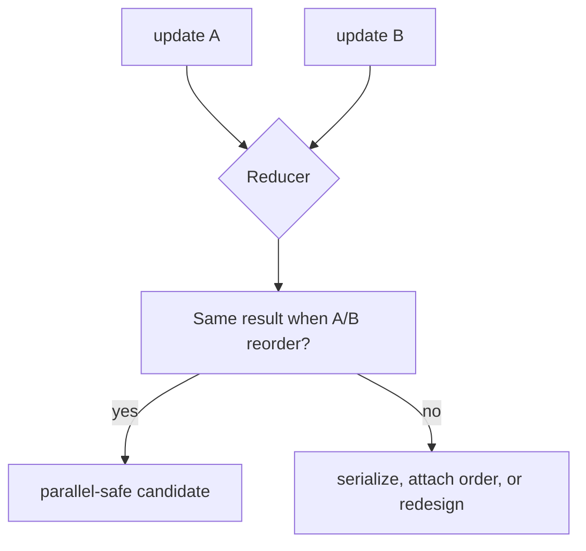

# LangGraph State, Graphs, Nodes, and Reducers

**Research date:** 2026-08-31
**Status:** Research-backed design guide

## Start with state semantics

The quality of a LangGraph system is determined less by the diagram than by its state contract. State is a set of independently updated channels. A node returns a partial update; a reducer decides how each channel combines its current value with an update.

## Schema choices

| Schema | Use it when | Caution |
|---|---|---|
| `TypedDict` | Fast, clear dictionary contract | Runtime validation remains your responsibility |
| dataclass | Defaults and typed object behavior help | Define serialization and migration expectations |
| Pydantic model | Recursive runtime validation is worth its overhead | Validation does not make effect data trustworthy or authorized |

Use distinct input and output schemas to avoid exposing internal state to clients. Keep raw evidence in state and format prompts inside nodes. Storing a rendered prompt duplicates data, hides provenance, and makes later prompt migrations harder.

## State field taxonomy

| Field class | Example | Preferred update |
|---|---|---|
| Scalar decision | `route: "review"` | Single writer or overwrite |
| Append-only evidence | search results with stable IDs | Deduplicating associative reducer |
| Message history | typed messages | Message-aware reducer, plus compaction policy |
| Domain reference | `ticket_id`, `ticket_version` | Overwrite after verified commit |
| Budget | remaining tool calls | Centralized decrement or safe monotonic reducer |
| Error | typed failure record | Replace current or append bounded history |
| Approval | proposal ID and decision receipt | Versioned record; never a bare boolean |

Avoid storing live clients, coroutines, file handles, secret-bearing context, or arbitrary provider objects in state.

## Reducers are concurrency contracts

Without a reducer, multiple writes to the same key in one superstep can raise `INVALID_CONCURRENT_GRAPH_UPDATE`. Adding list concatenation only silences the error; it may create duplicates and order dependence.

A parallel-safe reducer should normally be:

- associative, so grouping does not change the result;
- commutative, if completion order is not guaranteed;
- idempotent, if the same update may be replayed;
- bounded, so state cannot grow indefinitely.



For evidence collections, prefer a map keyed by a stable evidence ID over unconstrained list append. Materialize an ordered view later using an explicit sort key.

## Node design

A good node:

- accepts a narrow part of state and typed runtime context;
- performs one class of work;
- returns a small, serializable update;
- has a retry/timeout policy appropriate to that work;
- exposes enough IDs to reconcile ambiguous effects;
- does not hide a second uncontrolled agent loop.

Separate model decisions, read-only retrieval, non-idempotent actions, and human review. They have different failure and security properties.

### Node size rule

Create a boundary where you need any of:

- checkpoint/recovery granularity;
- an independent retry or timeout;
- a human interrupt;
- a security decision;
- streamed progress;
- observable evaluation;
- a different concurrency limit.

Do not split pure transformations merely to create an attractive graph.

## Commands, edges, and fan-out

`Command` can combine a state update and a route. `Send` creates dynamic parallel tasks. Both require destination names to be treated as code-controlled values; never accept a client- or model-supplied arbitrary node name without an allowlist.

For fan-out, persist an explicit work-item ID and define:

1. maximum items;
2. per-item timeout/retry;
3. partial failure policy;
4. deterministic aggregation;
5. deduplication;
6. cancellation behavior.

## Message state is not a full domain model

`MessagesState` is convenient for chat-shaped agents, but important workflow facts should not exist only as prose. Extract and validate fields such as customer ID, requested action, target resource, proposal, and approval. Messages can explain; typed state decides.

Conversation growth needs compaction, summarization, archival, or windowing. Keep the original authoritative transcript or audit records outside a lossy summary when compliance or dispute resolution requires them.

## State mutation and time travel

`update_state` creates a new checkpoint; it does not edit history in place. Reducers still apply. The optional `as_node` affects which transition the runtime infers next. Treat operator state edits as privileged commands with actor, reason, previous checkpoint, schema version, and audit record.

## Design review example

Weak state:

```text
messages: append everything
results: append everything
approved: boolean
```

Stronger state:

```text
request: immutable normalized request
evidence_by_id: bounded map with provenance
proposal: action + target + arguments + policy_version + resource_version
approval_receipt: proposal_hash + actor + decision + expiry
effect_receipt: operation_id + external_id + status
messages: bounded conversational projection
```

## Acceptance tests

- [ ] Execute parallel writes in multiple completion orders.
- [ ] Repeat an identical update and check for duplication.
- [ ] Resume from every checkpoint with old and new optional fields.
- [ ] Reject an oversized state update and tool result.
- [ ] Verify client output excludes internal and secret fields.
- [ ] Fuzz malformed node return values and unknown route names.
- [ ] Compact messages while preserving referenced evidence and approval records.
- [ ] Prove budget fields cannot increase through parallel merge.

## Sources

- [Graph API: state and reducers](https://docs.langchain.com/oss/python/langgraph/graph-api)
- [Use the Graph API](https://docs.langchain.com/oss/python/langgraph/use-graph-api)
- [Thinking in LangGraph](https://docs.langchain.com/oss/python/langgraph/thinking-in-langgraph)
- [Common errors](https://docs.langchain.com/oss/python/common-errors)

Next: [persistence, checkpoints, and threads](persistence-checkpoints-and-threads.md).
