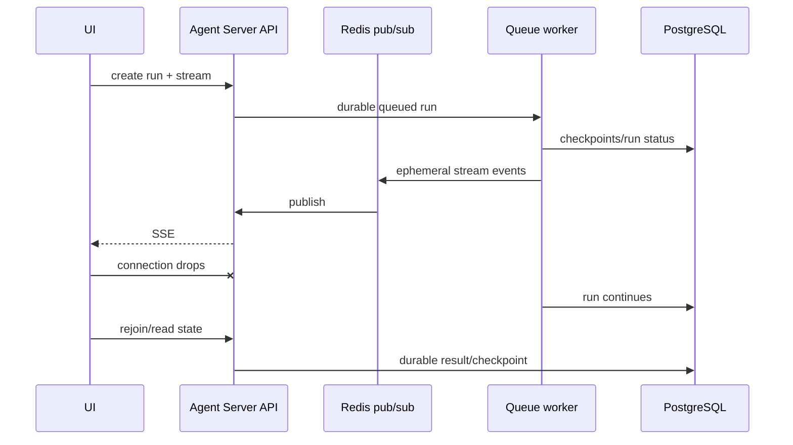
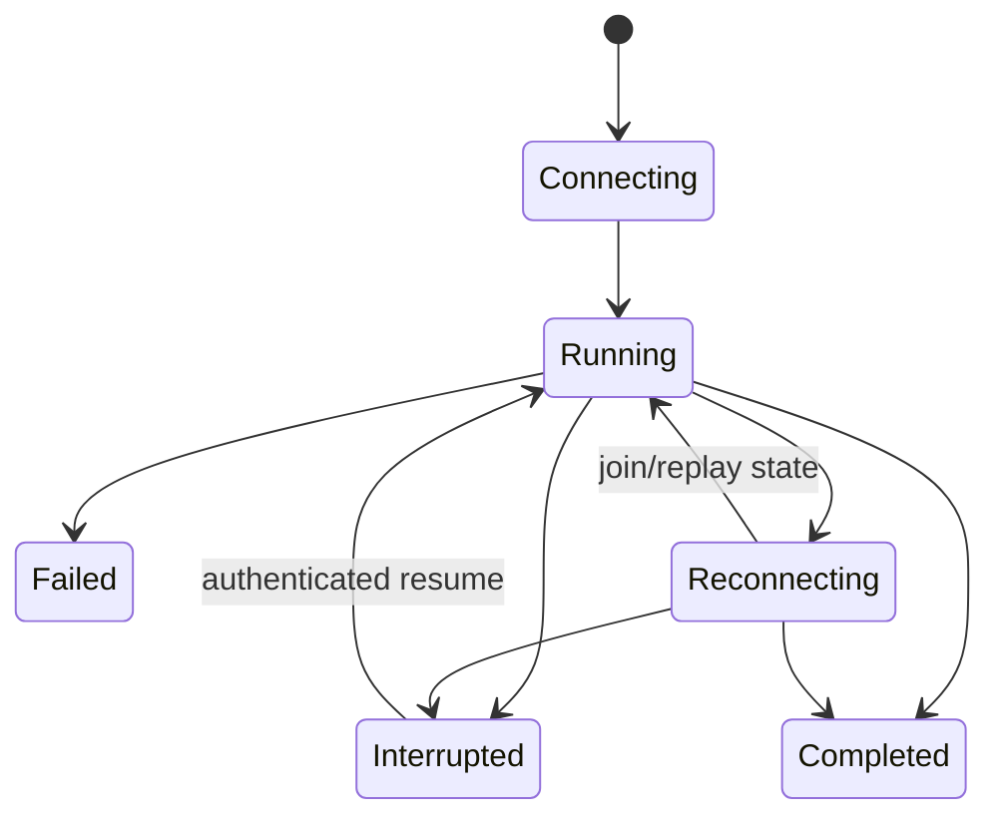

# LangGraph Streaming, Event Protocols, and Frontends

**Research date:** 2026-08-31
**Status:** Research-backed streaming guide

## Streaming is a replicated-state protocol

A UI consumes an observation of graph execution. It may disconnect, reconnect, receive duplicate or late events, and miss ephemeral transport messages while the run continues. Build the UI from durable identifiers and recoverable state, not from the assumption that one socket is the run.

## Library stream modes

LangGraph's v2 stream format, available from 1.1, uses a consistent envelope:

```text
type: values | updates | messages | custom | checkpoints | tasks | debug
ns: tuple identifying root or subgraph namespace
data: mode-specific payload
```

| Mode | Use | Production caution |
|---|---|---|
| `updates` | Node-level state deltas | Same superstep can yield multiple updates; apply with graph semantics |
| `values` | Full state after steps | Large state creates bandwidth and disclosure risk |
| `messages` | Model token/message chunks plus metadata | Provider token boundaries and usage timing vary |
| `custom` | Application progress | Define a versioned schema; do not emit secrets |
| `checkpoints` | Checkpoint envelopes | Requires persistence; distinguish notification from committed read |
| `tasks` | Task start/finish/error | Requires persistence; high volume under fan-out |
| `debug` | Broad execution diagnostics | Development only unless aggressively filtered |

Prefer `version="v2"` for stable shape in new Python code. The older v1 output changes its tuple shape based on modes and subgraphs. At this snapshot, a newer v3 event-streaming surface exists with typed projections; treat it as a separately versioned protocol and pin it before use.

## Namespace every event

With `subgraphs=True`, `ns` identifies the nested graph path. The namespace can include task-derived components and should be treated as an execution locator, not a permanent business identity.

Add application identity:

```text
protocol_version
thread_id
run_id
graph_release
logical_node
work_item_id
monotonic application sequence where available
event kind
payload
```

Do not authorize access based only on `ns`, a run ID, or a client-provided thread ID.

## Transport versus execution lifecycle



In Agent Server, PostgreSQL holds durable run/thread data while Redis carries ephemeral signaling and stream pub/sub. A Redis or client disconnect should be repaired by reading durable state or joining the run—not by assuming the run stopped.

## Build a client-side state machine

Use explicit states:



The client should:

- deduplicate terminal and tool events;
- tolerate token chunks after a cancellation signal;
- reconcile current state after reconnect;
- distinguish paused, cancelled, failed, and completed;
- display partial output as provisional;
- keep approval proposals immutable once shown;
- bound buffered events and apply backpressure.

## Custom progress events

`get_stream_writer()` can emit custom payloads from nodes and tools. Define an allowlisted schema:

```text
progress.v1:
  phase
  completed_items
  total_items
  user_safe_message
  work_item_id
```

Never stream raw prompts, full state, credentials, stack traces, or provider bodies to an untrusted client. A “debug” channel is not a substitute for a redaction policy.

## Streaming model and tool output

`messages` mode can surface tokens from graph nodes, tasks, tools, and subgraphs when using compatible model integrations. For other model clients, emit a custom stream. Preserve provider request IDs and finish reasons in server-side telemetry; do not force every provider event into a falsely uniform UI token.

Tool progress needs its own semantic lifecycle:

1. proposed;
2. authorized or awaiting approval;
3. started;
4. committed, failed, cancelled, or unknown;
5. reconciled if unknown.

“Tool finished streaming” does not prove an external transaction committed.

## Double-texting

Agent Server adds four strategies when new input arrives during a run:

| Strategy | Behavior | Main risk |
|---|---|---|
| Enqueue | Wait for current run, then process new input | Stale intent and queue growth |
| Reject | Refuse concurrent input | Client must retry intentionally |
| Interrupt | Stop current work and continue from preserved progress | Partial model/tool calls need repair |
| Rollback | Revert current progress and start with new input | External effects cannot be rolled back by checkpoint state |

This feature is not part of the standalone open-source graph invocation. Whichever strategy is selected, document it in the client protocol.

## Streaming tests

- [ ] Disconnect before first event, during tokens, during a tool, at interrupt, and before final state.
- [ ] Reconnect after Redis restart and after API-server replacement.
- [ ] Duplicate, reorder, and delay non-token events.
- [ ] Bound a slow client's buffer without blocking the worker fleet.
- [ ] Resume an approval on a new browser and device.
- [ ] Cancel while the downstream model/tool ignores cancellation.
- [ ] Verify `values` and `debug` cannot leak hidden state.
- [ ] Test every double-texting strategy with an in-flight side effect.
- [ ] Upgrade stream protocol v1 to v2/v3 with recorded fixtures.

## Sources

- [LangGraph streaming](https://docs.langchain.com/oss/python/langgraph/streaming)
- [Event streaming](https://docs.langchain.com/oss/python/langgraph/event-streaming)
- [Agent Server](https://docs.langchain.com/langsmith/agent-server)
- [Double texting](https://docs.langchain.com/langsmith/double-texting)
- [Cancel a run](https://docs.langchain.com/langsmith/cancel-run)

Next: [Agent Server deployment and operations](agent-server-deployment-and-operations.md).
