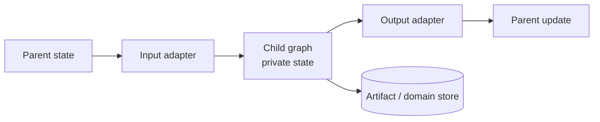

# LangGraph Subgraphs and Multi-Agent Composition

**Research date:** 2026-08-31
**Status:** Research-backed composition guide

## A subgraph is a runtime boundary only if you design it as one

Subgraphs help isolate state, topology, testing, persistence scope, and team ownership. Calling three agents “researcher,” “critic,” and “writer” does not make their coordination reliable. The contract is the data, checkpoint namespace, concurrency policy, and effect boundary between them.

## Persistence modes

Current Python documentation distinguishes:

| Mode | Compile setting | Lifetime | Interrupts/recovery | Same-subgraph concurrency |
|---|---|---|---|---|
| Per invocation | `checkpointer=None` or omitted | One invocation | Inherits parent for that call | Supported with isolated namespaces |
| Per thread | `checkpointer=True` | Across calls on one thread | Yes | Conflict-prone for repeated same instance |
| Stateless | `checkpointer=False` | None | No | Fresh ordinary call |

Per-invocation persistence is the default recommendation for independent specialists. Per-thread persistence is justified only when that specialist genuinely needs continuity across calls.

## State boundary patterns

### Shared schema

Parent and child accept overlapping state. Simple, but it couples migrations and makes unintended fields easy to expose.

### Adapter node

Map a narrow parent request into child input, invoke the child, then map its result back. This is usually the cleanest contract for separately evolving graph state.

### Store-mediated collaboration

Graphs exchange durable artifacts through authorized store/domain records. This supports asynchronous ownership but requires versioning, tenancy, and concurrency control.

## Namespace and inspection

Subgraph checkpoints use nested `checkpoint_ns` paths. State inspection with `subgraphs=True` depends on static discoverability; a graph hidden behind an arbitrary tool indirection may still interrupt but not expose the same inspection shape.

Do not parse namespace strings to infer authorization, product identity, or billing. Preserve your own logical subagent and work-item IDs in state/telemetry.

## Parallel subagents

Every parallel delegation needs:

- maximum fan-out and depth;
- per-child input and output schema;
- duplicate-work key;
- deterministic merge;
- partial success policy;
- cancellation propagation;
- per-child token/time/cost budget;
- isolated credentials and store namespace;
- an escalation rule when children disagree.

Avoid a shared mutable conversation transcript as the only coordination medium. It creates reducer ambiguity, context growth, and prompt-injection propagation.

## Per-thread subgraph hazards

The same persistent subgraph instance called more than once can write to a shared checkpoint namespace. Current docs direct teams toward per-invocation mode for parallel calls and warn that per-thread mode is not suitable for repeated calls to the same subgraph without deliberate isolation.

Tests should cover:

- sequential repeated calls;
- parallel repeated calls;
- a child interrupt in one branch while siblings complete;
- parent retry after child completion;
- parent replay from a checkpoint inside a child;
- two graph releases resuming the same nested lineage.

## Replay limits and current failure evidence

Nested checkpointing is a high-risk compatibility seam. Issue #8458 reported that versions through 1.2.9 could rerun an entire subgraph when time-traveling to a checkpoint inside it. Issue #6792 captured task outputs re-executing on resume in nested/entrypoint shapes and linked subsequent fixes.

These issues do not establish a universal failure rate. They establish bounded conformance tests:

1. record every child node and effect invocation;
2. interrupt within the child;
3. restart the process;
4. resume and count reused versus repeated work;
5. time-travel to each nested checkpoint;
6. repeat after every core/checkpointer upgrade.

Assume external effects can repeat even when recorded task outputs are normally reused.

## Multi-agent topologies

| Topology | Use | Risk |
|---|---|---|
| Supervisor routes to specialist | Clear central policy and synthesis | Supervisor becomes bottleneck and prompt-injection concentrator |
| Parallel panel then deterministic merge | Independent evidence or scoring | Cost/fan-out and incompatible evidence |
| Sequential refinement | Strong ordered handoff | Error propagation and latency |
| Peer handoff | Dynamic ownership | Cycles, lost budgets, unclear final authority |
| Remote graph | Organizational/deployment separation | Network failure, identity propagation, protocol/version skew |

Put deterministic policy and effect commit outside the model-selected topology. A model may recommend a route; code should enforce allowed destinations and budgets.

## Remote graphs

`RemoteGraph` can expose a remote Agent Server graph through a familiar interface. Treat it as a network dependency:

- authenticate service and end user;
- propagate tenant and trace context explicitly;
- set connection and total deadlines;
- version request/response schemas;
- constrain redirects and endpoints;
- distinguish remote run ID from local run ID;
- reconcile timeouts rather than blindly retrying writes;
- define whether parent cancellation cancels the remote run.

## Composition acceptance tests

- [ ] Prove state adapters exclude credentials and unrelated parent fields.
- [ ] Run maximum fan-out and nested depth under quotas.
- [ ] Resume a child interrupt after process and version changes.
- [ ] Reorder parallel child completion and verify the same merge.
- [ ] Replay every nested checkpoint and count model/tool/effect repetition.
- [ ] Cancel a parent while local and remote children are active.
- [ ] Attempt cross-tenant store and thread access from every child.
- [ ] Make one child return malicious instructions and verify peers/policy remain isolated.

## Sources

- [LangGraph subgraphs](https://docs.langchain.com/oss/python/langgraph/use-subgraphs)
- [Persistence namespaces](https://docs.langchain.com/oss/python/langgraph/persistence)
- [MULTIPLE_SUBGRAPHS guidance](https://docs.langchain.com/oss/python/langgraph/errors/MULTIPLE_SUBGRAPHS)
- [Nested resume issue #6792](https://github.com/langchain-ai/langgraph/issues/6792)
- [Subgraph time-travel issue #8458](https://github.com/langchain-ai/langgraph/issues/8458)

Next: [models, tools, context, and memory](models-tools-context-and-memory.md).
