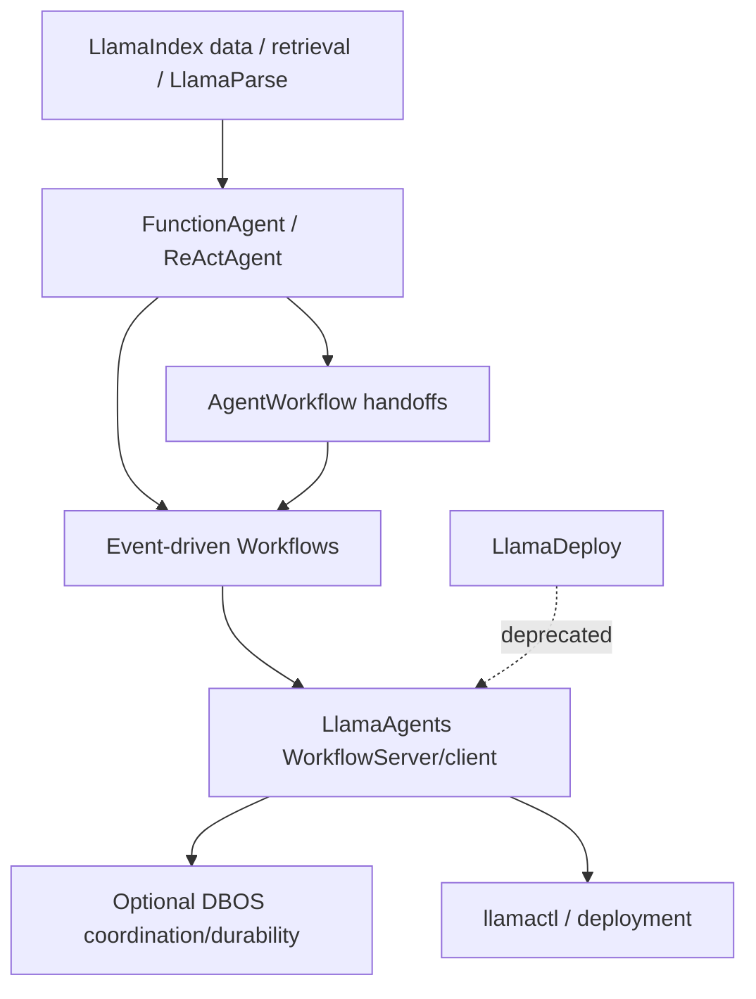
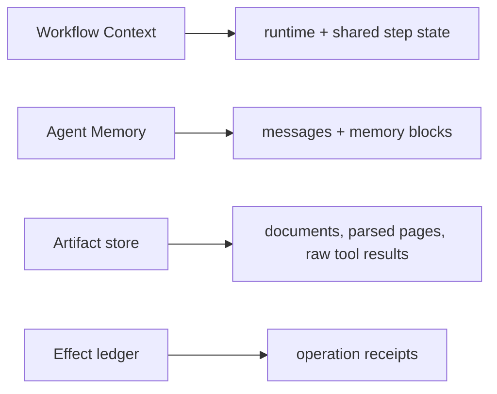
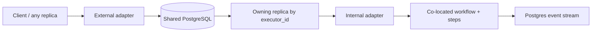

# LlamaIndex and LlamaAgents in Production

**Research date:** 2026-08-31  
**Status:** Research-backed technology guide  
**Scope:** Current LlamaIndex agents, Agent Workflows, LlamaAgents server/durable layers; legacy LlamaDeploy is deprecated

## Bottom line

Choose the LlamaIndex ecosystem when document ingestion/retrieval, data tools, and event-driven Python agent workflows are central. Use `FunctionAgent` for a focused loop, `AgentWorkflow` for simple sequential handoffs, and custom Workflows for explicit events, parallelism, waits, and deterministic control.

For production hosting, evaluate the new LlamaAgents server and durability adapters. Do not build new infrastructure around the deprecated LlamaDeploy project, and do not confuse workflow `Context`, conversational `Memory`, server persistence, or DBOS history.

## Current stack map

Package and product boundaries are moving. Pin the umbrella/core/integration/workflow/server/durability set and record which repository owns each component.

## Choose the orchestration shape

| Shape | Use when | Main caution |
|---|---|---|
| One `FunctionAgent` | One model/tool loop owns the task | Keep total tool/turn budgets outside provider defaults |
| `AgentWorkflow` | Linear model-selected handoffs are adequate | It is a sequential swarm/handoff shape, not general parallel orchestration |
| Orchestrator-as-tools | One supervisor should retain control | Context projection and subagent cost must be explicit |
| Custom Workflow | Events, joins, parallel steps, human waits, or deterministic routes matter | You own event schema, state reducers, and replay/effect safety |

Do not ask a handoff prompt to emulate a complex predefined DAG. Encode known dependencies in Workflow steps and reserve model choice for ambiguous decisions.

## Context, Memory, and artifacts

- **Context** can be serialized/deserialized and carries workflow runtime/shared state.
- **Memory** owns chat history and optional long-term blocks. A customized Memory may need a separate runtime argument/store because it is not necessarily serialized with Context.
- **Artifacts** should hold large documents, images, parsed output, embeddings, and raw provider/tool data by immutable reference.
- **Effect state** belongs in a transactional application ledger, not inferred from an absent Workflow event.

Human-in-the-loop paths often need both Context and Memory. Version and restore them as a consistent bundle or record immutable references to one authoritative state. Older memory classes are deprecated; identify and migrate their stored formats before upgrading.

## Concurrency and shared state

Workflow steps emit and consume events and may have multiple workers. Use `ctx.store.edit_state()` or an external transactional store for compound mutations. Avoid read-modify-write outside the protected edit boundary.

Nested workflow streaming and multiple concurrent runs of the same workflow instance have produced runtime errors in issue/discussion evidence. Instantiate per run unless current documentation guarantees reuse; test nested events, cancellation, and cleanup under actual concurrency. Attach run, tenant, document, and step IDs to every event so silent cross-run pollution becomes detectable.

Parallel agents should return immutable candidate results. Merge them in one deterministic reducer rather than letting each append to shared document state in timing order.

## LlamaAgents production boundary

The current LlamaAgents stack can embed a Workflow as a library, mount it in `WorkflowServer` for REST/streaming/HITL, and add a coordination backend for recovery and replicas. This is materially different from earlier LlamaDeploy architecture.

The DBOS adapter’s documented model is specific:

- workflow and steps run in one owning process; individual steps are not distributed workers;
- shared PostgreSQL coordinates cross-replica messages and event streaming;
- per-workflow queues apply `num_concurrent_runs` when configured;
- old application fingerprints require compatible old workers to drain runs;
- queue cancellation is observed after admission, not necessarily before execution starts;
- idle release uses persisted ticks and a fenced lifecycle state machine to rebuild a run.

The adapter notes that changing user step code may not change its wrapper fingerprint. Add an application-owned `workflow_schema_version`, prompt/tool versions, and migration gate. Never rely solely on the engine fingerprint to prevent an old run from executing new semantics.

## Durability and effects

A recovered step can repeat if its durable boundary did not record completion. For each model/tool/data operation specify:

| Operation | Safe recovery pattern |
|---|---|
| Model call | Record request identity and full result or rerun intentionally under eval policy |
| Retrieval/read | Repeat with snapshot/version pin when consistency matters |
| Document transform | Content-address input/output artifacts |
| External write | Reserve stable operation ID, commit idempotently, reconcile ambiguity |
| Human response | Deduplicate by response/event ID and bind to exact pending request |

Do not store multi-megabyte document payloads in workflow history. Persist a digest, media type, tenant, authorization label, location, and provenance.

## Security boundary

LlamaIndex’s security policy describes the library as intended for a trusted execution environment and says embedding it in a network service creates an application-owned attack surface. Apply this literally:

- authenticate and authorize WorkflowServer and artifact endpoints;
- enforce document/tool tenant filters server-side;
- limit remote download bytes, redirects, media types, decompression, and parsing;
- isolate untrusted readers/parsers and model-generated code;
- prevent debug logs, temp files, traces, and exception text from exposing data;
- inventory security scope across the umbrella package and numerous integrations.

## Operational acceptance tests

- [ ] Run each agent/orchestration shape against the same trace fixture and single-agent baseline.
- [ ] Serialize and restore Context plus custom Memory after every human-wait point.
- [ ] Run parallel/nested workflows with fresh and deliberately reused instances.
- [ ] Crash before/after model, retrieval, artifact, effect, event, and snapshot persistence.
- [ ] Start on replica A, subscribe/resume/cancel from replica B, then kill the owner.
- [ ] Deploy new user step code with old in-flight fingerprints and verify pin/drain behavior.
- [ ] Bound workflow runs, workers, events, artifact size, tokens, cost, and wall time.
- [ ] Verify document/resource authorization on retrieval, memory, artifact, and tool paths.
- [ ] Migrate deprecated memory and LlamaDeploy integrations explicitly.
- [ ] Reconcile ambiguous writes rather than replaying from missing tool output.

## Choose it when

- document-centric ingestion, retrieval, extraction, and agent workflow are one platform concern;
- Python async event workflows fit the team and workload;
- deployment can adopt the current LlamaAgents server/durable stack deliberately;
- the team will keep state, artifact, effect, and authorization owners separate.

## Prefer another shape when

- retrieval is a small tool rather than the application center;
- a mature general-purpose durable engine already owns the business process;
- TypeScript full-stack integration dominates: compare Mastra or AI SDK;
- the recent deployment-stack transition exceeds the organization’s change tolerance.

## Primary sources and failure-test leads

- [Current multi-agent patterns](https://github.com/run-llama/llama_index/blob/main/docs/src/content/docs/framework/understanding/agent/multi_agent.md) and [Memory vs Workflow Context](https://github.com/run-llama/llama_index/blob/main/docs/src/content/docs/framework/module_guides/deploying/agents/memory.mdx)
- [LlamaAgents repository](https://github.com/run-llama/llama-agents), [DBOS examples](https://github.com/run-llama/llama-agents/tree/main/examples/dbos), and [DBOS adapter architecture](https://github.com/run-llama/llama-agents/blob/main/packages/llama-agents-dbos/ARCHITECTURE.md)
- [Deprecated LlamaDeploy repository](https://github.com/run-llama/llama_deploy) and [LlamaIndex security policy](https://github.com/run-llama/llama_index/security)
- Adoption tests from [checkpoint serialization discussion #18265](https://github.com/run-llama/llama_index/discussions/18265), [nested streaming #15838](https://github.com/run-llama/llama_index/discussions/15838), and [parallel shared state #18282](https://github.com/run-llama/llama_index/discussions/18282)

See [evolving ecosystem selection](../comparisons/evolving-agent-framework-ecosystems.md) and the [research packet](../research/packets/framework-lifecycle-and-second-wave.md).
