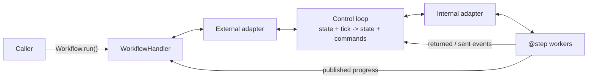
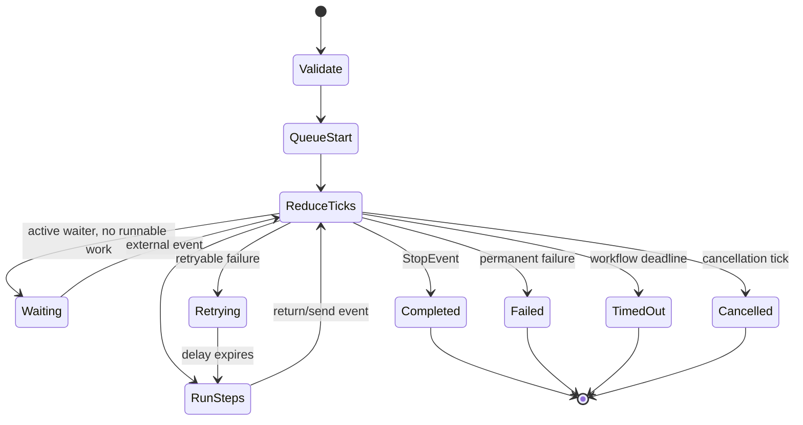
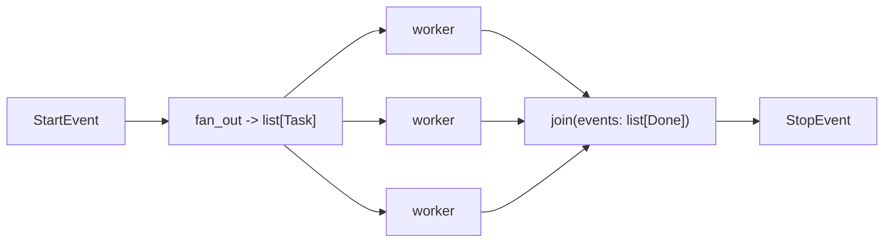
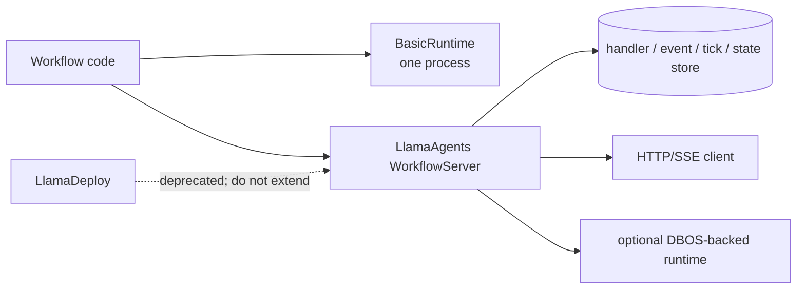

# Architecture and Event Workflows

- **Research date:** 2026-08-31
- **Status:** Research-backed, version-sensitive guide
- **Verified snapshot:** `llama-index-core` 0.14.24, `llama-index-workflows`
  2.23.3, `llama-agents-server` 0.7.1, and `llama-agents-client` 0.3.12
- **Scope:** The in-process Workflows runtime and its relationship to LlamaIndex
  and LlamaAgents

## The shortest accurate mental model

A LlamaIndex Workflow is an async, typed event program. A `@step` consumes one
or more Pydantic event types, does ordinary Python work, and emits another
event. Type annotations describe possible connections; the runtime routes actual
event instances.

The current runtime is not merely a collection of `asyncio.Queue` objects. It
reduces a journalable stream of **ticks** into new control state plus
**commands**. Commands start step workers, enqueue or publish events, schedule
retries, and terminate runs. The default `BasicRuntime` executes those commands
in one Python process. Other runtimes can replace or decorate the adapter
boundary.



This distinction matters: a pure reducer can reconstruct orchestration state
from recorded ticks, but it does **not** make arbitrary model calls, file
writes, or API mutations inside a step exactly-once.

## Keep the ecosystem boundaries explicit

| Surface                             | What it owns                                                                                                          | What it does not guarantee                                                                             |
| ----------------------------------- | --------------------------------------------------------------------------------------------------------------------- | ------------------------------------------------------------------------------------------------------ |
| LlamaIndex (`llama-index-core`)     | Agents, LLM/tool abstractions, retrieval, indexes, memory; compatibility re-exports under `llama_index.core.workflow` | Durable hosting or exactly-once effects                                                                |
| Workflows (`llama-index-workflows`) | `Workflow`, `Context`, events, handler, validation, retries, resources, in-process runtime contract                   | Authentication, tenancy, a production database, or distributed step workers                            |
| LlamaAgents                         | `WorkflowServer`, client, persistent event/tick stores, optional DBOS runtime, packaging/deployment tooling           | A different agent loop; it hosts Workflows                                                             |
| LlamaDeploy                         | Older deployment project                                                                                              | A supported target for new systems; its repository is explicitly deprecated in favor of `llama-agents` |

`llama-index-core` now re-exports the standalone `workflows` package to preserve
imports. For a new workflow-only library, use `from workflows import ...`. In a
LlamaIndex application, `from llama_index.core.workflow import ...` remains a
supported compatibility path. Pin and test the complete package set rather than
assuming the umbrella package pins every server/runtime component for you.

## Construction and validation

The runtime infers the event graph from step signatures. A workflow must have
exactly one `StartEvent` type and one `StopEvent` type. Current graph validation
checks:

- reachability from a `StartEvent` or external `HumanResponseEvent`;
- produced events that no step consumes, except boundary events such as
  `StopEvent` and `InputRequiredEvent`;
- steps whose outputs cannot reach a terminal boundary;
- invalid step signatures, resource declarations, and error-handler ownership.

Validation catches structural mistakes, not behavioral ones. It cannot prove
termination, model compliance, authorization, idempotency, safe state merges, or
bounded cost. Avoid `disable_validation=True` and narrowly document any
`skip_graph_checks` exception.

### Event matching is exact by default

A step that accepts `ParentEvent` does not automatically receive `ChildEvent`.
Opt in with `@step(accept_event_subclasses=True)` only when the parent type is
intentionally the routing contract. Exact matching prevents a new subtype from
silently widening an existing consumer.

```python
class ToolEvent(Event):
    tool_name: str


class SearchEvent(ToolEvent):
    query: str


@step(accept_event_subclasses=True)
async def handle_tool(self, ev: ToolEvent) -> StopEvent:
    return StopEvent(result=ev.tool_name)
```

Use concrete events for security-sensitive routes. A broad `Event` consumer or
subclass-aware parent can become an accidental policy bypass when the event
catalog grows.

## Run lifecycle

`workflow.run(...)` schedules the run and returns an awaitable
`WorkflowHandler`. The handler is the caller's control surface: await the
terminal result, consume the published-event stream once, send an external
event, or request cancellation.



The default workflow timeout is 45 seconds. Set it deliberately; `None` removes
the runtime timeout and is rarely appropriate for an online request. A workflow
timeout does not replace provider, database, tool, and total request deadlines.

### Context has lifecycle-specific faces

The same `Context` facade exposes different operations before the run, to the
external caller, and inside a step:

| Face     | Typical operations                                                          | Invalid assumptions                                          |
| -------- | --------------------------------------------------------------------------- | ------------------------------------------------------------ |
| Pre-run  | initialize state, serialize/restore                                         | no live stream or handler yet                                |
| External | send an event, stream, snapshot, inspect run state                          | not a step-local dependency container                        |
| Internal | edit shared state, route/publish events, collect, wait, inspect retry state | caller lifecycle operations may be unavailable or deprecated |

Keep credentials, clients, indexes, and other non-serializable dependencies in
injected `Resource` objects, not event payloads or workflow state. A resource is
cached once per run by default; `cache=False` creates it per injection. Resource
lifetime is a dependency-lifetime decision, not durable state.

## Event flow patterns

### Linear, branch, and loop

A returned event is routed to every compatible consumer. Branching is a normal
conditional that returns different event types. A loop returns an event accepted
by an earlier step.

```python
@step
async def decide(self, ev: Classified) -> Approved | NeedsRevision:
    return Approved(id=ev.id) if ev.score >= 0.9 else NeedsRevision(id=ev.id)
```

Every loop needs application limits: iteration count, wall time, tokens/cost,
tool calls, and retained state. The Workflow timeout alone is too coarse.

### Typed fan-out and fan-in

Workflows 2.22 added first-class typed batches. Returning `list[Task]` opens a
collection stream and dispatches each element. A step accepting `list[Done]`
runs once when that batch closes. Result order is completion order; sort or
reduce by a stable key when order matters.



Important semantics:

- `@step(num_workers=N)` caps concurrent invocations of that step within a run;
  the current default is four.
- `num_concurrent_runs=N` is a separate whole-workflow limit. `BasicRuntime`
  applies it to the workflow instance in one process; it is not a fleet-wide
  quota.
- A branch returning `None` can drop itself and the batch still closes.
- `Collect(Take(1))` releases after the first result but does **not** cancel
  losing workers.
- Multiple single-event parameters implement a heterogeneous join: the step
  fires after one event of each declared type arrives.
- Nested typed batches retain collection levels, allowing an inner join per
  outer item and a final outer join.

Put a global or distributed concurrency limit around the scarce dependency
itself. A per-process `asyncio.Semaphore` does not protect a provider when the
service has multiple replicas.

### Dynamic dispatch is a different failure contract

`ctx.send_event(event)` routes immediately; `ctx.collect_events(...)` performs a
manually sized join. A typed list return is atomic with the producer step: if
the step raises before returning, none of the batch is emitted. Events sent
dynamically may already be running downstream when the producer later fails.

Prefer typed fan-out/fan-in when batch cardinality is known. Use the dynamic API
only when downstream work must begin before the producer returns or cardinality
is genuinely discovered at runtime. Record a correlation key and expected-count
contract; otherwise unrelated branches can be merged or a join can wait forever.

## Control-loop and retry implications

The control loop drains ticks through a pure reducer, executes commands, then
waits for a worker result, external event, or timer. Workers receive
collected-event snapshots. If relevant events arrive during optimistic
execution, the runtime can re-run the worker with the updated snapshot.

That leads to a strict production rule:

> A step body may execute again even when the application did not explicitly
> call it twice.

Retries also rerun the whole step for the same input event. The composable retry
API controls exception filtering, wait, and stop conditions. Use deterministic
jitter for durable replay and retry only failures that are actually transient.

| Work inside a step  | Recovery design                                                                                         |
| ------------------- | ------------------------------------------------------------------------------------------------------- |
| LLM call            | persist request identity and result when reproducibility matters; otherwise label reruns as intentional |
| Retrieval/read      | pin source/index version if repeatability matters                                                       |
| Artifact generation | content-address input and output                                                                        |
| External mutation   | reserve a stable operation ID before the call; make the destination idempotent; reconcile timeouts      |
| State update        | use `ctx.store.edit_state()` for compound changes; do not separate read and write across awaits         |

When step retries are exhausted, `@catch_error` can consume `StepFailedEvent`
and return a fallback route or terminal result. `max_recoveries` limits re-entry
per event lineage. A catch handler is not a substitute for effect
reconciliation: by the time it runs, an earlier external write may already have
committed.

## Terminal and cancellation behavior

The published stream includes terminal subclasses for completion failures:

- `WorkflowTimedOutEvent` includes the configured timeout and active step names;
- `WorkflowCancelledEvent` represents requested cancellation;
- `WorkflowFailedEvent` includes the step name, exception, attempt count, and
  elapsed time.

The stream describes the run; awaiting the handler is still the authoritative
completion/error path. Use `await handler.cancel_run()` for graceful
cancellation. The old hard `cancel()` and several future-like inspection methods
are deprecated.

Cancellation is cooperative at the application boundary. A cancelled task does
not prove an HTTP request, subprocess, nested workflow, or external transaction
stopped. An unresolved upstream discussion documents that cancelling a parent
workflow did not automatically cancel an independently started nested workflow.
Track child handlers and explicitly propagate cancellation until your pinned
version proves otherwise.

## From library to LlamaAgents server

The in-process runtime and the server share workflow code but have different
operational contracts.



`WorkflowServer` adds handler records, recorded event streams, tick persistence,
HTTP controls, and idle release/reload. It does not distribute individual
`@step` functions merely because the API has multiple replicas. Runtime-specific
coordination and effect semantics still apply.

Do not copy LlamaDeploy examples that use its control plane, message queue,
sessions, or worker model into the current stack. Migrate the workflow itself,
then redesign server/client, persistence, identity, and event-resume contracts
against LlamaAgents.

## Failure matrix

| Failure                                  | Observable symptom                       | Preventive design                                                           |
| ---------------------------------------- | ---------------------------------------- | --------------------------------------------------------------------------- |
| Event type omitted from annotations      | validation/diagram misses dynamic edge   | include possible sent types in return annotations or register intentionally |
| Broad subclass routing                   | unintended step receives new subtype     | exact events by default; policy tests for every accepted event              |
| Slow fan-out                             | provider overload and large queued batch | per-step, per-run, and dependency-level quotas                              |
| `Take(1)` assumed to cancel losers       | unnecessary cost/effects continue        | explicitly cancel cooperative child work or tolerate completion             |
| Dynamic event sent, producer later fails | partial downstream execution             | typed batch return or idempotent correlated effects                         |
| Retry after ambiguous write              | duplicate side effect                    | effect ledger plus reconciliation                                           |
| Reusing context without intent           | state leaks between logical requests     | one fresh context per run; reuse only for an explicit session               |
| Snapshot under new event/schema code     | deserialization or semantic drift        | version event/state schemas; drain or migrate in-flight runs                |
| Parent cancellation only                 | child keeps running                      | track and cancel every child handler                                        |

## Production review checklist

- [ ] Pin the umbrella/core, integration, workflows, server, client, and
      durability packages as a tested set.
- [ ] Give every event a clear owner, version, size limit, correlation ID, and
      retention class.
- [ ] Leave exact event matching enabled unless a parent contract is intentional
      and tested.
- [ ] Keep large documents and model payloads in an artifact store; pass
      immutable references in events.
- [ ] Set workflow, step/tool/provider, token, cost, fan-out, and queue limits
      separately.
- [ ] Treat every step as repeatable and every external mutation as ambiguous
      until reconciled.
- [ ] Use typed fan-out/fan-in for known batches and deterministic reducers for
      completion-order results.
- [ ] Test timeout, cancellation, retry exhaustion, snapshot/restore, and
      version upgrades at every boundary.
- [ ] Propagate tenant and authorization context outside model-controlled
      event/tool fields.
- [ ] Use LlamaAgents for new server work; keep LlamaDeploy only as a migration
      source.

## Primary sources

- [LlamaAgents repository and current stack overview](https://github.com/run-llama/llama-agents)
- [Workflows core architecture](https://github.com/run-llama/llama-agents/blob/main/architecture-docs/core-overview.md)
  and
  [control-loop architecture](https://github.com/run-llama/llama-agents/blob/main/architecture-docs/control-loop.md)
- [`Workflow` implementation](https://github.com/run-llama/llama-agents/blob/main/packages/llama-index-workflows/src/workflows/workflow.py),
  [`@step` implementation](https://github.com/run-llama/llama-agents/blob/main/packages/llama-index-workflows/src/workflows/decorators.py),
  and
  [graph validation source](https://github.com/run-llama/llama-agents/blob/main/packages/llama-index-workflows/src/workflows/representation/validate.py)
- [Concurrent execution and typed collection streams](https://github.com/run-llama/llama-agents/blob/main/docs/src/content/docs/llamaagents/workflows/concurrent_execution.md),
  [branches and loops](https://github.com/run-llama/llama-agents/blob/main/docs/src/content/docs/llamaagents/workflows/branches_and_loops.md),
  [resources](https://github.com/run-llama/llama-agents/blob/main/docs/src/content/docs/llamaagents/workflows/resources.md),
  and
  [retry/error handling](https://github.com/run-llama/llama-agents/blob/main/docs/src/content/docs/llamaagents/workflows/retry_steps.md)
- [Workflows release history](https://github.com/run-llama/llama-agents/blob/main/packages/llama-index-workflows/CHANGELOG.md)
  and [PyPI package](https://pypi.org/project/llama-index-workflows/)
- [LlamaIndex Workflows compatibility re-export](https://github.com/run-llama/llama_index/blob/main/llama-index-core/llama_index/core/workflow/workflow.py)
- [Deprecated LlamaDeploy repository](https://github.com/run-llama/llama_deploy)
- Bounded failure evidence:
  [nested streaming discussion #15838](https://github.com/run-llama/llama_index/discussions/15838)
  and
  [nested cancellation discussion #19820](https://github.com/run-llama/llama_index/discussions/19820)

## Refresh triggers

Re-verify this guide when `llama-index-workflows` reaches 3.x; the `Context`
faces, handler result contract, default worker count, graph validation, or
collection-stream semantics change; LlamaIndex stops re-exporting `workflows`;
LlamaAgents changes its runtime decorator/store model; or LlamaDeploy publishes
a successor/migration tool. Also refresh after any change to retry replay,
cancellation propagation, or server-side workflow distribution.
