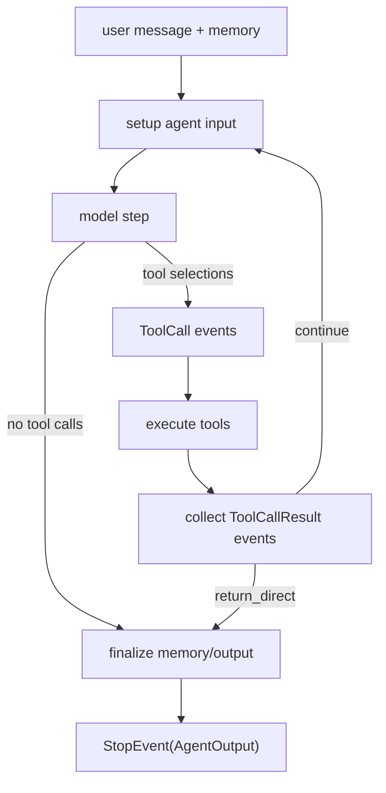
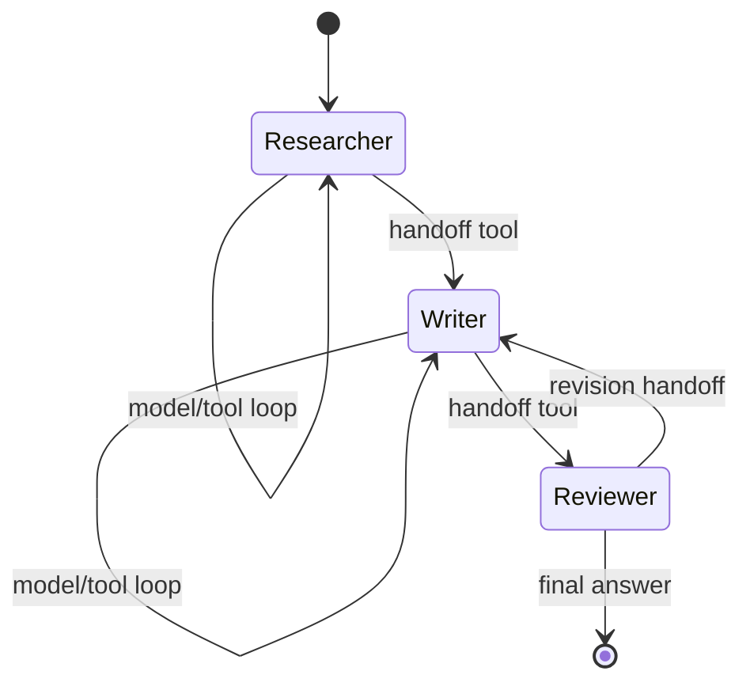
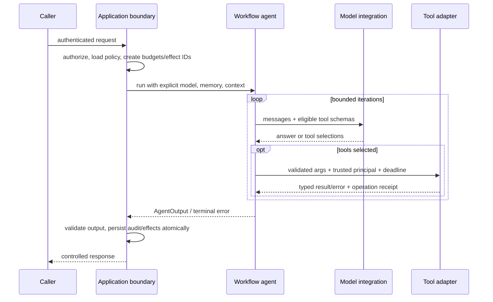

# Agents, Models, and Tools

- **Research date:** 2026-08-31
- **Status:** Research-backed, version-sensitive guide
- **Verified snapshot:** `llama-index-core` 0.14.24 with `llama-index-workflows`
  2.23.3
- **Scope:** LlamaIndex framework agents and their model/tool loop; not
  LlamaAgents server internals

## Bottom line

Use `FunctionAgent` when the chosen LLM integration reliably implements native
tool calling. Use `ReActAgent` when the model must select tools through a text
ReAct protocol. Use `CodeActAgent` only with a hardened code sandbox. Use
`AgentWorkflow` for a small, sequential handoff network—not as a general
parallel multi-agent scheduler.

All of these are Workflow-based agents. They do not become durable or remotely
distributed until hosted through an appropriate LlamaAgents runtime. The older
AgentRunner/AgentWorker APIs and the deprecated LlamaDeploy project are
migration concerns, not recommended foundations.

## Agent loop anatomy

`BaseWorkflowAgent` is both a Pydantic configuration model and a Workflow. It
initializes memory and state, prepares model input, calls one model-specific
`take_step`, fans out selected tools, joins their results, and repeats until it
receives a final response or reaches an iteration limit.



The current default maximum is 20 model-loop iterations.
`early_stopping_method="force"` raises when the limit is reached; `"generate"`
spends one more model call to attempt a final answer. An iteration ceiling is
not a complete budget: one iteration may contain multiple concurrent tools,
large retrievals, or a slow provider call.

## Choose the agent deliberately

| Agent                                  | Model contract                                        | Tool protocol                                                                 | Best fit                                                                   | Main risk                                                           |
| -------------------------------------- | ----------------------------------------------------- | ----------------------------------------------------------------------------- | -------------------------------------------------------------------------- | ------------------------------------------------------------------- |
| `FunctionAgent`                        | `llm.metadata.is_function_calling_model` must be true | Provider/integration-native structured tool calls                             | Modern tool-capable chat models                                            | Integration-specific schema/tool-call behavior and parallel effects |
| `ReActAgent`                           | General chat model                                    | Prompted `Thought` / `Action` / `Action Input`, parsed from text              | Models without dependable native tool calling; inspectable custom protocol | Formatting/parser brittleness and extra prompt tokens               |
| `CodeActAgent`                         | Function-calling LLM plus caller-supplied executor    | Model writes code inside an execute protocol; agent exposes functions to code | Data manipulation where code is materially clearer than many tool calls    | Arbitrary-code execution, data exfiltration, resource exhaustion    |
| Custom `BaseWorkflowAgent` or Workflow | Application-defined                                   | Application-defined                                                           | A specialized loop with evidence for custom behavior                       | Owning the loop, memory, tool, retry, and upgrade contracts         |

### FunctionAgent

`FunctionAgent` passes tool metadata to `achat_with_tools` or
`astream_chat_with_tools`. It extracts `ToolSelection` objects through the LLM
integration. `allow_parallel_tool_calls` defaults to `True`, and
`initial_tool_choice` can request a particular tool on the first model response.

Native tool calling is only as reliable as the provider integration. Test the
exact model and integration version for:

- JSON-schema coverage and rejected keywords;
- tool-name and description limits;
- empty, duplicated, partial, and malformed tool calls;
- multiple tool calls in streaming responses;
- tool-choice semantics;
- ordering and correlation of tool results;
- provider changes to parallel calls.

Set `allow_parallel_tool_calls=False` when tools mutate the same resource, rely
on order, or share a non-thread-safe client. When parallel calls are allowed,
the agent emits all calls and the Workflow tool step processes them with its
worker limit; calls beyond available workers queue. This is still not a tenant
or provider-wide concurrency limit.

### ReActAgent

`ReActAgent` formats the tool catalog and accumulated reasoning into a text
prompt, calls ordinary chat APIs, then parses an action or final answer. It does
not use native provider tool calls for this loop.

This can extend tool use to models without a native function-calling contract,
but parser compliance is part of correctness. An open August 2026 issue reports
that a final `Answer:` without the required `Thought:` can be rejected
repeatedly until the 20-iteration ceiling. Treat custom formatters and parsers
as versioned protocol code, add adversarial fixtures, and keep the iteration cap
low enough to fail safely.

Do not expose private chain-of-thought to end users. ReAct's formatted reasoning
is an application protocol and may contain prompts, tool data, or secrets.
Prefer concise action rationale or audit events that your application defines
explicitly.

### CodeActAgent

`CodeActAgent` requires a caller-supplied `code_execute_fn`. It supports plain
functions and `FunctionTool` instances that do not require Workflow `Context`;
other tool kinds are rejected. The executor is the security boundary.

Minimum sandbox controls include:

- an isolated identity, filesystem, process, and network namespace;
- no ambient cloud credentials or host mounts;
- allowlisted egress and package availability;
- CPU, memory, process, output-byte, and wall-time limits;
- immutable input artifacts and quarantined outputs;
- audit records without secrets;
- teardown after every run.

Running model-generated code in the application process is not a production
shortcut. If the task can be expressed as a small typed function, use a normal
tool instead.

## AgentWorkflow is sequential handoff orchestration

`AgentWorkflow` registers one or more `BaseWorkflowAgent` instances, starts with
one root agent, adds a `handoff` tool when allowed, and lets the active model
choose the next agent. Only one agent owns the conversation at a time; a handoff
changes that owner.



For multiple agents, every agent needs a unique name and meaningful description,
and exactly one root agent must be selected. `can_handoff_to` constrains
destinations; `None` is not the same policy as an empty allowlist. The reserved
tool name `handoff` cannot be reused.

Use `AgentWorkflow` when model-selected transfers are the desired behavior. Use
a custom Workflow when dependencies, parallelism, approvals, joins, or mandatory
routes are known in advance. Do not encode a deterministic business process as
prose asking agents to hand off correctly.

Current source stores agent and existing tool objects by reference. A
closed-as-not-planned 2026 issue demonstrates that sharing the same mutable tool
instance between agents shares its mutations. Prefer immutable/stateless tools
or create a separate instance per agent unless shared state is intentional and
concurrency-safe.

## Model configuration boundary

An agent uses its explicit `llm` or the process-global `Settings.llm`. Explicit
injection is safer in services and tests: it prevents unrelated initialization
order from silently changing model behavior.

Version and record:

- provider and integration package;
- model/deployment identifier and region;
- system prompt and ReAct formatter/parser version;
- temperature and model-specific settings;
- tool catalog/schema digest;
- structured-output schema version;
- token, time, cost, retry, and iteration limits.

Do not route solely on `metadata.is_function_calling_model`. That flag is a
capability declaration, not evidence that the exact provider/model supports
every schema, streaming, or parallel-call behavior your application needs.

## Tool surfaces

| Tool type                              | Purpose                                                                     | Production notes                                                                                    |
| -------------------------------------- | --------------------------------------------------------------------------- | --------------------------------------------------------------------------------------------------- |
| Plain callable                         | Automatically wrapped as `FunctionTool`                                     | Type annotations and docstring become a model-facing contract; inspect the generated schema         |
| `FunctionTool`                         | Sync/async function, schema, metadata, callbacks, optional Workflow context | Sync functions run through an executor; make blocking work bounded and thread-safe                  |
| `QueryEngineTool`                      | Wrap a LlamaIndex query engine as an async-capable tool                     | Give each corpus a precise scope description; enforce tenant/document filters below the model       |
| `BaseToolSpec` integration             | Expand an integration into several `FunctionTool` objects                   | Audit every generated function, permission, schema, and credential scope                            |
| `ObjectRetriever` via `tool_retriever` | Select a subset of tools dynamically                                        | Retrieval relevance is not authorization; filter the eligible catalog first                         |
| MCP tools                              | Remote or local external tool catalog                                       | Treat server identity, transport, schemas, and returned content as untrusted integration boundaries |

### Tool descriptions are routing logic

The model sees names, descriptions, and argument schemas. Make names unique and
stable. Descriptions should state what the tool does, when to use it, scope,
required inputs, important side effects, and a compact failure contract. Avoid
overlapping descriptions that force the model to guess between near-duplicates.

Do not include secrets in descriptions or defaults. Tool metadata can be sent to
third-party providers and captured in traces.

### Context-aware FunctionTool

`FunctionTool` detects a parameter annotated as Workflow `Context`. That
parameter is excluded from the model-facing schema, and the agent injects the
live context when it calls the tool.

```python
async def load_invoice(ctx: Context, invoice_id: str) -> str:
    tenant_id = await ctx.store.get("tenant_id")
    return await repository.load_authorized(tenant_id, invoice_id)
```

This is useful for server-controlled identity and state, but `Context` is
mutable orchestration state—not an immutable security principal. Bind
authenticated identity in an application service or resource the model cannot
overwrite, then enforce authorization again in the repository/tool. Never accept
a model-supplied `tenant_id` because it happens to match context most of the
time.

## Tool execution and error semantics

The base agent adapts tools to async. For normal tool exceptions, it creates an
error `ToolOutput` and returns it to the model; the agent may repair its
arguments or choose another tool. The special internal wait-for-event exception
is re-raised so HITL can suspend the step.

`return_direct=True` makes a successful tool result terminate the current agent
loop, except for the `handoff` tool. Use it only when the tool output is already
safe, user-ready, and independently validated. Otherwise the model's absence
from the final step can bypass expected synthesis or redaction.

Classify tool failures:

| Failure class                | Model-visible response                        | Application action                                    |
| ---------------------------- | --------------------------------------------- | ----------------------------------------------------- |
| Invalid model arguments      | concise typed validation error                | allow a small repair budget                           |
| Authorization failure        | generic denial, no sensitive existence signal | audit and stop or let model choose a safe alternative |
| Transient dependency failure | stable retryable error code                   | retry outside the model loop with bounded backoff     |
| Ambiguous external write     | `outcome_unknown` plus operation ID           | reconcile; never invite a blind repeat                |
| Permanent internal defect    | generic failure reference                     | stop and alert; do not leak stack traces              |

Tool callbacks can transform a `FunctionTool` result, but there is no universal
agent-wide pre/post middleware contract across arbitrary tools. Centralize
policy in your own wrapper or adapter rather than assuming callbacks cover MCP,
query-engine, and custom tool classes uniformly.

## Output and streaming contract

During a run, framework agents publish typed events:

| Event                         | Meaning                                                                                                                         |
| ----------------------------- | ------------------------------------------------------------------------------------------------------------------------------- |
| `AgentInput`                  | Model input prepared for an agent                                                                                               |
| `AgentStream`                 | Incremental text, accumulated response, optional tool-call fragments, provider raw data in-process, and optional thinking delta |
| `AgentOutput`                 | Completed model step and selected tools                                                                                         |
| `ToolCall`                    | A tool execution is about to run                                                                                                |
| `ToolCallResult`              | Tool result including `ToolOutput` and `return_direct`                                                                          |
| `AgentStreamStructuredOutput` | Final structured response produced after agent completion                                                                       |

`output_cls` or `structured_output_fn` is applied after ordinary agent
finalization. `output_cls` can require another model call through structured
generation, so include that latency and cost. Source catches structured-output
exceptions and emits warnings; validate `AgentOutput.structured_response` at the
application boundary and decide whether absence is terminal. Do not silently
accept a text response when the business contract requires a schema.

Fields marked `exclude=True`, including some raw provider objects, will not
survive normal Pydantic/remote serialization. Persist a deliberate,
vendor-neutral audit envelope rather than relying on in-process `raw` fields.

## Production agent wrapper



The wrapper—not the model—owns authentication, tool eligibility, quotas,
deadlines, retries, effect IDs, final validation, and redaction.

## Failure modes to test

- A model claims native tool support but emits malformed, partial, or duplicated
  calls.
- ReAct output omits a required marker or includes an action-like string inside
  ordinary text.
- The model emits more parallel calls than the provider, database, or tenant can
  support.
- Two tools have the same name or overlapping descriptions.
- A tool attempts cross-tenant access using a model-controlled identifier.
- A timeout occurs after an external write but before `ToolCallResult` is
  recorded.
- A `return_direct` tool exposes raw internal data.
- A dynamically retrieved tool is relevant but not authorized.
- Two agents share a mutable tool/client and contaminate each other.
- Structured output generation warns and returns no typed value.
- CodeAct attempts filesystem, network, process, or secret access.
- A version upgrade changes tool schema serialization or ReAct parsing.

## Review checklist

- [ ] Choose `FunctionAgent`, `ReActAgent`, or a custom Workflow from verified
      model behavior, not provider marketing.
- [ ] Set a conservative iteration limit plus independent time, token, tool,
      fan-out, and cost budgets.
- [ ] Inject the model explicitly and pin every integration package.
- [ ] Snapshot and regression-test the exact tool schemas sent to each provider.
- [ ] Filter tool eligibility by authorization before relevance retrieval.
- [ ] Bind tenant/user identity outside model-controlled arguments and mutable
      workflow state.
- [ ] Make writes idempotent and reconcile unknown outcomes by operation ID.
- [ ] Disable parallel tool calls or serialize tools with shared mutable
      effects.
- [ ] Validate final and structured outputs outside the agent.
- [ ] Sandbox CodeAct in a disposable, resource-limited, no-secret environment.
- [ ] Use custom Workflows for deterministic routes and parallel orchestration;
      keep `AgentWorkflow` for sequential handoffs.
- [ ] Host through current LlamaAgents when an API/durability layer is needed;
      do not extend LlamaDeploy.

## Primary sources

- [LlamaIndex agent exports](https://github.com/run-llama/llama_index/blob/main/llama-index-core/llama_index/core/agent/__init__.py)
  and
  [`BaseWorkflowAgent` source](https://github.com/run-llama/llama_index/blob/main/llama-index-core/llama_index/core/agent/workflow/base_agent.py)
- [`FunctionAgent` source](https://github.com/run-llama/llama_index/blob/main/llama-index-core/llama_index/core/agent/workflow/function_agent.py),
  [`ReActAgent` source](https://github.com/run-llama/llama_index/blob/main/llama-index-core/llama_index/core/agent/workflow/react_agent.py),
  and
  [`CodeActAgent` source](https://github.com/run-llama/llama_index/blob/main/llama-index-core/llama_index/core/agent/workflow/codeact_agent.py)
- [`AgentWorkflow` source](https://github.com/run-llama/llama_index/blob/main/llama-index-core/llama_index/core/agent/workflow/multi_agent_workflow.py)
  and
  [official multi-agent guide](https://github.com/run-llama/llama_index/blob/main/docs/src/content/docs/framework/understanding/agent/multi_agent.md)
- [Agent workflow event contracts](https://github.com/run-llama/llama_index/blob/main/llama-index-core/llama_index/core/agent/workflow/workflow_events.py)
- [`FunctionTool` source](https://github.com/run-llama/llama_index/blob/main/llama-index-core/llama_index/core/tools/function_tool.py),
  [`QueryEngineTool` source](https://github.com/run-llama/llama_index/blob/main/llama-index-core/llama_index/core/tools/query_engine.py),
  and
  [`BaseToolSpec` source](https://github.com/run-llama/llama_index/blob/main/llama-index-core/llama_index/core/tools/tool_spec/base.py)
- [LlamaIndex package architecture and integration model](https://github.com/run-llama/llama_index)
  and [PyPI release snapshot](https://pypi.org/project/llama-index-core/)
- Bounded issue evidence:
  [ReAct final-answer parser #22563](https://github.com/run-llama/llama_index/issues/22563),
  [shared mutable tools #22146](https://github.com/run-llama/llama_index/issues/22146),
  [streaming tool results request #20409](https://github.com/run-llama/llama_index/issues/20409),
  and
  [tool I/O middleware request #20386](https://github.com/run-llama/llama_index/issues/20386)
- [LlamaAgents repository](https://github.com/run-llama/llama-agents) and
  [deprecated LlamaDeploy repository](https://github.com/run-llama/llama_deploy)

## Refresh triggers

Re-verify this guide when LlamaIndex reaches 0.15 or 1.0;
`DEFAULT_MAX_ITERATIONS`, `FunctionAgent.allow_parallel_tool_calls`, ReAct
formatting/parsing, CodeAct executor contracts, agent event fields,
structured-output handling, or tool context injection changes; the open ReAct
parser issue is fixed; a general tool middleware or streaming-tool-result API
ships; provider integrations change native tool-call semantics; or the legacy
agent APIs are fully removed.
