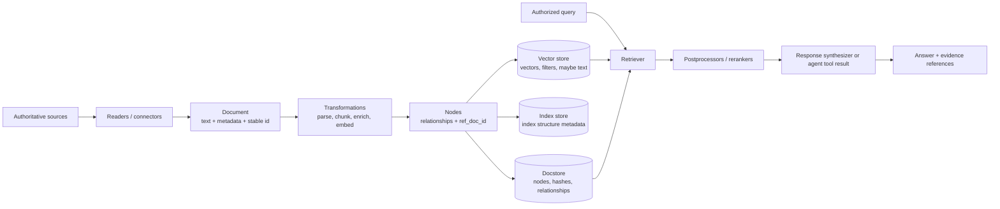
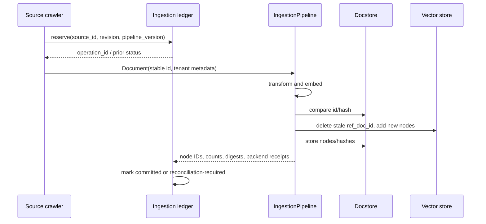
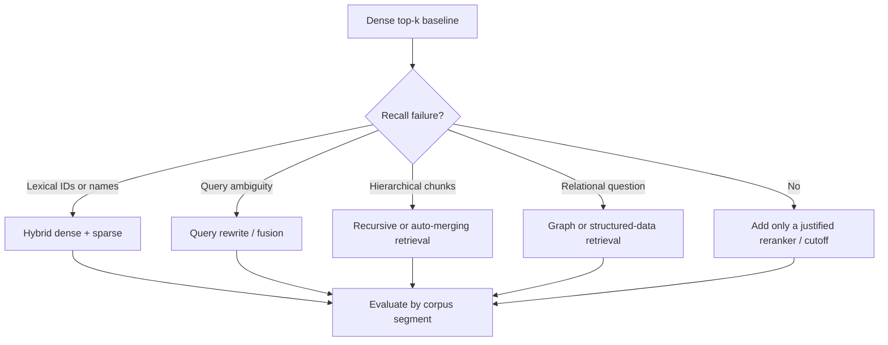

# LlamaIndex Data, RAG, Indices, and Retrieval

**Research date:** 2026-08-31

**Status:** Research-backed production guide

**Verified baseline:** `llama-index-core` 0.14.24 on `run-llama/llama_index` main (`f87a57b`); integrations are independently versioned

## Bottom line

LlamaIndex is strongest when the application is fundamentally a data system: sources become `Document` objects, transformations make `Node` objects, stores preserve several different representations, retrievers select evidence, postprocessors refine it, and a response synthesizer presents it. An agent should call that tested retrieval path as a tool; it should not own corpus synchronization or invent authorization filters.

A production RAG system needs four application-owned contracts that the framework does not choose for you:

1. stable source, document, node, tenant, and corpus-version identities;
2. an idempotent update/delete protocol across the docstore and vector store;
3. authorization before retrieval, with filters enforced by the backend;
4. an evaluation set that measures retrieval separately from answer generation.

## The data path and its owners



| Object or store | What it means | Do not confuse it with |
|---|---|---|
| `Document` | A source-level item plus metadata and `id_` | A database row that is automatically synchronized |
| `Node` | A retrieval unit, normally with a source relationship and `ref_doc_id` | An immutable copy of the source |
| `docstore` | Nodes, document hashes, and reference relationships used by many indices and ingestion strategies | The authoritative source or a vector database |
| `vector_store` | Backend-specific vector/text/filter index | A universal transactionally consistent LlamaIndex store |
| `index_store` | Serialized index-structure metadata | The vectors or complete corpus |
| `StorageContext` | A container wiring doc, index, vector, graph, and property-graph stores | Workflow `Context`, agent `Memory`, or a unit-of-work transaction |
| Retriever | Returns `NodeWithScore` evidence for a query | A query engine, which also synthesizes a response |
| Node postprocessor | Filters, reorders, or reranks retrieved nodes | Authorization; filtering after retrieval is too late for isolation |

## Build an ingestion contract before a pipeline

### Stable identities

Set `Document.id_` from a stable source identity, not a random UUID generated on every crawl. A practical identity record is:

```text
tenant_id + source_system + source_object_id + source_revision
```

Keep the current revision in metadata or an ingestion ledger; use the stable object identity as the document ID when updates must replace earlier content. A node needs its own deterministic identity when downstream citations, deletes, or offline labels refer to it. If chunk boundaries change, treat node IDs and embeddings as a new corpus version rather than pretending they are unchanged.

`ref_doc_id` is the relationship from a parsed node back to its parent document. It is normally created by parsing documents (including `from_documents`). Nodes constructed directly need that relationship set deliberately if document-level delete/update behavior is required. A document ID, node ID, provider vector ID, and citation ID are related but not interchangeable.

### Transformations are a versioned build

`IngestionPipeline` applies ordered transformations and can cache each node/transformation combination. Typical stages are parsing, splitting, metadata extraction, and embedding. If the pipeline writes directly to a vector store, embeddings must exist by that point.

Treat the transformation chain like a build artifact. Record at least:

- parser and reader package/version;
- splitter type, chunk size, overlap, and relationship settings;
- metadata-extractor and prompt versions;
- embedding provider, exact model, dimensions, and task settings;
- pipeline code version and tenant/corpus version;
- source content digest and ingestion timestamp.

A cache proves that an identical transformation input was seen under the cache key. It does **not** prove that the source is still authorized, that stale nodes were deleted, that a remote vector write committed, or that every replica uses the same configuration.

### Choose the docstore strategy deliberately

Current core exposes three `DocstoreStrategy` values:

| Strategy | Match basis | Intended behavior | Operational caution |
|---|---|---|---|
| `DUPLICATES_ONLY` | Content hash | Skip duplicate inputs | Does not express source deletion or same-ID replacement semantics |
| `UPSERTS` | Stable document/reference ID plus hash | Reprocess new or changed documents and remove old vector entries for changed IDs | Requires a persistent docstore **and** vector store for full semantics |
| `UPSERTS_AND_DELETE` | Upsert rules plus the observed input set | Also delete stored documents absent from the current input set | Safe only when the run is an authoritative complete snapshot of that scope |

Current main warns and uses `DUPLICATES_ONLY` **for that run** if an upsert strategy has a docstore but no vector store; it no longer permanently mutates the configured strategy. This followed issue [#20823](https://github.com/run-llama/llama_index/issues/20823). Keep a regression test because behavior differs in older pins.

Do not use `UPSERTS_AND_DELETE` for a partial crawl, one tenant shard, or a page of results unless the deletion comparison is scoped to exactly that complete set. Otherwise a successful run can delete valid documents it never observed.

## A production ingestion shape



The exact write order cannot make two independent backends atomic. Wrap the framework pipeline with an application ledger:

- reserve a stable ingestion operation ID;
- make vector upsert/delete idempotent by document or node ID;
- store expected node count and digest;
- mark completion only after both stores can be read back;
- reconcile interrupted operations instead of assuming absence means nothing happened;
- use a new corpus namespace for breaking parser/embedding changes, then atomically switch the query alias if the backend supports it.

The recent core test suite contains regression coverage that an upsert keeps **all** nodes sharing a `ref_doc_id`; older faulty logic could collapse them. Add your own end-to-end assertion that the vector backend contains the expected count for a multi-chunk document.

## StorageContext is composition, not a transaction

`StorageContext` wires a docstore, index store, named vector stores, graph store, and optional property-graph store. With simple stores, `persist()` writes each representation to files; remote integrations often persist as they operate, so a later `persist()` may do little or nothing.

This yields two safe patterns:

### Local or test snapshot

1. quiesce writers;
2. persist into a new versioned directory;
3. write a manifest with file hashes, package versions, embedding configuration, index IDs, and completion marker;
4. atomically publish the directory or pointer;
5. restore and query it in a fresh process.

When multiple indices share a directory, set stable index IDs and pass the intended `index_id` to `load_index_from_storage`; loading without one is only unambiguous when exactly one index exists.

### Managed backend

Recreate `StorageContext` using the same remote clients, collections/namespaces, docstore, and index store. Do not assume `VectorStoreIndex.from_vector_store()` reconstructs data the backend did not store. Some vector stores keep text/nodes; others return IDs that LlamaIndex must resolve through the docstore. Verify the integration's `stores_text`, delete, filter, async, and consistency behavior against the pinned package.

Back up and restore every participating store to a mutually compatible point. A vector snapshot without the document/index metadata it depends on is not a complete recovery image.

## Index and retrieval selection

`VectorStoreIndex` is the default general semantic index. It chunks documents when constructed with `from_documents`, embeds nodes, and delegates search mechanics to the configured vector store. `SummaryIndex` generally returns its nodes for synthesis and is appropriate for bounded all-content summarization, not a large retrieval corpus. Property-graph, SQL, keyword, document-summary, and composable indices solve different query structures; choose them because an evaluation demonstrates benefit.

The retriever contract is `query -> list[NodeWithScore]`. Vector retrievers can pass mode, dense and sparse top-k, hybrid `alpha`, MMR settings, document/node constraints, metadata filters, and backend-specific keyword arguments. `VectorStoreQueryMode` names a requested behavior; the actual algorithm, scoring scale, supported filter operators, and limits belong to the integration/backend.

### A disciplined retrieval ladder



Start with a transparent dense baseline. Add hybrid search for exact identifiers/rare terms, reranking when a larger candidate set improves recall but harms precision, and query transformations only when labelled failures justify their extra calls and latency. Composable retrieval can retrieve objects such as query engines and execute them; treat that as tool routing with an allowlist, budgets, and audit trail, not harmless document lookup.

### Filtering and tenancy

`MetadataFilters` supports nested `AND`/`OR`/`NOT` groups and operators such as equality, ranges, membership, text match, and contains in the core type system. Integrations do not necessarily implement every operator identically.

Tenant and ACL predicates must be constructed from authenticated server context and pushed into the datastore query. Never accept a model- or client-supplied tenant filter as authoritative. Never retrieve globally and rely on a node postprocessor to remove forbidden results: identifiers, scores, timing, traces, and reranker inputs have already crossed the boundary.

The following construction is verified against the pinned core filter and vector-retriever types. `access_scope` must be produced by authenticated server policy—not parsed from the user query or model output:

```python
from llama_index.core.vector_stores import (
    FilterCondition,
    FilterOperator,
    MetadataFilter,
    MetadataFilters,
)

filters = MetadataFilters(
    condition=FilterCondition.AND,
    filters=[
        MetadataFilter(
            key="tenant_id",
            operator=FilterOperator.EQ,
            value=access_scope.tenant_id,
        ),
        MetadataFilter(
            key="resource_id",
            operator=FilterOperator.IN,
            value=sorted(access_scope.allowed_resource_ids),
        ),
    ],
)

retriever = index.as_retriever(
    similarity_top_k=12,
    filters=filters,
)
```

This proves only that LlamaIndex passes a typed filter into `VectorStoreQuery`. It does not prove the installed vector-store integration translates `IN`, nested groups, missing values, or hybrid-mode filters correctly. Fail deployment if the backend cannot enforce the required predicate before top-k selection; do not silently fall back to application post-filtering.

Test each integration for:

- missing metadata (fail closed);
- nested filter translation;
- integer/string coercion;
- empty and `NOT` behavior;
- hybrid-search filter parity;
- deletes by `ref_doc_id` within a tenant;
- namespace/collection isolation under concurrency.

A compact tenancy conformance fixture should seed unmistakable canaries and exercise the real integration:

| Test | Seed/query | Required result |
|---|---|---|
| Basic isolation | Same query text in tenants A and B with unique canary tokens | A returns only A; B returns only B |
| Missing metadata | One relevant node has no `tenant_id` | Node is absent, not treated as public |
| ACL narrowing | Same tenant, only one resource ID allowed | Only the allowed resource is considered before top-k |
| Dense/hybrid parity | Repeat the isolation query in every enabled retrieval mode | Every mode enforces the identical policy |
| Nested/negative filters | Exercise `AND`, `OR`, `NOT`, and empty sets actually used by policy | Backend semantics match the policy truth table |
| Cache/rerank | Warm caches and enable reranking | No forbidden node ID, text, score, or trace crosses the boundary |
| Delete/re-ingest | Delete A's document and update B's same-shaped document | Only the intended tenant/revision changes |

Run this suite after every integration/backend upgrade and index migration. A passing unit test against an in-memory store is not evidence for the production adapter.

## Postprocessing and synthesis

Node postprocessors operate after retrieval and before response synthesis. They can apply similarity thresholds, recency rules, metadata replacement, neighbor expansion, or external rerankers. Scores from different retrievers or backends are not generally calibrated; a cutoff copied from one embedding/store pair may be meaningless in another.

For every answer preserve an evidence envelope outside the model-visible prose:

```text
query_id, tenant_id, corpus_version, retriever_config_version,
node_id, ref_doc_id, source_revision, score, rank,
postprocessor/reranker version, quoted span or artifact reference
```

The response synthesizer or agent may omit, merge, or misstate citations. Audit and UI provenance should be reconstructed from the evidence envelope, not scraped from generated text.

## Retrieval evaluation before agent evaluation

LlamaIndex's `RetrieverEvaluator` supports labelled expected node IDs and metrics including hit rate and MRR, and it can apply postprocessors in evaluation. Synthetic query generation is useful for coverage but must not replace human-labelled, adversarial, and production-representative queries.

Measure at least:

| Layer | Measures | Failure it isolates |
|---|---|---|
| Ingestion integrity | expected documents/nodes, stale-node rate, digest match | Corpus build/synchronization |
| Retrieval | recall@k, hit rate, MRR, precision/nDCG where required | Candidate selection/ranking |
| Context assembly | evidence retained after rerank/token budget | Postprocessing/truncation |
| Generation | groundedness, citation correctness, task quality | Synthesis/model behavior |
| Operations | p50/p95 latency, timeouts, tokens, backend calls, cost | Capacity and dependency health |

Stratify by source type, language, tenant size, table/narrative/footnote, query intent, document age, and ACL class. Open issue [#21706](https://github.com/run-llama/llama_index/issues/21706) is a useful reminder that aggregate retrieval metrics can conceal severe failures in heterogeneous corpora.

## Failure matrix

| Symptom | Likely cause | Detection | Recovery |
|---|---|---|---|
| Duplicate vectors grow every run | Unstable IDs, nonpersistent docstore, wrong strategy | Count by source/ref ID | Repair identities, rebuild or reconcile namespace |
| Changed document returns old chunks | Partial delete/upsert or stale replica/cache | Compare source revision and node digest | Re-run idempotent operation; delete stale IDs |
| A document loses most chunks | Upsert grouping/regression | Expected vs actual nodes per ref ID | Pin fixed core; rebuild affected documents |
| New embedding model returns nonsense or errors | Mixed dimensions/semantic spaces | Manifest and dimension check | Build a new versioned collection |
| High answer quality hides poor recall | Model guesses or evaluator only grades final text | Retrieval labels and evidence audit | Fix retrieval independently |
| Cross-tenant result | Missing/backend-mistranslated filter | Canary documents and auth tests | Stop traffic, investigate exposure, rebuild controls |
| Local snapshot loads but remote production does not | Different `stores_text`, clients, namespaces, or packages | Fresh-process restore test | Recreate the exact storage configuration |
| Reranker overwhelms latency/cost | Candidate set too large or remote call unbounded | Stage timings and candidate counts | Cap candidates, timeout, degrade to baseline |

## Production checklist

- [ ] Stable source/document/node identities and a documented `ref_doc_id` policy.
- [ ] Persistent docstore whenever deduplication or document-level updates depend on it.
- [ ] Ingestion ledger, operation IDs, expected node counts, and reconciliation job.
- [ ] Complete-snapshot proof before `UPSERTS_AND_DELETE` is allowed.
- [ ] Versioned parser, transformations, prompts, embedding model/dimensions, and corpus.
- [ ] Backend filter/delete/async behavior tested for the exact integration version.
- [ ] Tenant and ACL filters injected server-side and exercised with canary data.
- [ ] Artifacts and large raw documents stored by immutable reference, not in workflow state.
- [ ] Retrieval labels and metrics separated from synthesis metrics.
- [ ] Fresh-process backup/restore and old-version rollback drill.
- [ ] Time, candidate, token, cost, document-size, and concurrency budgets.
- [ ] Evidence envelope retained with authorization-aware access and deletion policy.

## Sources

### Primary documentation and source

- [LlamaIndex RAG indexing concepts](https://github.com/run-llama/llama_index/blob/main/docs/src/content/docs/framework/understanding/rag/indexing/index.mdx)
- [IngestionPipeline guide](https://github.com/run-llama/llama_index/blob/main/docs/src/content/docs/framework/module_guides/loading/ingestion_pipeline/index.md) and [current pipeline source](https://github.com/run-llama/llama_index/blob/main/llama-index-core/llama_index/core/ingestion/pipeline.py)
- [VectorStoreIndex guide](https://github.com/run-llama/llama_index/blob/main/docs/src/content/docs/framework/module_guides/indexing/vector_store_index.mdx)
- [Document management](https://github.com/run-llama/llama_index/blob/main/docs/src/content/docs/framework/module_guides/indexing/document_management.md)
- [Retriever guide](https://github.com/run-llama/llama_index/blob/f87a57b/docs/src/content/docs/framework/module_guides/querying/retriever/index.mdx), [pinned vector retriever](https://github.com/run-llama/llama_index/blob/f87a57b/llama-index-core/llama_index/core/indices/vector_store/retrievers/retriever.py), and [pinned query/filter types](https://github.com/run-llama/llama_index/blob/f87a57b/llama-index-core/llama_index/core/vector_stores/types.py)
- [Node postprocessors](https://github.com/run-llama/llama_index/blob/main/docs/src/content/docs/framework/module_guides/querying/node_postprocessors/index.mdx)
- [Storage customization](https://github.com/run-llama/llama_index/blob/main/docs/src/content/docs/framework/module_guides/storing/customization.md), [save/load](https://github.com/run-llama/llama_index/blob/main/docs/src/content/docs/framework/module_guides/storing/save_load.md), and [StorageContext source](https://github.com/run-llama/llama_index/blob/main/llama-index-core/llama_index/core/storage/storage_context.py)
- [Retrieval evaluation guide](https://github.com/run-llama/llama_index/blob/main/docs/src/content/docs/framework/module_guides/evaluating/usage_pattern_retrieval.md) and [evaluator source](https://github.com/run-llama/llama_index/blob/main/llama-index-core/llama_index/core/evaluation/retrieval/evaluator.py)

### Bounded failure evidence

- [Ingestion strategy mutation fixed in #20823](https://github.com/run-llama/llama_index/issues/20823)
- [`ref_doc_id` clarification #9209](https://github.com/run-llama/llama_index/issues/9209)
- [Repeated Postgres ingestion/duplicate report #13461](https://github.com/run-llama/llama_index/issues/13461)
- [Heterogeneous-corpus metric gap #21706](https://github.com/run-llama/llama_index/issues/21706)

## Refresh triggers

Re-verify this guide when `llama-index-core` or an ingestion/vector-store package changes minor version; when `DocstoreStrategy`, `StorageContext`, metadata-filter, or `VectorStoreQueryMode` behavior changes; when an embedding model, parser, or corpus schema changes; when a vector backend changes index/filter/delete semantics; or after any ingestion consistency or cross-tenant incident. Run the compatibility suite against source, docstore, vector store, and restore path before accepting the refresh.
