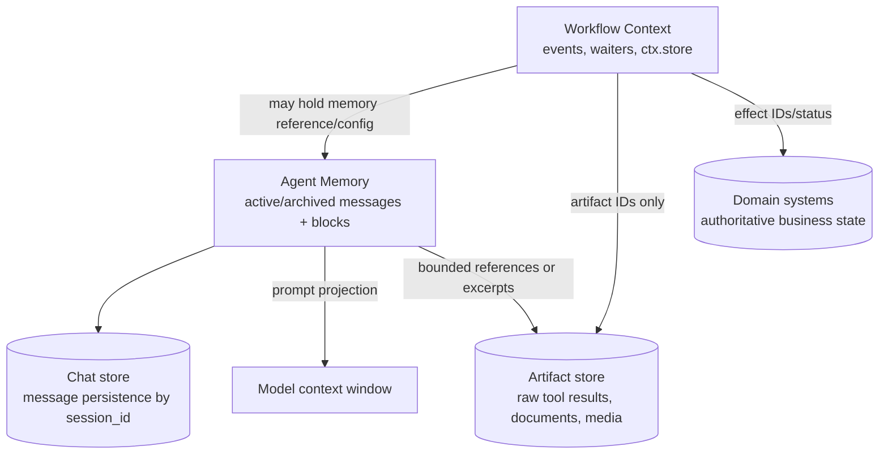
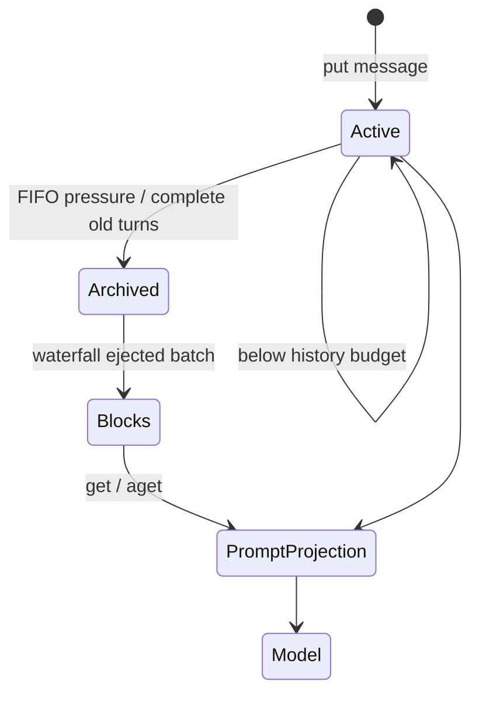
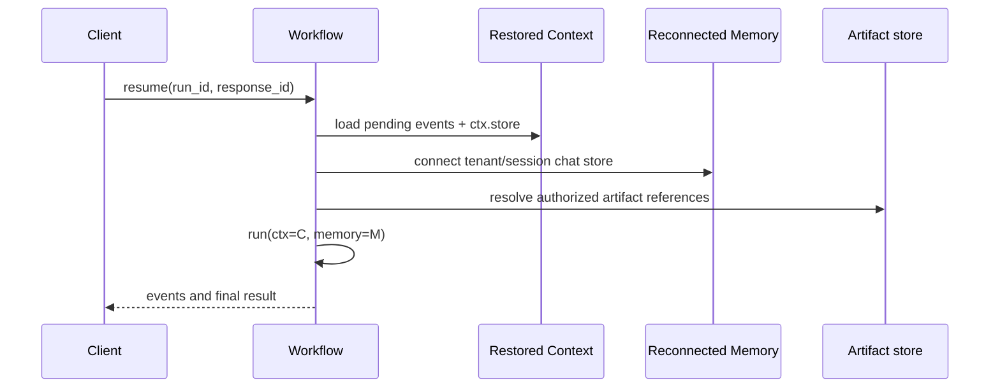

# LlamaIndex Context, Memory, and Chat Stores

**Research date:** 2026-08-31

**Status:** Research-backed production guide

**Verified baseline:** `llama-index-core` 0.14.24 on `run-llama/llama_index` main (`f87a57b`); `llama-index-workflows` 2.x is a separate dependency

## Bottom line

LlamaIndex uses the word “context” in several ordinary-language senses, but two runtime objects must remain distinct:

- workflow `Context` is the resumable execution state of one workflow run: pending/in-flight events, fan-in buffers, waiters, retry state, and `ctx.store`;
- agent `Memory` is conversation-oriented model input: stored `ChatMessage` history plus optional memory blocks.

A chat store is the persistence mechanism behind message history, not a workflow checkpoint. Neither system is a suitable owner for large source documents, full tool artifacts, or business records. Human-in-the-loop agents commonly require both a restored `Context` and the same logical `Memory` session.

## Five state planes



| Plane | Primary contents | Identity | Persistence owner |
|---|---|---|---|
| Workflow `Context` | Run queues, in-flight events, waiters, fan-in buffers, retry metadata, shared step state | workflow/run/handler ID | Context snapshot, WorkflowServer store, or durable runtime |
| `Memory` | Active and archived chat messages; optional static, fact, and vector blocks | application-chosen `session_id` | `AsyncDBChatStore` plus block-specific persistence |
| Legacy chat store | Message lists keyed by `chat_store_key` | arbitrary key | `SimpleChatStore` file or integration backend |
| Artifact store | Full tool payloads, parsed files, images, source-node bundles | immutable artifact ID/digest | Object/blob/document storage |
| Domain store | Orders, approvals, tickets, permissions, effect receipts | domain and operation IDs | Transactional application services |

Knowledge of a `session_id`, handler ID, or artifact ID is not authorization. Bind every lookup to authenticated tenant and actor policy.

## The current `Memory` model

The current `Memory` class combines:

1. a FIFO queue of chat messages in an `AsyncDBChatStore`;
2. a total `token_limit` (default in current source: 30,000);
3. a `chat_history_token_ratio` (default 0.7) that reserves a share for active recent history;
4. a `token_flush_size` controlling how much old history is ejected under pressure;
5. ordered memory blocks whose content is merged into a system message or the latest user message.

When active history exceeds its budget, `Memory` keeps conversation-turn integrity where possible, marks the oldest messages archived in the SQL store, and sends the ejected batch to blocks that accept short-term memory. On `get()`/`aget()`, it combines active history with block output and truncates nonzero-priority blocks as necessary.



This is a prompt-assembly and conversational retention policy. It is not an audit log guarantee. Token budgets, summarization/extraction, block truncation, and conversion of workflow events into `ChatMessage` objects can all omit information.

### Configure the store explicitly

`Memory.from_defaults()` uses `SQLAlchemyChatStore`; without a database URI or engine the current default is in-memory SQLite. That is useful for a process-local demo and disappears with the process. A production service should pass one of:

- a supported async SQLAlchemy URI and managed connection pool; or
- an application implementation of `AsyncDBChatStore`.

The custom interface must implement message get/add/set/delete/count/key operations plus oldest-delete/archive behavior. An older `BaseChatStore` integration is not automatically an `AsyncDBChatStore`; confirm which interface the pinned `Memory` constructor accepts.

```python
from llama_index.core.memory import Memory

memory = Memory.from_defaults(
    session_id=server_generated_session_id,
    token_limit=40_000,
    async_database_uri="postgresql+asyncpg://...",
    table_name="agent_memory",
)
```

Prefer passing an application-managed async engine so pool size, TLS, statement timeout, rotation, and shutdown are explicit. Store secrets outside serialized workflow state.

## Memory blocks: capability and persistence

| Block | Behavior | Production risks | Persistence requirement |
|---|---|---|---|
| `StaticMemoryBlock` | Always returns configured text/content blocks | Stale policy, prompt injection through configuration, unbounded priority-0 content | Rebuild from versioned trusted config |
| `FactExtractionMemoryBlock` | Uses an LLM to extract facts from flushed messages and condenses after `max_facts` | Extraction error, contradiction, lossy condensation, sensitive inference, cost | Its `facts` live on the block object; persist/version them separately if restart survival matters |
| `VectorMemoryBlock` | Embeds an ejected message batch and retrieves similar batches | Tenant/filter defects, irrelevant/poisoned recall, vector deletion obligations | Persistent vector store plus embedding/config manifest |
| Custom block | Application-defined `aget`, `aput`, and optional truncation | Arbitrary effects, serialization, concurrency, privacy | Define an explicit durable owner and migration contract |

`priority=0` means “never truncate” in block ordering. Reserve it for small, mandatory content; otherwise a block can consume the context budget that recent messages and evidence need. Current source processes other blocks in ascending numeric order when truncating (`1` before `2` before `3`); pin and test this rather than inferring ordinary-language priority semantics. Test the final serialized provider request—do not infer it from nominal token limits.

`accept_short_term_memory=False` prevents a block from receiving waterfall puts; it does not make retrieved block content trusted or authorized.

### Vector memory limitation as of the research date

Open issue [#22701](https://github.com/run-llama/llama_index/issues/22701) demonstrates that current-main `VectorMemoryBlock` mutates its `query_kwargs` when adding a `session_id` filter. Reusing one block instance across sessions can pin retrieval to the first session; the report also shows mutation of caller-supplied filters and a write path that removes `session_id` from live message metadata. Until a verified fix is pinned:

- do not share a `VectorMemoryBlock` instance or mutable filter object across sessions;
- enforce tenant/session isolation in the vector collection/namespace and authorization layer, not only this filter;
- add a two-session canary test asserting no cross-session results and no input mutation;
- treat any failure as a potential confidentiality incident.

Semantic similarity is relevance evidence, never an authorization decision.

## Legacy memory and chat stores

`ChatMemoryBuffer`, `ChatSummaryMemoryBuffer`, `VectorMemory`, and `SimpleComposableMemory` are deprecated in favor of `Memory` and blocks. Release notes for core 0.14.13 include replacing `ChatMemoryBuffer` with `Memory`, but older chat engines, examples, or pinned integrations can still expose legacy defaults. Inspect the concrete constructor instead of assuming every surface migrated at once.

Legacy buffer types commonly use `BaseChatStore` plus `chat_store_key`. `SimpleChatStore` is an in-memory dictionary that can explicitly persist/load a UTF-8 JSON file. Current source writes non-ASCII text directly using `model_dump_json()`, addressing the storage concern raised in [#15055](https://github.com/run-llama/llama_index/issues/15055). It still lacks multi-process coordination, database transactions, tenant authorization, backup management, and scalable querying.

Plan migration as a data change:

1. inventory legacy memory class, chat-store class, keys, serialized message schema, and package versions;
2. export messages without reordering tool-call/tool-result pairs;
3. map legacy keys to server-owned tenant/conversation/session IDs;
4. import into the new async store and mark active/archive state deliberately;
5. rebuild or migrate long-term vector/fact content separately;
6. compare model-visible history and UI transcript on fixtures;
7. retain a reversible snapshot until old workers are drained.

Do not deserialize arbitrary pickle-based legacy objects. Extract them in a trusted, isolated migration environment with the exact pinned code, then convert to a validated JSON schema.

## Workflow Context is not Memory

Workflow `Context` belongs to `llama-index-workflows` and contains much more than `ctx.store`. Current serialization includes global state, per-step queues, in-progress attempts, collected events, waiters, collection streams/fan-in release state, broker history needed for recovery, counters, and whether the run was running.

Memory documentation notes an important exception: a default agent may place memory in context-managed state, but customized `Memory`—especially objects with external clients or blocks—is not generally safe to serialize as part of `Context`. Pass or inject it separately and reconnect it to the same `session_id` on resume.



Restore these as a consistent bundle:

```text
tenant_id, actor_id, workflow_name/version, run_id,
context_snapshot_version, memory_session_id,
artifact_manifest_version, prompt/tool/model versions
```

If the context points to memory session A but authorization maps the request to session B, fail closed. Do not silently create empty memory and continue a sensitive approval or support thread.

## Chat history is not a complete transcript

`ChatMessage` can serialize content blocks and `additional_kwargs`, and current SQL store rows preserve the direct message JSON. Yet the workflow event stream is richer than the eventual messages. Maintainer discussion in [#19128](https://github.com/run-llama/llama_index/issues/19128) confirms that whole message threads are stored, while only a projection of some tool events reaches messages; for example, source-node bundles were not automatically transferred in the reported path.

Use three outputs from every tool call:

| Output | Contents | Retention |
|---|---|---|
| Model-visible result | Small, sanitized text/structured result | Conversation retention policy |
| Internal receipt | Tool/call IDs, authorization decision, request digest, status, timing, effect identity | Audit/reconciliation policy |
| Artifact | Full result, source nodes, files/media, provider payload where justified | Encrypted object store with explicit ACL and TTL |

Place only an artifact reference and bounded provenance in memory. This prevents huge results from dominating token counts and avoids duplicating sensitive data across chat, checkpoints, traces, and vector memory.

## Concurrency and consistency

One `session_id` can be used by multiple requests unless the application prevents it. The memory queue operation is a sequence: add messages, measure active history, archive old messages, and update blocks. A database makes individual writes durable; it does not automatically make two concurrent agent turns semantically serial.

Choose and test a policy:

- **Single writer per conversation:** queue turns by conversation ID; simplest and usually correct.
- **Optimistic concurrency:** attach a conversation version; reject/retry if the expected version changed before committing messages.
- **Branch and merge:** give concurrent runs distinct branch IDs and merge through a deterministic application reducer; do not interleave by timestamp alone.

Maintain a monotonic turn/message sequence generated transactionally. Timestamps are diagnostic, not a complete ordering protocol across processes. Keep tool-call and tool-result messages together during truncation and migration.

For memory blocks, assume `aput()` may be repeated after a workflow retry or recovery. Fact extraction and vector insertion therefore need stable batch IDs, deduplication, and versioned prompts/embeddings. External writes must not be inferred from whether a memory message exists.

## Context assembly and trust

Memory contents are untrusted inputs to the model, even when previously produced by the assistant. A user, retrieved page, tool result, or erroneous fact extractor can persist instructions that later appear near system content.

Build the final request in a deterministic order:

1. current trusted system/policy instructions;
2. current authenticated request and allowed tools;
3. small trusted static application facts;
4. bounded recent messages;
5. recalled facts/vector memories with source, author, timestamp, confidence, and trust label;
6. current RAG evidence with authorization already enforced;
7. explicit remaining token/tool/time budgets.

Do not store authorization policy as ordinary user-editable memory. Do not let an extracted “fact” become a credential, approval, legal decision, or domain truth without validation. For conflicting facts, retain provenance and surface the conflict rather than overwriting silently.

Token counting is an estimate. Current `Memory` supports configurable tokenizer functions and fixed estimates for image, audio, video, and document blocks. Provider serialization, tool schemas, cached content, and multimodal accounting can differ. Reserve headroom and enforce provider-request limits after formatting.

## Privacy, deletion, and multi-tenancy

Define deletion across every derived copy:

- active and archived chat rows;
- fact blocks and summaries;
- vector-memory nodes and embeddings;
- workflow context snapshots/server events;
- artifacts and receipts;
- traces, logs, caches, backups, and evaluation datasets.

Use opaque server-generated IDs, but authorize by tenant/actor/relationship on every operation. Encrypt sensitive stores, minimize `additional_kwargs`, redact logs, and separate production data from evaluation exports. A deletion workflow should be idempotent and return a manifest of deleted, retained-under-policy, and pending-backup-expiry records.

## Failure matrix

| Symptom | Likely cause | Correct response |
|---|---|---|
| Agent forgets after restart | Default in-memory SQLite or unreconstructed block state | Use remote store; rebuild/persist block state explicitly |
| UI history lacks citations/tool details | Event-to-message projection omitted rich fields | Store artifact/receipt and render from them |
| Two users see the same recalled memory | Shared/mutated vector block or missing tenant isolation | Stop exposure; pin fix; isolate stores and test two sessions |
| Messages appear out of order | Concurrent writers using timestamps as ordering | Serialize turns or add transactional sequence/version |
| Old facts remain after correction/deletion | Extracted/vector memory has no provenance/delete path | Use source-linked facts, tombstones, and derived-data cleanup |
| Model context overflows below nominal limit | Provider formatting/tool/multimodal overhead | Measure final request and reserve headroom |
| Context restore fails on custom memory | External client/block not serializable | Inject `Memory` as resource/runtime argument by stable session ID |
| Retried step duplicates vector facts | Memory-block put is not idempotent | Stable batch IDs and backend upsert/dedup |

## Production checklist

- [ ] `Memory`, workflow `Context`, artifacts, and domain state have separate owners.
- [ ] Production memory uses a durable async chat store, not default in-memory SQLite.
- [ ] Tenant/conversation/session IDs are server generated, mapped, and authorized.
- [ ] One-writer, optimistic-version, or explicit branch policy handles concurrent turns.
- [ ] Memory-block persistence and restart behavior are documented per block.
- [ ] Vector memory has a two-session isolation/mutation regression test for #22701.
- [ ] Deprecated memory formats have a reversible migration plan.
- [ ] Full tool results/source nodes live in artifacts; messages contain bounded references.
- [ ] Prompt assembly labels provenance/trust and measures the final provider request.
- [ ] Active, archived, vector, fact, workflow, artifact, trace, and backup deletion is tested.
- [ ] Crash/retry tests prove memory puts and derived writes are idempotent.
- [ ] Resume binds the exact context version, memory session, workflow version, and tenant.

## Sources

### Primary documentation and source

- [Current Memory guide](https://github.com/run-llama/llama_index/blob/main/docs/src/content/docs/framework/module_guides/deploying/agents/memory.mdx)
- [`Memory` and `BaseMemoryBlock` source](https://github.com/run-llama/llama_index/blob/main/llama-index-core/llama_index/core/memory/memory.py)
- [Static](https://github.com/run-llama/llama_index/blob/main/llama-index-core/llama_index/core/memory/memory_blocks/static.py), [fact-extraction](https://github.com/run-llama/llama_index/blob/main/llama-index-core/llama_index/core/memory/memory_blocks/fact.py), and [vector](https://github.com/run-llama/llama_index/blob/main/llama-index-core/llama_index/core/memory/memory_blocks/vector.py) block source
- [`AsyncDBChatStore` interface](https://github.com/run-llama/llama_index/blob/main/llama-index-core/llama_index/core/storage/chat_store/base_db.py) and [`SQLAlchemyChatStore`](https://github.com/run-llama/llama_index/blob/main/llama-index-core/llama_index/core/storage/chat_store/sql.py)
- [`SimpleChatStore` source](https://github.com/run-llama/llama_index/blob/main/llama-index-core/llama_index/core/storage/chat_store/simple_chat_store.py)
- [Workflow resource guidance, including Memory injection](https://github.com/run-llama/llama-agents/blob/main/docs/src/content/docs/llamaagents/workflows/resources.md)
- [Current core releases](https://github.com/run-llama/llama_index/releases)

### Bounded failure evidence

- [Open cross-session `VectorMemoryBlock` mutation bug #22701](https://github.com/run-llama/llama_index/issues/22701)
- [Memory persistence and missing rich tool-event projection #19128](https://github.com/run-llama/llama_index/issues/19128)
- [`SimpleChatStore` non-ASCII persistence issue and fix lineage #15055](https://github.com/run-llama/llama_index/issues/15055)
- [Context serialization discussion #18265](https://github.com/run-llama/llama_index/discussions/18265)

## Refresh triggers

Re-verify after any `llama-index-core` minor release; a change to `Memory`, memory-block, `ChatMessage`, `AsyncDBChatStore`, or agent event-to-message logic; resolution of #22701; a provider tokenizer/content-block change; a new persistent-memory integration; or a confidentiality/deletion incident. Run migration, two-session isolation, concurrent-turn, context+memory resume, and complete-erasure fixtures before accepting the refresh.
