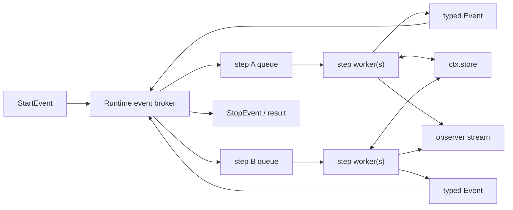
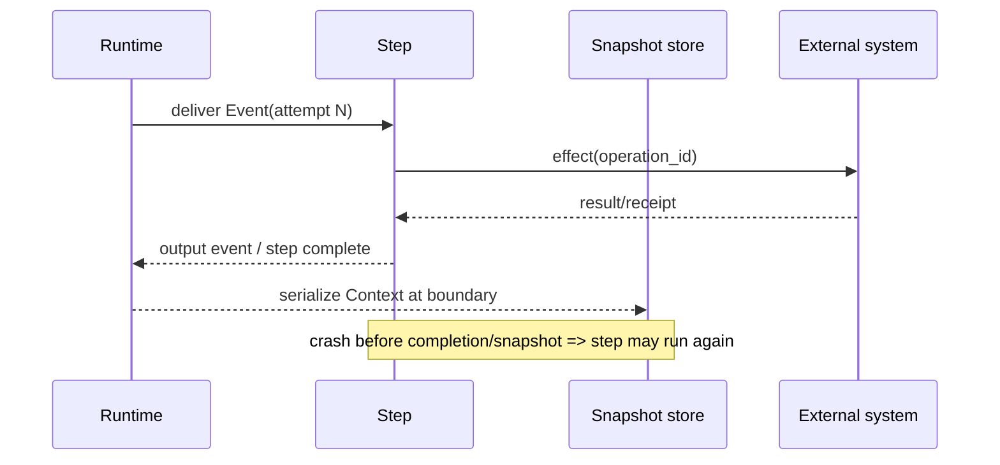
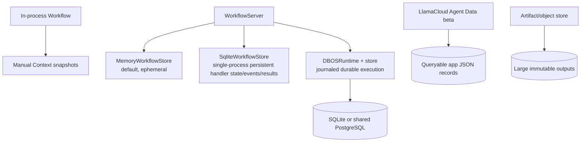

# LlamaIndex Workflow State, Events, and Persistence

**Research date:** 2026-08-31

**Status:** Research-backed production guide

**Verified baseline:** `llama-index-workflows` 2.x in `run-llama/llama-agents` main (`94f17c9`); `llama-index-core` 0.14.24 re-exports workflow APIs for compatibility

## Bottom line

A LlamaIndex Workflow is an event reducer running in Python. Its `Context` is the per-run recovery image: state store plus pending/in-flight event machinery. By default it lives in memory and is ephemeral. `Context.to_dict()` gives you a resumable snapshot, but the application must decide when and atomically where to save it. A snapshot or DBOS journal gives at-least-once recovery at interrupted step boundaries; it does not make an external API call and the workflow transition one atomic transaction.

Keep four persistence concerns separate:

1. workflow execution state (`Context`, handler events/results, DBOS journal);
2. agent conversation state (`Memory`/chat store);
3. large artifacts and source data;
4. authoritative business state and effect receipts.

## Runtime model



`Context` coordinates event delivery, tracks work, exposes the shared state store, supports event synchronization/waiters, and supplies the observer stream. A current serialized context includes more than user state: per-step queues, in-progress attempts, collected events, human/event waiters, static fan-in buffers, collection stream state, retry metadata, counters, and the running flag.

Workflow instance attributes and Python globals are **not** per-run durable state. They may be shared across concurrent runs or disappear on restart. A run-scoped value belongs in an event or `ctx.store`; a client/index/LLM handle belongs in a `Resource`; a large output belongs in an artifact store.

## Design events as durable contracts

`Event` is a Pydantic-based, dict-like model. Declared fields are validated, while extra keyword fields are accepted in a private dynamic mapping. This flexibility is convenient for prototypes but can hide misspellings and schema drift. Production events should declare their fields and constrain values.

```python
from pydantic import Field
from workflows.events import Event

class DocumentReady(Event):
    schema_version: int = 1
    tenant_id: str
    document_id: str
    artifact_id: str
    attempt: int = Field(ge=0)
```

Every durable event should carry or derive:

- schema version;
- tenant and authorization scope;
- run, correlation, and causation IDs;
- stable work/effect ID for deduplication;
- small immutable payload or artifact reference;
- deadline/expiry where stale work is unsafe;
- producer code/prompt/tool version where semantics can change.

Avoid credentials, open clients, raw bytes, large documents, model objects, or mutable shared containers. Treat an emitted event as immutable even though Python can mutate its object.

### Control events versus streamed events

| API | Destination | Use | Important behavior |
|---|---|---|---|
| Step return | Runtime broker | Normal typed transition | A returned list forms an all-or-nothing fan-out batch when the step completes |
| `ctx.send_event()` | Step queue(s) | Incremental/dynamic control flow | Events already sent remain available even if the producer later fails |
| `ctx.collect_events()` | Per-step collection buffer | Manual fan-in for a known expected set | Returns `None` until complete; caller owns expected count and buffer identity |
| Typed `list[Event]` input | Runtime batch collector | Static fan-in | Preferred when the batch shape is expressed in signatures |
| `ctx.write_event_to_stream()` | Handler/client observer stream | Progress, deltas, UI/HITL notification | Does not by itself route an event to a workflow step |
| Handler/Context `send_event()` | Running workflow | External/HITL response | Must target the correct live/restored run and be deduplicated |

For `ctx.collect_events()`, distinct expected types are returned in the specified type order. Repeated instances of the same type are effectively arrival ordered. Use a stable `buffer_id` when multiple logical joins could otherwise share the same buffer, and include item IDs so the reducer can sort/deduplicate deterministically.

Prefer typed list fan-out/fan-in in current Workflows. The runtime understands batch scope, including nested batches and dropped branches. Manual `send_event` is useful when work must begin before the producer returns or the count is dynamic, but it expands partial-failure states.

## State store semantics

Each context exposes `ctx.store`. Without a typed state declaration it uses flexible `DictState`; typed Pydantic state provides validation and a migration target. Every typed field should have a default so the context can initialize it.

```python
from pydantic import BaseModel, Field

class RunState(BaseModel):
    schema_version: int = 1
    completed_ids: set[str] = Field(default_factory=set)
    artifact_ids: list[str] = Field(default_factory=list)
    budget_used: int = 0
```

Use single `get`/`set` calls only for independent values. A read-modify-write sequence must be atomic:

```python
async with ctx.store.edit_state() as state:
    state.completed_ids.add(item_id)
    state.budget_used += cost
```

Current state-store behavior is deliberately specific:

- writers are serialized;
- `edit_state()` yields an isolated copy and commits on normal block exit;
- lockless reads during an edit see the previous committed state;
- `set`, `clear`, `set_state`, or nested `edit_state` inside the block raises rather than deadlocking;
- slow LLM/network/tool calls inside the edit block hold the writer lock and should be moved outside;
- the process-local lock does not make a domain database or API transactional.

Compute an external result outside the block, then use a short edit to apply it only if the state's expected version/work ID still matches. If the check fails, discard or reconcile the result.

### State placement

| Value | Correct home | Why |
|---|---|---|
| Small counter, decision, pending approval ID | `ctx.store` | Shared run state and snapshot material |
| Work item/result moving between steps | Typed event | Makes dependencies and retry unit explicit |
| LLM client, retriever, index, DB connection | `Resource` | Recreated by factory; not serialized |
| Parsed file, media, full source nodes, large result | Artifact store; event/state carries ID | Keeps snapshots bounded and access controlled |
| Chat history and long-term recall | `Memory`/chat and memory stores | Different lifecycle and projection semantics |
| External write receipt | Transactional effect ledger | Needed to reconcile ambiguous outcomes |

Resources are cached per workflow run by default and recreated on resume. Their factory must reconnect safely from configuration; local caches/files are available only on the replica that owns the run unless explicitly shared.

## Context serialization

`Context.to_dict()` is the supported snapshot boundary. `Context.from_dict(workflow, payload)` restores it against a workflow instance. The current payload is versioned; it can migrate known older formats and rejects a version newer than the installed library rather than silently discarding fields. Legacy-format migrations may lack retry/waiter information that did not exist in the old payload, so upgrade fixtures must exercise real old snapshots.

Use the same serializer for writing and reading:

```python
import json
from workflows import Context
from workflows.context.serializers import JsonSerializer

serializer = JsonSerializer(allowed_types=allowed_workflow_types)
payload = handler.ctx.to_dict(serializer=serializer)
await snapshots.put(run_id, json.dumps(payload), expected_version=version)

restored = Context.from_dict(
    workflow,
    json.loads(await snapshots.get(run_id)),
    serializer=serializer,
)
handler = workflow.run(ctx=restored)
```

The JSON serializer handles JSON structures, Pydantic models, and LlamaIndex components and records qualified Python class names for reconstruction. Without `allowed_types`, deserialization may import named application types. Treat snapshots as privileged internal data, validate ownership and integrity before loading, and use an exhaustive, tested `allowed_types` set for every event/state/component type a snapshot can contain. A module/class rename can break restoration even when the field schema is unchanged.

`PickleSerializer` (formerly `JsonPickleSerializer`) falls back to pickle and can execute arbitrary code while loading. Never use it for client-controlled, cross-tenant, or otherwise untrusted payloads. Prefer explicit JSON event/state schemas and artifact references.

### Snapshot storage protocol

Persist a manifest beside the payload:

```text
tenant_id, workflow durable name, workflow schema version,
run/handler ID, context format/library version, snapshot sequence,
created_at, payload digest, encryption key ID,
memory session ID, artifact manifest version, status
```

Write with optimistic compare-and-swap on snapshot sequence so an older concurrent writer cannot overwrite a newer state. Encrypt and authenticate the payload, apply per-tenant authorization, and make retention/deletion explicit. Validate maximum event, state, and snapshot sizes before accepting them.

## Manual checkpoint and recovery

Library Workflows are ephemeral by default; there is no checkpointer switch. Current documentation recommends observing internal `StepStateChanged` events with `stream_events(expose_internal=True)` and snapshotting when a step becomes `NOT_RUNNING`. Throttle writes if step boundaries are noisy, accepting that the interval bounds repeated work after a crash.



On restore, pending events and partial fan-in buffers are reconstructed. Completed-step output already in the snapshot need not rerun. A step that was executing when the snapshot was captured is rewound and runs from the top. This is at-least-once execution for in-flight work.

Snapshot only after `StopEvent` protects a completed run, not a long active run. Snapshot only after a human prompt protects the wait but not earlier expensive branches. Choose recovery-point objectives per workflow and measure serialization/write latency at production state sizes.

## Side effects and the idempotency ledger

Neither `ctx.store` nor an absent output event proves an external operation did not happen. For every effectful step use an application-owned protocol:

1. derive stable `operation_id = run_id + logical_step + entity/version`;
2. authorize the exact action from trusted runtime context;
3. reserve the operation in a transactional ledger;
4. call an idempotent downstream API with that key;
5. record the provider receipt/result;
6. emit only a bounded result/artifact reference;
7. on retry, return the prior receipt or reconcile ambiguous status.

| Operation | Recovery policy |
|---|---|
| LLM call | Cache by request identity if repeat cost/non-determinism matters, or deliberately rerun and record both attempts |
| Retrieval/read | Repeat against a pinned corpus/source version where reproducibility matters |
| Artifact transform | Content-address inputs/outputs and upsert manifest |
| Email/payment/ticket mutation | Idempotency key plus downstream lookup/reconciliation; never blind retry after timeout |
| Human response | Bind response to pending request ID and deduplicate response ID |
| Memory update | Stable message/batch IDs; avoid duplicate waterfall/vector writes |

Retry policies handle transient execution failures; they do not supply effect idempotency. Keep deadlines and total attempt budgets outside per-step backoff.

## Human waits

The most transparent HITL shape is two steps: one emits `InputRequiredEvent`, another consumes `HumanResponseEvent`. Snapshot after the prompt, cancel the original handler if handing the run to another request/process, restore the context later, then send the response into the restored handler.

`ctx.wait_for_event()` can keep the wait in one step and supports `waiter_id`, requirements, and timeout. Current documentation warns that the step replays all code before the wait when the triggering or matching event arrives; preceding code must be repeat-safe. Use a stable waiter/request ID and bind response fields to it. Prefer separate event-consuming steps when the replay semantics are not worth the compact code.

Race-test response-versus-timeout, double submission, cancel-versus-response, expired authorization, and resume onto a new worker. A human answer is an external event, not permission to bypass current authorization policy.

## Server and durable-runtime boundaries



These are different state services:

- `WorkflowServer` defaults to `MemoryWorkflowStore`; handler state and events are lost on restart.
- `SqliteWorkflowStore` persists handler state, events, and results to a local file and is positioned for single-process use. Test actual crash/resume, file locking, backup, and deployment semantics before treating it as production durability.
- `DBOSRuntime` journals transitions and stream events, rebuilds context/state by replay, and can integrate with `WorkflowServer`. Interrupted steps can still run more than once before their journal completion is committed.
- LlamaCloud Agent Data (beta) is a deployment/collection-scoped queryable JSON record service for application outputs; it is not automatically the workflow context, conversation memory, or large-artifact store.
- Artifacts need their own blob/object owner with content digest, ACL, TTL, and provenance.

Under DBOS, the workflow's durable name is journal identity; an HTTP route name is separate. Renaming/moving a class can change the default durable name, so set a stable explicit name for long-lived workflows. A replica identified by `executor_id` owns a workflow and all its steps run in that process; individual steps are not distributed across replicas. Recovery replay and queueing use shared persistence, but local files/caches remain owner-local.

Drain old workflow names/versions before removing compatible workers. Changing event types, step signatures, state schemas, prompts, or effect logic beneath an in-flight history can change resumed behavior. Register a new durable name/version for breaking changes.

## Concurrency and deterministic reducers

`@step(num_workers=N)` enables concurrent event processing inside a run. Workflow `num_concurrent_runs` limits runs in one process in the default runtime and participates in DBOS queue behavior when configured. Neither setting is a global downstream API quota across replicas; use a shared rate limiter or service quota.

Parallel results arrive in completion order. A deterministic join should:

- key results by stable item ID;
- reject/deduplicate duplicate attempts;
- sort explicitly before hashing or presenting;
- define partial-failure and late-result policy;
- write one merged state transition inside `edit_state()`;
- keep large candidates in artifacts, not append them all to state.

Do not reuse mutable workflow instance attributes as per-run scratch space. Run-level context prevents cross-request leakage; the run-llama create template report [#724](https://github.com/run-llama/create-llama/issues/724) is a concrete warning about module-scope workflow instances with mutable instance state under concurrent requests.

Nested workflows have independent contexts/handlers unless explicitly connected. Historical discussion [#15838](https://github.com/run-llama/llama_index/discussions/15838) documents streaming/concurrent reuse failures, and [#19820](https://github.com/run-llama/llama_index/discussions/19820) records cancellation not propagating automatically in the reported nested shape. Test the current pinned release; track child handlers, forward only intended events, and propagate cancellation/deadlines explicitly.

## Failure matrix

| Failure | What may repeat or be lost | Required control |
|---|---|---|
| Crash before next manual snapshot | All transitions after prior snapshot; in-flight steps rerun | Snapshot RPO plus idempotent effects |
| Snapshot write race | Newer payload overwritten by older writer | Monotonic sequence and compare-and-swap |
| Unserializable event/state | Entire snapshot attempt fails | JSON schemas; artifact/resource references; preflight test |
| Event/class rename | Deserializer cannot import old qualified name | Stable modules or explicit migration/old worker |
| Pickle payload tampering | Arbitrary code execution | Never load untrusted pickle; signed restricted JSON |
| Parallel compound state writes | Lost update | Short `edit_state()` reducer |
| Dynamic event emitted then producer fails | Downstream observes partial fan-out | Idempotent/correlated reducer or typed batch return |
| Duplicate human response | Approval/action executes twice | Pending request + response dedup IDs |
| Parent canceled, child continues | Orphan work/effects | Track and cancel child handlers; deadlines |
| DBOS worker/name removed | In-flight history not resumed by compatible owner | Stable identity, drain/version deployment |
| Context restored without matching Memory/artifacts | Semantically incomplete agent run | Versioned bundle and fail-closed resolution |

## Recovery and migration tests

- [ ] Snapshot/restore before and after every step boundary and human wait.
- [ ] Kill a step before, during, and after each external side effect.
- [ ] Restore pending static and manual fan-in with duplicates and out-of-order results.
- [ ] Race concurrent `edit_state()` operations and verify read-committed behavior.
- [ ] Reject overlarge, tampered, wrong-tenant, future-version, and disallowed-type snapshots.
- [ ] Load representative snapshots from every supported old library/workflow schema.
- [ ] Rename an event/step/workflow in a staging migration and prove drain or translation.
- [ ] Restart WorkflowServer with the selected store and verify handler/events/results/resume.
- [ ] Restart and kill DBOS owners; verify replay, stream cursor behavior, and idempotent effects.
- [ ] Cancel parent/child, queued/active, and HITL runs; reconcile all external operations.
- [ ] Delete a run and verify context, server events/results, memory, artifacts, traces, and ledger retention independently.

## Sources

### Primary documentation and source

- [Workflows managing state](https://github.com/run-llama/llama-agents/blob/main/docs/src/content/docs/llamaagents/workflows/managing_state.md)
- [Writing durable workflows](https://github.com/run-llama/llama-agents/blob/main/docs/src/content/docs/llamaagents/workflows/durable_workflows.md)
- [Concurrent execution and fan-in/fan-out](https://github.com/run-llama/llama-agents/blob/main/docs/src/content/docs/llamaagents/workflows/concurrent_execution.md)
- [Human-in-the-loop events and waits](https://github.com/run-llama/llama-agents/blob/main/docs/src/content/docs/llamaagents/workflows/human_in_the_loop.md)
- [Workflow resources](https://github.com/run-llama/llama-agents/blob/main/docs/src/content/docs/llamaagents/workflows/resources.md)
- [`Context` source and serialization contract](https://github.com/run-llama/llama-agents/blob/main/packages/llama-index-workflows/src/workflows/context/context.py)
- [State-store source](https://github.com/run-llama/llama-agents/blob/main/packages/llama-index-workflows/src/workflows/context/state_store.py), [context payload versions](https://github.com/run-llama/llama-agents/blob/main/packages/llama-index-workflows/src/workflows/context/context_types.py), and [serializers](https://github.com/run-llama/llama-agents/blob/main/packages/llama-index-workflows/src/workflows/context/serializers.py)
- [`Event` source](https://github.com/run-llama/llama-agents/blob/main/packages/llama-index-workflows/src/workflows/events.py)
- [WorkflowServer deployment and persistence](https://github.com/run-llama/llama-agents/blob/main/docs/src/content/docs/llamaagents/workflows/deployment.md)
- [DBOS durable execution model](https://github.com/run-llama/llama-agents/blob/main/docs/src/content/docs/llamaagents/workflows/dbos.md)
- [LlamaCloud Agent Data overview (beta)](https://github.com/run-llama/llama-agents/blob/main/docs/src/content/docs/llamaagents/cloud/agent-data-overview.md)

### Bounded failure evidence

- [Context/checkpoint serialization discussion #18265](https://github.com/run-llama/llama_index/discussions/18265)
- [Nested streaming/concurrent reuse discussion #15838](https://github.com/run-llama/llama_index/discussions/15838)
- [Nested cancellation discussion #19820](https://github.com/run-llama/llama_index/discussions/19820)
- [Shared workflow-instance state in templates #724](https://github.com/run-llama/create-llama/issues/724)

## Refresh triggers

Re-verify when `llama-index-workflows`, `llama-agents-server`, or `llama-agents-dbos` changes minor version; the serialized context version or state-store protocol changes; event batching/waiter/retry semantics change; a new WorkflowServer store or runtime plugin appears; DBOS changes identity, ownership, queue, or replay behavior; or a recovery/cross-tenant incident occurs. Preserve old snapshot fixtures and run the full crash/effect/HITL/migration matrix before accepting a new version.
