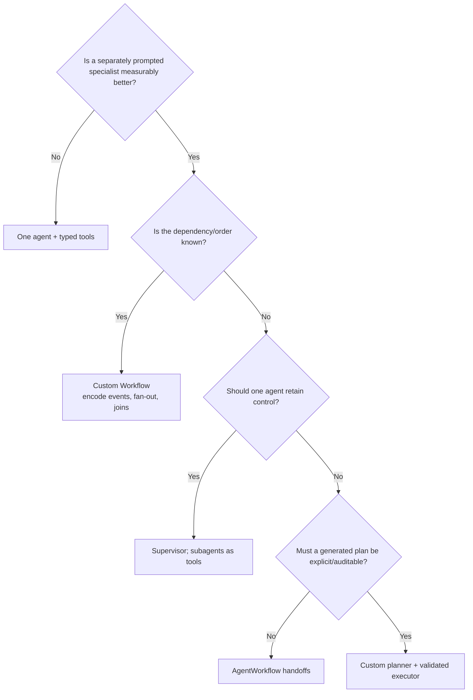
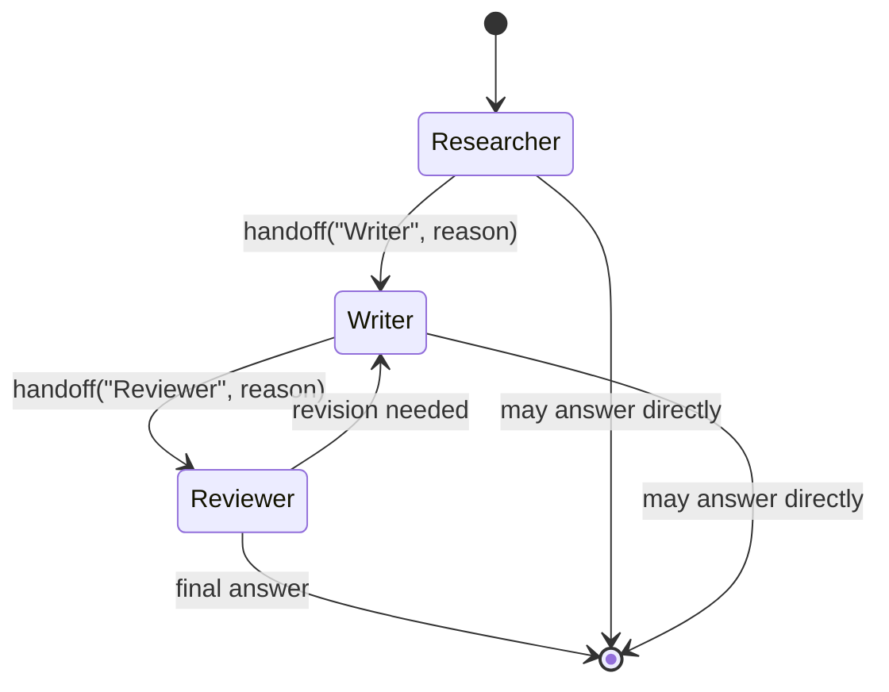
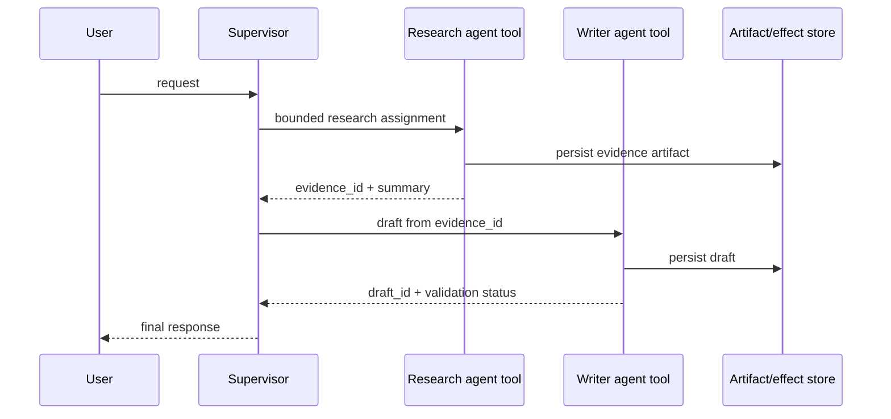
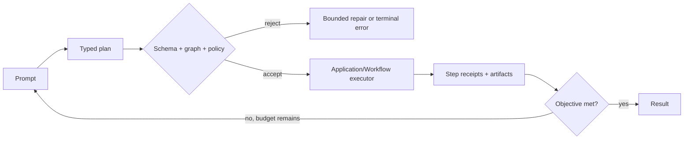

# LlamaIndex multi-agent patterns

**Research date:** 2026-08-31  
**Status:** Production guide; version-sensitive  
**Verified against:** `llama-index-core` 0.14.24 at commit `f87a57b`, `llama-index-workflows` 2.23.3 at commit `94f17c9`  
**Scope:** LlamaIndex `AgentWorkflow`, supervisor-as-tools, custom planners, and custom event Workflows. Hosting and durability are separate LlamaAgents concerns.

## Bottom line

Start with one agent. Add a second agent only when a separately prompted tool loop has a measurable advantage over another typed tool or deterministic step.

When multiple agents are justified:

- use `AgentWorkflow` for a **sequential, model-selected handoff** among a small, bounded set of specialists;
- use a supervisor agent with subagents exposed as tools when one agent should keep user-facing control;
- use a custom Workflow when dependencies, fan-out, joins, approval gates, or ordering are known in advance;
- use a custom planner only when the plan itself must be model-generated and inspected, stored, or externally scheduled.

`AgentWorkflow` and a custom Workflow run in the application process. They do not become crash durable, remotely hosted, or horizontally coordinated merely because several agents participate. Those are LlamaAgents server/runtime concerns covered in [server, clients, and executors](08-llamaagents-server-clients-and-executors.md) and [durability and recovery](09-durability-reliability-concurrency-and-recovery.md). The older LlamaDeploy project is deprecated and is not the runtime described here.

## Choose the smallest adequate pattern

| Pattern | Control owner | Concurrency | Best fit | Primary failure mode |
|---|---|---:|---|---|
| One `FunctionAgent` with typed tools | One model loop | Tool-call dependent | Most applications | Too many overlapping tools or an unbounded loop |
| `AgentWorkflow` | Current specialist; handoff tool changes owner | Handoffs are sequential | Conversational specialist transfer | Handoff loops, context leakage, weak termination |
| Supervisor with agents as tools | Supervisor remains owner | Usually sequential unless deliberately fanned out | Central policy, synthesis, and user interaction | Nested token/tool cost; supervisor becomes a bottleneck |
| Custom event Workflow | Application event graph | Explicit fan-out/fan-in | Known dependencies, parallel work, approval gates | Incorrect event cardinality or non-idempotent branches |
| Custom model planner | Planner output plus application executor | Whatever the executor implements | Auditable or externally scheduled dynamic plans | Invalid plans, unsafe dependency inference, replanning loops |



Evaluate the selected pattern against a single-agent baseline. Multi-agent designs normally add model calls, context transfer, state coordination, latency, and more ways to stop incorrectly.

## Pattern 1: `AgentWorkflow` is a handoff loop

`AgentWorkflow` is a prebuilt Workflow around `FunctionAgent`, `ReActAgent`, or another `BaseWorkflowAgent`. It starts at one required root agent. The active agent may call its ordinary tools or a generated `handoff` tool. A successful handoff updates `current_agent_name`; the next model turn uses the destination agent.



The handoff graph should be explicit:

```python
from llama_index.core.agent.workflow import AgentWorkflow, FunctionAgent

researcher = FunctionAgent(
    name="Researcher",
    description="Finds evidence and records source-backed notes.",
    system_prompt="Research only. Hand off after the evidence record is complete.",
    tools=[search, record_note],
    can_handoff_to=["Writer"],
    llm=llm,
)
writer = FunctionAgent(
    name="Writer",
    description="Drafts from approved evidence.",
    system_prompt="Draft from recorded evidence; do not perform new research.",
    tools=[load_notes, save_draft],
    can_handoff_to=["Reviewer"],
    llm=llm,
)
reviewer = FunctionAgent(
    name="Reviewer",
    description="Checks claims against the evidence record.",
    system_prompt="Return to Writer only when a concrete correction is required.",
    tools=[load_notes, load_draft, record_review],
    can_handoff_to=["Writer"],
    llm=llm,
)

workflow = AgentWorkflow(
    agents=[researcher, writer, reviewer],
    root_agent="Researcher",
    initial_state={
        "workflow_schema_version": 1,
        "evidence_ids": [],
        "draft_id": None,
        "review_status": "pending",
    },
    timeout=180,
    early_stopping_method="force",
)

result = await workflow.run(
    user_msg="Produce a source-backed brief.",
    max_iterations=20,
)
```

The example is intentionally bounded. `max_iterations` limits model-loop iterations; `timeout` limits the Workflow. Neither limits tokens, tool expense, fan-out, or a slow tool by itself. Add application deadlines and budgets at those boundaries.

### Source-level semantics that matter in production

| Behavior in current source | Consequence |
|---|---|
| Every agent in a multi-agent workflow must have a non-default name and description. | Names are routing identities; treat renames as behavioral changes and test prompts again. |
| Exactly one root agent is required when more than one agent exists. | Entry routing is deterministic even though later routing is model-selected. |
| `can_handoff_to=None` permits every other agent; an empty list prevents handoffs. | Default-open routing creates cycles easily. Prefer an allow-list. |
| Per-agent `initial_state` is rejected; state belongs to `AgentWorkflow`. | Do not design around private per-agent mutable dictionaries hidden from the workflow. |
| One `memory` object in Workflow context is shared as agents hand off. | Every specialist may see the accumulated conversation/tool transcript unless tools enforce a narrower data view. |
| Initial state is deep-copied into context and formatted into the last input message once per run. | Later state mutations are not automatically re-rendered into every subsequent prompt. Return needed facts from tools or explicitly load them. |
| The handoff is a `return_direct` tool, but the workflow finalizes the current agent and continues with the destination. | A handoff is a control transition, not a child-agent call that returns to the caller. |
| All tool calls emitted in a turn are dispatched as Workflow events. | Side-effecting tool calls must not depend on provider-returned ordering. |
| Tool exceptions are converted to error `ToolOutput` values, except the internal wait-for-event signal. | A model may continue after a tool failure; terminal error policy must be explicit. |
| `force` raises when `max_iterations` is reached; `generate` makes one final model call. | `generate` can hide an incomplete workflow behind a fluent answer. Use it only when partial completion is acceptable and labeled. |

The current implementation stores the supplied agent and tool objects by reference. An issue reported cross-agent mutation when the same mutable `FunctionTool` instance was shared. The issue was closed as not planned, so the production rule is simple: make tool definitions effectively immutable after assembly, put per-run data in `Context` or a scoped resource, and do not mutate shared tool metadata, partial parameters, or session handles during a run.

### When `AgentWorkflow` is the wrong abstraction

Do not use a handoff prompt to approximate a known DAG. It is the wrong fit when:

- several specialists must run concurrently;
- every branch must run, regardless of what a model prefers;
- a join needs an exact cardinality or deterministic reduction;
- approval must occur before a particular external effect;
- the plan must be persisted independently from chat history;
- branch-specific context or authorization must be proven rather than described in prompts.

Move those requirements into a custom Workflow and use agents only inside the steps that genuinely need model reasoning.

## Pattern 2: supervisor with agents as tools

Here the top-level `FunctionAgent` owns the conversation. Each specialist is wrapped by an async function tool. The specialist completes a bounded assignment and returns an artifact or summary to the supervisor; it does not take over the conversation.



Use this pattern when central instructions must enforce budgets, authorization, output policy, or user-facing style. It also gives one place to decide whether another specialist call is necessary.

Production rules:

- Give each wrapper a narrow typed input and output. Return artifact IDs and bounded summaries rather than another agent's entire transcript.
- Start the subagent with fresh memory unless continued specialist conversation is intentional.
- Pass only the tenant, authorization scope, and state slice needed for that call.
- Bound nested calls independently. The supervisor's iteration limit does not automatically cap a subagent's internal loop.
- Treat the subagent call as a tool effect for tracing, timeout, cancellation, and retry policy.
- Make the supervisor verify completion state; a fluent subagent response is not proof that an artifact was persisted or an external action succeeded.

An orchestrator-as-tools design is still model-directed. If all three specialists must execute, an event graph is simpler and cheaper to validate.

## Pattern 3: custom planner plus validated executor

A custom planner asks a model for a typed plan, validates it, then executes it in application code or a Workflow. This is more controllable than parsing free-form prose, but it creates two separate products: a planning language and an executor.

The plan contract should include at least:

```text
plan_id, schema_version, objective, steps[]
step: id, capability, input_refs, depends_on, expected_output_schema,
      authorization_scope, timeout, retry_class, max_attempts
```

Reject a plan when it contains an unknown capability, a cycle, an unbound input, an unauthorized effect, an excessive fan-out, or an output that no later step consumes. Never let the planner invent import paths, tool names, database identifiers, or arbitrary code and pass them directly to an executor.



Keep planning and execution histories separate. Replanning should reference immutable step receipts, not guess from a chat transcript whether a side effect happened.

## Pattern 4: custom Workflow for parallel agents

The current standalone package is imported as `workflows`; `llama_index.core.workflow` remains a compatibility surface in LlamaIndex. A typed list return is the clearest fan-out: each element becomes an event, a worker step processes elements concurrently, and a list parameter performs the fan-in.

```python
from workflows import Workflow, step
from workflows.events import Event, StartEvent, StopEvent

class Assignment(Event):
    index: int
    capability: str
    prompt: str

class Candidate(Event):
    index: int
    artifact_id: str
    score: float

class ParallelReview(Workflow):
    @step
    async def dispatch(self, ev: StartEvent) -> list[Assignment]:
        return [
            Assignment(index=0, capability="factual", prompt=ev.prompt),
            Assignment(index=1, capability="security", prompt=ev.prompt),
            Assignment(index=2, capability="operability", prompt=ev.prompt),
        ]

    @step(num_workers=3)
    async def review(self, ev: Assignment) -> Candidate:
        artifact_id, score = await run_specialist(ev.capability, ev.prompt)
        return Candidate(index=ev.index, artifact_id=artifact_id, score=score)

    @step
    async def reduce(self, events: list[Candidate]) -> StopEvent:
        ordered = sorted(events, key=lambda event: event.index)
        return StopEvent(result=select_result(ordered))
```

Current Workflow concurrency semantics are precise:

- `@step(num_workers=N)` limits concurrent copies of that step; the current default is four.
- `Workflow(num_concurrent_runs=N)` limits whole runs separately.
- fan-in lists arrive in **completion order**, so sort by an explicit key before deterministic reduction;
- `Collect(Take(1))` releases the first result but does **not** cancel the losing branches;
- returning a list publishes the batch only after the producer returns; if it raises, no batch is emitted;
- `ctx.send_event()` publishes immediately, so downstream work already started is not rolled back if the producer later fails;
- an `asyncio.Semaphore` shared by workflows limits one process, not a multi-replica deployment.

For compound state updates, use `ctx.store.edit_state()` or an external transactional store. A safe parallel pattern is for each branch to emit an immutable candidate and for one reducer to commit the combined result. Do not let concurrent agents append to a shared draft in completion order.

## Context and effect ownership

Multi-agent systems become manageable when each data class has one owner:

| Data | Authoritative owner | What agents receive |
|---|---|---|
| Conversation messages | `Memory` / chat store | Deliberately selected messages |
| Workflow control state | Workflow `Context` state store | Typed fields or a state slice |
| Large documents and generated files | Artifact store | Immutable IDs, hashes, and metadata |
| External writes | Effect ledger / target system | Stable operation ID and receipt |
| Authorization | Application policy service | Capability- and resource-scoped decision |
| Trace/eval record | Telemetry/eval store | Correlation IDs, not mutable control state |

An agent saying “done” is not an effect receipt. Persist the receipt from the tool that performed the operation. On retry or recovery, look it up by a stable operation ID before repeating the effect.

Nested agents and workflows may each have a distinct `Context`. A 2025 issue about multi-context human-in-the-loop propagation did not establish a universal automatic merge. Treat every parent/child boundary as an explicit state projection: define what is copied down, what result comes back, and which context owns a pending waiter. Persist that relationship if a human wait crosses a process or request boundary.

## Failure modes and controls

| Failure | Detection | Control |
|---|---|---|
| Handoff cycle | Repeated agent transition sequence; iteration budget consumed | Allow-list an acyclic default path; cap iterations and per-agent visits |
| Premature final answer | Required artifact/effect receipt absent | Deterministic completion validator outside the model |
| State disappears across handoff | Trace contains state write but destination prompt lacks value | Return value explicitly or load authoritative state via a tool |
| Cross-agent data disclosure | Specialist trace includes another tenant/task's data | Per-run context, server-side tenant filtering, narrow artifact references |
| Concurrent draft corruption | Output order varies across otherwise identical runs | Immutable branch outputs and one sorted reducer |
| Duplicate external action | Same operation appears twice after retry/recovery | Stable idempotency key, effect ledger, reconciliation |
| Shared tool mutation | Tool metadata/session changes across agents or runs | Immutable tool objects; per-run resources; concurrency test |
| Planner fabricates capability | Unknown tool or dependency appears in plan | Closed capability registry and schema/graph validation |
| Cost explosion | Nested model/tool calls exceed envelope | Hierarchical budgets: run, agent, model, tool, and fan-out |

## Acceptance tests

- [ ] Compare quality, latency, tokens, tool calls, and failure rate against a one-agent baseline.
- [ ] Assert every permitted and forbidden handoff edge.
- [ ] Force each agent to return early and confirm deterministic completion validation rejects incomplete work.
- [ ] Trigger the maximum-iteration path for both `force` and `generate` policies.
- [ ] Emit multiple tool calls in one turn and verify side effects do not depend on ordering.
- [ ] Run fan-out branches with randomized delays and verify the reducer stays deterministic.
- [ ] Reuse and concurrently call agent/workflow instances only where the current package contract supports it.
- [ ] Serialize/restore every context that can cross a human wait or process boundary.
- [ ] Crash after an external effect but before the branch result is recorded; verify deduplication and reconciliation.
- [ ] Attempt cross-tenant retrieval, artifact access, and tool execution from every specialist.
- [ ] Pin model, prompt, tool, workflow schema, and package versions in the trace/eval record.

## Issue evidence: use as test leads, not contracts

| Evidence | What it should add to an adoption suite | Qualification |
|---|---|---|
| [Nested streaming discussion #15838](https://github.com/run-llama/llama_index/discussions/15838) | Concurrent/nested run and stream-consumption stress tests | 2024 discussion against an older Workflow implementation |
| [Parallel multi-agent discussion #18282](https://github.com/run-llama/llama_index/discussions/18282) | Completion-order and shared-state tests | Unanswered; bot guidance is not an API contract |
| [Multi-agent HITL context issue #19811](https://github.com/run-llama/llama_index/issues/19811) | Parent/child waiter ownership and restore tests | Closed question, not a confirmed current defect |
| [Shared mutable tool issue #22146](https://github.com/run-llama/llama_index/issues/22146) | Tool immutability and concurrent isolation tests | Closed as not planned; behavior is visible in current reference storage |

## Version posture and refresh triggers

This guide inspected LlamaIndex commit `f87a57bb2b95a7ca9923b4e5029cb6d7ea6e28fe` (2026-08-29) and LlamaAgents commit `94f17c9dd98c523f9a1457ef40d4661a1db68173` (2026-08-22). Refresh it when any of the following changes:

- `llama-index-core` changes `AgentWorkflow`, handoff, structured-output, memory, or iteration behavior;
- `llama-index-workflows` changes the default worker count, list fan-out/fan-in, collection, retry, or context APIs;
- the compatibility import path under `llama_index.core.workflow` is removed;
- agent tools gain a documented isolation/copying contract;
- the server/runtime begins distributing individual steps across processes;
- any cited issue is reproduced against the pinned current versions.

## Primary sources

- [LlamaIndex multi-agent patterns](https://developers.llamaindex.ai/python/framework/understanding/agent/multi_agent/)
- [Current `AgentWorkflow` source](https://github.com/run-llama/llama_index/blob/f87a57bb2b95a7ca9923b4e5029cb6d7ea6e28fe/llama-index-core/llama_index/core/agent/workflow/multi_agent_workflow.py)
- [Current multi-agent tests](https://github.com/run-llama/llama_index/blob/f87a57bb2b95a7ca9923b4e5029cb6d7ea6e28fe/llama-index-core/tests/agent/workflow/test_multi_agent_workflow.py)
- [LlamaAgents concurrent execution guide](https://developers.llamaindex.ai/python/llamaagents/workflows/concurrent_execution/)
- [Current Workflows concurrency source](https://github.com/run-llama/llama-agents/tree/94f17c9dd98c523f9a1457ef40d4661a1db68173/packages/llama-index-workflows/src/workflows)
- [LlamaIndex 0.14.24 changelog](https://github.com/run-llama/llama_index/blob/f87a57bb2b95a7ca9923b4e5029cb6d7ea6e28fe/CHANGELOG.md)
- [Deprecated LlamaDeploy notice](https://github.com/run-llama/llama_deploy)
