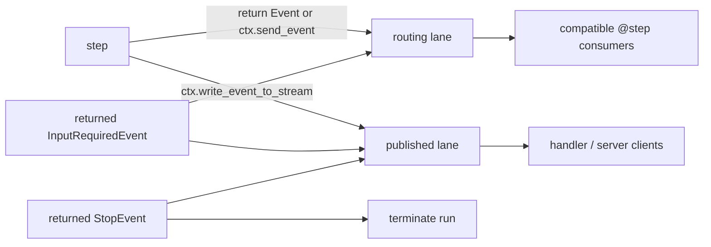
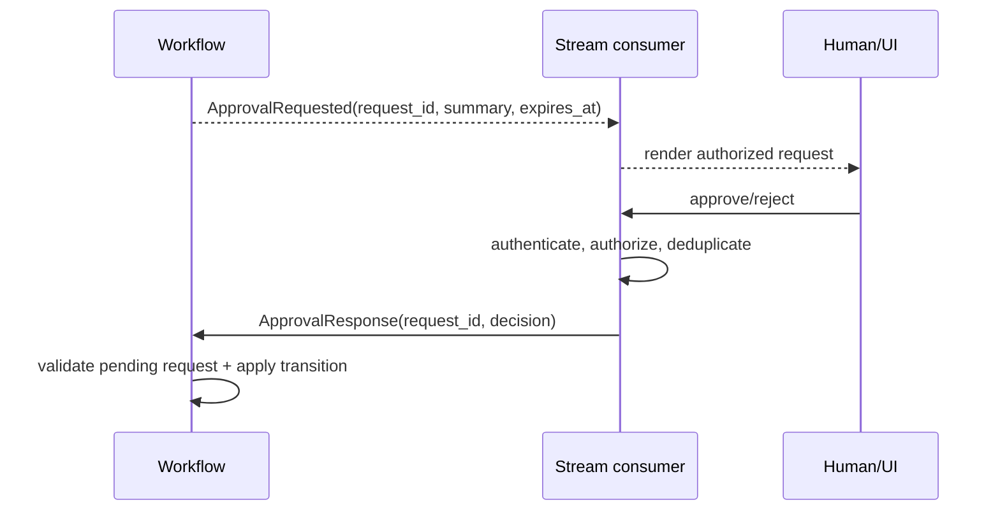
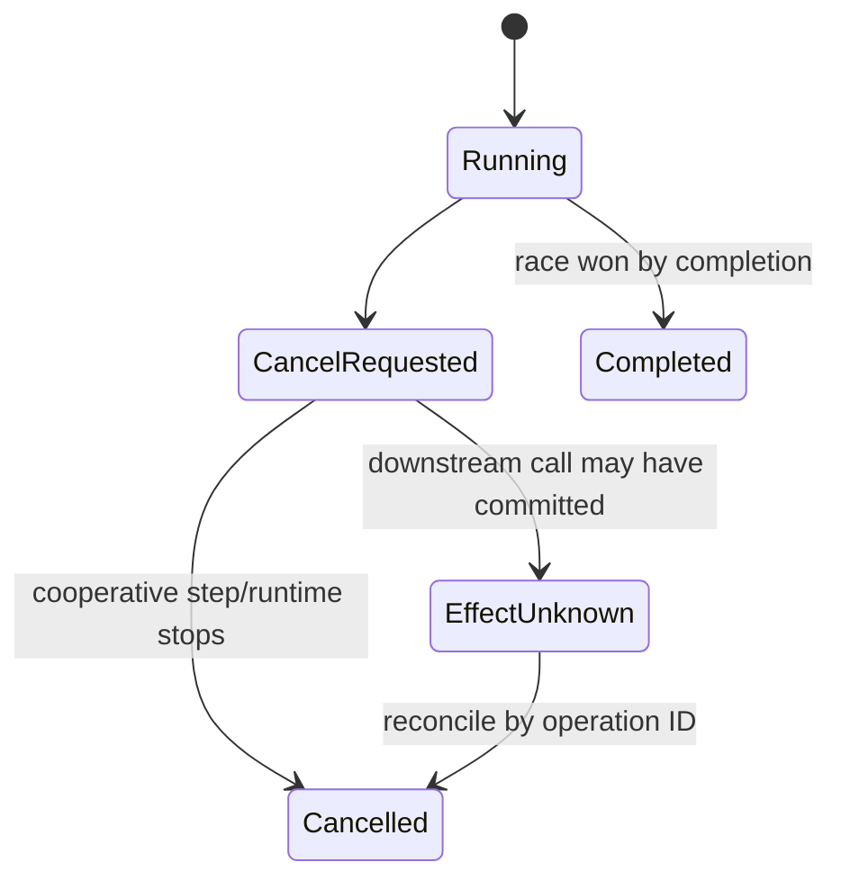

# Streaming, Human-in-the-Loop, and Run Control

- **Research date:** 2026-08-31
- **Status:** Research-backed, version-sensitive guide
- **Verified snapshot:** `llama-index-core` 0.14.24, `llama-index-workflows`
  2.23.3, `llama-agents-server` 0.7.1, and `llama-agents-client` 0.3.12
- **Scope:** Local Workflow/agent streams and current LlamaAgents server/client
  controls

## Bottom line

Treat streaming as a typed event protocol, not as a token-printing convenience.
Treat human input as an authenticated, correlated command against a specific
pending request. Treat cancellation as a cooperative signal whose external
effects may remain ambiguous.

Local Workflows and remote LlamaAgents expose related but different contracts:

| Concern           | In-process Workflow                         | LlamaAgents server/client                                                                |
| ----------------- | ------------------------------------------- | ---------------------------------------------------------------------------------------- |
| Run handle        | `WorkflowHandler`                           | persisted `handler_id` plus `run_id` internally                                          |
| Event consumption | one stream iteration per local run          | persisted sequence log with `after_sequence` cursor                                      |
| Disconnect resume | application must buffer/persist             | server store can replay after a sequence; client reconnects up to three times by default |
| HITL response     | `handler.send_event(...)`                   | authenticated `POST /events/{handler_id}` / `client.send_event(...)`                     |
| Restart behavior  | lost unless context is snapshotted/restored | depends on store/runtime; memory store is not restart durable                            |
| Cancellation      | `await handler.cancel_run()`                | cancel handler endpoint/client method; optional purge is destructive                     |

LlamaDeploy examples describe an older, deprecated control plane. Do not use its
streaming/session API as the contract for current LlamaAgents.

## Routing events and published events are different lanes



- Returning an ordinary event or calling `ctx.send_event` advances workflow
  control.
- `ctx.write_event_to_stream` publishes an observation to the caller; it does
  not by itself route control to another step.
- A returned `InputRequiredEvent` is automatically published and may form a
  valid graph boundary while the run remains open waiting for an external
  `HumanResponseEvent`; it does not terminate the run.
- A `StopEvent`, including timeout/cancel/failure subclasses, is always
  published and closes the stream.

Use separate event classes for domain commands and UI observations even if their
payloads initially look alike. Otherwise a progress event can accidentally
trigger work, or a command can expose sensitive fields on the public stream.

## Local streaming contract

`workflow.run()` returns immediately with a handler. Stream while the workflow
runs, then await the same handler for the authoritative result or exception.

```python
handler = workflow.run(start_event=MyStartEvent(job_id=job_id))

async for event in handler.stream_events():
    await consume(event)

result = await handler
```

`handler.stream_events()` can be consumed once. It filters internal dispatch
events unless `expose_internal=True` and stops at a `StopEvent`. A second full
consumption raises `WorkflowRuntimeError`.

If several local consumers need the same events, create one stream-draining task
and broadcast application-owned envelopes to bounded subscriber queues. Do not
let multiple components race to consume the handler directly.

### Terminal events and await semantics

| Published event          | Meaning                                      | What `await handler` does                                                   |
| ------------------------ | -------------------------------------------- | --------------------------------------------------------------------------- |
| normal `StopEvent`       | successful terminal result                   | returns `StopEvent.result`; a custom stop subclass is returned as the event |
| `WorkflowTimedOutEvent`  | workflow timeout; includes active step names | raises the timeout path after terminal event publication                    |
| `WorkflowCancelledEvent` | cancellation requested                       | exposes cancellation semantics, normally as an exception from the run       |
| `WorkflowFailedEvent`    | step failed permanently                      | raises the workflow failure; event includes step/attempt metadata           |

Always handle both the stream and the awaited result. A UI that only watches
deltas can show success after the last token even when final structured
validation, persistence, or a later step fails.

### Backpressure is application-owned

The inspected `BasicRuntime` uses default, unbounded `asyncio.Queue` instances
for incoming ticks and published events. Publishing is non-blocking. If a model
produces fine-grained chunks faster than the consumer drains them, memory grows.

For high-volume streams:

- coalesce token deltas by time or byte count;
- publish progress transitions, not every internal object;
- cap application broadcast queues and define a drop/coalesce policy for
  noncritical telemetry;
- keep a complete final result separate from lossy progress;
- limit per-event and per-run bytes;
- stop producing when the run is cancelled;
- measure produced, persisted, delivered, dropped, and lagging-event counts.

The server persists published events. Token-per-event streaming therefore also
increases database writes, retention, replay time, and client bandwidth.

## Agent event stream

Framework agents publish richer events on the same Workflow stream:

| Event                         | UI/operations use                                                                                  | Sensitivity                                                                                       |
| ----------------------------- | -------------------------------------------------------------------------------------------------- | ------------------------------------------------------------------------------------------------- |
| `AgentInput`                  | trace which agent received an input                                                                | may include system prompts, memory, and retrieved data                                            |
| `AgentStream`                 | incremental `delta`, accumulated response, current agent, optional tool calls and `thinking_delta` | provider raw data is excluded from normal serialization, but text/thinking can still be sensitive |
| `AgentOutput`                 | completed model step and selected tools                                                            | may reveal internal retry messages and content                                                    |
| `ToolCall`                    | show a pending tool activity                                                                       | arguments may include secrets or personal data                                                    |
| `ToolCallResult`              | audit success/error and duration in an application envelope                                        | raw output may be large or restricted                                                             |
| `AgentStreamStructuredOutput` | typed final response after finalization                                                            | validate schema and authorization before rendering                                                |

Render `AgentStream.delta` for conversational text. Do not render
`thinking_delta`, `AgentInput`, raw tool arguments, or raw results by default.
Produce application-defined status events such as `SearchStarted`,
`ApprovalRequested`, and `ArtifactReady` with explicitly safe fields.

Provider and higher-level response-synthesis implementations can buffer despite
a streaming API. Test time-to-first-byte and chunk distribution for the exact
model, LLM integration, and query engine. Generic `FunctionTool` execution
returns one final `ToolOutput`; a generator does not automatically become
intermediate `ToolCallResult` events. For progressive tools, implement an
explicit workflow step or a context-aware tool that emits safe progress events.

## Human-in-the-loop: prefer explicit event pairs

The simplest and safest shape uses one step to request input and another step to
consume the response.



```python
class ApprovalRequested(InputRequiredEvent):
    request_id: str
    summary: str
    expires_at: datetime


class ApprovalResponse(HumanResponseEvent):
    request_id: str
    decision: Literal["approve", "reject"]


@step
async def request_approval(self, ev: DraftReady) -> ApprovalRequested:
    return ApprovalRequested(
        request_id=ev.request_id,
        summary=ev.safe_summary,
        expires_at=ev.expires_at,
    )


@step
async def apply_approval(self, ev: ApprovalResponse) -> StopEvent:
    return StopEvent(result={"request_id": ev.request_id, "decision": ev.decision})
```

The application must verify that the authenticated principal may decide this
request, that the request is still pending and unexpired, and that the decision
has not already been consumed. Event validation is not authorization.

### Correlation and duplicate control

Every request/response pair should include:

- stable `request_id` generated before publication;
- workflow/handler and tenant ownership in server-side state;
- expected decision schema and policy version;
- created/expiry timestamps;
- one-use or revision semantics;
- responder identity and immutable audit record;
- deduplication key for client retries.

Do not rely on a `handler_id` being secret enough to authorize a response. Do
not trust tenant or user fields carried by the human-response event; derive
identity from the authenticated transport.

If multiple steps accept the same response type, an untargeted event can be
broadcast to all compatible consumers. Use distinct response classes or
`requirements`/stable IDs for correlation. The optional `step` target is a
routing convenience, not an authorization mechanism.

## `wait_for_event`: compact but replay-sensitive

`ctx.wait_for_event(ResponseType, waiter_event=..., waiter_id=..., requirements=...)`
keeps the request/wait inside one step. The current default waiter timeout is
2,000 seconds, but the workflow's own timeout may end the run earlier.

The implementation pauses by recording a waiter and reruns the step when a
matching event arrives. Code before `wait_for_event` executes again. Therefore:

- never perform a non-idempotent effect before the wait;
- set a stable `waiter_id` when one step can wait more than once;
- use requirements such as `request_id` when waiters share a response class;
- keep request construction deterministic across reruns;
- test timeout, retry, snapshot/restore, and parallel fan-out waiters;
- prefer separate request/response steps for production flows with material
  effects.

Workflows 2.22.1 fixed collisions between implicit waiter IDs in parallel
fan-out branches. Pin at least the tested version and still use explicit
correlation for business requests.

## Pause, snapshot, and resume locally

For an in-process web application where the request displaying a prompt differs
from the request receiving the answer, the official pattern is:

1. consume the `InputRequiredEvent`;
2. serialize `handler.ctx.to_dict()` to durable storage;
3. cancel the original handler so it does not remain resident;
4. restore with `Context.from_dict(workflow, snapshot)`;
5. start the workflow with the restored context;
6. send the correlated human-response event;
7. stream and await the resumed handler.

Version the snapshot alongside workflow code, event models, prompts, tool
schemas, and memory format. Encrypt sensitive snapshots and enforce tenant-level
access. Do not deserialize arbitrary qualified Python types from an untrusted
snapshot; current `JsonSerializer` supports allowed-type controls, which should
be configured for untrusted or long-lived data.

Context and agent `Memory` are separate concepts. When customized memory is
supplied outside the default context-managed path, persist/restore it
consistently with the waiting context or use one authoritative durable store.

## Remote streams with WorkflowServer

Use `run_workflow_nowait`, then stream by `handler_id`:

```python
remote = await client.run_workflow_nowait("review", start_event=start)
stream = client.get_workflow_events(remote.handler_id, after_sequence=-1)

async for envelope in stream:
    event = envelope.load_event(registry=[ApprovalRequested, ApprovalResponse])
    await consume_idempotently(event, sequence=stream.last_sequence)
```

### Cursor semantics

| `after_sequence` | Behavior                                                         |
| ---------------- | ---------------------------------------------------------------- |
| `-1`             | replay all recorded events from the beginning                    |
| `"now"`          | skip current history and tail new events                         |
| integer `N`      | replay events with sequence greater than `N`, then continue live |

The server assigns monotonic sequence numbers and SSE `id` values. The Python
client tracks `EventStream.last_sequence` and automatically reconnects from its
last received sequence after connection errors, up to `max_reconnect_attempts`
(default three). If a completed run has no events after the requested cursor,
the server returns HTTP 204 and the stream ends.

Persist a cursor only **after** your consumer's side effect commits. A crash
before cursor commit can redeliver; a cursor committed before processing can
skip work. Make consumers idempotent by `(handler_id, sequence)` or an
event-level operation ID.

The current store-backed server source supports recorded, resumable streams.
Some prose in the deployment guide still describes an older single-reader,
unrecoverable stream. Prefer the current client guide, architecture document,
source, and pinned integration tests when those statements conflict.

### Event envelopes and registries

Remote events carry `value`, type metadata, and optionally a qualified class
name. Use an explicit registry with `load_event` and validate the resulting
Pydantic model. Avoid importing arbitrary qualified types from data you do not
trust.

`WorkflowServer` derives known event classes from workflow annotations. Events
hidden inside dynamic `wait_for_event` paths may need `additional_events=[...]`
when registering the workflow so the debugger and send-event UI know their
schemas.

### Persistence and idle waiting

`MemoryWorkflowStore` loses handlers, ticks, results, and recorded events on
process restart. `SqliteWorkflowStore` is appropriate for a single-process
durable deployment. DBOS/PostgreSQL is the current path for coordinated replicas
and recovery.

The server runtime can record ticks, detect `WorkflowIdleEvent`, release a run
waiting only for external input, and reload it when a new event arrives. This is
more suitable for long human waits than retaining a Python task, but it still
requires:

- a durable supported store/runtime combination;
- compatible workflow code for old in-flight runs;
- idempotent external effects;
- event/snapshot retention and cleanup;
- an expiration/escalation process for abandoned requests.

## Authentication, authorization, and data exposure

The server exposes health, workflow discovery, run, handler, event stream,
send-event, and cancellation routes. Wrap the Starlette app with production
middleware or a trusted gateway that enforces:

- authentication on every non-public route;
- tenant ownership on workflow names, handler IDs, event streams, results,
  send-event, cancel, and purge;
- event-type and step-target allowlists;
- request/event/body size and rate limits;
- origin and CSRF controls for browser credentials;
- safe error messages;
- TLS and service-to-service identity;
- audit logging with redaction.

A caller who can stream a handler may see prompts, model output, tool metadata,
and failure text. A caller who can send events can change control flow. A caller
who can cancel or purge can destroy active or persisted state. Treat each route
as an application capability, not a debugging convenience.

## Cancellation and other controls

Use `await handler.cancel_run()` locally or
`client.cancel_handler(handler_id, purge=False)` remotely. `purge=True`
additionally deletes the handler record and should be a separately authorized,
audited retention action.

Cancellation is not rollback:



Track child workflow handlers explicitly; parent cancellation has not
historically cascaded to independently started nested workflows. Pass
cancellation/deadline signals into tools and HTTP clients where supported. If a
write's outcome is unknown, record and reconcile it rather than rerunning
automatically.

## UI protocol recommendations

Separate three channels:

1. **user-visible content** — redacted text deltas and final artifacts;
2. **control requests** — typed, correlated approvals or input forms;
3. **operations telemetry** — internal step states, retries, usage, and errors.

Never make UI rendering depend on Python class importability alone. Define a
stable application envelope with `schema_version`, `event_kind`, `handler_id`,
`sequence`, `request_id`, `occurred_at`, and a bounded payload. Map framework
events into that envelope at one boundary.

## Acceptance tests

- [ ] Start streaming before, during, and after a fast-completing run; verify no
      missed terminal event.
- [ ] Disconnect after every event and resume from the last committed sequence.
- [ ] Slow the consumer below producer rate; assert memory/database/retention
      limits and coalescing.
- [ ] Send the same human response twice and concurrently; exactly one business
      transition occurs.
- [ ] Send a valid response from the wrong tenant/user; no existence or content
      leaks.
- [ ] Exercise two simultaneous waiters of the same response type with distinct
      request IDs.
- [ ] Snapshot after a prompt, terminate the process, restore, and respond under
      the pinned code version.
- [ ] Upgrade event/snapshot code with old pending requests; migrate, drain, or
      reject explicitly.
- [ ] Cancel before, during, and after model/tool/external-write boundaries;
      reconcile unknown writes.
- [ ] Kill a parent with nested workflow handlers; every child reaches an
      intentional terminal state.
- [ ] Verify internal events, tool inputs/results, thinking fields, and
      exception text are not exposed by default.
- [ ] Restart Memory, SQLite, and DBOS-backed configurations and document which
      guarantees each passed.

## Primary sources

- [Official streaming guide](https://github.com/run-llama/llama-agents/blob/main/docs/src/content/docs/llamaagents/workflows/streaming.mdx),
  [HITL guide](https://github.com/run-llama/llama-agents/blob/main/docs/src/content/docs/llamaagents/workflows/human_in_the_loop.md),
  and
  [`WorkflowHandler` source](https://github.com/run-llama/llama-agents/blob/main/packages/llama-index-workflows/src/workflows/handler.py)
- [`Context` public API](https://github.com/run-llama/llama-agents/blob/main/packages/llama-index-workflows/src/workflows/context/context.py),
  [internal waiter implementation](https://github.com/run-llama/llama-agents/blob/main/packages/llama-index-workflows/src/workflows/context/internal_context.py),
  and
  [workflow event definitions](https://github.com/run-llama/llama-agents/blob/main/packages/llama-index-workflows/src/workflows/events.py)
- [`BasicRuntime` queue/stream implementation](https://github.com/run-llama/llama-agents/blob/main/packages/llama-index-workflows/src/workflows/plugins/basic.py)
  and
  [Workflows changelog](https://github.com/run-llama/llama-agents/blob/main/packages/llama-index-workflows/CHANGELOG.md)
- [Agent event definitions](https://github.com/run-llama/llama_index/blob/main/llama-index-core/llama_index/core/agent/workflow/workflow_events.py),
  [`FunctionAgent` streaming source](https://github.com/run-llama/llama_index/blob/main/llama-index-core/llama_index/core/agent/workflow/function_agent.py),
  and
  [`FunctionTool` source](https://github.com/run-llama/llama_index/blob/main/llama-index-core/llama_index/core/tools/function_tool.py)
- [LlamaAgents Python client guide](https://github.com/run-llama/llama-agents/blob/main/docs/src/content/docs/llamaagents/workflows/client.md),
  [client implementation](https://github.com/run-llama/llama-agents/blob/main/packages/llama-agents-client/src/llama_agents/client/client.py),
  and
  [event envelope implementation](https://github.com/run-llama/llama-agents/blob/main/packages/llama-agents-client/src/llama_agents/client/protocol/serializable_events.py)
- [WorkflowServer architecture](https://github.com/run-llama/llama-agents/blob/main/architecture-docs/server-architecture.md),
  [server API source](https://github.com/run-llama/llama-agents/blob/main/packages/llama-agents-server/src/llama_agents/server/_api.py),
  and
  [pinned deployment/persistence guide](https://github.com/run-llama/llama-agents/blob/94f17c9/docs/src/content/docs/llamaagents/workflows/deployment.md)
- Bounded failure evidence:
  [nested cancellation discussion #19820](https://github.com/run-llama/llama_index/discussions/19820),
  [streaming tool results request #20409](https://github.com/run-llama/llama_index/issues/20409),
  and
  [query-engine streaming issue #22183](https://github.com/run-llama/llama_index/issues/22183)
- [Deprecated LlamaDeploy repository](https://github.com/run-llama/llama_deploy)

## Refresh triggers

Re-verify this guide when Workflows 3.x changes handler/context faces or stream
consumption; the local runtime adds bounded queues or multicast; server cursor,
SSE, reconnect, idle-release, or event-envelope semantics change; the outdated
single-reader deployment note is removed; streaming tool results become
first-class; cancellation propagates to nested workflows; snapshot serialization
changes; or LlamaAgents adds built-in authentication/tenancy policy.
