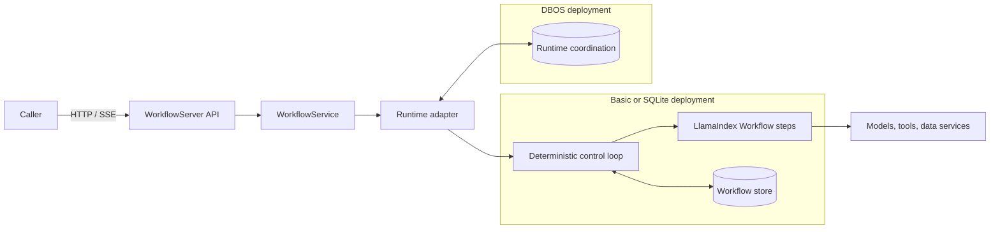
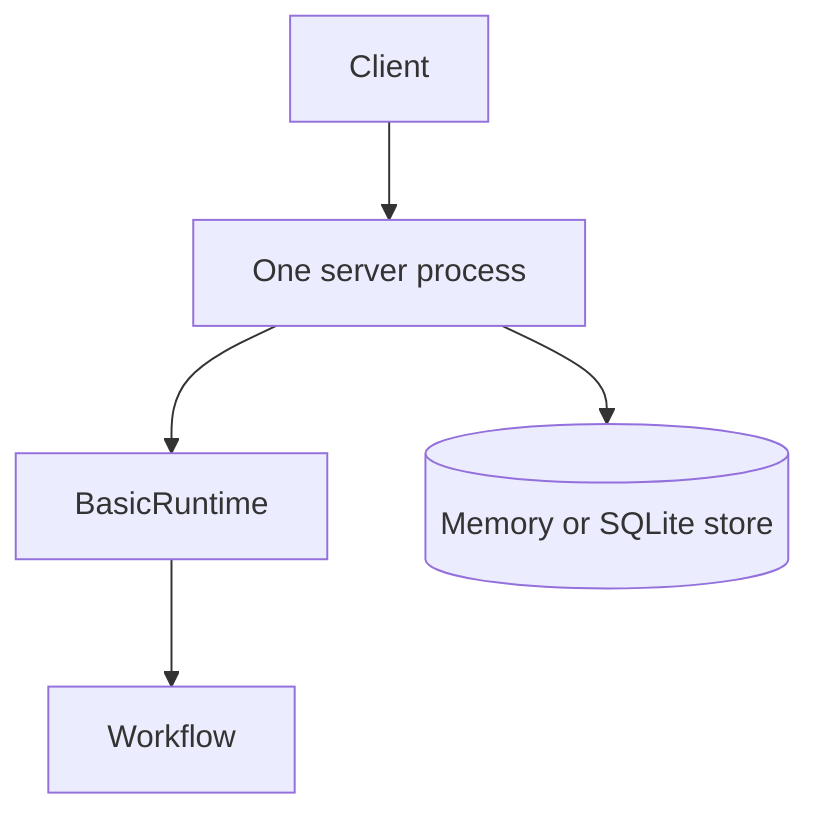
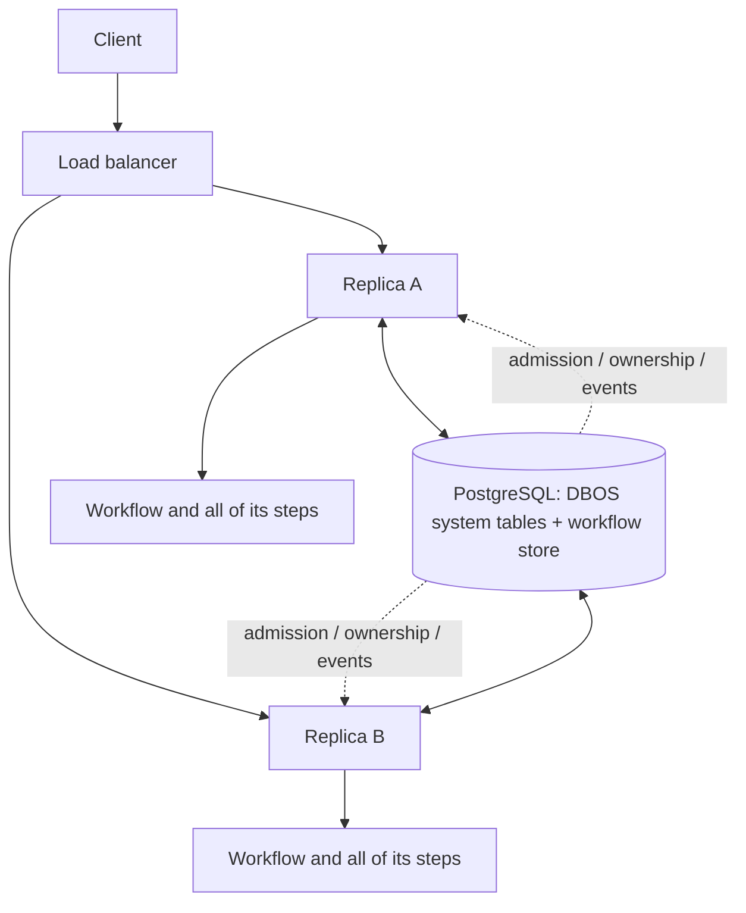
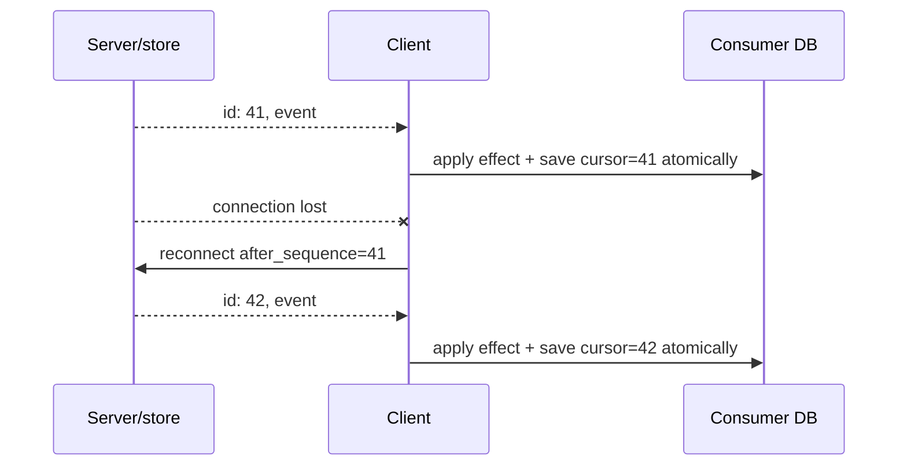

# LlamaAgents server, clients, and executors

**Research date:** 2026-08-31  
**Status:** Production guide; protocol- and version-sensitive  
**Verified against:** `llama-agents-server` 0.7.1, `llama-agents-client` 0.3.12, and `llama-agents-dbos` 0.6.0 at `llama-agents` commit `94f17c9`  
**Scope:** Hosting a LlamaIndex Workflow behind the current LlamaAgents API. This is not a guide to the deprecated LlamaDeploy control plane.

## Bottom line

Use LlamaAgents when a LlamaIndex Workflow needs a remote lifecycle: submit, stream, inspect, send an event, cancel, resume, or recover. Choose the runtime and store by failure boundary:

| Need | Smallest suitable deployment | What it does **not** provide |
|---|---|---|
| Library call in one application | `Workflow.run()` with the default in-process runtime | Remote API, restart recovery, replica coordination |
| Remote API for development or disposable work | `WorkflowServer` + `MemoryWorkflowStore` | Restart persistence |
| Single-process restart recovery | `WorkflowServer` + `SqliteWorkflowStore` | Multi-replica ownership/coordination |
| Durable multi-replica admission and recovery | LlamaAgents DBOS runtime + PostgreSQL | Distributed execution of individual steps; application-level exactly-once side effects |

The current DBOS adapter keeps a workflow and all its steps in one process. PostgreSQL coordinates ownership, queues, state, and event delivery; it is not a task broker that sends each step to an arbitrary worker.

> **Name collision:** “LlamaAgents” is the current server/runtime repository. “LlamaDeploy” is a separate, deprecated project. Do not mix LlamaDeploy services, CLI commands, deployment YAML, or queue semantics into a current LlamaAgents design.

## Where the server sits



The Workflow still defines events, steps, state, retries, and human-in-the-loop waits. The server adds an HTTP lifecycle. A runtime adapter adds scheduling and recovery behavior. A store persists handler metadata, events, ticks, and state. These are separate contracts; changing one does not silently strengthen the others.

See [architecture and event Workflows](01-architecture-and-event-workflows.md) for authoring, [durability and recovery](09-durability-reliability-concurrency-and-recovery.md) for guarantees, and [security and tenancy](11-security-tenancy-and-data-governance.md) for the API trust boundary.

## Production topology

### Embedded and single-process



- The memory store is appropriate only when losing handlers and event history on restart is acceptable.
- The SQLite store can reconstruct server state and running handlers after a single-process restart.
- A process-local concurrency semaphore does not impose a cluster-wide limit.
- Do not put several independent Basic/SQLite servers behind a load balancer and assume they form a cluster.

### DBOS and multiple replicas



An API request may reach any replica. A newly admitted run is owned by one executor; its step code remains co-located there. Events are stored in PostgreSQL and can be served by another replica. Recovery preserves the owning-executor model described in the DBOS architecture; plan executor identity and rollout behavior deliberately.

## Minimal server and client shape

The following method names and argument order are verified against server 0.7.1 and client 0.3.12. Imports remain package/version-specific, so verify them in the installed release:

```python
# Server process: register explicit public names, then launch once.
server = WorkflowServer(
    workflow_store=store,       # Memory, SQLite, or a DBOS/Postgres-backed store
    runtime=runtime,            # BasicRuntime or the DBOS adapter
    accept_context_api=False,   # Keep disabled unless its trust model is intentional
)
server.add_workflow("claims-v3", workflow)
await server.serve(host="0.0.0.0", port=8000)
```

```python
# Client: inject a configured httpx client for auth, TLS, and deadlines.
async with httpx.AsyncClient(
    base_url="https://agents.example.com",
    headers={"Authorization": f"Bearer {token}"},
    timeout=httpx.Timeout(60.0, connect=5.0),
) as http:
    client = WorkflowClient(httpx_client=http)
    handler = await client.run_workflow_nowait(
        "claims-v3", start_event=start_event
    )
    stream = client.get_workflow_events(
        handler.handler_id, after_sequence=-1
    )
    async for event in stream:
        await consume(event)
```

`WorkflowClient` accepts either a base URL or a preconfigured `httpx.AsyncClient`, not both. Prefer the injected client in production so authentication, certificate validation, proxy behavior, request limits, and timeouts are visible application policy.

Treat examples as integration sketches, not a substitute for the installed API reference. Pin server and client versions together and exercise the wire contract before promotion.

## Current HTTP lifecycle contract

The 0.7.1 server exposes operations in these families; exact generated paths and payload schemas remain versioned API surface:

| Operation | Purpose | Production concern |
|---|---|---|
| List workflows; fetch schema, event types, or representation | Discovery and tooling | Do not expose internal graphs or schemas to untrusted users by default |
| Run and wait | Submit and return final result | Upstream timeout may expire while the Workflow is still running |
| Run without waiting | Submit and return handler identity | Persist handler identity before acknowledging downstream work |
| Stream events as SSE or NDJSON | Historical replay plus live tail | Resume by sequence; deduplicate application effects |
| Send event | Resume HITL or inject a typed event | Authenticate, authorize, validate type and run ownership |
| Get/list handlers | Inspect lifecycle and output | Scope by tenant; paginate and bound history |
| Cancel, optionally purge | Stop work and optionally remove records | Cancellation is cooperative and purge destroys recovery/audit data |
| Legacy result endpoints | Backward compatibility | Deprecated in favor of handler operations; do not build new clients on them |

The generated schema is useful for client generation and contract tests, but it is not a compatibility promise across unpinned releases.

## Identity: workflow name, handler ID, and run ID

Three names solve different problems:

| Identifier | Meaning | Log and persist it for |
|---|---|---|
| Registered workflow name | Public API route/name selected in `add_workflow` | Routing, authorization, schema/version selection |
| Handler ID | Server lifecycle identity returned to the client | Polling, cancellation, continuation, user-facing job record |
| Run ID | Runtime execution identity attached to Workflow context | Traces, durable ownership, step/event correlation |

Also keep an application request/idempotency key. Do not assume handler ID is the business operation ID. Reusing a handler ID while its handler is active returns a conflict in current source. A completed handler can be used as continuation context, which is a different action from deduplicating a business command.

Log all four dimensions when possible:

```text
tenant_id, operation_id, workflow_name, workflow_schema_version,
handler_id, run_id, event_sequence, executor_id
```

## Event streaming is a persisted cursor protocol

At server 0.7.1, events receive a per-run monotonic sequence in the workflow store. The server emits that sequence as the SSE `id`, accepts `after_sequence`, honors SSE `Last-Event-ID`, supports multiple store subscribers, and emits an SSE heartbeat (25 seconds by default). This permits replay after a disconnect if event records are retained.



### Cursor semantics verified in current source

| Cursor | Meaning |
|---|---|
| `-1` | Replay retained history, then follow live events |
| `"now"` | Start at the live tail; do not replay prior events |
| integer `N` | Return events strictly after sequence `N`, then follow live events |
| `Last-Event-ID: N` | SSE resume cursor; in current API parsing it takes precedence over the query cursor |

There is an easy default mismatch: the raw streaming endpoint defaults to `"now"`, while the current Python client defaults its event stream to `after_sequence=-1`. Set the cursor explicitly; never let library defaults decide whether history is replayed.

At the pinned server, a non-integer `Last-Event-ID` is silently ignored rather than rejected; the parsed query cursor remains in effect. Treat malformed cursor handling as part of the ingress contract test so a proxy or client bug cannot quietly switch replay position.

The client event stream is single-iteration and tracks `last_sequence`. Its built-in reconnect is bounded (three reconnects in current source), so the application still owns longer retry/backoff, terminal error handling, and durable cursor storage.

### Resolve the documentation conflict correctly

The current source (`_api.py` and workflow-store implementations) and `architecture-docs/server-architecture.md` agree on persisted sequences, resumable cursors, multiple subscribers, and heartbeat. The prose page `workflows/deployment.md` still carries an older warning that describes a single reader consuming unrecoverable events. That warning is stale for the verified versions.

Do not resolve this by trusting whichever page is more convenient. Make it a version gate:

1. Pin server, client, runtime, and store package versions.
2. Contract-test replay, `Last-Event-ID`, query cursor precedence, concurrent subscribers, heartbeat, retention, and reconnect.
3. Block rollout if the installed behavior differs.
4. Re-run the protocol suite on every upgrade or store substitution.

### Consumption rules

- Deserialize only event types registered and importable by the consumer version.
- Treat delivery as at least once from the application effect's perspective.
- Apply the effect and advance the cursor in one transaction when they share a database.
- Otherwise use an inbox/deduplication table keyed by `(run_id, sequence)`.
- Advance the durable cursor **after** processing succeeds, not when bytes arrive.
- Set event-retention time beyond the maximum outage and replay window.
- Bound reconnect backoff and reconnect with the last committed sequence.
- Treat heartbeats as liveness bytes, not Workflow progress.

## Typed events and compatibility

The Python client reconstructs typed events through `load_event()`. The consumer must be able to import the serialized event class or resolve it through an explicit registry. A package rename can therefore turn retained history into unreadable data even when JSON itself is intact.

Use a stable application event envelope at durable/external boundaries:

```json
{
  "event_type": "claim.review_requested",
  "schema_version": 2,
  "operation_id": "op_01...",
  "payload": {},
  "occurred_at": "2026-08-31T12:00:00Z"
}
```

Keep framework-native classes inside a pinned deployment when possible. For rolling upgrades, deploy a reader that understands old and new versions before any writer emits the new version.

## Store selection and lifecycle

| Store/runtime combination | Survives process restart | Multiple replicas | Event replay | Appropriate use |
|---|---:|---:|---:|---|
| Memory store + BasicRuntime | No | No | Only while process lives | Local development, disposable tests |
| SQLite store + BasicRuntime | Yes, single-process | No | Yes, retained rows | Small single-instance service, restart tests |
| PostgreSQL store + DBOS runtime | Yes | Yes | Yes, retained rows | Durable service with shared admission and recovery |

The server reconstructs running handlers from stored ticks at startup. On graceful server stop, active loops are aborted without being marked cancelled so that a persistent deployment can resume them. That design is useful only when the selected store/runtime survives the failure.

The server can release idle Workflow state after an idle timeout (60 seconds by default in current source) and rehydrate it when a new event arrives. Idle is signaled by Workflow events; it is not proof that all external work completed.

## Executor ownership and admission

### Stable executors

The documented DBOS model gives each replica a unique stable `executor_id`. Once a workflow starts, that executor owns it; on startup, that executor recovers its incomplete work. Enqueued workflows do not yet have affinity and can be admitted by available workers.

Queue names are derived from the durable workflow name. Renaming a workflow creates a new queue name; old queued entries do not magically move. Keep the old worker/queue alive until drained or perform an explicit migration.

### Experimental executor leases

Current DBOS configuration includes a private `_experimental_executor_lease` mode backed by PostgreSQL slots. Treat it as experimental, not the default recovery contract.

| Concern | Stable executor IDs | Experimental leases |
|---|---|---|
| Identity | Configured replica identity | Slot acquired from a database pool |
| Scale-up | New unique ID | Replica count must not exceed pool size |
| Rolling update | Preserve recovery ownership | Kubernetes `maxSurge: 0` is required by the documented constraint or new pods can block |
| Scale-down | Drain the owner | Releasing a slot with active workflows can orphan work until lease expiry/reclaim |
| Support posture | Main architecture | Private/experimental configuration; version gate it |

## Capacity and backpressure

For DBOS, the queue uses a `worker_concurrency` derived from `num_concurrent_runs`. It is a per-process worker limit, so a first-order capacity estimate is:

```text
nominal active workflows <= replicas * num_concurrent_runs
```

This is not a strict instantaneous invariant during reconfiguration: work that already started does not retroactively count against a newly lowered limit. An unlimited setting bypasses the admission queue and should be avoided when model, tool, database, or memory capacity is finite.

Size at least four independent budgets:

| Budget | Protects | Control |
|---|---|---|
| Concurrent runs | Process memory and long-lived contexts | `num_concurrent_runs`, replica count |
| Step workers | CPU/tool parallelism inside each Workflow | `@step(num_workers=...)` |
| Provider calls | Model/tool quotas and spend | App semaphore/rate limiter, deadlines |
| Stored history | PostgreSQL/SQLite size and replay latency | Retention, archival, purge policy |

Cancellation of a queued DBOS run is recorded, but current architecture notes it may only be processed when that item is admitted. Do not promise instant cancellation to callers.

### Slow stream consumers are a memory boundary

The pinned 0.7.1 `_stream_events` implementation starts one feeder task per connection and places stored events into an unbounded process-local `asyncio.Queue` before the response generator writes them to the socket. A slow client can therefore let that per-connection queue grow while the durable event store also grows. SSE heartbeats solve idle intermediary timeouts; they do not provide backpressure.

For a high-volume stream, choose and test one of these policies:

1. keep published progress events bounded and coalescible while retaining terminal/domain events;
2. limit streams per tenant/principal, connection lifetime, event bytes, and maximum produced-versus-consumed lag;
3. disconnect lagging clients and require replay from the last committed cursor;
4. if those controls are insufficient, expose an application-owned stream endpoint with a bounded buffer and explicit overflow response rather than relying on the default endpoint.

Never drop an effect receipt, approval request, cancellation, or terminal outcome as if it were decorative progress. Persist those domain events first; coalesce only a documented progress class. Load-test through the real proxy with a consumer that reads one event at a time deliberately slowly and observe process RSS, feeder count, store growth, and reconnect correctness.

## Readiness, shutdown, and deploys

The built-in health endpoint confirms that the runtime launched; it is not a complete readiness proof for PostgreSQL, model providers, vector stores, tools, or event-stream replay.

Production readiness should check:

- migrations and expected schema version;
- database connectivity and DBOS/store compatibility;
- workflow registration and expected public schema hash;
- executor identity/lease state;
- ability to append and read a synthetic event in a non-production namespace;
- required provider/tool dependencies separately.

During shutdown:

1. fail readiness and stop new admissions;
2. allow bounded HTTP and non-durable work to drain;
3. flush event/log/trace exporters;
4. stop the server using its lifecycle hook;
5. let DBOS recover durable work—do not turn deployment shutdown into business cancellation.

## Security boundary

The current server is a framework API, not a complete zero-trust gateway. Authentication, authorization, tenant scoping, TLS, request limits, and debugger/schema exposure are application or platform responsibilities. The context API is disabled by default and current source warns that accepting serialized Python/Pydantic context can import and instantiate arbitrary classes. Leave it disabled unless every caller and stored payload is trusted and the risk has been explicitly designed.

See [security, tenancy, and data governance](11-security-tenancy-and-data-governance.md) for the full threat model; do not duplicate security policy in runtime configuration snippets.

## Failure matrix

| Symptom | Likely cause | Evidence | Response |
|---|---|---|---|
| Events before connection are missing | Raw endpoint used its `"now"` default | Request query/header and first sequence | Set explicit replay cursor and contract-test defaults |
| Duplicate downstream action | Reconnect replayed an event; cursor saved before/after effect non-atomically | `(run_id, sequence)` duplicates | Transactional inbox/deduplication; save cursor after success |
| A client cannot decode retained events after rollout | Event class/module path or schema changed | Serialized type and import error | Compatibility registry/envelope; dual-reader rollout |
| Handler vanished on restart | Memory store used | Store configuration, empty handler table | Use SQLite or DBOS/PostgreSQL for required recovery |
| Same run appears stalled after replica loss | Executor identity cannot recover ownership | executor ID, DBOS status/tables | Restore owner or use the supported recovery topology |
| Queued work is invisible after rename | Queue derived from old workflow name | Old/new queue names | Keep old deployment until drained; explicit migration |
| Load rises after lowering concurrency | Already-started work is not preempted | Active vs queued counts | Drain gradually; provision transient headroom |
| Health is green but runs fail | Built-in probe is shallow | Dependency-specific probes/traces | Add application readiness and synthetic checks |
| SSE disconnects at a proxy interval | Idle timeout/heartbeat policy mismatch | Proxy logs and heartbeat cadence | Align proxy idle timeout; keep heartbeat enabled |
| Process memory grows with slow SSE clients | Per-connection feeder outruns socket consumer | RSS, stream lag, per-connection event counts | Connection/byte/lag quotas; bounded app stream; cursor replay |
| Two consumers disagree with old docs | Stale deployment prose | Installed version and sequence contract test | Prefer pinned source/architecture; gate upgrades |

## Release-gate checklist

- [ ] Server, client, Workflows, DBOS adapter, DBOS, and store versions are pinned and recorded.
- [ ] LlamaDeploy configuration is absent from the current path.
- [ ] Public workflow name and application schema version are explicit and immutable for the release.
- [ ] Handler ID, run ID, operation ID, sequence, and executor ID are correlated.
- [ ] Event replay from `-1`, `"now"`, integer cursor, and `Last-Event-ID` is contract-tested.
- [ ] Two simultaneous subscribers see the expected retained/live sequence.
- [ ] A disconnected consumer resumes from its last **committed** cursor without lost effects.
- [ ] Typed events survive an N-1/N rolling reader compatibility test.
- [ ] Store/runtime failure boundary matches the availability promise.
- [ ] Queue/admission, step, provider, and storage budgets are independently bounded.
- [ ] A slow-consumer test proves event/connection/lag limits and cursor-safe reconnect.
- [ ] Restart, replica loss, shutdown, queued cancellation, and workflow rename are tested.
- [ ] Readiness checks dependencies rather than only runtime launch.
- [ ] Authentication and tenant isolation are enforced outside or around the server.

## Refresh triggers

Re-verify this guide when any of these change:

- `llama-agents-server`, `llama-agents-client`, `llama-agents-dbos`, DBOS, Starlette, or `llama-index-workflows` version;
- `_api.py`, WorkflowStore sequence/subscriber behavior, `EventStream`, heartbeat, or cursor parsing;
- DBOS executor ownership, queue naming, recovery, or lease configuration;
- handler/run identity or server startup/shutdown behavior;
- the deprecation status or replacement of LlamaDeploy.

At minimum, compare installed source with `architecture-docs/server-architecture.md`, `llama-agents-dbos/ARCHITECTURE.md`, changelogs, and the protocol contract suite. A prose page alone is insufficient where it conflicts with current code.

## Primary references

- [LlamaAgents repository and package overview](https://github.com/run-llama/llama-agents)
- [Pinned LlamaAgents server architecture](https://github.com/run-llama/llama-agents/blob/94f17c9/architecture-docs/server-architecture.md)
- [Pinned Workflow server API implementation](https://github.com/run-llama/llama-agents/blob/94f17c9/packages/llama-agents-server/src/llama_agents/server/_api.py)
- [Pinned Workflow server public lifecycle implementation](https://github.com/run-llama/llama-agents/blob/94f17c9/packages/llama-agents-server/src/llama_agents/server/server.py)
- [Pinned LlamaAgents client implementation](https://github.com/run-llama/llama-agents/tree/94f17c9/packages/llama-agents-client)
- [Pinned DBOS adapter architecture](https://github.com/run-llama/llama-agents/blob/94f17c9/packages/llama-agents-dbos/ARCHITECTURE.md)
- [Pinned DBOS runtime source and changelog](https://github.com/run-llama/llama-agents/tree/94f17c9/packages/llama-agents-dbos)
- [LlamaAgents server changelog](https://github.com/run-llama/llama-agents/blob/main/packages/llama-agents-server/CHANGELOG.md)
- [LlamaAgents client changelog](https://github.com/run-llama/llama-agents/blob/main/packages/llama-agents-client/CHANGELOG.md)
- [LlamaDeploy deprecation notice](https://github.com/run-llama/llama_deploy)
- [DBOS workflow recovery](https://docs.dbos.dev/production/workflow-recovery)
- [DBOS queues](https://docs.dbos.dev/python/tutorials/queue-tutorial)

### Conflict retained for future archaeology

- [Pinned Workflow deployment prose](https://github.com/run-llama/llama-agents/blob/94f17c9/docs/src/content/docs/llamaagents/workflows/deployment.md) — contains the stale single-reader/unrecoverable-event warning described above. Keep it as a regression signal, not the verified 0.7.1 contract.
