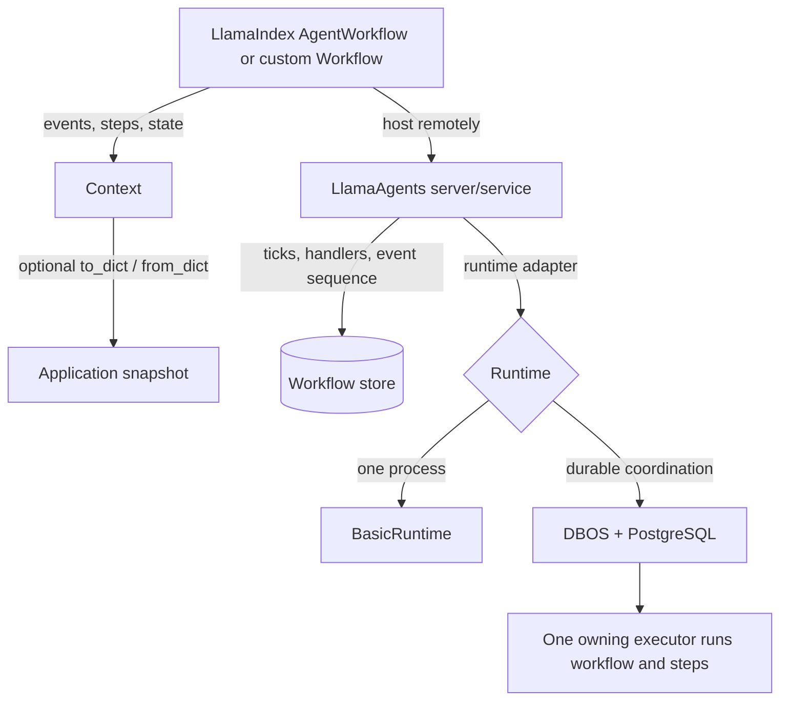
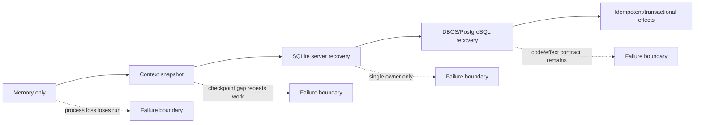
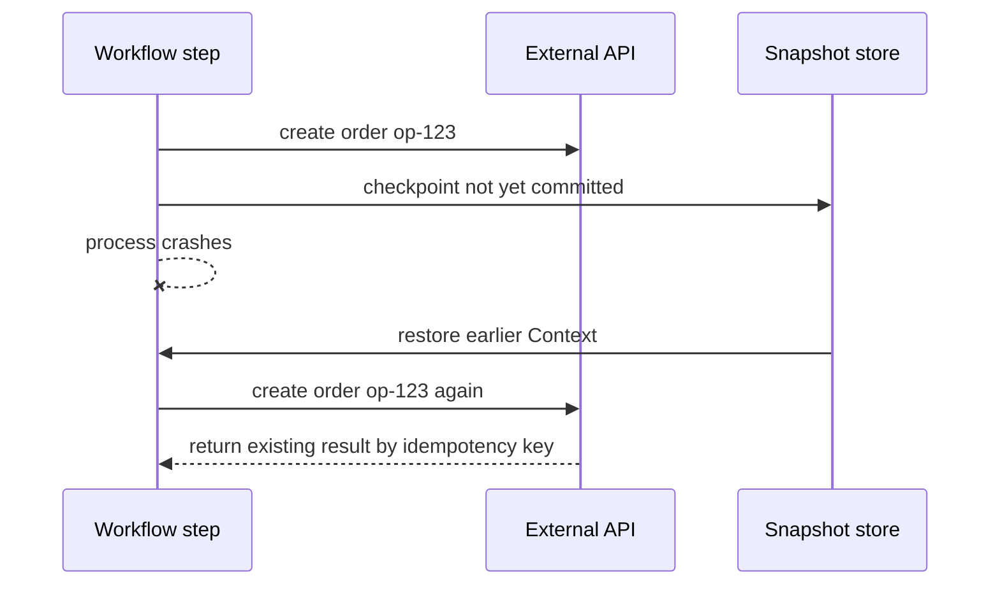
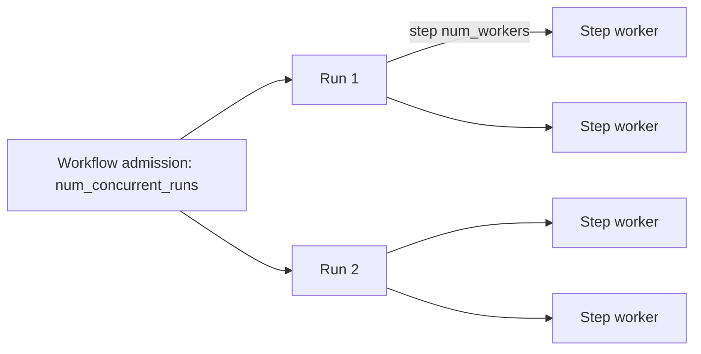
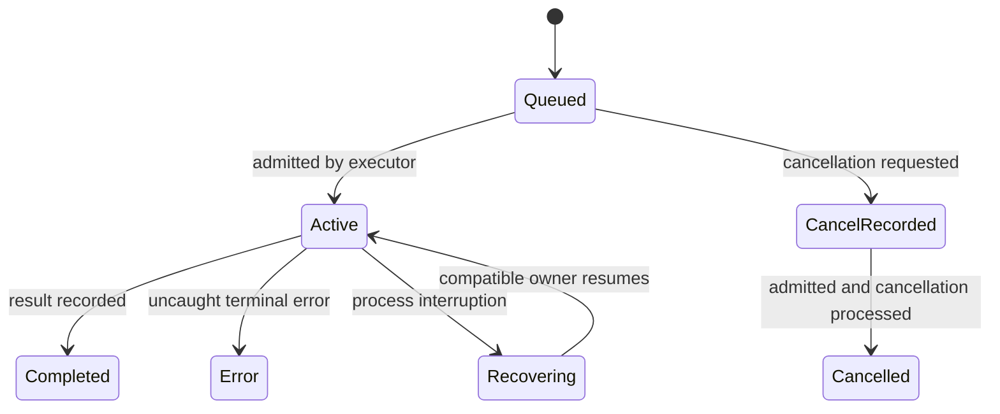
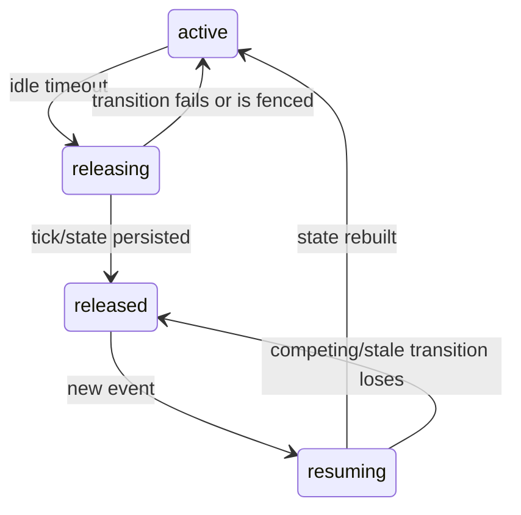

# Durability, reliability, concurrency, and recovery

**Research date:** 2026-08-31  
**Status:** Production guide; runtime- and version-sensitive  
**Verified against:** `llama-index-workflows` 2.23.3, `llama-agents-server` 0.7.1, and `llama-agents-dbos` 0.6.0 at `llama-agents` commit `94f17c9`; DBOS Python documentation current on the research date  
**Scope:** Failure semantics from an in-process LlamaIndex Workflow through LlamaAgents/DBOS. The deprecated LlamaDeploy runtime is out of scope.

## Bottom line

Durability is not one switch. A production claim must name the artifact, boundary, and failure:

| Claim | Minimum mechanism | Remaining caveat |
|---|---|---|
| Retry a failed step | Workflow retry policy | The entire step body runs again; external effects can duplicate |
| Resume from an application snapshot | Serialized `Context` | In-flight step rewinds; snapshot scheduling and storage are application-owned |
| Recover a single hosted process after restart | Persistent LlamaAgents store, such as SQLite | No multi-replica ownership |
| Recover and coordinate across replicas | LlamaAgents DBOS runtime + PostgreSQL | Steps stay co-located; code and side effects still need version/idempotency policy |
| Exactly-once external business effect | Atomic transaction in the effect's system, or an idempotent effect protocol | Durable Workflow execution alone cannot guarantee it |

The safest mental model is **durable at-least-once orchestration around explicitly idempotent effects**. Use “exactly once” only for the narrow transaction actually proven.

## Keep the layers separate



- `AgentWorkflow` is an orchestration pattern implemented on LlamaIndex Workflows. Multiple agents do not add persistence.
- A custom Workflow defines event flow and step retry/recovery semantics.
- LlamaAgents adds a remote handler/event lifecycle and persistence adapters.
- DBOS adds durable execution records, queueing, executor ownership, and recovery.
- LlamaDeploy is deprecated and has a different architecture; do not infer its behavior here.

## Define the guarantee before choosing the mechanism



Write an SLO in observable terms, for example: “After one replica is killed, an admitted run becomes active on a compatible executor within 60 seconds, emits no lost stored events, and creates at most one payment for a stable operation ID.” Then crash-test that statement.

## Workflow state, events, and external effects

These three domains have different consistency properties:

| Domain | Examples | Controlled by | Required production rule |
|---|---|---|---|
| Workflow state | plan, current agent, approved flag | `Context`, snapshots, ticks | Store compact, serializable facts; version them |
| Workflow events | request, tool result, human response | broker/store and sequence cursor | Make schemas compatible and consumers replay-safe |
| External effects | charge, email, ticket, database write | target system | Supply stable operation key and reconcile ambiguous outcomes |

Do not store live database clients, locks, file handles, or model instances in durable state. LlamaIndex Workflows provides `Resource`-style dependency injection for live resources; reconstruct them in the process rather than serializing them.

## Step retries

Current Workflows supports a retry policy on a step and exposes retry metadata through the context. The default retry policy retries broad exceptions up to three attempts with fixed delay in the current docs; do not rely on defaults for production classification.

```python
retry = retry_policy(
    retry=retry_if_exception_type(TransientProviderError),
    stop=stop_after_attempt(4),
    wait=wait_exponential_jitter(initial=1, max=30, jitter=1),
)

@step(retry_policy=retry)
async def call_provider(ctx: Context, ev: RequestEvent) -> ResultEvent:
    info = ctx.retry_info()
    return ResultEvent(result=await provider.call(ev.request, key=ev.operation_id))
```

Names and combinator signatures are version-sensitive; the semantic rules matter:

- A retry re-executes the whole step body from its beginning.
- Retry only failures likely to succeed later: rate limit, timeout, transient transport, unavailable dependency.
- Do not retry invalid input, denied authorization, exhausted budget, or deterministic model-output validation forever.
- Set a deadline as well as an attempt limit. A retry count without an elapsed-time budget can violate the caller SLO.
- Make backoff jitter replay-safe. Current Workflows/DBOS work includes deterministic jitter so durable replay reaches the same scheduling decisions.
- Record attempt number, chosen delay, error class, operation ID, run ID, and step.

### Error recovery paths

`@catch_error` can route a scoped or wildcard failure to a recovery step, with bounded recoveries. Use it for a deliberate compensating or terminal path, not as a blanket “keep going.” A recovery step should emit a typed business outcome such as `ManualReviewRequired`, `PartiallyCompleted`, or `PermanentlyFailed`.

An uncaught DBOS Workflow exception is recorded as an error; DBOS does not treat a deterministic application error as a reason to retry forever. Transient work must have an explicit retry policy.

## Manual `Context` snapshots

`Context.to_dict()` and `Context.from_dict()` serialize Workflow state, event queues, completed outputs, pending events, and collection state. This is useful for application-managed checkpoints and tests, but it is not a transaction around an in-flight Python coroutine.

If a snapshot is taken while a step is running, restoration rewinds that step and executes it again. Therefore snapshots imply at-least-once effects across the snapshot boundary.



Snapshot rules:

- Persist a schema version and code/build identifier alongside the serialized context.
- Encrypt and access-control snapshots; they may contain prompts, tool results, and credentials accidentally returned by tools.
- Enforce payload size and retention limits.
- Restore using the same or explicitly compatible event/state classes.
- Recreate live dependencies; never make snapshot success depend on pickling a client object.
- Test restore at every meaningful wait, fan-in, retry, and human-approval boundary.

## Concurrency has two independent axes

### Step workers inside one Workflow

`@step(num_workers=N)` controls how many instances of that step may process events concurrently. The current default is four. Fan-out may return a list of events or emit them immediately with `ctx.send_event`; a list-typed input performs fan-in.

Important semantics from current source:

- collected list results are in completion order, not input order;
- `Collect(Take(1))` returns the first result but does not cancel losing tasks;
- returning a list emits it only after the producer returns successfully;
- `ctx.send_event()` makes an event visible immediately and cannot retract it if the step later fails;
- shared mutable state still needs an atomic update strategy.

Assign an explicit index/correlation ID before fan-out and sort after collection when order matters. Make losing speculative branches cancellable or side-effect-free.

### Concurrent Workflow runs

`Workflow(num_concurrent_runs=N)` bounds runs in the current process/runtime. In BasicRuntime the semaphore is process-local. In the DBOS adapter it drives per-worker admission concurrency through the durable queue.



Worst-case provider pressure is not merely `num_concurrent_runs`; multiply by relevant fan-out and step-worker bounds, then include retries and replicas. Protect the provider independently with a shared rate limiter or quota-aware admission rule.

### Optimistic worker execution

The LlamaAgents control-loop architecture permits optimistic work: if new events change the broker state while a worker is running, the worker may be re-run against the updated snapshot. Never use “the Python function was entered once” as an effect guarantee. Step code must tolerate re-entry, replay, cancellation, and stale results.

## Server-store recovery

| Failure | Memory store | SQLite store | DBOS/PostgreSQL |
|---|---|---|---|
| Client disconnect | Run continues; history only while process lives | Run and retained events continue | Run and retained events continue |
| Server process restart | Run/history lost | Stored ticks reconstruct single-process run | Durable records recover through DBOS ownership |
| Replica loss | Not coordinated | Not supported | Supported when executor/recovery topology is correct |
| Multiple event subscribers | Current process supports them | Persistent sequence/replay | Persistent sequence/replay across replicas |
| Database loss | N/A | Restore SQLite backup; no cluster failover | PostgreSQL backup/HA still required |

Current server source persists per-run event sequences and supports `after_sequence` and `Last-Event-ID`. This supersedes the stale single-reader/unrecoverable warning still present in `workflows/deployment.md` for the verified releases. Protocol-test this behavior on the exact store; see [server, clients, and executors](08-llamaagents-server-clients-and-executors.md).

## DBOS recovery model

### Ownership and queueing

The LlamaAgents DBOS architecture assigns each running Workflow to one executor. A shared queue admits new work; once admitted, the Workflow and all its steps execute in the owner process. On startup, an executor recovers incomplete workflows it owns.



Operational consequences:

- Give every stable replica a unique executor ID and preserve the recovery mapping.
- `num_concurrent_runs` becomes per-process queue worker concurrency; deployment capacity is approximately replicas times that value.
- Lowering concurrency does not preempt already-started work, so capacity can temporarily exceed the new limit.
- Unlimited concurrency bypasses the queue and removes admission protection.
- Queue names incorporate the Workflow name. A rename needs an old-queue drain plan.
- Queued cancellation may not become effective until admission.

### Idle release and resumption

DBOS can release an idle Workflow's in-memory ownership while retaining durable state. Current architecture describes a fenced state machine:



Compare-and-swap/fencing prevents two replicas from successfully owning the same transition. Stale transitions require recovery. Monitor time spent in each transition, failed CAS attempts, and handlers stuck beyond the expected idle/resume SLO.

### Recovery attempts and poison work

`max_recovery_attempts` is forwarded to DBOS. Once exhausted, it behaves like a dead-letter boundary rather than silently looping. Alert with the Workflow/run/operation identity and preserve enough state to diagnose or replay safely.

Recent DBOS adapter changelog entries include fixes for double recovery, zombie handlers, idle-release races, bounded tick streaming, delayed retry scheduling, deterministic jitter, teardown poisoning, and PostgreSQL `LISTEN` reconnection. These are concrete regression-test themes, not evidence that every older release is affected.

## “Exactly once” is local, not magical

DBOS records completed durable steps and does not re-run a recorded completion. A crash can still occur after an external system accepts an effect but before the durable step completion is recorded.

| Effect pattern | Crash window | Practical guarantee |
|---|---|---|
| Plain HTTP call then return | After remote success, before step completion record | At least once; duplicate possible |
| HTTP API with idempotency key | Same window | Exactly-once-like if the provider durably enforces key semantics |
| Inbox/outbox in application DB | Between orchestration and dispatcher transactions | At least once dispatch; deduplicated consumer |
| DBOS transaction/data source with effect and DBOS record in the same DB transaction | Atomic commit boundary | Exactly once for that database transaction |
| Email or non-idempotent legacy API | Ambiguous timeout | Reconcile before retry; may require manual review |

Use a stable key derived before the retryable boundary:

```python
operation_id = f"claim:{claim_id}:settlement:v2"

existing = await effects.get(operation_id)
if existing:
    return existing.result

result = await payment_provider.charge(
    amount=amount,
    idempotency_key=operation_id,
)
await effects.record(operation_id, provider_id=result.id)
return result
```

The check and record above are not atomic with an arbitrary remote API. The provider's idempotency contract is the real protection. On timeout, query by the same key before creating another effect.

### Effect checklist

- [ ] Stable operation ID is created before the first attempt and survives replay.
- [ ] Target API documents key scope, retention, payload-conflict behavior, and response replay.
- [ ] Local inbox/outbox has a unique constraint on the operation/event identity.
- [ ] Ambiguous timeout triggers reconciliation, not blind retry.
- [ ] Compensating action is itself idempotent and authorized.
- [ ] Operator replay cannot create a fresh business operation accidentally.

## Code and schema versioning

DBOS application version/fingerprint protection is necessary but insufficient. The LlamaAgents DBOS adapter wraps user steps in a common control loop; changing a user step may not change the DBOS application fingerprint. Adding/removing a Workflow or changing package versions may change it, but do not use that as the sole application compatibility detector.

Persist and enforce an application-owned `workflow_schema_version` that covers:

- step and event semantics;
- serialized context/state schema;
- registered Workflow name and queue name;
- external effect protocol;
- tool/model/prompt policy where output compatibility matters.

Rollout order:

1. Back up and rehearse database migration.
2. Deploy readers that understand old and new state/events.
3. Stop or drain incompatible new admissions.
4. Keep compatible old workers available for old fingerprints/runs.
5. Start new-version admissions under an explicit versioned Workflow name if coexistence is needed.
6. Drain queues and running handlers before removing old code.
7. Retire old schemas only after retention and replay windows expire.

`run_migrations_on_launch` is configurable in the current DBOS adapter. If disabled, schema migration becomes an explicit deployment prerequisite. Never allow several replicas to improvise incompatible migrations at startup.

## Failure and recovery matrix

| Failure | Unsafe response | Correct control |
|---|---|---|
| Transient model 429 | Retry forever | Bounded exponential backoff, shared rate limit, deadline |
| Tool timeout after possible success | Repeat with a new ID | Reconcile by stable operation ID, then retry same key |
| Step emits events then fails | Assume emitted events rolled back | Consumers dedupe; prefer return-list emission if atomic visibility is required |
| Fan-in output order changes | Bind by list position | Carry correlation/index and sort or join by key |
| `Take(1)` finishes | Assume loser stopped | Explicitly cancel or require side-effect-free losers |
| Context restored mid-step | Assume continuation at Python line | Expect whole step replay; idempotent effect protocol |
| Server restarts on memory store | Retry using old handler | Admit that state is lost or choose persistent store beforehand |
| Executor disappears | Start same business command manually | Recover through supported owner topology; dedupe by operation ID |
| Workflow code changes in place | Trust DBOS fingerprint alone | Application schema version and drain/version gate |
| Workflow renamed | Delete old deployment | Drain the old derived queue first |
| DBOS recovery repeatedly fails | Infinite restart loop | Bounded recovery attempts, alert, quarantined/manual remediation |
| PostgreSQL notification connection drops | Assume stored event lost | Reconnect and replay persisted sequence; monitor LISTEN health |

## Crash-injection acceptance suite

Run with the real database and at least two replicas for the DBOS tier:

- [ ] Kill the process before a step starts, during a model call, after an external effect, and after the step returns.
- [ ] Verify every external effect count by stable operation ID.
- [ ] Restart a SQLite server and confirm handler, state, pending event, and sequence recovery.
- [ ] Kill a DBOS owner and measure recovery time on the supported executor topology.
- [ ] Disconnect an event consumer after effect commit but before cursor acknowledgement; verify replay deduplication.
- [ ] Disconnect before effect commit; verify the event is applied after reconnect.
- [ ] Run two subscribers and prove neither consumes events away from the other.
- [ ] Race two events against idle release/resume and verify one fenced owner.
- [ ] Lower concurrency while runs are active and observe transient capacity.
- [ ] Cancel queued work and measure when cancellation becomes visible.
- [ ] Roll N-1 and N event/state readers together; restore retained history.
- [ ] Rename a versioned Workflow only after proving the old queue is empty.
- [ ] Exhaust retry and recovery limits and verify alert, terminal status, and manual replay procedure.

## Production checklist

- [ ] Failure-boundary SLO states what survives client, process, replica, and database failure.
- [ ] Runtime/store choice matches that SLO.
- [ ] Retry policy classifies transient and terminal errors and has elapsed-time budget.
- [ ] Every non-transactional effect is idempotent or reconciled.
- [ ] Step and run concurrency, provider rate, retry amplification, and replica count are capacity-tested together.
- [ ] Context/events are compact, serializable, encrypted as required, and schema-versioned.
- [ ] Event consumption commits effect and cursor atomically or uses a deduplicating inbox.
- [ ] Stable executor identity or experimental lease constraints are understood and tested.
- [ ] DBOS recovery-attempt exhaustion has an operator runbook.
- [ ] Database migration, backup, point-in-time recovery, and compatibility rollback are rehearsed.
- [ ] Crash tests prove effects, not just final Workflow status.

## Refresh triggers

Re-run the research and failure suite when any of these change:

- Workflows retry, snapshot, fan-out/fan-in, worker, or runtime implementations;
- LlamaAgents reducer, worker, tick, event-store, idle release, handler, or cursor behavior;
- DBOS adapter/DBOS queue, executor, recovery, transaction, fingerprint, or migration behavior;
- PostgreSQL major version, HA/failover design, async driver, or connection pool;
- external provider idempotency/timeout contract;
- Workflow/event/state schema, public Workflow name, or deployment concurrency.

## Primary references

- [LlamaIndex Workflows package](https://github.com/run-llama/llama-agents/tree/main/packages/llama-index-workflows)
- [Workflows retry documentation](https://developers.llamaindex.ai/python/llamaagents/workflows/retry_steps/)
- [Workflows durable-snapshot documentation](https://developers.llamaindex.ai/python/llamaagents/workflows/durable_workflows/)
- [LlamaAgents runtime architecture](https://github.com/run-llama/llama-agents/tree/main/architecture-docs)
- [LlamaAgents server architecture](https://github.com/run-llama/llama-agents/blob/main/architecture-docs/server-architecture.md)
- [LlamaAgents DBOS architecture](https://github.com/run-llama/llama-agents/blob/main/packages/llama-agents-dbos/ARCHITECTURE.md)
- [LlamaAgents DBOS source and changelog](https://github.com/run-llama/llama-agents/tree/main/packages/llama-agents-dbos)
- [DBOS durable workflow tutorial](https://docs.dbos.dev/python/tutorials/workflow-tutorial)
- [DBOS workflow recovery](https://docs.dbos.dev/production/workflow-recovery)
- [DBOS queue tutorial](https://docs.dbos.dev/python/tutorials/queue-tutorial)
- [DBOS transaction tutorial](https://docs.dbos.dev/python/tutorials/transaction-tutorial)
- [DBOS Python decorators](https://docs.dbos.dev/python/reference/decorators)
- [DBOS configuration reference](https://docs.dbos.dev/python/reference/configuration)
- [LlamaDeploy deprecation notice](https://github.com/run-llama/llama_deploy)

### Version-conflict note

[The pinned LlamaAgents deployment prose](https://github.com/run-llama/llama-agents/blob/94f17c9/docs/src/content/docs/llamaagents/workflows/deployment.md) retains an older single-reader warning. Current 0.7.1 source and server architecture implement persisted sequences, multiple subscribers, resumable cursors, and heartbeat. Preserve a wire-level regression test because documentation can lag implementation in either direction.
