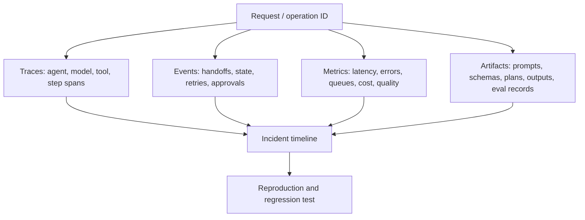
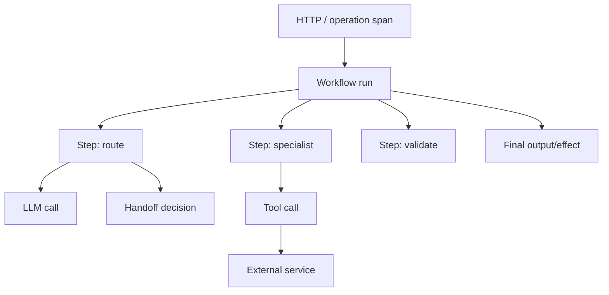
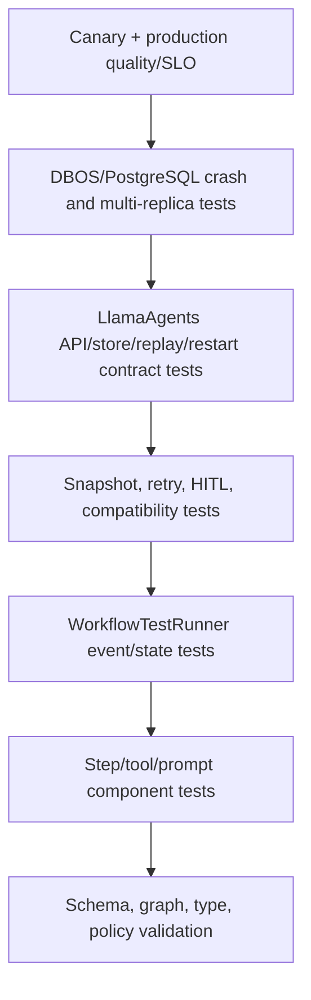
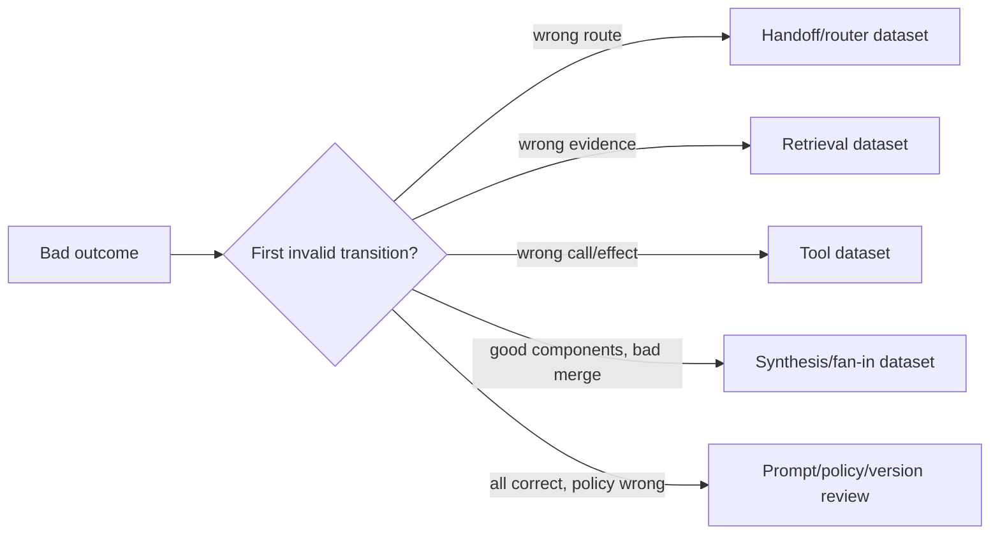

# Observability, evaluation, testing, and debugging

**Research date:** 2026-08-31  
**Status:** Production guide; telemetry schemas and integrations are version-sensitive  
**Verified against:** `llama-index-core` 0.14.24 at `f87a57b`; `llama-index-workflows` 2.23.3, `llama-agents-server` 0.7.1, `llama-agents-client` 0.3.12, and `llama-agents-dbos` 0.6.0 at `94f17c9`; `llama-index-observability-otel` 0.6.4  
**Scope:** Evidence for LlamaIndex Agent/Workflow behavior and current LlamaAgents hosting. LlamaDeploy-specific monitoring is deprecated and out of scope.

## Bottom line

An agent is observable only when a responder can reconstruct both decisions and effects across model, tool, Workflow, server, and durable-runtime boundaries. A final answer and a latency histogram are not enough.

Build four linked evidence planes:



Instrumentation answers **what ran**. Evaluation answers **whether it was good**. Tests answer **whether known contracts still hold**. Durable event history helps all three, but it is not a substitute for any of them.

## Boundary map

| Layer | Native evidence | What the application must add |
|---|---|---|
| LlamaIndex agent | LLM/tool spans and instrumentation events | prompt/tool/model versions, policy decision, cost budget |
| `AgentWorkflow` / custom Workflow | step spans, streamed events, `StepStateChanged`, context/run tag | business operation identity, state-transition meaning, effect identity |
| LlamaAgents server | handler records, run ID, persisted event sequence, API logs | tenant/request identity, authenticated actor, route version, deployment build |
| DBOS runtime | durable workflow/step status, executor/queue/database evidence | ownership SLO, recovery attempt, schema/fingerprint version, effect reconciliation |
| External systems | provider request/response and business records | cross-system idempotency/correlation key |

Do not conflate these layers. `AgentWorkflow` handoffs occur inside a Workflow. LlamaAgents hosts and persists that Workflow. DBOS coordinates its durable execution. The deprecated LlamaDeploy telemetry/control-plane model is not the current architecture.

## Correlation contract

Create identities before work begins and propagate them through logs, traces, events, state, and effects:

| Field | Cardinality | Purpose |
|---|---:|---|
| `operation_id` | One per business command | Idempotency and end-to-end reconstruction |
| `request_id` / trace ID | One per ingress attempt | HTTP and trace correlation |
| `tenant_id` | Bounded | Authorization and scoped operational analysis |
| `workflow_name` | Bounded | Public route and dashboard grouping |
| `workflow_schema_version` | Bounded | Replay/compatibility diagnosis |
| `handler_id` | One per hosted lifecycle | LlamaAgents lookup/cancel/continue |
| `run_id` | One per Workflow execution | Runtime/step/event correlation |
| `event_sequence` | Increasing per run | Replay position and gap/duplicate detection |
| `step`, `agent`, `tool` | Bounded names | Decision-path breakdown |
| `executor_id`, build/version | Bounded per deploy | Ownership and rollout diagnosis |
| `effect_id` | One per external effect | Reconciliation and deduplication |

Current Workflows applies an instrumentation tag named `llamaindex.run_id` through its context. The server adds `llamaindex.handler_id` around run handling. The DBOS adapter captures and restores propagation context across its serialization/process boundary. Verify those attributes in the exporter rather than assuming a vendor backend maps them automatically.

Never put raw prompts, user IDs, document text, URLs with secrets, or arbitrary tool arguments into metric labels. High-cardinality identities belong in logs/traces with retention controls, not time-series dimensions.

## LlamaIndex instrumentation and OpenTelemetry

LlamaIndex's instrumentation system uses dispatchers, spans, and typed events and is intended to replace the legacy callback mechanism. Both may appear during the migration period. Avoid installing two exporters that record the same model/tool action twice.

Workflows automatically instrument steps. The supported OpenTelemetry integration package translates LlamaIndex spans/events to OTel. A production configuration should use an application-owned provider/exporter lifecycle:

```python
# Conceptual lifecycle; verify exact imports for the pinned 0.6.x integration.
instrumentor = LlamaIndexOpenTelemetry(
    tracer_provider=tracer_provider,
    event_logger_provider=event_logger_provider,
)
instrumentor.start_registering()

try:
    await serve_application()
finally:
    tracer_provider.force_flush()
    tracer_provider.shutdown()
```

Use a batch span processor for normal service operation. A simple/synchronous processor is useful for tests and tiny demos but adds exporter latency to the request path. Explicitly flush and shut down providers during process termination; otherwise the last spans can disappear.

Version 0.6.4 source includes fixes around ended-span event buckets and span-ID handling. Make “one logical call produces one correctly parented span, no unbounded retained event bucket” an integration test when upgrading.

### Minimum span model



For each model call capture provider/model/deployment name, request class, latency, token counts, cached-token fields if supported, retry/throttle outcome, and finish/error class. For tools capture stable tool name/version, deadline, attempt, effect/idempotency ID, outcome class, and response size—not the full sensitive payload by default.

## Workflow internal events

`StepStateChanged` is an internal dispatch event that identifies the step, worker, input/output event context, and state transition. Current states include preparing, running, and not running. Internal events are hidden from normal user streams unless explicitly exposed; the test runner exposes them by default.

Use them to answer:

- Which step was eligible, active, or idle?
- Did several workers overlap?
- Did a step run again after retry, optimistic invalidation, or recovery?
- Where did a Workflow become idle before a human event?

Do not expose internal event payloads to arbitrary external clients. Store/export them to an access-controlled operational sink and set retention/volume budgets.

## Logs, metrics, traces, and retained events

| Signal | Best use | Minimum fields | Anti-pattern |
|---|---|---|---|
| Structured log | Discrete decision/error and operator narrative | timestamp, severity, operation/handler/run, step, attempt, error class | Prompt/output dump on every call |
| Metric | SLO, capacity, trend, alert | bounded workflow/step/status/model dimensions | run ID as a label |
| Trace | Causal latency and dependency path | parent links, run/handler tags, model/tool/step spans | Sampling all success or dropping all failures blindly |
| Persisted Workflow event | Domain/runtime replay and audit | run, monotonic sequence, event/schema version | Treating it as a global message queue without retention contract |
| Eval record | Quality regression and release comparison | dataset item, versions, scores, judge, evidence | Only aggregate average with no slice/error examples |

### Core metrics

| Category | Examples |
|---|---|
| Traffic | admitted, active, queued, completed, cancelled by workflow/version/tenant tier |
| Latency | submit-to-start, step, model, tool, wait-for-human, end-to-end, recovery |
| Reliability | step error/retry, terminal error, recovery attempt/exhaustion, replay duplicate/gap |
| Concurrency | active runs, workers busy, provider in-flight, queue age/depth, idle released/resuming |
| Resource | process RSS/CPU, event/tick rows and bytes, DB connections/locks, exporter queue/drop |
| Cost | prompt/completion/cached tokens, calls, tool spend, cost per successful operation |
| Quality | task success, faithfulness, retrieval, handoff/tool/plan accuracy, human override |

Track p50/p95/p99 and worst-slice behavior. Agent latencies and costs are heavy-tailed; an average can improve while timeouts and spend outliers worsen.

## Event-stream observability

For server 0.7.1, events are persisted with per-run sequence numbers and can be replayed by `after_sequence`/SSE `Last-Event-ID`; multiple subscribers and heartbeat are implemented by current source/store architecture. The older `workflows/deployment.md` single-reader warning is stale for the verified version.

Monitor:

- latest produced sequence minus each durable consumer cursor;
- reconnect count/reason and replayed-event count;
- sequence gaps, non-monotonic IDs, and duplicate `(run_id, sequence)` application;
- subscription duration and heartbeat age;
- retained-history size and oldest available sequence;
- deserialize failures by event type/schema version.

Keep a protocol contract test as a release gate. Documentation and code have diverged before; the installed behavior is the contract you operate.

## A production testing pyramid



Mocked unit tests are fast and necessary. They cannot prove provider schemas, streaming, event importability, database recovery, executor ownership, proxy behavior, or effect idempotency. Each higher tier should cover a smaller number of critical paths with real boundaries.

## Workflow tests with `WorkflowTestRunner`

The current runner drains the handler stream, awaits completion, and returns the final result, collected events, per-type counts, and final `Context`. Internal events are exposed by default.

```python
from workflows.testing import WorkflowTestRunner

result = await WorkflowTestRunner(workflow).run(
    start_event=ClaimSubmitted(claim_id="c-17"),
    expose_internal=True,
)

assert result.result.status == "manual_review"
assert result.event_types[ReviewRequested] == 1
assert any(
    isinstance(event, StepStateChanged) and event.name == "triage"
    for event in result.collected
)
assert (await result.ctx.store.get("claim_id")) == "c-17"
```

The exact `StepStateChanged` field names and typed-state access depend on the installed version and Workflow definition; keep assertions against public fields verified by the schema. Prefer semantic invariants over a complete event snapshot that changes whenever instrumentation improves.

### Component-test matrix

| Component | Deterministic test | Fault test |
|---|---|---|
| Structured model output | schema-valid/invalid fixtures | truncation, refusal, unknown enum, model mismatch |
| Tool wrapper | request mapping and result normalization | timeout, 429, ambiguous success, oversized/hostile output |
| Router/handoff | allowed path and state transfer | loop, unavailable specialist, forged agent/tool name |
| Planner | dependency DAG and budget | cycle, missing dependency, excessive tasks |
| Fan-out/fan-in | correlation and deterministic sort | completion reordering, partial failure, loser still running |
| HITL | typed request/response and authorization | duplicate/late event, restart while waiting |
| Retry/recovery | retry classification and attempt count | crash after external effect, exhausted recovery |

## Serialization and compatibility tests

For every durable state/event type:

1. Produce it with N-1 code.
2. Serialize through the actual Context or server store path.
3. Load it with N code and continue to completion.
4. Produce it with N code and ensure N-1 either reads it safely during the rollout window or is prevented from doing so.
5. Redact/delete it under the real retention workflow.

Include snapshots while a step is in flight; restoration should demonstrate whole-step replay and effect deduplication. Include stored event class/module renames because the Python client reconstructs typed events through import/registry resolution.

## Server and durable-runtime contract tests

Minimum LlamaAgents suite:

- synchronous and no-wait submission, handler lookup, send-event, cancel, and terminal result;
- duplicate active handler ID returns conflict;
- raw stream explicitly tested from `-1`, `"now"`, integer cursor, and `Last-Event-ID`;
- two simultaneous subscribers receive expected history/live events;
- heartbeat keeps the chosen proxy path alive;
- client reconnect resumes from last sequence and stops after its configured bound;
- SQLite restart reconstructs handler, ticks, state, and event history;
- DBOS owner kill recovers within SLO without duplicate external effect;
- idle release races a new event and preserves one fenced owner;
- old and new builds restore compatible runs and reject incompatible schema versions.

Test the protocol over the same ingress proxy, TLS/auth middleware, and database configuration used in production. An in-process ASGI test does not expose buffering or idle-timeout failures.

## Graphs and debugger

The optional `llama-index-utils-workflow` package can draw all possible flows or the most recent execution as Mermaid/HTML. Static graphs reveal unreachable steps, overly broad event types, accidental cycles, and missing terminal paths. Executed graphs show one path, not proof that other paths are safe.

```python
from llama_index.utils.workflow import draw_all_possible_flows

draw_all_possible_flows(workflow, "workflow.html")
```

The current LlamaAgents server includes a debugger UI at its root and exposes workflow schema, event schema, and graph representation; the current client methods include `get_workflow_schema()`, `get_workflow_events_schema()`, and `get_workflow_graph()`. Keep these surfaces authenticated and normally restricted to engineering environments because they reveal system topology and accepted event types.

## Evaluation strategy

### Evaluate the outcome and the trajectory

| Layer | Questions | Metrics/evidence |
|---|---|---|
| Final answer/artifact | Correct, complete, grounded, schema-valid? | deterministic assertions, correctness, faithfulness, semantic similarity |
| Retrieval | Relevant evidence found and cited? | hit/recall/precision/MRR-style retrieval metrics; attribution checks |
| Tool use | Right tool and arguments, safe effect, useful result? | selection/argument/effect accuracy, invalid-call rate |
| Handoff/routing | Correct specialist, bounded transitions, context preserved? | route accuracy, handoff count, loop/override rate |
| Plan/Workflow | Valid dependencies and state transitions? | DAG validity, task completion, unnecessary-step ratio |
| Operations | Within latency, cost, retry, and safety budget? | SLO and resource metrics |
| Human outcome | User accepted/corrected/escalated? | blinded labels, override and escalation taxonomy |

LlamaIndex evaluators include correctness, faithfulness, relevancy/context relevancy, pairwise comparison, semantic similarity, retrieval evaluation, and batch runners. Use the narrowest evaluator matching the claim. “Faithful” does not mean “correct,” and a fluent judge score does not prove a tool effect was safe.

### End-to-end and component-wise

Use both:

- End-to-end datasets detect whether the shipped system solves the user task.
- Component datasets isolate retrieval, routing, tool arguments, handoff, or synthesis regressions.

If only end-to-end quality falls, diagnosis is slow. If only components pass, interaction failures remain invisible.

### Environment-based evaluation and promotion gates

Do not run one generic evaluation suite in every environment. Each environment can prove different claims because its models, data, stores, network, credentials, and failure controls differ.

| Environment | Data and dependencies | Required evaluation | Promotion decision |
|---|---|---|---|
| Pull request / local | Frozen redacted fixtures; deterministic model/tool doubles where useful | Schema/graph validation, component cases, retrieval fixture, policy checks, budget calculation | Reject invalid behavior cheaply before remote calls |
| Shared integration | Real pinned model/vector/parser/tool sandboxes; synthetic tenants | Provider schema/streaming conformance, tenant-filter canaries, trajectory evals, latency/cost smoke | Prove integrations behave like the mocks and preserve isolation |
| Staging | Production topology and ingress; scrubbed replay corpus; real database/store class | Server cursor/reconnect, crash/recovery, N-1 state restore, load/tail latency, red-team suites | Prove lifecycle and operational contracts, not only answer quality |
| Pre-production shadow | Mirrored or sampled inputs with effects disabled or redirected | Slice quality, retrieval drift, route/tool proposals, cost forecast, data-policy audit | Compare candidate against current release on the same traffic distribution |
| Canary production | Small authorized cohort; real reads and tightly controlled writes | Online task outcome, override/escalation, effect reconciliation, error/tail/cost SLOs | Expand only when hard safety and critical-slice gates pass |
| Full production | Real traffic with retained labels and incident taxonomy | Continuous drift/slice monitoring, delayed human outcomes, scheduled regression replay | Roll back/disable capability when guardrail or SLO burn thresholds fire |

Keep effectful tests safe. In shared or shadow environments, replace email, ticket, payment, deployment, and deletion tools with policy-equivalent sandboxes that return realistic receipts. A mock that always succeeds cannot validate retry classification or ambiguous outcomes; a real production effect is not an acceptable eval probe.

Every evaluation run should emit a reproducibility manifest:

```text
evaluation_run_id, environment, dataset_id/version/digest,
candidate_build + package lock, workflow/event/state schema versions,
corpus/index/embedding version, prompt/tool/model policy versions,
model and judge provider/deployment IDs, sampling configuration,
ingress/store/runtime topology, started_at, code commit,
per-slice metrics, hard-gate results, cost and latency distribution
```

Compare like with like. If staging uses a different model deployment, vector backend, parser, or corpus than production, report it as a different environment fingerprint instead of presenting the score as a production prediction. Keep dataset changes separate from candidate changes so an easier dataset cannot masquerade as an improvement.

### LLM-as-judge controls

- Pin judge model/deployment, prompt, rubric version, sampling settings, and evaluation code.
- Require structured rationale plus score, while treating rationale as diagnostic—not ground truth.
- Calibrate against blinded human labels and report agreement/confusion by slice.
- Include adversarial verbosity, citation laundering, self-preference, and position-order checks.
- Randomize pairwise order and run both orders for important comparisons.
- Prefer deterministic programmatic checks for schema, arithmetic, citations, tool arguments, policy, and effects.
- Store the evidence visible to the judge; do not let it infer from unavailable private state.
- Track judge drift separately from candidate-system drift.

### Multi-agent credit assignment

Do not award every specialist the final score. Attribute failures using recorded trajectory and counterfactual/component tests:



A model-generated “reason” for its own handoff is not reliable attribution. Use the actual route, inputs, outputs, state deltas, and expected decision.

## Incident-debugging sequence

1. Start from application `operation_id`; find handler and run IDs.
2. Confirm the registered Workflow name, schema version, build, prompt/tool/model versions, and executor.
3. Check handler status, latest persisted sequence, active/queued/idle/recovery state, and consumer lag.
4. Build the step timeline from trace plus `StepStateChanged` and retry events.
5. Identify the first divergence from the expected state/event/effect invariant.
6. Reconcile every ambiguous external effect before replaying anything.
7. Reproduce with the retained start event and mocked/frozen provider results when policy permits.
8. Add the smallest component or contract regression test, then rerun the crash/eval slice.

Do not begin by manually resubmitting the user's command. That can hide the original timeline and duplicate effects.

## Failure matrix

| Symptom | Likely cause | Evidence | Control |
|---|---|---|---|
| Trace ends before final result | Exporter not flushed or process killed | exporter queue/drop and shutdown logs | Batch processor with bounded queue; lifecycle flush/shutdown |
| Duplicate spans/cost | Callbacks and instrumentation both exported | matching request IDs/timestamps | One canonical pipeline; migration dedupe |
| Flat/missing parentage after recovery | context propagation not restored/exporter mapping changed | span links and run/handler tags | Cross-boundary integration test |
| Memory grows with telemetry | event/span buckets or exporter queue retained | heap/cardinality/exporter metrics | Upgrade regression test; bounded queues and payloads |
| Workflow looks stuck | waiting for human, queued, idle released, or dead executor | internal events, handler/runtime/DBOS state | State-specific alert and runbook |
| Consumer says no events | `"now"` default skipped history | request cursor and first sequence | Explicit cursor; current protocol test |
| Quality average stable, incidents rise | regression concentrated in slice/tail | per-slice and worst-case eval | Gate critical slices and error taxonomy |
| Judge score changes without app change | judge model/prompt drift | judge version and calibration control | Pin/version judge; human anchor set |
| Retry count looks safe but effects duplicate | step replay/ambiguous timeout not traced by effect ID | operation/effect records | Stable effect ID and reconciliation |
| Debugger leaks architecture | root/schema endpoints exposed | ingress/access logs | Authenticate and restrict operational surfaces |

## Release-gate checklist

- [ ] Operation, request, handler, run, event sequence, step, executor, and effect IDs correlate.
- [ ] Trace propagation survives HTTP, serialization, DBOS recovery, and tool calls.
- [ ] Exporters are bounded, sampled deliberately, and flushed on shutdown.
- [ ] Sensitive prompts/tool payloads are redacted, access-controlled, and retained deliberately.
- [ ] Metrics use bounded dimensions and include queue/recovery/consumer lag.
- [ ] `WorkflowTestRunner` asserts result, meaningful events, state, retries, and internal transitions.
- [ ] N-1/N context and event serialization is tested.
- [ ] Server cursor/multi-subscriber/heartbeat/reconnect behavior is contract-tested.
- [ ] SQLite restart and DBOS crash/recovery tests prove external effect counts.
- [ ] Static and executed Workflow graphs are reviewed for critical changes.
- [ ] End-to-end plus retrieval/router/tool/handoff/component evals gate the release.
- [ ] Evaluation manifests identify the environment, dataset, dependency topology, corpus, candidate, and judge versions.
- [ ] Promotion progresses from deterministic/component proof to real-integration, recovery/load, shadow, and canary evidence.
- [ ] Judge versions are pinned and calibrated to human labels.
- [ ] Canary alerts cover quality, safety, cost, latency, retries, queue age, and recovery exhaustion.
- [ ] Operator replay procedure begins with effect reconciliation.

## Refresh triggers

Re-verify this guide when any of these change:

- `llama-index-core`, instrumentation, observability OTel, Workflows, workflow utilities, server/client, or DBOS packages;
- instrumentation/callback deprecation, span/event schema, context tags, or exporter behavior;
- `StepStateChanged`, `WorkflowTestRunner`, graph/debugger, event sequence, or client reconnect behavior;
- evaluator prompts/models/metrics or provider token/cost fields;
- Workflow/event/state schema, model, tool, prompt, policy, ingress proxy, or retention rules.

The observability release gate must include a real exported trace, a retained/replayed event stream, a crash recovery, and a scored eval slice—not only unit-test success.

## Primary references

- [LlamaIndex observability documentation](https://developers.llamaindex.ai/python/framework/module_guides/observability/)
- [LlamaIndex instrumentation documentation](https://developers.llamaindex.ai/python/framework/module_guides/observability/instrumentation/)
- [LlamaIndex instrumentation source](https://github.com/run-llama/llama_index/tree/main/llama-index-core/llama_index/core/instrumentation)
- [LlamaIndex OpenTelemetry integration](https://github.com/run-llama/llama_index/tree/main/llama-index-integrations/observability/llama-index-observability-otel)
- [LlamaIndex evaluation guide](https://developers.llamaindex.ai/python/framework/module_guides/evaluating/)
- [LlamaIndex retrieval evaluation](https://developers.llamaindex.ai/python/framework/module_guides/evaluating/usage_pattern_retrieval/)
- [LlamaIndex Workflows testing implementation](https://github.com/run-llama/llama-agents/blob/main/packages/llama-index-workflows/src/workflows/testing/runner.py)
- [Workflow internal event implementation](https://github.com/run-llama/llama-agents/blob/main/packages/llama-index-workflows/src/workflows/events.py)
- [Workflow visualization utilities](https://github.com/run-llama/llama-agents/tree/main/packages/llama-index-utils-workflow)
- [LlamaAgents server API implementation](https://github.com/run-llama/llama-agents/blob/main/packages/llama-agents-server/src/llama_agents/server/_api.py)
- [LlamaAgents server architecture](https://github.com/run-llama/llama-agents/blob/main/architecture-docs/server-architecture.md)
- [LlamaAgents client implementation](https://github.com/run-llama/llama-agents/tree/main/packages/llama-agents-client)
- [LlamaAgents DBOS architecture](https://github.com/run-llama/llama-agents/blob/main/packages/llama-agents-dbos/ARCHITECTURE.md)
- [DBOS workflow recovery](https://docs.dbos.dev/production/workflow-recovery)
- [OpenTelemetry semantic conventions](https://opentelemetry.io/docs/specs/semconv/)

### Version-conflict note

- [Pinned LlamaAgents Workflow deployment prose](https://github.com/run-llama/llama-agents/blob/94f17c9/docs/src/content/docs/llamaagents/workflows/deployment.md) still describes an older one-reader/unrecoverable stream. Current 0.7.1 server source and architecture implement persisted sequence cursors, concurrent subscribers, SSE resume, and heartbeat. Retain the old prose only as a regression prompt.
