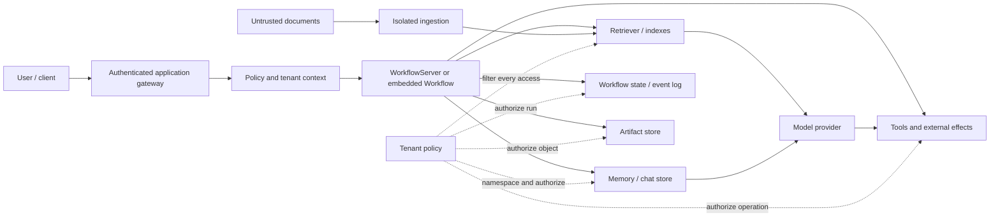
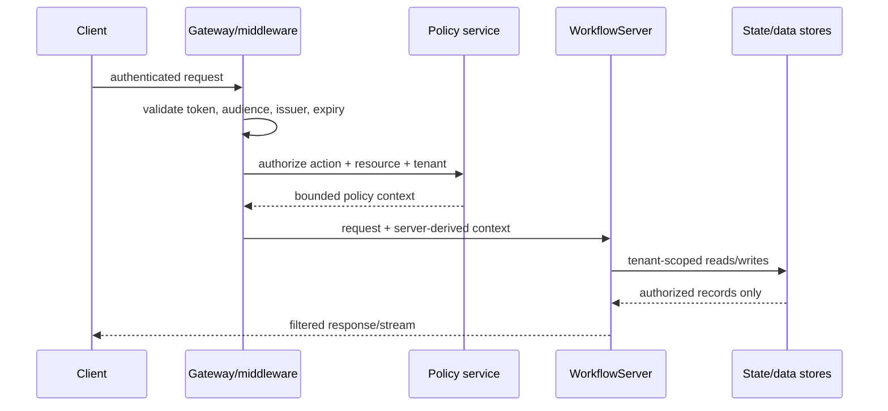

# Security, Tenancy, and Data Governance

**Research date:** 2026-08-31  
**Applies to:** LlamaIndex core/integrations, Agent Workflows, self-hosted `WorkflowServer`, the optional DBOS runtime, and LlamaAgents deployment tooling  
**Production stance:** LlamaIndex is an application library, not a security boundary

## Bottom line

Treat every document, retrieved node, tool result, model message, workflow event, and restored snapshot as potentially hostile data. Put authentication, authorization, tenant routing, request limits, egress policy, effect approval, and retention controls in the hosting application.

This is not just conservative advice. LlamaIndex's own security policy says the library is intended to run in a trusted execution environment and assigns validation, authentication, authorization, rate limiting, prompt-injection mitigation, and web security to the application. At the source snapshot used for this guide, the standalone `WorkflowServer`:

- exposes run, result, event-stream, event-injection, handler-listing, and cancellation routes;
- includes a workflow debugger UI at `/`;
- applies permissive credentialed CORS by default;
- accepts custom Starlette middleware but does not install an authentication or tenant-authorization policy for you;
- keeps the context-upload API disabled by default because context restoration can import Python types.

Therefore, a bare Internet-facing server is not a production architecture.

## Trust-boundary map



The gateway authenticates a principal. A server-side policy layer derives immutable tenant, subject, roles, entitlements, and request budget. Downstream components consume that policy; they must not derive authority from model output, user-supplied metadata, a run ID, or a document ID.

## Responsibility matrix

| Surface | Framework capability | Application responsibility |
|---|---|---|
| HTTP API | ASGI app, typed workflow routes, middleware injection | TLS, authentication, authorization, CSRF strategy, safe CORS, body/time/rate limits |
| Workflow identity | Workflow and handler/run identifiers | Bind every run to tenant and owner; prevent enumeration and cross-tenant resume/cancel |
| Context restore | Serialization and restoration; server API disabled by default | Keep snapshots trusted, signed/versioned, and server-loaded; never accept arbitrary client snapshots |
| Events | Typed Pydantic events and server registry | Authorize each event type and transition; deduplicate human/tool callbacks |
| Retrieval | Metadata filters and many vector/index integrations | Mandatory tenant predicate, ACL filtering, deletion, consistency, and isolation tests |
| Memory | Chat stores, `Memory`, optional long-term blocks | Tenant/session namespace, access policy, retention, redaction, and provenance |
| Tools | Tool schemas and agent invocation | Least privilege, allowlists, argument validation, confirmation, idempotency, egress control |
| Ingestion | Readers, parsers, transformations, extractors | Size/type/path/URL validation, malware handling, parser isolation, quotas, content provenance |
| Model calls | Provider integrations and instrumentation | Provider/data-region policy, secret isolation, prompt-injection controls, spend and token budgets |
| Persistence | Index stores, chat stores, workflow stores, DBOS/Postgres | Encryption, credentials, RLS/schema design, backups, deletion, audit, migration safety |
| Observability | Callbacks, instrumentation, OpenTelemetry integrations | Data classification, sampling, redaction, access, retention, incident response |

## Harden `WorkflowServer` before exposure

### Source-level exposure traps in server 0.7.1

These are observations from the pinned implementation, not assumptions about future releases:

| Surface | Pinned behavior | Production consequence |
|---|---|---|
| Middleware fallback | `middleware = middleware or [permissive CORS]` | `middleware=[]` still installs the permissive default; pass a **non-empty** reviewed middleware list |
| Authentication | No built-in principal or tenant policy on run/handler/event routes | An `Authorization` header sent by the client has no effect unless an outer app/middleware validates it |
| Unhandled errors | Default handler logs the exception and returns `Internal server error: {exc}` | Internal exception text can reach clients; install a sanitized handler and keep diagnostic detail only in protected logs |
| Handler listing | `/handlers` filters by status/workflow name but has no built-in tenant predicate or pagination | Do not expose it as a multi-tenant listing API; build a tenant-owned, paginated application endpoint or block the route |
| Resource lookup | Handler/event/cancel routes accept a handler ID and the stored handler model has no application tenant field | Middleware must authorize the specific resource through an application ownership record; authentication alone is insufficient |
| Debugger assets | Root UI loads pinned JavaScript and CSS from public jsDelivr URLs | Version pinning is not supply-chain isolation; block the UI or self-host reviewed assets under CSP |
| Stream buffering | One unbounded process-local queue is created per event-stream connection | Slow authorized clients can still cause memory growth; apply stream/byte/lag quotas and disconnect/replay policy |

Review these behaviors again on every server upgrade. A release may fix one default while changing a route, event envelope, or middleware seam elsewhere.

### Put an authenticated application boundary in front

The server can be mounted inside a Starlette/FastAPI application or given Starlette middleware. Use that seam to implement identity and policy. The client documentation's ability to attach an `Authorization` header only shows transport extensibility; it does not mean the server validates that header.

A safe request path is:



Do not let callers choose `tenant_id`, roles, storage namespaces, provider credentials, allowed tools, or authorization filters in a start event. If the workflow needs these values, inject a server-derived resource or place an immutable policy reference in trusted run state.

### Replace the default CORS policy

At the researched server source revision, the default middleware permits any matching origin, all methods and headers, and credentials. Replace it with explicit origins and the smallest required methods/headers. If browser cookies are used, define a CSRF defense and same-site policy; CORS alone does not prevent cross-site requests.

Test preflight and credential behavior at the actual reverse proxy and application path. Proxy header rewriting, multiple origins, and cached preflight responses frequently invalidate local assumptions.

This minimal configuration demonstrates the exact replacement seam. It deliberately uses bearer-style headers and disables credentialed browser cookies; it is **not** the authentication implementation:

```python
from starlette.middleware import Middleware
from starlette.middleware.cors import CORSMiddleware
from starlette.requests import Request
from starlette.responses import JSONResponse

from llama_agents.server import WorkflowServer


async def safe_500(_request: Request, _exc: Exception) -> JSONResponse:
    # Log the exception with a server-side correlation ID in the real service.
    return JSONResponse({"detail": "Internal server error"}, status_code=500)


server = WorkflowServer(
    # A non-empty list replaces the pinned permissive default.
    middleware=[
        Middleware(
            CORSMiddleware,
            allow_origins=["https://agents.example.com"],
            allow_methods=["GET", "POST"],
            allow_headers=["Authorization", "Content-Type", "Last-Event-ID"],
            allow_credentials=False,
        )
    ],
    exception_handlers={Exception: safe_500},
    accept_context_api=False,
)
```

Put real token validation and action/resource authorization in an outer application or additional reviewed middleware. If no browser CORS access is required, use a non-empty security/authentication middleware list without `CORSMiddleware`; an empty list triggers the pinned default.

### Restrict the debugger and discovery endpoints

The root UI can visualize workflows, schemas, runs, and streamed events and can inject accepted event types. Treat it as a privileged operator surface:

- do not expose it to end users by default;
- authenticate it separately from run APIs;
- disable or route-block it in production when it is unnecessary;
- restrict `/handlers`, workflow schema/representation, event listing, and OpenAPI output;
- review its browser supply chain—the researched static page loaded debugger JavaScript and CSS from a public CDN.

Self-host or pin browser assets under a content-security policy if the UI is retained in a sensitive environment.

### Keep client-provided context restoration off

`WorkflowServer(accept_context_api=False)` is the safe default. Current context serialization can encode qualified Python type names; the JSON serializer can import classes during restoration, and the pickle-capable serializer explicitly warns that unpickling can execute code.

Recommended policy:

1. Clients send a stable run/handler reference, never a serialized execution context.
2. The server loads state from an authenticated, integrity-protected store.
3. Persisted records include tenant, workflow name/schema version, code version, serializer version, and digest.
4. JSON restoration uses an explicit `allowed_types` set where the integration surface allows it.
5. Pickle is prohibited for data influenced by another trust domain.
6. Old snapshots are migrated offline or drained under old code rather than accepted into arbitrary new code.

An allowlist narrows imports; it does not make arbitrary model validators or application constructors safe. Only allow application-owned types with reviewed restoration behavior.

### Bound every route and stream

Apply limits at the proxy and application layers:

| Limit | Why it matters |
|---|---|
| Request bytes and JSON depth | Events and start payloads can exhaust memory or validation time |
| Concurrent runs per principal/tenant/workflow | Provider calls and fan-out multiply cost |
| Queue length and admission deadline | Unbounded queued work becomes a delayed denial of service |
| Workflow wall time, model turns, tokens, and tool calls | Agent loops are probabilistic and can fail to converge |
| Step workers and fan-out cardinality | A single run can saturate local asyncio, threads, providers, or databases |
| SSE connections, lifetime, replay window, and bytes | Slow/disconnected consumers retain resources and event history |
| Produced-versus-consumed stream lag | The pinned per-connection feeder queue is unbounded |
| Stored events, state, artifacts, and memory | Persistence can become the attack target |
| Human-wait lifetime | Idle runs otherwise become permanent retained state |

Cancellation is cooperative and recovery is at-least-once. Limits must also exist in downstream HTTP clients, databases, sandboxes, and effect services; cancelling the workflow does not undo a completed write or forcibly stop every dependency.

## Tenant isolation is end-to-end

### Identifiers are routing keys, not capabilities

A handler ID, run ID, session ID, chat-store key, index ID, collection name, or artifact URI is not proof of authorization. For every read, stream, resume, event injection, cancellation, purge, and artifact fetch, authorize the authenticated subject against a server-stored ownership record.

Prefer opaque random IDs, but assume they leak through browser history, logs, traces, model messages, or support tickets. Security must survive identifier disclosure.

### Use one tenant predicate everywhere

Define a canonical policy contract, for example:

```text
AccessScope = {
  tenant_id,
  subject_id,
  allowed_resource_ids,
  roles,
  data_regions,
  tool_grants,
  policy_version
}
```

Project it into each subsystem without allowing the model to edit it:

| Subsystem | Required projection |
|---|---|
| Vector retrieval | Tenant/ACL predicate applied by the backend before top-k results are returned |
| Document and index stores | Tenant partition plus object-level authorization |
| Chat store / Memory | Tenant + user/session namespace; no caller-selected cross-tenant key |
| Workflow store / DBOS | Ownership record and tenant-filtered handler/event queries |
| Artifact store | Tenant prefix is insufficient alone; signed/authorized object access and digest |
| Tools | Per-operation grant, target-resource authorization, and bounded credentials |
| Telemetry | Tenant label for access control, never as the sole isolation mechanism |

Post-filtering an already retrieved global top-k list can both leak metadata and degrade recall. Enforce the predicate in the vector/database query or use physically separate collections/databases where the backend cannot provide dependable mandatory filtering.

### Choose the isolation tier deliberately

| Tier | Shape | Appropriate when | Main trade-off |
|---|---|---|---|
| Logical | Shared service/store with mandatory tenant columns and filters | Many ordinary tenants, strong database controls | One missed predicate can be catastrophic |
| Partitioned | Separate schema/collection/bucket/key hierarchy and credentials | Higher assurance or noisy-neighbor concerns | More provisioning and migrations |
| Dedicated | Separate deployment, database, provider keys, and network boundary | Regulated/high-value tenants or customer-managed environment | Highest operational cost |

Test the chosen tier with adversarial cross-tenant fixtures. Code review is not sufficient evidence.

## Retrieval and document-ingestion threats

Documents are active input to an agent even when they are stored as passive files.

| Threat | Example | Primary controls |
|---|---|---|
| Indirect prompt injection | A document tells the agent to disclose secrets or call a tool | Mark provenance, separate instructions from data, restrict tools, require policy/approval for effects |
| SSRF | Reader/parser follows an attacker URL to metadata or private services | Fetch broker, scheme/host/IP allowlist, redirect revalidation, DNS-rebinding defense, egress policy |
| Path traversal / arbitrary file read | User metadata supplies a local path | Never pass client paths directly; stage by generated ID in an isolated directory |
| Parser exploit | Malformed PDF/archive/image targets native or Python parser | Isolated worker/container, patched dependencies, low privilege, CPU/memory/time limit |
| Archive/decompression bomb | Small upload expands massively | Compressed and expanded byte/file/depth quotas |
| Embedding/retrieval poisoning | Adversarial nodes dominate similarity or metadata | Source trust labels, ingestion review, deduplication, anomaly tests, authorization-first retrieval |
| Text-to-SQL/code execution | Model generates destructive SQL/Python | No direct privileged executor; read-only DB role, allowlisted AST/query plan, sandbox, limits, approval |
| Cross-tenant cache | Cache key omits tenant/ACL/policy version | Include authorization scope and corpus version or avoid shared result cache |
| Deletion gap | Source deleted but chunks, embeddings, cache, memory, and traces remain | Lineage index and verifiable cascading deletion workflow |

LlamaIndex's security documentation explicitly places URL, path, prompt-injection, and unbounded-input handling at the application boundary. Several LlamaIndex components also include local warnings for dangerous execution surfaces such as text-to-SQL. Treat these warnings as architecture requirements.

## Agent and tool security

### A valid tool call is not an authorized action

Schema validation proves that arguments have the expected shape. It does not prove intent, authority, semantic safety, or idempotency. A production tool wrapper should:

1. authenticate the service identity and bind the user/tenant scope;
2. authorize the exact operation and target object;
3. validate semantic constraints, not only JSON types;
4. attach a stable operation/idempotency key;
5. enforce timeout, bytes, rate, and result-size limits;
6. return a receipt with outcome, target version, and provenance;
7. redact secrets and sensitive fields before returning to the model;
8. require explicit approval for high-impact or ambiguous actions.

Keep read and write tools separate. Prefer narrow verbs such as `create_draft_invoice` over a generic SQL, shell, HTTP, or cloud-admin tool.

### Treat tool output as untrusted input

Web pages, email, tickets, database strings, MCP results, and retrieved nodes can carry indirect instructions. Preserve a typed distinction between:

- trusted system/developer policy;
- authenticated human input;
- untrusted content returned by tools and retrieval;
- model-generated proposals;
- confirmed effect receipts.

Do not concatenate these categories into an undifferentiated prompt. A supervising prompt is helpful, but the decisive controls belong in code and infrastructure.

### Isolate dangerous execution

If a workflow must execute generated code, shell commands, browser actions, or complex parsers, use a disposable sandbox with:

- no ambient cloud credentials;
- read-only application code and a fresh writable work directory;
- explicit network allowlist or no network;
- CPU, memory, process, file, and wall-time limits;
- output/artifact size caps;
- non-root identity and hardened seccomp/AppArmor/Windows isolation as applicable;
- full operation audit and cleanup.

The Python process hosting the agent is not a sandbox.

## Persistence, secrets, and governance

### Separate state classes

Use distinct stores and policies for:

| State | Examples | Security/governance need |
|---|---|---|
| Conversation memory | User/model/tool messages, memory blocks | User access, minimization, retention, correction/deletion |
| Workflow runtime | Pending events, state store, ticks, handler lifecycle | Integrity, version compatibility, replay safety |
| Retrieval data | Source docs, nodes, embeddings, metadata | Source ACLs, region, lineage, deletion |
| Artifacts | Parsed files, images, raw tool/provider results | Object authorization, malware controls, digest, lifecycle |
| Effects | External write intents and receipts | Transactional audit, idempotency, reconciliation |
| Telemetry/evaluation | Prompts, spans, scores, datasets | Redaction, restricted access, sampling, limited retention |

One database may physically hold several classes, but a single opaque context blob should not become their policy model.

### Secrets never belong in model-visible state

- Inject provider and tool credentials through a secret manager or runtime resource.
- Prefer short-lived, tenant-scoped credentials.
- Do not put keys in start events, `ctx.store`, chat history, prompts, tool results, event streams, or persisted artifacts.
- Redact authorization headers, signed URLs, database DSNs, and model-provider raw responses from logs and traces.
- Rotate credentials independently of workflow code and recover in-flight runs without restoring old secrets.

`llamactl` supports environment files and required-variable checks, and managed deployment can inject LlamaCloud credentials. Those are delivery mechanisms, not a complete secret-governance design. Keep `.env` files out of images, source control, build logs, and browser bundles.

### Make deletion provable

Maintain a lineage record from source object to parsed artifacts, nodes, embeddings, index/doc-store records, caches, memories, workflow runs, evaluations, and telemetry. A deletion job should enumerate and remove or cryptographically expire every derivative, record failures, and support retry/reconciliation.

For legal hold or audit, keep effect receipts and minimal immutable metadata separately from content. Do not silently retain full prompts/documents merely because the workflow event log makes it convenient.

## Security acceptance tests

### Authorization matrix

- [ ] A user from tenant A cannot list, read, stream, resume, inject into, cancel, or purge tenant B's run, even with a valid B identifier.
- [ ] Retrieval never returns B nodes to A before or after reranking, caching, synthesis, or citations.
- [ ] Memory/chat-store keys cannot be selected or overwritten across users/tenants.
- [ ] Artifact URLs and tool receipts require authorization after direct leakage.
- [ ] Operator/debugger endpoints have a stricter role than ordinary workflow invocation.
- [ ] `/handlers` and other collection routes are blocked or replaced with tenant-scoped pagination.
- [ ] Client-visible 5xx responses never include internal exception text.

### Hostile-input matrix

- [ ] Oversized/deep JSON, event floods, slow streams, fan-out bombs, and long waits remain bounded.
- [ ] A deliberately slow event consumer cannot grow process memory without limit and reconnects from a committed cursor.
- [ ] URLs are retested after every redirect and cannot reach private/link-local ranges.
- [ ] Malformed archives, documents, and images execute only in the isolated ingestion boundary.
- [ ] Indirect prompt injection cannot enable a forbidden tool or reveal another tenant's data.
- [ ] Generated SQL/code/shell cannot escape read-only or sandbox controls.
- [ ] Untrusted serialized context and pickle payloads are rejected.

### Recovery and audit matrix

- [ ] Retried steps cannot duplicate external writes.
- [ ] Human responses are bound to one pending request and deduplicated.
- [ ] Audit records identify principal, tenant, policy version, model/tool/prompt version, operation ID, and outcome.
- [ ] Logs/traces/event streams contain no secrets and honor data-class retention.
- [ ] Tenant deletion reaches documents, embeddings, memory, artifacts, caches, runs, and evaluation copies.

## Primary sources

- [LlamaIndex security policy and application threat model](https://github.com/run-llama/llama_index/blob/main/SECURITY.md)
- [Pinned `WorkflowServer` source and secure-context default](https://github.com/run-llama/llama-agents/blob/94f17c9/packages/llama-agents-server/src/llama_agents/server/server.py)
- [Pinned server API: default CORS, errors, routes, streams, and context gate](https://github.com/run-llama/llama-agents/blob/94f17c9/packages/llama-agents-server/src/llama_agents/server/_api.py)
- [Pinned debugger page and public-CDN assets](https://github.com/run-llama/llama-agents/blob/94f17c9/packages/llama-agents-server/src/llama_agents/server/static/index.html)
- [Workflow serializers, type allowlisting, and pickle warning](https://github.com/run-llama/llama-agents/blob/main/packages/llama-index-workflows/src/workflows/context/serializers.py)
- [Workflow server deployment and persistence documentation](https://developers.llamaindex.ai/python/llamaagents/workflows/deployment/)
- [Workflow client and custom HTTP headers](https://developers.llamaindex.ai/python/llamaagents/workflows/client/)
- [LlamaAgents Helm chart and default egress policy](https://github.com/run-llama/llama-agents/tree/main/charts/llama-agents)
- [LlamaAgents deployment configuration and credential injection](https://developers.llamaindex.ai/python/llamaagents/llamactl/configuration-reference/)
- [LlamaIndex text-to-SQL implementation warning](https://github.com/run-llama/llama_index/blob/main/llama-index-core/llama_index/core/indices/struct_store/sql_query.py)

Bounded failure evidence used as adoption-test input, not prevalence data: [prompt-to-code execution report #7054](https://github.com/run-llama/llama_index/issues/7054), [text-to-SQL injection report #9957](https://github.com/run-llama/llama_index/issues/9957), and [arbitrary image-file read report #21518](https://github.com/run-llama/llama_index/issues/21518).

## Refresh triggers

Re-audit this guide when any of the following changes:

- `WorkflowServer` authentication, middleware, default CORS, debugger UI, route, or request-limit behavior;
- context/event serializer allowlisting, qualified-name imports, or pickle support;
- server/client major versions or event-stream/resume protocol;
- LlamaIndex security scope, advisory, reader/parser, generated-code, or text-to-SQL behavior;
- LlamaAgents managed-deployment authentication/tenancy leaves beta or documents a new contract;
- Helm network policy, secret injection, namespaces, or operator RBAC;
- a vector/chat/workflow store changes its tenant-filter or deletion guarantees.
