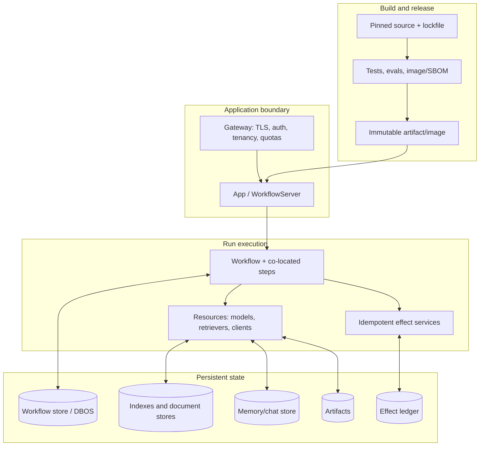

# Deployment, Scaling, Versioning, Migration, Limitations, and Alternatives

**Research date:** 2026-08-31  
**Version evidence:** LlamaIndex repository changelog through 2026-08-19; LlamaAgents source snapshot `94f17c9` from 2026-08-22  
**Scope:** Current LlamaIndex agents/data framework, standalone Agent Workflows, LlamaAgents server/client/DBOS/deployment tooling, and migration away from deprecated LlamaDeploy

## Bottom line

Adopt the ecosystem as a set of separately versioned layers, not one product:

1. **LlamaIndex core and integrations** provide document ingestion, indexing, retrieval, models, tools, memory, and workflow-based agents.
2. **Agent Workflows** is the extracted event-driven runtime, published as `llama-index-workflows` and imported from `workflows` in current standalone examples.
3. **LlamaAgents server/client/DBOS packages** add HTTP serving, event streaming, persistence, runtime adapters, and optional database-coordinated recovery.
4. **`llamactl` and the LlamaAgents control-plane/operator packages** build and deploy applications; managed LlamaCloud deployments were documented as beta preview at the research date.
5. **The old standalone `llama-deploy` project is deprecated.** It is not the durability/runtime architecture described by current LlamaAgents.

Pin and test a compatible package set. Version the durable workflow identity and application semantics yourself. A package upgrade, workflow class rename, prompt change, or tool-schema change can make an in-flight run semantically unsafe even when deserialization still succeeds.

## Stack and version map

The following is a time-stamped research snapshot, not a recommendation to copy exact versions forever.

| Layer | Package/repository evidence at snapshot | Purpose | Stability caution |
|---|---|---|---|
| LlamaIndex core | `llama-index-core` 0.14.24 in 2026-08-19 changelog | Data framework, agents, memory, indexes, tools, integrations' core contracts | Integrations release independently; umbrella version is not the whole matrix |
| Agent Workflows | `llama-index-workflows` 2.23.3 in LlamaAgents repo | Async event/step runtime, Context, resources, state, streaming | v2 was a breaking boundary; runtime internals continue to evolve quickly |
| Server | `llama-agents-server` 0.7.1 | ASGI API, debugger, stores, persisted streams, idle release | Pre-1.0; API/docs/source must be checked together |
| Client | `llama-agents-client` 0.3.12 | Typed async HTTP client | Couple protocol tests to exact server version |
| DBOS adapter | `llama-agents-dbos` 0.6.0 | Durable runtime and multi-replica Postgres coordination | Adapter-specific replay, fingerprint, ownership, and drain constraints |
| CLI | `llamactl` 0.10.3 | Local development, packaging, managed deployment operations | Managed cloud deployment documented as beta preview |
| Control plane/operator | Several independently versioned LlamaAgents packages plus Helm/CRDs | Kubernetes builds and deployment reconciliation | CRD and chart upgrade ordering is operationally significant |
| Legacy deployment | `llama-deploy` 0.9.2 was its deprecation release | Old deployment/orchestration project | Do not start new production dependencies on it |

Use the repository changelogs and a lockfile to reconstruct the tested set. Do not infer compatibility from similar names or the fact that all packages live in the same organization.

## Choose a deployment shape

| Shape | Use when | Persistence/recovery | Scale unit | Main caution |
|---|---|---|---|---|
| Embedded workflow library | Existing service already owns auth, APIs, queues, and lifecycle | None unless the app snapshots Context or supplies a runtime | Existing service process | Most control, most application-owned operations work |
| `WorkflowServer` + memory store | Local development and disposable tests | None across restart | One process | Debugger and permissive defaults are not an Internet boundary |
| `WorkflowServer` + SQLite store | Single-process durable prototype or appliance | Handler/events/ticks/state survive restart | One process/filesystem | File durability, locking, backups, and failover remain local |
| `WorkflowServer` + Postgres-backed server store | Shared persisted server event/state access | Server decorators rebuild runs from stored ticks | Server replicas, subject to runtime behavior | Store durability alone is not effect-safe exactly-once execution |
| `WorkflowServer` + DBOS/Postgres runtime | Crash recovery and cross-replica coordination are required | DBOS journal plus shared workflow store | Stateful owning replicas; all steps of a run stay co-located | Executor ownership, fingerprints, drains, and at-least-once steps |
| Managed LlamaCloud LlamaAgents deployment | Team accepts preview maturity and wants managed build/deploy integration | Verify current managed contract and SLO | Managed platform | Beta surface, data/region/compliance and rollback contract need validation |
| Self-hosted LlamaAgents control plane/operator | Organization wants its Kubernetes deployment platform | Platform-specific stores/backups plus app runtime choice | Control plane, operator, and app pods | Significantly larger operational surface than embedding the server |
| Existing durable engine + LlamaIndex activities | Business process already runs on Temporal, Restate, DBOS, Prefect, Dapr, etc. | Engine-owned | Engine workers/partitions | Avoid two competing sources of workflow truth |

Start at the smallest shape that satisfies recovery, scaling, and ownership requirements. A document agent behind an existing authenticated API often needs an embedded workflow or mounted `WorkflowServer`, not a new Kubernetes control plane.

## Deployment architecture



Keep these stores logically distinct even if they share Postgres or object storage. Workflow history is not the canonical document store, chat memory is not an effect ledger, and a vector index is not an authorization database.

## Capacity and scaling model

### Measure the workload before setting replicas

Document agents combine different bottlenecks:

| Work | Typical bottleneck | Correct first control |
|---|---|---|
| Parsing/OCR/image transforms | CPU, memory, native libraries, remote service quota | Isolated worker/resource pool, file-size and concurrency quotas |
| Embedding | Provider token/rate limits or local GPU | Batch size, provider-aware limiter, retry/backoff, idempotent upsert |
| Vector ingestion | Database IOPS, index build, network | Bounded batches, backpressure, document-version upsert contract |
| Retrieval/reranking | Vector/query latency, reranker quota | Tenant filter in query, bounded top-k, timeout and fallback |
| Model reasoning | Tokens, provider latency/rate limits | Turn/token/cost/deadline budget and model routing |
| Tool fan-out | Downstream API/database concurrency | Per-tool semaphores, bulkheads, idempotency, circuit policy |
| Human waits | Retained runtime and state | Idle release, expiry/escalation, durable response correlation |
| Streaming | Connections, event bytes, slow clients | Cursor/reconnect protocol, byte/lifetime quotas, heartbeats |

Do not size from HTTP requests per second alone. Track active and queued runs, step workers, file/page/chunk counts, provider concurrency, tokens, event bytes, store latency, retry amplification, and human-wait inventory.

### Understand `num_workers` and `num_concurrent_runs`

- Step `num_workers` controls concurrency inside a workflow process for events handled by that step.
- Workflow `num_concurrent_runs` limits active runs in that process/runtime configuration.
- Neither value automatically protects a model provider, vector database, tool API, thread pool, or CPU-heavy synchronous function.
- In the DBOS adapter, configured workflow run limits map to named admission queues and approximate capacity as limit times active replicas, subject to existing runs and queue semantics.

Use hierarchical budgets: global deployment, tenant, workflow, provider/tool, and per-run. Admission control belongs before expensive parsing/model work, not after the run has already fanned out.

### DBOS scales owning replicas, not individual steps

Current adapter architecture is explicit:

- a replica's `executor_id` owns runs it starts;
- the workflow and all its steps execute in one process;
- replicas coordinate and stream through shared Postgres;
- a single workflow is not spread step-by-step across replicas;
- on restart, an executor recovers its incomplete workflows;
- removing an executor without a drain can strand its owned runs;
- any replica can send an event or subscribe to persisted events, but execution remains with the owner unless the idle-release recovery path establishes a new owner.

This is a good fit for in-process Python document work with database coordination. It is not a general distributed task-worker topology. If one run must use hundreds of machines, externalize that fan-out to a batch/data system and keep references plus coordination in the workflow.

### Backpressure and overload behavior

Define explicit overload outcomes:

1. Reject before admission with a retryable status when tenant/global capacity is exhausted.
2. Queue only bounded work with an expiry and visible position/state.
3. Propagate deadlines to model, parser, retriever, and tools.
4. Stop generating new fan-out after cancellation/deadline.
5. Quarantine poison inputs after a bounded retry policy.
6. Shed optional reranking/evaluation/telemetry work before correctness-critical persistence.

A queue without a bound moves the outage into the future. A retry without a budget amplifies it.

## Production persistence and recovery

### Three different guarantees

| Mechanism | What it can restore | What it does not guarantee |
|---|---|---|
| Manual `Context.to_dict()` snapshot | In-flight events, state store, partial collections at snapshot boundary | Work after the last snapshot; non-serialized resources; exactly-once effects |
| `WorkflowServer` persistent store | Handler lifecycle, event log, ticks, state; startup/idle reconstruction | Provider/tool writes cannot duplicate; code is compatible with old state |
| DBOS runtime | Journaled transitions, crash relaunch, replica coordination | A step interrupted before completion cannot run again; arbitrary user-code changes are safe |

The current durable-workflow docs correctly describe resumption as at-least-once for a step that was executing at the captured boundary. Design every external write with a stable operation identity and a reconciliation path.

### Version durable identity explicitly

For long-lived workflows, persist:

```text
run_id
tenant_id
workflow_logical_name
workflow_schema_version
application_build_digest
prompt_version
tool_contract_version
model_policy_version
input/artifact digests
effect operation IDs
serializer/state-store version
```

The DBOS adapter uses workflow names and application fingerprints, but its architecture notes that user step-code changes may not alter the shared control-loop wrapper fingerprint. Do not depend on engine fingerprinting as the only semantic migration gate.

Make the application gate machine-comparable. A release manifest can be small, but it should distinguish the engine fingerprint from the semantics the application owns:

```yaml
release: claims-agent-2026-08-31.3
build_digest: sha256:...
packages_lock_digest: sha256:...
workflow:
  public_name: claims-v4
  durable_name: claims-v4
  contract_digest: sha256:...   # events + state + steps + reducers
  context_format: workflows-2.23.3
dbos:
  adapter: 0.6.0
  observed_fingerprint: "..."  # diagnostic, not the application gate
retrieval:
  corpus_version: claims-2026-08-27
  embedding_model: provider/model@revision
  filter_contract: tenant-acl-v3
agent:
  prompt_digest: sha256:...
  tool_contract_digest: sha256:...
  model_policy: claims-model-policy-v5
```

Compute `workflow.contract_digest` from a canonical checked-in manifest of durable event/state schemas, step and reducer identifiers, effect protocol versions, and migration version—not from Python object string representations. A prompt-only or tool-policy change may keep the event schema identical while still changing safe resume semantics, so gate those fields separately.

At startup and before resuming a stored run, compare the stored application contract to the running release. Choose one explicit outcome: resume because the compatibility suite approved that pair, route to an old worker, migrate offline, or fail closed. “The DBOS fingerprint matched” is not an approval outcome for ordinary user-step edits in the pinned adapter.

Recommended deployment rule:

- compatible implementation fix: prove replay compatibility with golden old-state fixtures;
- incompatible state/event/prompt/tool behavior: register a new durable workflow name/version;
- retain old workers until old queued/in-flight runs drain, expire, or are explicitly migrated;
- route new starts to the new version;
- never silently resume an old run under untested new semantics.

### Database migration order

Back up and rehearse SQLite/Postgres workflow-store migrations with real production-size copies. Test concurrent first startup, downgrade/rollback, partial failure, and old-worker coexistence.

For the self-hosted Helm platform, manage CRDs separately in serious environments. Helm does not upgrade or delete CRDs with ordinary chart lifecycle. The current chart publishes a compatible CRD-chart version; upgrade the CRD chart in the documented order before the application chart, and inspect conversion/backward compatibility before rollout.

## Package and integration versioning

### Pin the matrix, not only `llama-index`

LlamaIndex has an umbrella starter package, a core package, and many independently released integrations. A reproducible build should pin or lock:

- Python runtime and platform/native dependencies;
- `llama-index-core` or umbrella package;
- model, embedding, reader/parser, vector-store, memory, observability, and protocol integrations;
- `llama-index-workflows` when used directly;
- server, client, and DBOS adapter together when deployed;
- DBOS, Pydantic, Starlette/Uvicorn, database driver, and frontend debugger/UI assets;
- prompt/model IDs and external API versions outside Python packaging.

Run import and contract tests against the resolved lock. An integration's compatible version range is not proof that its provider behavior is equivalent.

### Upgrade gates

- [ ] Read core and every used integration changelog since the pinned version.
- [ ] Diff public event, tool, memory, message/block, node, metadata-filter, serializer, and server OpenAPI schemas.
- [ ] Restore golden snapshots and DB rows written by the previous release.
- [ ] Compare the application workflow-contract digest independently of the DBOS fingerprint.
- [ ] Replay crash fixtures around every external effect.
- [ ] Run model/tool streaming, multimodal, structured-output, and provider-specific conformance tests.
- [ ] Re-ingest a corpus fixture and compare node counts, IDs, metadata, retrieval, and citations.
- [ ] Run offline evaluations and a single-agent/control baseline.
- [ ] Canary new starts while old workers drain; monitor retry, cost, latency, recall, and state growth.
- [ ] Prove rollback does not require an older binary to read data already migrated incompatibly.

## Migration history that matters

### Legacy LlamaIndex agents to workflow-based agents

LlamaIndex 0.13 made the workflow-based `FunctionAgent`, `ReActAgent`, `CodeActAgent`, and `AgentWorkflow` the migration target for older agent runners/workers. This is an execution-model migration, not only an import change.

Inventory old behavior before conversion:

| Old behavior to capture | New design decision |
|---|---|
| Agent runner/worker step loop | `FunctionAgent`/`ReActAgent` for one agent, `AgentWorkflow` for handoffs, custom Workflow for explicit control |
| Callback and streaming events | Map to current agent/workflow event types and test ordering/completeness |
| Chat memory buffer | Current `Memory` and a selected chat store/block policy |
| Implicit retry/iteration behavior | Explicit max iterations, early stopping, deadline, tool/provider retry layers |
| Tool output/citations | Preserve required raw results/artifact references; do not assume chat memory retains every event field |
| Agent state | Separate conversation memory, workflow Context/state, artifacts, and effects |

Run both implementations on captured fixtures and compare tool trajectory, final answer, citations, token/cost, streaming UX, cancellation, and recovery before switching traffic.

### Workflows v1 to v2 / LlamaIndex 0.14

The LlamaIndex 0.14 release bumped `llama-index-workflows` to 2.0 and removed deprecated surfaces including the old checkpointer, sub-workflows, workflow-level `send_event`/`stream_events` methods, and stepwise execution. Current usage centers `WorkflowHandler`/`Context`, resources, event-driven steps, explicit snapshots or runtime plugins.

Migration steps:

1. Pin the old environment and capture serialized contexts plus event traces.
2. Replace removed workflow-level calls with the current handler/context interfaces.
3. Replace deprecated sub-workflows with composition that has explicit state, event, and failure ownership; do not nest merely to reproduce class structure.
4. Replace old checkpointer assumptions with current Context snapshots or a durable runtime.
5. Move clients/indexes/models/file handles out of serialized events/state and into `Resource` factories.
6. Validate parallel collection, cancellation, streaming, HITL, snapshot restore, and step retry behavior.

Do not promise that an arbitrary v1 snapshot is loadable by v2. Treat state migration as a tested data migration.

### Deprecated memory classes to current `Memory`

`ChatMemoryBuffer`, `ChatSummaryMemoryBuffer`, `VectorMemory`, and `SimpleComposableMemory` are documented as deprecated. Current `Memory` separates short-term chat history from optional memory blocks and can use chat-store backends.

Before migrating:

- export the full old message history and metadata, not just what fits the active token window;
- determine whether tool calls, source nodes, multimodal blocks, and provider-specific fields round-trip;
- define the new block extraction/condensation policy and token budget;
- dual-read or backfill into a versioned namespace;
- evaluate recall and factual corruption, not only successful deserialization;
- keep a rollback copy until deletion/retention policy permits removal.

Custom `Memory` may need to be supplied separately from serialized workflow Context. HITL paths commonly require both; restore them as one application-level consistency bundle.

### `ServiceContext` to `Settings` and explicit overrides

The earlier `ServiceContext` migration replaced a large passed context object with global `Settings` defaults and component-level overrides. For production multi-tenant or multi-model systems, avoid mutating global settings per request. Build tenant/request-specific models, embeddings, and transformations as explicit resources or constructor arguments.

Test async concurrency for configuration bleed. A global default is convenient at process startup, not a tenant isolation mechanism.

### Deprecated LlamaDeploy to current LlamaAgents

The legacy repository's README and 0.9.2 release mark `llama-deploy` deprecated in favor of the current workflows/LlamaAgents direction. The old architecture used different deployment, message-queue, control-plane, client, and session concepts over its lifetime. Current LlamaAgents uses the extracted workflow runtime, `WorkflowServer`/client, current stores/runtime decorators, optional DBOS, `llamactl`, and newer control-plane/operator code.

Do **not** perform a package rename and assume semantics stayed constant.

Migration inventory:

| Legacy asset | Current destination/question |
|---|---|
| LlamaDeploy deployment/service config | Re-express in current `[tool.llamaagents]`, server embedding, or chosen platform manifest |
| API/client calls | Map to current server OpenAPI and `WorkflowClient`; test event encoding and reconnect |
| Sessions/message queues | Decide whether state belongs in Memory, Workflow Context/store, DBOS, or application DB |
| Workflow code | Port to current Workflows v2 API and resources |
| UI/websocket/event protocol | Rebuild against current SSE/NDJSON/client behavior; do not assume wire compatibility |
| Authentication/tenancy | Reimplement at current application/platform boundary |
| In-flight runs | Drain under legacy stack or explicitly transform; do not import blindly |
| Observability/metrics | Remap trace/span names, run IDs, event types, and dashboards |

Some current LlamaAgents repository internals and Kubernetes labels still contain `llama_deploy` naming. That is implementation history, not compatibility with the deprecated standalone project.

## A safe migration program


### Evidence to capture before changing code

- representative inputs, documents, and expected retrieval/citations;
- model messages, tool calls/results, raw artifacts, final outputs, and costs;
- old serialized context, memory/chat-store rows, workflow/store records, and index metadata;
- streaming and HITL event sequences;
- timeout, cancellation, retry, crash, and partial-effect behavior;
- authentication/tenant decisions and audit records;
- latency/capacity baselines.

### Cutover rules

- Give old and new durable workflows different identities and storage namespaces.
- Do not dual-write external effects unless both paths share an idempotency/effect ledger.
- Route a user's continuing conversation consistently or migrate its Memory explicitly.
- Preserve source document/node IDs only if the new ingestion path proves compatible; otherwise version the corpus.
- Maintain old binaries and dependencies long enough to drain old fingerprints/runs.
- Make rollback a traffic-routing operation, not an emergency database downgrade.

## Limitations and failure modes

| Limitation | Production consequence | Mitigation or alternative |
|---|---|---|
| Rapid, separately versioned ecosystem | Compatible-looking sets can regress imports, schemas, provider behavior, or persistence | Lockfile, changelog review, cross-package contract suite |
| Pre-1.0 server/client/DBOS packages at snapshot | Protocol and operational behavior can change | Pin exact set; source-level review; canary and replay fixtures |
| Managed cloud deployment was beta preview | SLO, upgrade, tenancy, region, and rollback assumptions need validation | Formal platform acceptance review or self-host/embed |
| Default server is not an auth boundary | Bare exposure risks run/data takeover and CSRF/CORS abuse | Authenticated gateway/middleware, restrictive CORS, route policy |
| At-least-once recovery | Model/tool/effect calls can repeat | Idempotency keys, result journal, reconciliation |
| DBOS run steps remain co-located | One large run cannot distribute its steps across replicas | External batch workers/engine, artifact references |
| Executor ownership and old fingerprints require drain | Scaling down/upgrading can strand or delay work | Stable IDs, drain automation, old-worker pool, monitored queues |
| Workflow state must serialize and stay small | Heavy documents/clients break or inflate snapshots | Resources and external content-addressed artifacts |
| AgentWorkflow handoffs are not a general parallel DAG | Prompted delegation can be nondeterministic and sequential | Custom Workflow or deterministic engine |
| Memory is not a complete audit/event store | Rich tool/source fields may be transformed or lost | Explicit artifact/provenance/effect stores and event consumers |
| Integration breadth exceeds uniform test coverage | Vector/model/reader behavior differs | Choose a narrow supported set and run real-backend conformance tests |
| Python async does not make CPU/sync work nonblocking | Event loop stalls and cancellation is delayed | Offload/isolate CPU and sync work; bound thread/process pools |

## When to choose an alternative

| Dominant requirement | Prefer considering | Why |
|---|---|---|
| Existing enterprise durable business process | Temporal, Restate, DBOS directly, Dapr Workflow, Prefect, or existing engine | One authoritative scheduler/history and mature operations may matter more than native agent events |
| Explicit checkpointed state graph and replay inspection | LangGraph | Graph/checkpoint semantics are the product center |
| Typed Python agent with a maintained engine bridge | Pydantic AI plus selected durable integration | Strong tool/output validation and explicit engine adapters |
| TypeScript full-stack streaming/UI | Vercel AI SDK or Mastra | Native TypeScript/web application boundary |
| Small, provider-specific tool loop | Provider-native SDK or custom loop | Less framework surface and simpler upgrades |
| Document ingestion/retrieval is minor | Existing application stack with retrieval as one tool | Avoid adopting a broad data framework for a peripheral feature |
| Large distributed data transformation | Batch/data engine plus a thin orchestration workflow | Better worker distribution, resource scheduling, and data locality |

Choose LlamaIndex/LlamaAgents when document parsing, ingestion, retrieval, and agentic document workflows are central and the team benefits from one Python ecosystem. Do not choose it merely because an application contains an LLM call.

## Production adoption checklist

- [ ] A package/version matrix and repository commit are recorded with the release.
- [ ] The selected deployment shape is the smallest one that meets recovery and scale needs.
- [ ] Authentication, tenancy, quotas, artifacts, effects, and observability have explicit owners.
- [ ] Workflow, state, event, memory, prompt, tool, model-policy, and artifact schemas are versioned.
- [ ] Old serialized state and database migrations pass compatibility fixtures.
- [ ] Crash tests cover before/after every model, retrieval, tool, effect, event, and snapshot boundary.
- [ ] Capacity tests cover parsing, fan-out, provider throttling, database pressure, streams, and idle runs.
- [ ] Upgrade and rollback keep compatible old workers available until runs drain.
- [ ] LlamaDeploy dependencies and old API/session/message-queue assumptions are removed deliberately.
- [ ] A simpler custom loop, existing durable engine, and at least one competing framework were compared.

## Primary sources

- [LlamaIndex repository and current package structure](https://github.com/run-llama/llama_index)
- [LlamaIndex changelog](https://github.com/run-llama/llama_index/blob/main/CHANGELOG.md)
- [LlamaIndex 0.13 migration direction for workflow-based agents](https://github.com/run-llama/llama_index/releases/tag/v0.13.0)
- [LlamaIndex 0.14 / Workflows 2.0 breaking changes](https://github.com/run-llama/llama_index/releases/tag/v0.14.0)
- [Current Memory and deprecated memory types](https://developers.llamaindex.ai/python/framework/module_guides/deploying/agents/memory/)
- [LlamaAgents repository overview and package boundaries](https://github.com/run-llama/llama-agents)
- [Durable workflow snapshots and at-least-once boundary](https://developers.llamaindex.ai/python/llamaagents/workflows/durable_workflows/)
- [DBOS runtime documentation](https://developers.llamaindex.ai/python/llamaagents/workflows/dbos/)
- [DBOS adapter architecture, executor ownership, queues, fingerprints, and idle release](https://github.com/run-llama/llama-agents/blob/main/packages/llama-agents-dbos/ARCHITECTURE.md)
- [Workflow server architecture and persistent event streams](https://github.com/run-llama/llama-agents/blob/main/architecture-docs/server-architecture.md)
- [LlamaAgents Helm chart and CRD upgrade guidance](https://github.com/run-llama/llama-agents/tree/main/charts/llama-agents)
- [`llamactl` and managed deployment documentation](https://developers.llamaindex.ai/python/llamaagents/llamactl/getting-started/)
- [Deprecated LlamaDeploy notice](https://github.com/run-llama/llama_deploy)
- [LlamaDeploy 0.9.2 deprecation release](https://github.com/run-llama/llama_deploy/releases/tag/v0.9.2)
- [Historical `ServiceContext` to `Settings` migration](https://docs.llamaindex.ai/en/stable/module_guides/supporting_modules/service_context_migration/)

## Refresh triggers

Re-research this guide when:

- `llama-index-core`, `llama-index-workflows`, server, client, DBOS adapter, or `llamactl` publishes a major/minor release affecting used surfaces;
- server/client packages reach 1.0 or change OpenAPI/event-stream/context semantics;
- LlamaAgents managed deployment exits beta or publishes new SLO, tenancy, data-region, backup, or rollback contracts;
- DBOS changes executor ownership, fingerprinting, queue cancellation, Conductor recovery, or idle release;
- Workflows changes snapshot, resource, worker, collection, cancellation, or runtime-plugin behavior;
- LlamaIndex replaces workflow-based agents, current `Memory`, message blocks, Settings, ingestion, or index persistence contracts;
- the Helm chart changes CRDs, operator reconciliation, app namespaces, autoscaling, or network policy;
- deprecated LlamaDeploy packages or documentation are finally removed;
- a security advisory or bounded issue invalidates a documented assumption.
