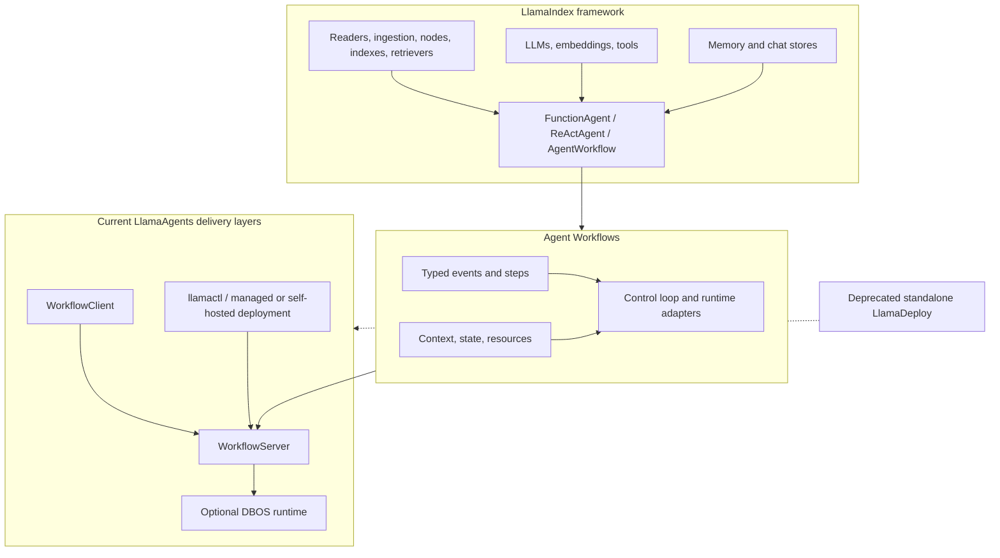

# LlamaIndex and LlamaAgents Engineering Guide

**Research date:** 2026-08-31  
**Status:** Deep, production-focused knowledge area  
**Source snapshot:** LlamaIndex changelog through 2026-08-19 and LlamaAgents repository commit `94f17c9` from 2026-08-22, cross-checked with current official documentation, source, releases, examples, and bounded issue evidence

## What this area is for

Use this area to design, build, deploy, secure, test, or migrate a production system based on LlamaIndex's data/agent framework and the current LlamaAgents/Agent Workflows stack.

The name **LlamaAgents** now covers a current family of workflow, server, client, durability, CLI, and deployment components. It must not be confused with the deprecated standalone **LlamaDeploy** project.

## Stack boundary

The boundaries matter operationally:

- **Agent Workflows** is the async event/step runtime. It can run as a library without LlamaIndex retrieval or the LlamaAgents server.
- **LlamaIndex agents** are workflow-based model/tool loops that integrate with the data framework.
- **`WorkflowServer`** exposes workflows over HTTP and adds persisted handlers/events/ticks through its server runtime.
- **The DBOS adapter** adds database-coordinated recovery and replica ownership; it does not distribute individual steps across worker machines.
- **`llamactl` and deployment components** package and ship applications. Managed LlamaCloud deployments were documented as beta preview at the research date.
- **Conversation Memory, workflow Context, server/DBOS history, artifacts, indexes, and external-effect receipts are different state classes.** Do not collapse them into one blob.

### Sixty-second layer selection

Choose the first row that fully satisfies the requirement. Moving downward adds an operational contract; it does not automatically make the layers above it safer.

| Requirement | Smallest primary layer | Add the next layer only when |
|---|---|---|
| Parse, index, retrieve, or synthesize over documents | LlamaIndex data framework | A multi-step run needs explicit state, waits, branches, retries, or recovery |
| Run an in-process event/step pipeline | Agent Workflows | Another process needs to submit, inspect, stream, cancel, or resume it |
| Expose a remote workflow lifecycle | `WorkflowServer` + client | Process restart must preserve handlers/events/state, or replicas must coordinate ownership |
| Recover one server process | SQLite-backed server store | More than one replica must admit and recover durable runs |
| Coordinate durable runs across replicas | DBOS adapter + shared PostgreSQL | One run must distribute heavy tasks across machines—then use an external batch/task system for those tasks |
| Build and deploy an application package | `llamactl` / deployment components | The team accepts the control-plane, operator, tenancy, rollback, and preview-surface obligations |

A document agent can use several rows, but each row must have one reason to exist. For example, retrieval does not need `WorkflowServer`, and a remote API does not by itself need DBOS.

## Read by problem

| Question | Guide |
|---|---|
| How do events, steps, Context, handlers, reducers, runtimes, and resources fit together? | [Architecture and event workflows](01-architecture-and-event-workflows.md) |
| Which agent, model, and tool abstractions should I use? | [Agents, models, and tools](02-agents-models-and-tools.md) |
| How should I build ingestion, indexes, retrieval, RAG, and document lineage? | [Data, RAG, indices, and retrieval](03-data-rag-indices-and-retrieval.md) |
| What belongs in Context, Memory, a chat store, or an artifact store? | [Context, memory, and chat stores](04-context-memory-and-chat-stores.md) |
| How do I model shared state, event contracts, snapshots, and persistence? | [State, events, and persistence](05-state-events-and-persistence.md) |
| Should I use `AgentWorkflow`, an orchestrator agent, or a custom Workflow? | [Multi-agent patterns](06-multi-agent-patterns.md) |
| How do streaming, cancellation, waits, approvals, and human input behave? | [Streaming, human-in-the-loop, and control](07-streaming-human-in-the-loop-and-control.md) |
| What exactly do the server, client, stores, executors, and DBOS adapter do? | [LlamaAgents server, clients, and executors](08-llamaagents-server-clients-and-executors.md) |
| What repeats after failure and how do I handle concurrency and recovery? | [Durability, reliability, concurrency, and recovery](09-durability-reliability-concurrency-and-recovery.md) |
| How should I trace, evaluate, test, and debug the system? | [Observability, evaluation, testing, and debugging](10-observability-evaluation-testing-and-debugging.md) |
| How do I secure the server, retrieval, tools, tenants, state, and data lifecycle? | [Security, tenancy, and data governance](11-security-tenancy-and-data-governance.md) |
| How do I deploy, scale, pin, upgrade, migrate from old agents/LlamaDeploy, or choose an alternative? | [Deployment, scaling, versioning, and migration](12-deployment-scaling-versioning-and-migration.md) |

For a short selection summary, see the existing [LlamaIndex and LlamaAgents overview](../llamaindex-and-llamaagents.md). The [research packet](../../research/packets/llamaindex-llamaagents-deep-dive.md) records evidence boundaries, version observations, disagreements, and refresh triggers behind this area.

Use the repository's application-owned [agent state and event contract](../../runtime/agent-state-and-event-contracts.md) to unify workflow, server, client, and DBOS identities and terminal outcomes. Their native stores and event types are adapters to that contract, not substitutes for an effect ledger or product protocol.

## Recommended learning path

### Building a new document agent

1. Read [architecture](01-architecture-and-event-workflows.md) and [agents/models/tools](02-agents-models-and-tools.md).
2. Design the [data and retrieval plane](03-data-rag-indices-and-retrieval.md).
3. Assign ownership across [Context, Memory, chat stores, artifacts, and effects](04-context-memory-and-chat-stores.md).
4. Start with one agent. Add [multi-agent orchestration](06-multi-agent-patterns.md) only when an evaluated decomposition wins.
5. Define [event/state contracts and persistence](05-state-events-and-persistence.md) before adding recovery.
6. Add [streaming and HITL](07-streaming-human-in-the-loop-and-control.md) as a versioned application protocol.
7. Select the smallest [server/runtime/deployment shape](08-llamaagents-server-clients-and-executors.md) that meets the requirement.
8. Prove [recovery](09-durability-reliability-concurrency-and-recovery.md), [evaluation/operations](10-observability-evaluation-testing-and-debugging.md), and [security/tenancy](11-security-tenancy-and-data-governance.md) before production traffic.

### Migrating an existing system

Start with [deployment, versioning, and migration](12-deployment-scaling-versioning-and-migration.md), then read the state and runtime guides for every persisted or in-flight surface. Do not mechanically rename packages:

- legacy LlamaIndex agent runners/workers moved to workflow-based agents;
- Workflows 2.0 removed deprecated execution/checkpointing/sub-workflow surfaces;
- older memory classes are deprecated in favor of the current `Memory` design;
- the old standalone LlamaDeploy architecture is deprecated and wire/state compatibility with current LlamaAgents must not be assumed.

## Production invariants

These principles recur across the guides because they determine whether the system survives real load and failure:

1. **Use deterministic workflow structure for known dependencies.** Reserve model-selected tool calls and handoffs for decisions that genuinely require a model.
2. **Keep durable events/state small and serializable.** Put models, clients, retrievers, indexes, and other live dependencies in resources; put large content in an artifact/document store by immutable reference.
3. **Assume at-least-once step execution around failure boundaries.** External writes require stable operation IDs, idempotency, receipts, and reconciliation.
4. **Make concurrency ownership explicit.** Use atomic state edits and one deterministic reducer for parallel results; protect every downstream dependency with its own bulkhead.
5. **Treat Memory as model context, not as the audit or artifact system.** Preserve raw tool results, citations, source nodes, and provider evidence separately when they matter.
6. **Treat `WorkflowServer` as an embeddable application component.** Add authentication, tenant authorization, restrictive CORS, quotas, request limits, and operator-route isolation.
7. **Version more than Python packages.** Record workflow/state/event schemas, prompts, tool contracts, model policy, corpus/index version, serializer, and build digest.
8. **Drain or migrate old durable runs deliberately.** Do not silently resume old state under incompatible code.
9. **Evaluate the simplest baseline.** A single agent, deterministic workflow, retrieval pipeline, or custom loop often beats a multi-agent design on latency, cost, and reliability.

## Minimum production proof

- [ ] The exact package lock, repository/build digest, prompts, model policy, tool schemas, and workflow schema are recorded.
- [ ] Retrieval authorization is enforced before top-k results and tested across tenants.
- [ ] Context, Memory, artifacts, indexes, effects, and telemetry have separate lifecycle owners.
- [ ] Parallel steps cannot lose or timing-order shared-state updates.
- [ ] Timeouts, retries, cancellation, provider limits, and total run budgets are bounded end to end.
- [ ] Crash tests cover before/after model, retrieval, tool, effect, event, state, and snapshot persistence.
- [ ] Streaming reconnect and HITL response correlation work after process/replica failure.
- [ ] Old code remains available long enough to drain incompatible queued/in-flight runs.
- [ ] Bare debugger/handler/event APIs are not exposed without authorization.
- [ ] Offline evaluation and load/cost tests beat an appropriate simpler baseline.

## Evidence policy and freshness

Official documentation and current source are the foundation. Changelogs and releases establish migration/version facts. Bounded GitHub issues and discussions are used only to derive adoption tests and failure hypotheses; they do not establish failure frequency.

Where official prose disagreed with current source, the guides call out the disagreement instead of hiding it. For example, the researched server implementation and architecture support persisted sequence cursors and SSE resume, while an older paragraph in the deployment page still described a single-consumer, non-recoverable stream. Treat that as a versioned protocol to test, not a timeless guarantee.

Refresh this entire area when any of the following occurs:

- a major/minor release of `llama-index-core`, `llama-index-workflows`, server, client, DBOS adapter, or `llamactl` affects used surfaces;
- LlamaAgents server/client packages reach 1.0 or change the HTTP/event protocol;
- managed LlamaAgents deployment exits beta or publishes a materially new runtime/tenancy/SLO contract;
- Workflows changes its reducer, event collections, Context serializer, resources, retries, cancellation, or runtime adapter boundary;
- DBOS changes ownership, fingerprints, queues, recovery, or idle release;
- LlamaIndex replaces current agent, Memory, message-block, ingestion, index, or observability APIs;
- a security advisory affects any core or installed integration package.
