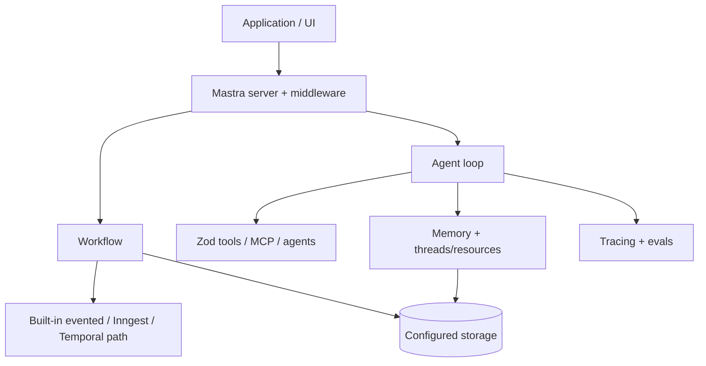
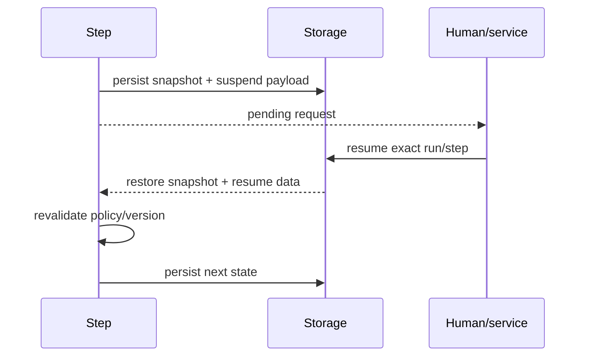

# Mastra in Production

**Research date:** 2026-08-31  
**Status:** Research-backed technology guide  
**Scope:** Current TypeScript agents, tools, memory, workflows, server/storage, and durable-engine surfaces; experimental networks remain maturity-labeled

## Bottom line

Choose Mastra when a TypeScript team wants an integrated platform for agents, typed tools, MCP, memory, workflows, server/storage, tracing/evals, and newer durable execution paths. Its breadth can reduce integration work, but it also makes package and state seams the primary risk.

Pin and test the full capability profile: core, provider/AI SDK adapter, storage, server, workflow engine, memory, and UI client. Keep resource authorization, effect identity, and application run discovery explicit even when framework services exist.

## Stack model

Do not attribute one engine’s queue, retry, or replay semantics to another.

## Agent, workflow, or network

| Shape | Choose for | Boundary |
|---|---|---|
| Agent | Open-ended model/tool loop | Total loop limits and effect policy stay application-owned |
| Workflow | Known steps, branches, parallelism, waits | Version state/snapshots and make steps replay-safe |
| Agent as workflow step | Bounded pocket of autonomy | Typed input/output and one completion contract |
| Agent network | Dynamic collaboration that beats simpler topology | Experimental/fast-moving; bound delegation and shared state |

Use workflows to encode known control. Agent networks are not a substitute for a DAG the application already understands.

## Snapshot and resume contract

Workflow snapshots capture execution path, step outputs/status, suspended paths/metadata, retries, input, and run ID in configured storage. A suspended step can later resume with new context.

Document whether a resumed step re-enters its handler and which earlier code repeats. Bind resume data to run, step, tool call, proposal hash, actor, expiry, and policy version. Store large values as artifact references.

Current issue history shows why snapshot semantics require a compatibility suite: nested workflow resumes once restarted at the outer first step; parallel suspended `foreach` siblings lost payloads; public state readers lacked recovery fields; some approval resumes could not locate snapshots. Fixed defects remain upgrade tests.

## Approval versus suspension

- **Approval** asks whether a proposed tool action may execute.
- **Suspension** asks for information needed to continue.

Automatic conversational resumption relies on memory and the same message thread. Use it only for low-risk clarification. A high-risk approval should be an application-owned, explicit action against a stored proposal.

Approval-capable tools can force sequential tool execution to prevent a suspension racing a sibling. This conservative behavior can increase latency even when the risky tool is available but not called. Measure the exact version’s concurrency strategy; never disable serialization without a valid multi-suspend state model.

## Concurrency and context isolation

A 2026 issue reproduced silent cross-run context pollution under concurrent `foreach`, and another exposed suspended sibling payload loss. Treat these as mandatory stress fixtures:

- concurrent parent runs with parallel children;
- same storage and same/different thread/resource identities;
- nested workflow and agent calls;
- multiple simultaneous approvals;
- cancellation/resume while siblings complete;
- tenant markers checked at every step and tool.

Prefer immutable per-iteration inputs and a single reducer. Validate tenant/run/step IDs in output before merge so corruption fails visibly.

## Durable engine and shutdown boundary

Mastra can move agent loops into evented/durable execution and integrate with engines such as Inngest and Temporal. For each selected engine prove:

| Concern | Evidence |
|---|---|
| Admission | Durable enqueue, dedupe ID, concurrency/fairness |
| Recovery | Crash points, lease/ownership, replayed step behavior |
| Retry | One owner, backoff, total deadline, non-retryable mapping |
| Streaming | Replay/reconnect, final event, backpressure |
| Suspension | Discoverable pending runs and stable public resume fields |
| Deployment | Old state pin/migrate/drain and schema compatibility |
| Shutdown | Stop admission, persist/suspend/drain, then close storage |

A current issue reports SIGTERM closing a PostgreSQL pool before in-flight durable runs could persist, causing the durability mechanism itself to fail. Graceful shutdown order and forced-kill recovery belong in release gates, not only unit tests.

Do not use private snapshot layout as the product UI contract. Maintain an application run index mapping tenant/thread to active and pending runs with stable event IDs.

## RuntimeContext, memory, and security

RuntimeContext supports typed per-request dependency injection for model, tools, instructions, and other behavior. It prevents globals; it does not authorize data. Derive available tools from identity, then have each tool enforce action and resource policy again.

Separate conversation history, working memory, semantic recall, workflow snapshot, and domain record. Apply tenant/resource scopes to every memory query. Cap retrieved/writable memory, record provenance, and prevent model-authored memory from altering immutable policy.

MCP servers and agents exposed as tools extend the trust boundary. Pin servers, constrain transport/egress, validate tool schemas/results, and propagate user/tenant identity rather than a platform-wide credential.

## Operational acceptance tests

- [ ] Pin and record every core/server/storage/provider/engine/client version.
- [ ] Resume nested and parallel suspensions after process and deployment restart.
- [ ] Run cross-tenant concurrent `foreach` stress with invariant markers.
- [ ] SIGTERM during model, tool, snapshot, stream, and terminal cleanup; then SIGKILL.
- [ ] Discover active/suspended runs after browser and server restart without private state parsing.
- [ ] Retry/reconnect UI streams without duplicate or orphan tool parts.
- [ ] Reauthorize exact approval proposals after resource/version changes.
- [ ] Compare built-in, Inngest, and Temporal behavior only if each is a real candidate.
- [ ] Bound loops, parallel calls, networks, result size, tokens, cost, and wall time.
- [ ] Verify RuntimeContext secrets never become prompt, trace, error, or stored snapshot data.

## Choose it when

- TypeScript/full-stack integration and a unified agent/workflow platform remove real work;
- the team accepts a fast release cadence and can own cross-package compatibility tests;
- built-in memory, observability, server, and deployment interfaces fit the platform;
- authorization, effect safety, and run discovery remain explicit application contracts.

## Prefer another shape when

- AI SDK Core plus a small custom loop is sufficient;
- a mature external workflow engine already owns process state and only bounded agent activities are needed;
- Python/data-centric integrations dominate;
- experimental networks or rapidly evolving durable surfaces are hard requirements under a conservative support policy.

## Primary sources and failure-test leads

- [Mastra core package](https://github.com/mastra-ai/mastra/tree/main/packages/core), [workflow snapshots](https://mastra.ai/reference/workflows/snapshots), and [current releases](https://github.com/mastra-ai/mastra/releases)
- [Approval versus suspension](https://mastra.ai/blog/human-in-the-loop-when-to-use-agent-approval), [dynamic RuntimeContext](https://mastra.ai/blog/dynamic-agents), and [tools/MCP](https://mastra.ai/docs/agents/mcp-guide)
- Adoption tests from [concurrent context #12029](https://github.com/mastra-ai/mastra/issues/12029), [parallel suspend payload #15552](https://github.com/mastra-ai/mastra/issues/15552), [recovery state API #16044](https://github.com/mastra-ai/mastra/issues/16044), [active-run index #17998](https://github.com/mastra-ai/mastra/issues/17998), and [shutdown durability #21193](https://github.com/mastra-ai/mastra/issues/21193)

See [evolving ecosystem selection](../comparisons/evolving-agent-framework-ecosystems.md) and the [research packet](../research/packets/framework-lifecycle-and-second-wave.md).
