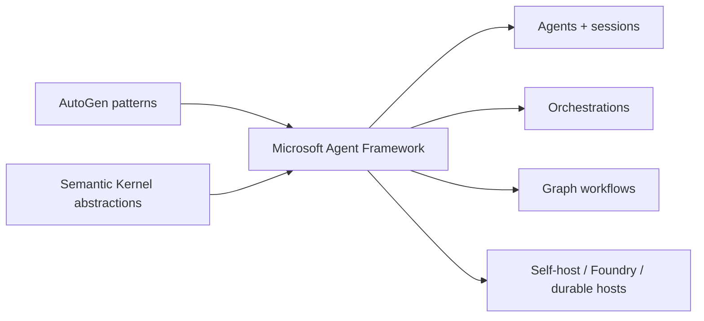
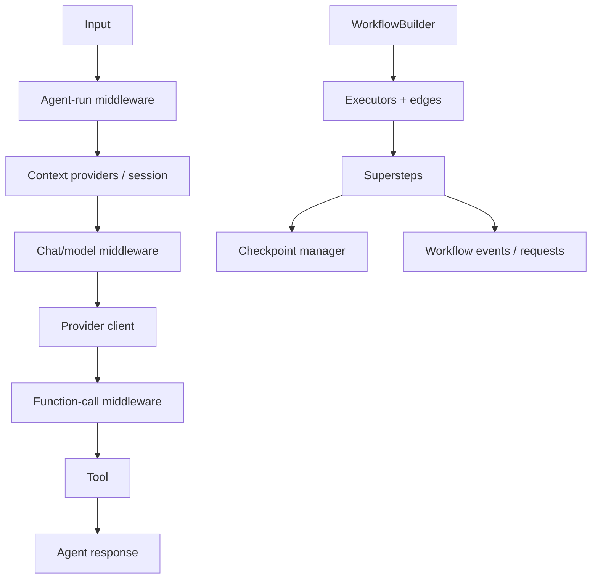
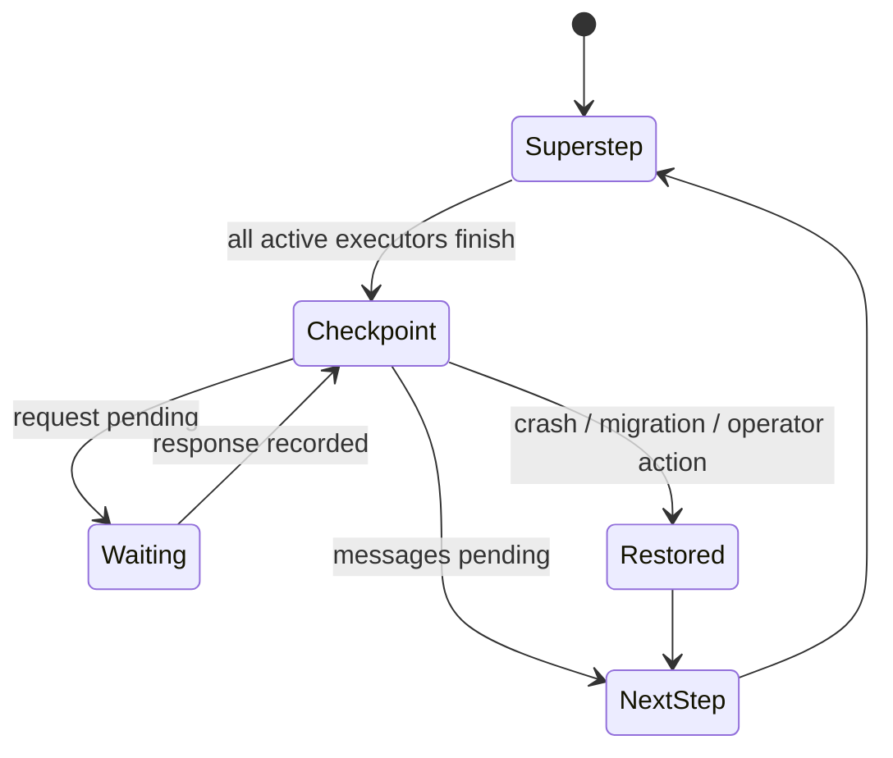

# Microsoft Agent Framework in Production

**Research date:** 2026-08-31
**Status:** Research-backed technology guide  
**Scope:** Agent Framework Python `1.16.x`, .NET `1.19.x`, and Go public preview agents, middleware, workflows, checkpoints, integrations, and hosting

## Bottom line

Choose Microsoft Agent Framework when you need a provider-neutral agent abstraction plus explicit graph workflows, middleware, sessions, OpenTelemetry, and Microsoft hosting/integration paths—especially in .NET, Python, or Go estates.

Treat maturity as **language + package + feature**. The checked Go surface is explicitly **public preview**; declarative agents, RAG, CodeAct, handoff orchestration, Foundry managed hosting, Durable Extension, and several evaluation/storage integrations were not yet available there. Python and .NET core/workflow packages have stable releases, but feature-stage markers still label APIs such as FIDES, Agent Hooks, evals, functional workflows, session stores, and selected tool surfaces experimental. Integrations and hosting adapters span released, beta, alpha, release-candidate, and preview tiers. “Agent Framework 1.x” is not one uniform stability guarantee.

## Position in the Microsoft ecosystem

Microsoft describes Agent Framework as the successor direction combining AutoGen’s agent patterns with Semantic Kernel’s enterprise abstractions. That does not make migration automatic.

Inventory provider clients, thread/session formats, middleware/filters, plugins, orchestration semantics, and persisted state before migrating. Keep an old-runtime replay path for in-flight work until compatibility is proven.

## Agent pipeline versus workflow runtime

Use an agent for an open-ended model/tool loop. Use a workflow when explicit routing, fan-out/fan-in, shared state, requests, or resumption is part of the business control flow. An agent can be a node; do not hide the entire business process in one opaque node.

## Checkpoint semantics

A workflow executes messages in supersteps. At the end of a completed superstep, a checkpoint can capture:

- executor state;
- messages pending for the next superstep;
- pending human requests and responses;
- shared workflow state.

Restoring a checkpoint re-emits pending requests so the application can resume the interaction. Recent Python releases added entry checkpoints for original input and delivered human responses, improving full replay while changing checkpoint/event ordering.

The checkpoint boundary is not a database transaction around tool effects. If a tool committed before the superstep checkpoint and the process failed, restore may encounter an ambiguous effect. Use operation IDs, an effect ledger, reconciliation, and the application-owned [agent state and event contract](../runtime/agent-state-and-event-contracts.md).

Persist these alongside a checkpoint:

- framework and package-set versions;
- workflow graph signature and executor schema versions;
- model/provider and tool-definition fingerprints;
- policy/configuration version;
- external effect receipts;
- encryption/key and permitted deserialization types.

Checkpoint deserialization is a security boundary. Use restricted formats and explicit type allowlists; never treat an untrusted checkpoint as inert data.

## Middleware without transcript corruption

Agent Framework provides agent-run, streaming, function, and model/chat middleware. It is a strong fit for telemetry, identity propagation, policy, caching, and result transformation, but ordering and short-circuit behavior are part of correctness.

| Middleware action | Required invariant |
|---|---|
| Reject before model | No model/tool work has started; rejection is traceable |
| Reject function call | Transcript receives a syntactically valid function result/rejection |
| Replace result | Original result retained in protected audit evidence if needed |
| Retry provider call | Same deadline and attempt budget; uncertain delivery classified |
| Terminate stream | Child/provider/tool work is cancelled and final state is coherent |

Official documentation warns that terminating the function loop can leave a function call without a result in chat history. Build middleware contract tests that parse the final transcript and checkpoint after every short circuit.

## Provider neutrality is conditional

The standard Agent can use multiple model clients; direct agent types can connect to managed or remote runtimes such as Foundry, A2A, GitHub Copilot, or Claude. This supports architectural substitution, but each client controls:

- tool-call shape and parallelism;
- hosted tools and background-response support;
- structured-output guarantees;
- conversation/server-state behavior;
- usage and model identity reporting;
- retry, streaming, cancellation, and approval semantics.

Keep core domain inputs, outputs, tools, state, and evaluation fixtures independent of provider-specific message types. A second-provider smoke test is more valuable than an abstraction-interface claim.

## Human input and approvals

Custom workflows use request ports; orchestrations can surface function approval requests. Checkpoints retain pending requests and re-emit them after restore. This is a sound control-plane shape when the application also:

1. stores exact proposed action, target, arguments, requester, and policy version;
2. expires or revokes stale decisions;
3. reauthorizes immediately before the effect;
4. executes with a stable operation ID;
5. records the effect outcome outside the model transcript.

Test nested agents and handoff orchestrations separately. Current issue history shows that approval/middleware visibility and checkpoint restore have not always been uniform at nested boundaries.

## Package and release discipline

The researched Python `1.16.0` and .NET `1.19.0` core lines are stable while independently released integrations and feature-stage markers vary. This means semantic versioning must be applied to the exact package set and feature maturity, not the brand or meta-package alone. Use the AutoGen migration guide for behavioral mapping, but verify current provider and tool availability against current package registries—the researched migration tables contained stale planned/available distinctions.

Use a compatibility manifest:

| Field | Example meaning |
|---|---|
| Core/runtime | Exact C#, Python, or Go package release |
| Provider adapter | OpenAI, Anthropic, Gemini, Foundry, or remote-agent package |
| Workflow/orchestration | Exact version and stability tier |
| UI/protocol adapter | AG-UI/A2A/ChatKit version and missing core capabilities |
| Checkpoint format | Encoder version and allowed types |
| Hosting extension | Foundry, Durable Task, Azure Functions, or self-host revision |

Do not independently float these dependencies in production.

## Hosting and durability

- **Self-hosting** gives full control over network, identity, process lifetime, stores, and scaling.
- **Foundry Hosted Agents** is a GA service, while the researched Python/.NET MAF Foundry hosting adapters remain beta/preview and long-running resilience remains preview. Track service, adapter, and optional resilience maturity separately.
- **Durable Task/Azure Functions integrations** can own failure recovery and long waits; keep agent calls as bounded activities and effect boundaries explicit.
- **Core checkpointing** supports workflow resume but does not by itself provide a distributed queue, leases, exactly-once effects, or operator repair service.

## Operational acceptance tests

- [ ] Pin and record every core, provider, orchestration, protocol, persistence, and hosting package.
- [ ] Restore checkpoints across the exact planned upgrade, including old in-flight workflows.
- [ ] Crash before, during, and after a superstep tool effect; reconcile instead of blind replay.
- [ ] Exercise concurrent branches, shared state, handoff, group chat, and request/response ordering.
- [ ] Approve a nested tool, restart, restore, and confirm original arguments and policy scope.
- [ ] Short-circuit every middleware layer and validate transcript/checkpoint invariants.
- [ ] Verify cancellation reaches model clients, tools, executors, and background work.
- [ ] Test the exact provider endpoint: chat vs Responses vs managed agent can differ.
- [ ] Confirm telemetry correlation and sensitive-content settings across all adapters.
- [ ] Threat-test checkpoint deserialization, MCP sampling, tool results, and cross-tenant IDs.

## Choose it when

- The organization is invested in .NET/Python/Go and Microsoft operational tooling.
- Provider substitution and remote-agent adapters are valuable, with understood parity limits.
- Explicit multi-agent workflow graphs and checkpointed human requests fit the use case.
- Middleware and context-provider composition match existing platform architecture.

## Prefer another shape when

- A small provider-native loop is sufficient.
- The team cannot absorb package-matrix and checkpoint migration testing.
- The required adapter lacks a core capability such as checkpointing or nested approval.
- A mature general-purpose workflow engine already owns the process and only needs bounded model activities.
- AutoGen/Semantic Kernel migration cost exceeds demonstrated value.

## Sources and related guides

Primary sources: [overview](https://learn.microsoft.com/en-us/agent-framework/overview/), [agent concepts](https://learn.microsoft.com/en-us/agent-framework/concepts/agents/), [workflows](https://learn.microsoft.com/en-us/agent-framework/concepts/workflows/), [checkpoints](https://learn.microsoft.com/en-us/agent-framework/workflows/checkpoints), [human in the loop](https://learn.microsoft.com/en-us/agent-framework/workflows/human-in-the-loop), [middleware](https://learn.microsoft.com/en-us/agent-framework/agents/middleware/), [self-hosting](https://learn.microsoft.com/en-us/agent-framework/hosting/self-hosting/), [Python changelog](https://github.com/microsoft/agent-framework/blob/main/python/CHANGELOG.md), and [durable workflows](https://devblogs.microsoft.com/dotnet/durable-workflows-in-microsoft-agent-framework/).

- [Provider-native framework selection](../comparisons/provider-native-agent-frameworks.md)
- [Custom loop vs framework vs workflow engine](../comparisons/custom-loop-vs-framework-vs-workflow-engine.md)
- [Go agent runtimes](../languages/go-agent-runtimes.md)
- [Go vs Python vs TypeScript/Node.js](../comparisons/go-vs-python-vs-typescript-node-agent-runtimes.md)
- [Durable execution](../runtime/durable-execution.md)
- [Multi-agent topologies](../orchestration/multi-agent-topologies.md)
- [Microsoft Agent Framework production playbook](microsoft-agent-framework/README.md)
- [Deep-dive research packet](../research/packets/microsoft-agent-framework-deep-dive.md)
- [Provider-native ecosystem packet](../research/packets/provider-native-agent-frameworks.md)
