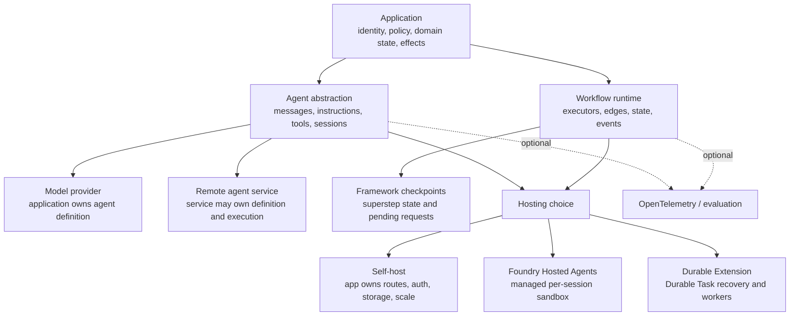

# Microsoft Agent Framework Production Playbook

**Research date:** 2026-08-31  
**Status:** Deep, research-backed guide cluster  
**Primary scope:** Microsoft Agent Framework Python 1.16.x and .NET 1.19.x  
**Secondary scope:** Go public preview at repository commit `6c58ac4` (2026-08-29); verify the moving pseudo-version before adoption

## Bottom line

Microsoft Agent Framework (MAF) is a family of agent, workflow, integration, and hosting components—not one runtime with one maturity level. The Python and .NET core agent/workflow packages are stable. Many providers, protocol adapters, declarative features, developer tools, and hosting packages remain alpha, beta, release candidate, or preview. Go is a separate public-preview implementation with useful core coverage but material gaps.

The most important production decision is to name the layer that owns each guarantee:

A workflow checkpoint is not a distributed transaction. A background response is not crash recovery. A session ID is not authorization. A protocol adapter is not a host. Foundry Hosted Agents being generally available does not make every MAF hosting package stable.

## Reading paths

| Goal | Start here | Continue with |
|---|---|---|
| Understand the ecosystem | [Ecosystem boundaries and architecture](ecosystem-boundaries-and-architecture.md) | [Package maturity and migration](package-maturity-migration-limitations-and-alternatives.md) |
| Build a single agent | [Agents, providers, messages, and instructions](agents-providers-messages-and-instructions.md) | [Tools, functions, MCP, and structured output](tools-functions-mcp-and-structured-output.md) |
| Add context and policy | [Middleware, context, sessions, and memory](middleware-context-sessions-and-memory.md) | [Security, identity, tenancy, and data](security-identity-tenancy-and-data.md) |
| Build deterministic orchestration | [Workflows, executors, edges, and state](workflows-executors-edges-and-state.md) | [Checkpoints, HITL, resume, and durability](checkpoints-human-input-resume-and-durability.md) |
| Build multi-agent behavior | [Multi-agent orchestration patterns](multi-agent-orchestration-patterns.md) | [Streaming, events, and protocols](streaming-events-and-protocols.md) |
| Deploy and operate | [Hosting, deployment, scaling, and operations](hosting-deployment-scaling-and-operations.md) | [Reliability, cancellation, retries, and effects](reliability-cancellation-retries-and-effects.md) |
| Verify quality | [Telemetry, evaluation, testing, and debugging](telemetry-evaluation-testing-and-debugging.md) | [Security, identity, tenancy, and data](security-identity-tenancy-and-data.md) |

## Guide map

1. [Ecosystem boundaries and architecture](ecosystem-boundaries-and-architecture.md)
2. [Agents, providers, messages, and instructions](agents-providers-messages-and-instructions.md)
3. [Tools, functions, MCP, and structured output](tools-functions-mcp-and-structured-output.md)
4. [Middleware, context, sessions, and memory](middleware-context-sessions-and-memory.md)
5. [Workflows, executors, edges, and state](workflows-executors-edges-and-state.md)
6. [Checkpoints, human input, resume, and durability](checkpoints-human-input-resume-and-durability.md)
7. [Streaming, events, and protocols](streaming-events-and-protocols.md)
8. [Multi-agent orchestration patterns](multi-agent-orchestration-patterns.md)
9. [Hosting, deployment, scaling, and operations](hosting-deployment-scaling-and-operations.md)
10. [Telemetry, evaluation, testing, and debugging](telemetry-evaluation-testing-and-debugging.md)
11. [Reliability, cancellation, retries, and effects](reliability-cancellation-retries-and-effects.md)
12. [Security, identity, tenancy, and data](security-identity-tenancy-and-data.md)
13. [Package maturity, migration, limitations, and alternatives](package-maturity-migration-limitations-and-alternatives.md)

The evidence ledger, source-resolution rules, contradictions, and bounded issue register are in the [deep-dive research packet](../../research/packets/microsoft-agent-framework-deep-dive.md).

Use the repository's application-owned [agent state and event contract](../../runtime/agent-state-and-event-contracts.md) to normalize MAF sessions, workflow checkpoints, requests, stream cursors, hosted work, and Durable Extension outcomes. Those native mechanisms do not replace product identity, terminal invariants, approval evidence, or the effect ledger.

## Production invariants

- Bind every session, checkpoint, approval, conversation, task, and stream cursor to an authenticated tenant and subject before loading it.
- Treat model output, tool arguments/results, retrieved context, serialized sessions, and restored checkpoints as untrusted input.
- Authorize and validate inside every effectful tool; human approval is an additional control, not authorization.
- Persist resumable state only after the applicable run or stream reaches a known settlement boundary.
- Give each request a fresh workflow/executor graph unless every shared executor implements the documented reset contract.
- Give every external effect a stable operation ID and make retry/recovery safe at the domain boundary.
- Put limits on model/tool iterations, wall time, tokens, bytes, fan-out, concurrent sessions, retained history, polling, and spend.
- Version agent instructions, tool schemas, workflow topology, checkpoint format, provider configuration, policy, and deployment together.
- Pin exact package versions across independently released components and run approval, checkpoint, streaming, and provider conformance tests before upgrades.
- Never infer Python/.NET/Go parity from a shared concept name.

## Verified language and core maturity snapshot

| Language | Checked distribution | Checked state | Practical interpretation |
|---|---|---|---|
| Python | `agent-framework==1.16.0`, Python `>=3.10` | Core/meta stable; extensions vary | Use `python/PACKAGE_STATUS.md` plus feature decorators, not the meta-package version alone |
| .NET | `Microsoft.Agents.AI==1.19.0`; `Microsoft.Agents.AI.Workflows==1.19.0` | Core/workflows stable; integrations vary | Hosting, Foundry, Anthropic, DevUI, and declarative surfaces have different prerelease/stable states |
| Go | module pseudo-version `v0.0.0-20260829074433-6c58ac4d9c8d`, `go 1.26.0` | Public preview, separate repository | Core agents, middleware, workflows, checkpoints, A2A/AG-UI/MCP exist; no stable semantic-version release was verified |

This is a time-stamped observation, not an evergreen compatibility promise.

## Refresh triggers

Refresh this cluster when any of the following changes:

- Python `PACKAGE_STATUS.md`, feature-stage decorators, or a Python/.NET core minor release;
- Go receives a stable tag, moves into the upstream repository, or closes a major parity gap;
- self-hosting, Foundry hosting integration, AgentServer protocol, or Durable Extension reaches a new lifecycle stage;
- checkpoint serialization, entry-checkpoint, approval resume, event, or session persistence semantics change;
- FIDES or Agent Hooks change maturity or language availability;
- a provider changes hosted-tool, background-response, conversation, or structured-output behavior.

## Primary starting sources

- [Microsoft Agent Framework overview](https://learn.microsoft.com/en-us/agent-framework/overview/)
- [Official Python/.NET repository](https://github.com/microsoft/agent-framework)
- [Official Go repository](https://github.com/microsoft/agent-framework-go)
- [Agent concepts](https://learn.microsoft.com/en-us/agent-framework/concepts/agents/)
- [Workflow concepts](https://learn.microsoft.com/en-us/agent-framework/concepts/workflows/)
- [Hosting choices](https://learn.microsoft.com/en-us/agent-framework/hosting/)
- [Python package status](https://github.com/microsoft/agent-framework/blob/main/python/PACKAGE_STATUS.md)
- [Python changelog](https://github.com/microsoft/agent-framework/blob/main/python/CHANGELOG.md)
