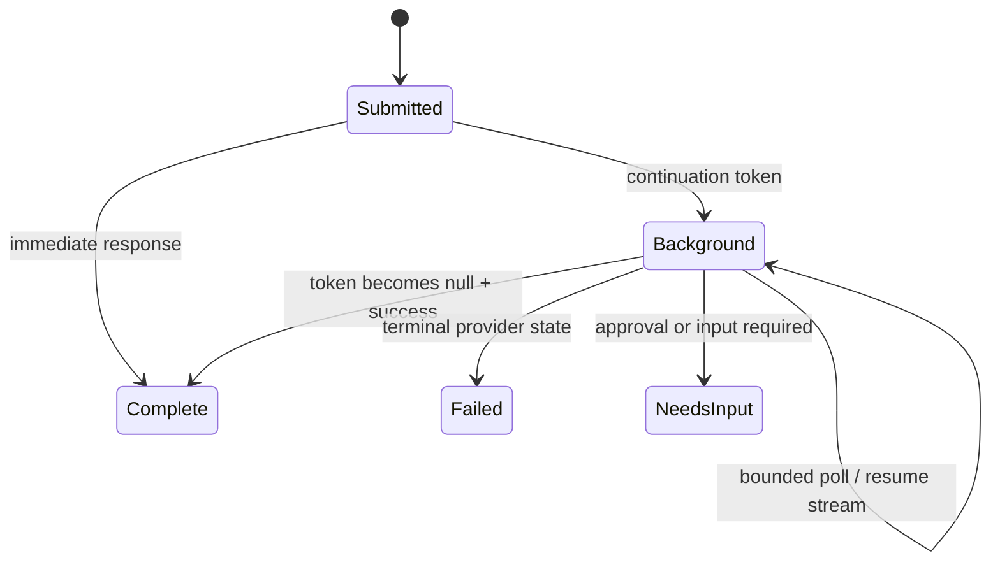

# Agents, Providers, Messages, and Instructions

## Start with the execution owner

Choose between an application-owned chat-client agent and a remote agent service before choosing a class name.

| Question | Model-provider agent | Remote agent service |
|---|---|---|
| Who owns instructions and local tools? | Application | Service may own some or all |
| Who owns the tool loop? | Framework client or provider adapter | Remote runtime |
| Where is conversation state? | Local history, provider conversation, or both | Service-specific session/task/conversation |
| Can local middleware observe everything? | Local model/function seams, subject to hosted tools | No; only exposed remote events/content |
| Typical examples | Azure OpenAI, OpenAI, Foundry inference, Anthropic, Ollama | Foundry Prompt/Hosted Agent, Copilot Studio, GitHub Copilot, Claude Agent SDK, A2A |

The official [provider page](https://learn.microsoft.com/en-us/agent-framework/integrations/by-component/model-providers/) lists capability categories, but availability still depends on client type, model, region, account entitlement, and package version.

## Agent construction contract

A production agent definition should make these values explicit and versioned:

- stable agent name and purpose;
- developer-controlled instructions;
- model/provider client and endpoint class;
- exact tool registry and approval policy;
- context/history providers and their order;
- middleware/hook bundle and order;
- default limits and provider options;
- telemetry and sensitive-data policy;
- configuration version stored with resumable sessions.

Do not resume an opaque session with a different provider or materially different agent configuration. The storage guidance treats sessions as agent/provider-specific application state.

## Instructions are a trust boundary

System/developer instructions must remain developer-controlled. Never interpolate untrusted retrieved text, user content, or tool output into a system message. Put untrusted content in a user/tool/context content item with provenance and enforce tool policy independently of the prompt.

Use layered instructions:

1. invariant role, scope, and prohibited behavior;
2. tool-use guidance that describes, but does not replace, authorization;
3. dynamic trusted application context;
4. user input and retrieved evidence as explicitly untrusted content.

Keep prompts short enough to audit. Record an instruction version or content hash in traces and eval fixtures.

## Messages and content

MAF responses are richer than text. Preserve typed content through the application boundary:

| Content category | Why it matters |
|---|---|
| Text and multimodal data | Rendering and provider conversion differ |
| Function call/result | Approval, correlation, retry, and audit need call IDs |
| Reasoning/metadata | May be unavailable, sensitive, or provider-specific |
| Hosted tool output | Execution occurred outside the local function seam |
| Error/usage/citations | Terminal outcome, billing, and provenance |
| Approval request/response | Must retain occurrence identity and session binding |

In .NET, agents use Microsoft.Extensions.AI message/content abstractions. Python and Go have their own models. Conversion to a provider or protocol can be lossy; the [running agents](https://learn.microsoft.com/en-us/agent-framework/agents/running-agents) guidance should be tested with the content types the product actually uses.

Do not implement `final_text = concat(all_chunks)` as the only record. Assemble a typed response, preserve correlation IDs, distinguish replace/delta semantics, and store the provider-native identifier needed for continuation.

## Conversation modes

Provider conversations and local history are separate choices:

| Mode | Request behavior | Main risk |
|---|---|---|
| Local history | Application loads/sends relevant prior messages | Unbounded context, racey concurrent turns |
| Service-managed history | Provider/service holds a conversation ID | Vendor-scoped IDs, retention/deletion semantics |
| Custom history provider | Application store selects/compacts history | Tenant isolation, consistency, schema migration |
| Stateless | Each call carries all needed input | Replay size and caller omissions |

Do not enable both local replay and service history unless the specific client documents that composition. Python storage guidance explicitly disallows some mixed modes because they duplicate conversation content.

Serialize session state only after a successful run/settled stream. For concurrent messages to one conversation, serialize turns or implement an explicit optimistic-concurrency policy; do not let two tool loops independently append to the same logical history.

## Provider capability negotiation

Treat the provider matrix as a discovery index, not a runtime contract. Build a small conformance suite per selected provider/client/model:

- plain non-streaming and streaming text;
- multimodal inputs used by the product;
- local function tool with invalid and valid arguments;
- parallel tool calls if enabled;
- structured output and schema violation;
- hosted tool events if used;
- usage and finish-reason mapping;
- cancellation and timeout behavior;
- session continuation after process restart;
- background response polling/resume if supported.

The current provider matrix reports broad support for function tools across common providers. Hosted capabilities differ sharply. For example, Chat Completions does not expose the same file-search/code-interpreter/hosted-MCP surface as Responses, and remote agent services configure capabilities on the remote runtime.

## Structured response is not semantic correctness

Schema-constrained output improves parsing, not truth. Validate:

- required business invariants and cross-field relationships;
- authorization-relevant identifiers against server-side data;
- length, range, enum, and resource bounds;
- cited evidence and freshness where required;
- model refusal, truncation, partial streaming, and provider fallback.

Keep a provider-independent domain validator after deserialization. If native structured output is unavailable, decide whether to reject, retry with a bounded repair prompt, or use a deterministic parser; do not silently accept free text as a valid object.

## Background responses

MAF background responses expose provider long-running operations and continuation tokens. Current docs limit the local feature to OpenAI Responses-compatible agents, including Azure OpenAI Responses. They are not framework workflow checkpoints.

Persist the session and last continuation cursor, poll with jitter/backoff, impose a deadline, and expose cancellation only when the selected provider supports it. A continuation token helps reconnect to provider-owned work; it does not prove a local tool effect is safe to repeat or that the hosting process can recover arbitrary application code.

## Failure patterns

| Failure | Root cause | Control |
|---|---|---|
| Duplicate history | Local messages replayed into service-managed conversation | Select one history authority and conformance-test continuation |
| Tool capability missing | Matrix interpreted without client/model entitlement | Startup capability probe and deployment validation |
| Session crosses tenants | Raw session ID accepted from request | Authenticated composite key and authorization before load |
| Prompt controls policy | Tool relies on “do not” instructions | Tool-side validation/authz and approval for high risk |
| Lost response metadata | UI keeps only concatenated text | Typed assembler and event/content persistence |
| Stale session restore | Agent/provider changed | Store config version; migrate or reject explicitly |

## Production checklist

- [ ] Agent and provider/service execution ownership is explicit.
- [ ] Instructions contain no untrusted interpolation.
- [ ] Message/content conversion is tested for every used type.
- [ ] History authority and concurrent-turn policy are documented.
- [ ] Provider features are verified against the exact model and package pin.
- [ ] Background continuation is not described as crash-safe workflow durability.
- [ ] Domain validation runs after structured deserialization.

## Sources

- [Agent concepts](https://learn.microsoft.com/en-us/agent-framework/concepts/agents/)
- [Running agents](https://learn.microsoft.com/en-us/agent-framework/agents/running-agents)
- [Model providers](https://learn.microsoft.com/en-us/agent-framework/integrations/by-component/model-providers/)
- [Agent services](https://learn.microsoft.com/en-us/agent-framework/integrations/m365)
- [Conversation storage](https://learn.microsoft.com/en-us/agent-framework/agents/conversations/storage)
- [Structured outputs](https://learn.microsoft.com/en-us/agent-framework/agents/structured-outputs)
- [Background responses](https://learn.microsoft.com/en-us/agent-framework/agents/background-responses)
