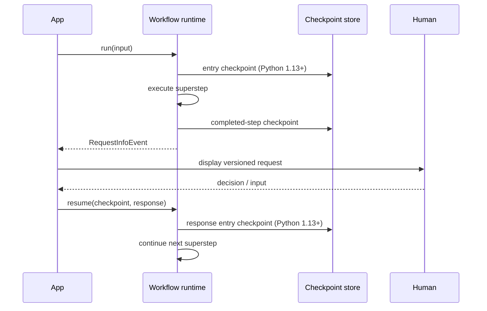
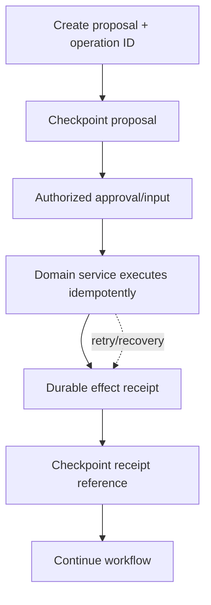

# Checkpoints, Human Input, Resume, and Durability

## Checkpoint semantics

A MAF graph-workflow checkpoint is a snapshot at a workflow execution boundary. At the end of a superstep it can capture:

- executor state contributed through the checkpoint contract;
- pending messages for the next superstep;
- pending requests and responses;
- shared workflow state;
- workflow/runtime metadata needed to resume.

Python 1.13.0 added entry checkpoints before the first superstep and when request responses are delivered, enabling full replay from initial input. That release also changed checkpoint ordering/source details; applications that inspect iteration numbers or IDs need regression tests.



A checkpoint is not:

- a database transaction with an external API;
- proof that a tool effect did or did not occur;
- a general process scheduler;
- automatic cross-version compatibility;
- authorization to resume;
- equivalent to Durable Task history.

## Checkpoint store contract

Use in-memory stores only for tests and disposable local runs. A production store needs:

- authenticated tenant/run partitioning;
- optimistic concurrency or monotonic sequence enforcement;
- atomic write of checkpoint payload and metadata;
- encryption at rest and transport protection;
- type allow-listing and safe deserialization;
- size/retention quotas and lifecycle deletion;
- versioned schema and compatibility gates;
- corruption detection and backup/restore testing;
- metrics for write latency, failures, bytes, and resume age.

Treat checkpoint payloads as untrusted after load. A compromised record could alter message roles, tool requests, routing state, or serialized types. Restrict deserialization to expected types and validate the reconstructed state before execution. Python changelogs include recent hardening for type deserialization and checkpoint mutation; pin and test the store implementation.

## Human input with request ports

Workflow HITL uses typed request/response handling. An executor sends a request through a `RequestPort`; the run emits a `RequestInfoEvent` and waits for an external response. Pending requests are included in checkpoints and re-emitted after restore.

Design the request as an application message, not a raw framework object exposed to an untrusted client:

```text
request_id
occurrence_id
workflow_run_id
tenant_id / subject binding (server-side)
request_schema_version
action summary and normalized arguments
resource version / proposal hash
created_at / expires_at
allowed response type
```

On resume:

1. authenticate the responder;
2. authorize the workflow and proposed resource/action;
3. load the checkpoint under the authorized composite key;
4. verify request occurrence, schema, expiry, and proposal hash;
5. re-check current domain permissions and resource version;
6. record the response idempotently;
7. resume once and return the stored outcome for duplicate submissions.

Never trust a client-supplied tenant ID inside the response payload.

## Agent tool approval versus workflow request

Both can pause for a person, but their semantics differ:

| Mechanism | Scope | Payload | Typical use |
|---|---|---|---|
| Tool approval | One proposed local function call | tool call + approval content | Gate a high-risk tool |
| Workflow `RequestPort` | Arbitrary executor decision/input | application-defined request | Review, clarification, external signal |
| Handoff interaction | Conversation control returns to user | agent message/request event | Interactive routing |

The workflow [HITL page](https://learn.microsoft.com/en-us/agent-framework/workflows/human-in-the-loop) notes that sequential, concurrent, and group-chat orchestrations do not pause for arbitrary free-form input by themselves. Add a request port in a custom graph. Handoff is interactive by default.

## Resume behavior

Resume is a new execution attempt from persisted framework state. Assume:

- the process and instance may be different;
- a pending request may be emitted again;
- code after the last durable boundary may run again;
- downstream provider/session state may have advanced;
- deployment code and schemas may have changed;
- a user may submit the response twice;
- the external effect may have committed even if the run did not checkpoint it.

Build a resume gate that checks deployment/workflow/checkpoint schema compatibility. Migrate known old formats explicitly; otherwise reject with an operator-actionable error. Never “best effort” deserialize into a changed topology and continue privileged work.

## Effect-safe checkpoint pattern



The domain service—not the checkpoint store—owns deduplication. On recovery, query the effect receipt by operation ID before calling the external system again. If the external service supports idempotency keys, pass the same key on every attempt.

## Replay and time travel

Replay is useful for debugging and deterministic reprocessing, but unsafe around effects unless effect execution is substituted or deduplicated. A replay environment should default to:

- fake/read-only tools;
- no production credentials;
- isolated tenant namespace;
- recorded provider responses where determinism matters;
- explicit operator acknowledgement before any live effect;
- new trace/run IDs linked to the source checkpoint.

Do not represent a replay as the original execution in audit logs.

## Framework checkpoint versus durable execution

| Capability | Workflow checkpoint | Foundry resilient task | Durable Extension |
|---|---|---|---|
| Captures graph superstep state | yes | reference only/application-owned | integrates graph state with Durable Task |
| Detects dead worker/process | no general scheduler guarantee | lease-based hosted recovery | yes via Durable Task backend |
| Handler reentry | caller/host initiates resume | from handler beginning | orchestration/activity replay model |
| Distributed stateless workers | not by itself | Foundry hosted runtime | yes |
| Durable stream delivery | no general transport guarantee | retained cursor replay for opted-in work | documented reliable streaming |
| External effects exactly once | no | no | no; activities still need idempotency |

Foundry long-running resilience and Durable Extension are covered further in [hosting](hosting-deployment-scaling-and-operations.md) and [reliability](reliability-cancellation-retries-and-effects.md).

## Failure matrix

| Failure | Control |
|---|---|
| Approval card restored but pending registry absent | Persist full occurrence state; test process restart; safely retire terminal stale requests |
| Tool executed before resume stream fails | Durable effect receipt and idempotent response record |
| Concrete content type lost in JSON | Round-trip every content subtype with the actual store/serializer |
| Resume under changed topology | Version gate and explicit migration |
| Same response submitted twice | Idempotent occurrence record with stored terminal outcome |
| Checkpoint grows without bound | Size quota, external artifact store, retention/compaction |
| Cross-tenant checkpoint lookup | Authenticated composite key and authorization before load |

## Production checklist

- [ ] The team can state exactly when a checkpoint is durable.
- [ ] Every stateful executor contributes required state explicitly.
- [ ] Checkpoint storage has concurrency, encryption, type, size, and retention controls.
- [ ] HITL requests are versioned, expiring, authorized occurrences.
- [ ] Resume checks deployment/schema/topology compatibility.
- [ ] External effects use operation IDs and durable receipts.
- [ ] Restart, duplicate response, serialization, and replay tests use the real store.

## Sources

- [Workflow checkpoints](https://learn.microsoft.com/en-us/agent-framework/workflows/checkpoints)
- [Workflow human-in-the-loop](https://learn.microsoft.com/en-us/agent-framework/workflows/human-in-the-loop)
- [Workflow state](https://learn.microsoft.com/en-us/agent-framework/workflows/state)
- [Python changelog](https://github.com/microsoft/agent-framework/blob/main/python/CHANGELOG.md)
- [Durable Extension](https://learn.microsoft.com/en-us/agent-framework/hosting/azure-functions)
- [Foundry long-running resilience](https://learn.microsoft.com/en-us/azure/foundry/agents/concepts/long-running-agent-resilience)
