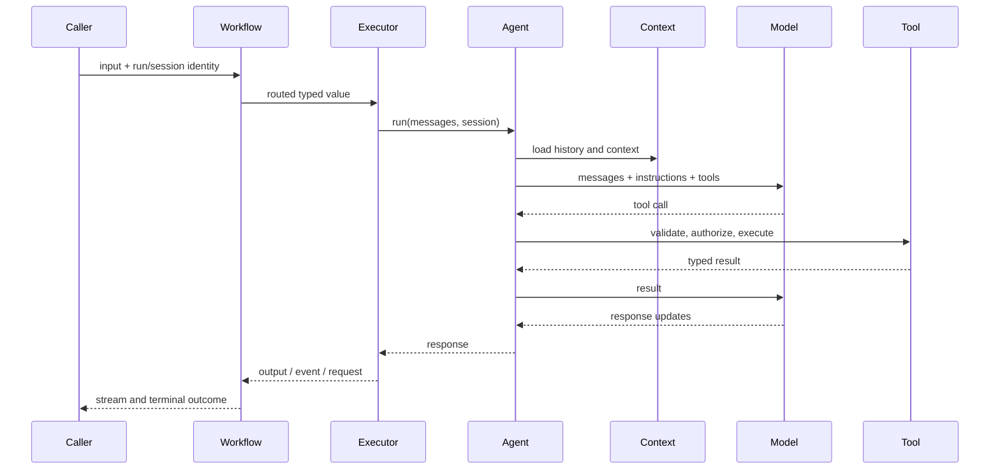
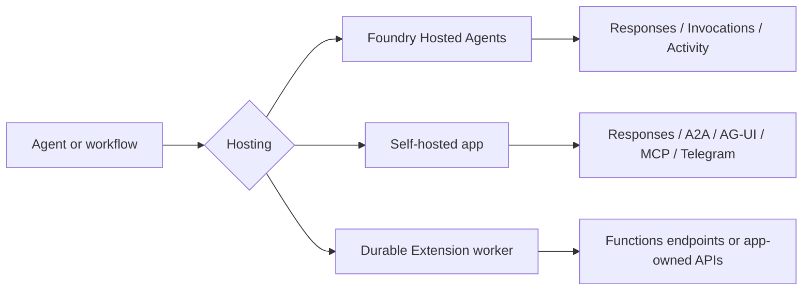

# Ecosystem Boundaries and Architecture

## The useful mental model

Microsoft Agent Framework is compositional. A production system usually combines an application-owned policy/domain layer with one agent implementation, zero or one workflow runtime, one or more model or remote-agent integrations, a hosting model, and optional protocol adapters.

The word “agent” is overloaded across those layers. Resolve it before designing:

| Surface | Owns | Does not automatically own |
|---|---|---|
| Chat-client agent | Instructions, local tools, middleware, context policy, run loop | Durable hosting, domain authorization, provider entitlements |
| Model provider | Inference and provider-hosted capabilities | Application agent definition, local tools, tenancy |
| Agent service | Some combination of remote definition, tools, permissions, sessions, tasks, execution | Application authorization and domain correctness |
| Workflow | Typed routing, executor activation, run state, events, checkpoints | Distributed recovery or exactly-once effects |
| Protocol adapter | Message/event conversion and endpoints/helpers | Authentication, storage, scaling, complete protocol semantics |
| Host | Process/container/server lifecycle | Domain policy or safe tools |
| Durable Extension | Durable Task-backed recovery and distributed workers | Automatically idempotent external effects |

The official [model-provider](https://learn.microsoft.com/en-us/agent-framework/integrations/by-component/model-providers/) and [agent-service](https://learn.microsoft.com/en-us/agent-framework/integrations/m365) pages deliberately separate inference from remote agent runtimes. Preserve that distinction in code and diagrams.

## Agent pipeline versus workflow runtime

An agent pipeline enriches and executes one logical agent run. A workflow routes typed values among executors across supersteps. Putting an agent inside a workflow does not merge these lifecycles.

The [agent pipeline](https://learn.microsoft.com/en-us/agent-framework/agents/agent-pipeline) differs by language:

- .NET `ChatClientAgent`: agent middleware wraps a context layer (`ChatHistoryProvider` and `AIContextProvider`s), then an `IChatClient` and its middleware.
- Python `Agent`: agent middleware and telemetry wrap `RawAgent`; context providers enrich a separate `ChatClient` pipeline whose function-invocation layer owns the local tool loop.
- Go: custom agent middleware wraps history, context providers, provider middleware, and the provider.

Specialized and remote agents can bypass parts of this shape. Do not assume function middleware sees a service-hosted tool or that a remote service uses the local history provider.

## Workflow runtime boundary

All three languages have graph workflows. Python also has an experimental functional API. The graph runtime defines executors, edges, events, workflow state, request ports, checkpointing, and in-process execution. The default workflow runtime is not the AutoGen distributed runtime and is not Durable Task.

At a superstep:

1. active executors receive their inputs;
2. eligible executors can run concurrently;
3. outputs and state updates are staged;
4. routing determines next messages;
5. a checkpoint can capture the completed boundary.

This explains why another executor normally sees a shared-state update on the next superstep, not midway through the current one.

## State has several owners

“Session state” is not one object in a real deployment:

| State | Typical owner | Stable key |
|---|---|---|
| Conversation history | Local history provider or remote model/agent service | authorized conversation/session ID |
| Agent provider state | `AgentSession` / provider-side session | agent + provider + configuration version |
| Context/memory | Context provider and its store | tenant + subject + memory namespace |
| Workflow state | Workflow runtime/checkpointer | workflow run + checkpoint ID |
| Approval request | Agent or workflow request mechanism | run + request/interrupt occurrence |
| Transport task/thread | AG-UI, A2A, Responses, or host | authenticated protocol resource ID |
| Domain record | Application database | domain aggregate/version |

Do not store domain truth only in a session or checkpoint. Do not make one externally supplied identifier address every row. Keep independent deletion, retention, encryption, and migration policies.

## Hosting and protocol are orthogonal

The [hosting overview](https://learn.microsoft.com/en-us/agent-framework/hosting/) explicitly separates where the code runs from how clients call it.

- Foundry Hosted Agents manages a container and per-session sandbox lifecycle.
- Self-hosting leaves routes, identity, authorization, storage, scaling, native client libraries, and lifecycle with the application.
- Durable Extension adds Durable Task infrastructure for C# and Python workers; it is a separate repository and operational model.
- A2A, AG-UI, MCP, Responses, and Telegram describe interaction contracts, not reliability guarantees.

## Language architecture is related, not identical

| Dimension | Python | .NET | Go |
|---|---|---|---|
| Core repository | upstream | upstream | separate repository |
| Core maturity | stable | stable | public preview |
| Agent message model | MAF `Message`/`Content` | Microsoft.Extensions.AI `ChatMessage`/`AIContent` | Go-native message/content types |
| Generic provider seam | client protocol/composition | `IChatClient` ecosystem | provider `RunFunc`/constructors |
| Graph workflows | yes | yes | yes |
| Functional workflows | experimental | no | no |
| Durable Extension | yes, prerelease components | yes, prerelease components | not available |
| Foundry managed hosting integration | beta package | preview package | not implemented |

Types are not wire-compatible merely because their names align. Serialize at an explicit protocol or application boundary, not by copying language-native checkpoint/session blobs.

## Architecture selection

Prefer the smallest layer set that supplies a needed guarantee:

| Need | Smallest suitable surface |
|---|---|
| One model/tool loop | Chat-client agent |
| Remote published agent | Agent-service adapter |
| Explicit deterministic routing | Graph workflow |
| Pause/resume in one workflow runtime | Workflow + durable checkpoint store |
| Managed container and session sandbox | Foundry Hosted Agents |
| Crash recovery across stateless workers | Durable Extension or an application workflow engine |
| Web event transport | AG-UI/Responses adapter plus an actual host |
| Cross-agent protocol | A2A adapter/service |

Avoid a multi-agent workflow where one agent plus deterministic functions is enough. Avoid a workflow when ordinary application code provides clearer control and no checkpoint/HITL graph is required.

## Architecture review checklist

- [ ] Every box is labeled “application,” “framework,” “provider/service,” “host,” or “protocol.”
- [ ] Each state object has one owner, one authenticated namespace, and a retention policy.
- [ ] The team can explain whether each tool runs locally or service-side.
- [ ] Workflow checkpointing and process crash recovery are described separately.
- [ ] Hosting lifecycle and client protocol are selected independently.
- [ ] Language-specific gaps are recorded and tested.
- [ ] External effects remain in domain services with idempotency and authorization.

## Sources

- [Agent concepts](https://learn.microsoft.com/en-us/agent-framework/concepts/agents/)
- [Agent pipeline architecture](https://learn.microsoft.com/en-us/agent-framework/agents/agent-pipeline)
- [Workflow concepts](https://learn.microsoft.com/en-us/agent-framework/concepts/workflows/)
- [Model providers](https://learn.microsoft.com/en-us/agent-framework/integrations/by-component/model-providers/)
- [Agent services](https://learn.microsoft.com/en-us/agent-framework/integrations/m365)
- [Hosting choices](https://learn.microsoft.com/en-us/agent-framework/hosting/)
- [Go .NET feature comparison](https://github.com/microsoft/agent-framework-go/blob/main/docs/dotnet-go-sdk-feature-comparison.md)
