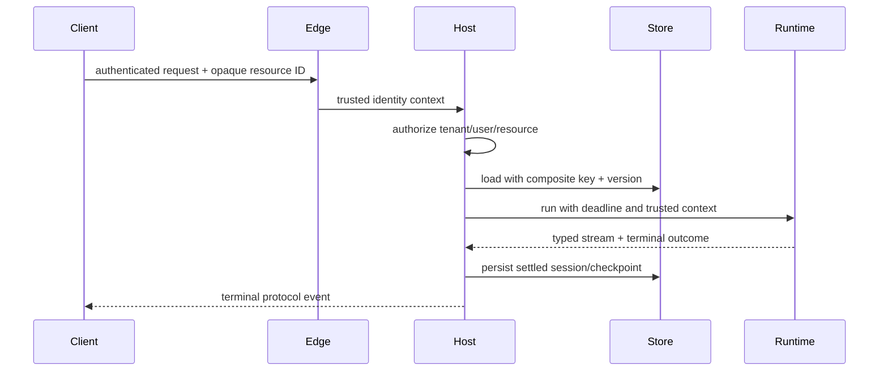

# Hosting, Deployment, Scaling, and Operations

## Choose the operator before the protocol

MAF separates the hosting model from the client protocol. Make two decisions:

1. who operates process/container lifecycle, identity, network, storage, and scale;
2. which protocols expose the agent or workflow.

| Hosting model | Operator | Best fit | Key limitation |
|---|---|---|---|
| Self-host | Application team | Existing service platform and maximum control | App owns routes, auth, persistence, scaling, lifecycle |
| Foundry Hosted Agents | Microsoft Foundry | Managed container and per-session sandbox | MAF adapter packages are prerelease; platform semantics/cost model apply |
| Durable Extension | App/Azure Functions with Durable Task backend | Crash-resilient distributed agents/workflows | C#/Python only; prerelease packages; deterministic/idempotent design required |

Then select Responses, A2A, AG-UI, MCP, Telegram, Invocations, Activity, or an application-native API as appropriate.

## Self-hosting

Self-hosting helpers integrate agents/workflows with an application host and protocol adapters. They do not supply a production platform by themselves.

The host must provide:

- authentication and resource-level authorization;
- routing, request limits, CORS/CSRF policy where relevant;
- tenant-partitioned session/checkpoint/approval/task storage;
- TLS, secret/identity management, and network egress controls;
- concurrency admission, queueing, timeouts, and backpressure;
- health/readiness/shutdown handling;
- deployment, autoscaling, logs, metrics, traces, alerts, and rollback;
- protocol-specific conformance and retention.

The current .NET `Microsoft.Agents.AI.Hosting` line is preview. Python `agent-framework-hosting` is alpha, with protocol packages also alpha at the checked date. The official self-hosting page states MAF does not ship a general-purpose durable session store. Provide an application store.

### Safe self-host request flow

Treat every protocol ID as untrusted. Never load state before authorization. Persist after the run/stream settles, not merely after a client disconnects.

## Foundry Hosted Agents

Foundry Hosted Agents runs a user-supplied container on Microsoft-managed infrastructure. The platform is generally available and supports Python and C# containers. The MAF integration packages remain prerelease at the checked date; service GA and adapter maturity are separate facts.

The platform provides:

- per-session VM-isolated sandbox;
- persistent `$HOME` and `/files` across idle deprovision/restart;
- Responses or Invocations endpoints and managed lifecycle;
- a dedicated Entra identity for each deployed agent;
- session APIs, versioned container deployment, and platform telemetry integration;
- scale per active session.

### Sessions are not conversations

| Concept | Represents | Persistence |
|---|---|---|
| Session / `agent_session_id` | Sandbox compute and filesystem state | `$HOME`/files restored across idle periods |
| Conversation / `previous_response_id` or `conversation` | Responses message/tool history | Stored separately by the Responses service |
| Invocations application state | Whatever the container manages | Not automatically conversation history |

Do not use a session ID alone to continue a Responses conversation. Conversely, an Invocations request needs application-managed history if continuity is required.

### Isolation and authorization

Current AgentServer protocol 2 guidance derives per-user session scope from the Entra caller. Older protocol 1.0/isolation-key behavior was deprecated and scheduled to be blocked after 2026-07-31. Other documented header/isolation modes still require a trusted caller to supply the correct scope. In every mode, session partitioning is not a substitute for application authorization.

An administrator with project-level roles may manage sessions beyond an end user’s scope. Model administrative access in the threat model and audit it.

### Scaling and cost

Foundry Hosted Agents scales per session, not by a replica count. At the checked date:

- sandbox sizes: 0.5 vCPU/1 GiB, 1 vCPU/2 GiB, or 2 vCPU/4 GiB;
- default idle timeout: 15 minutes, configurable 5–60 minutes;
- session deletion after 30 days of inactivity;
- disk budget up to roughly 20 GiB at 1 vCPU or larger, with system reservation;
- no warm-pool/replica knob documented;
- billing multiplies CPU and memory across active sessions.

Right-size per session and load-test cold start, concurrent session count, file restore, tool egress, and cost. A chatty client can keep a sandbox active; idle timeout is part of capacity and spend.

### Networking and identity

Use dedicated agent identity with least-privilege roles. Keep caller identity and agent identity distinct; pass user identity downstream only through a documented on-behalf-of or delegated flow. Prefer a specific production credential such as managed identity over a broad `DefaultAzureCredential` chain.

Choose public networking or private/BYO VNet based on data flows and tool support. Revalidate provider/tool availability under the selected network isolation. Treat outbound MCP/model/tool calls as controlled egress.

## Foundry long-running resilience

The Foundry resilient-task capability is preview. It provides durable work/input identity, persisted input, leases, process-loss detection, handler reentry, and retained stream events for opted-in work.

It does not restore local variables or an in-memory call stack. Recovery re-enters the handler from the beginning. The application supplies a safe rerun path or uses durable checkpoint/watermark references. For Responses, full crash recovery applies only to stored background responses when the server opts in; foreground responses are not reinvoked.

Keep resilient-task metadata small: checkpoint ID, phase, effect operation key, or pointer to external state—not a transcript or artifact store.

## Durable Extension

The [Durable Extension](https://learn.microsoft.com/en-us/agent-framework/hosting/azure-functions) moved to a [separate repository](https://github.com/microsoft/agent-framework-durable-extension). It supports C# and Python using either Azure Functions or a bring-your-own-compute worker connected to Durable Task Scheduler. Go was not supported at the research date.

It adds:

- checkpoint/resume across stateless workers;
- durable agents and graph workflows;
- human waits and distributed orchestration;
- reliable streaming;
- dashboard visibility and cleanup;
- scale-out through Durable Task infrastructure.

Durable orchestration code must follow Durable Task constraints. Put nondeterministic/provider/effect work in activities or framework-supported boundaries. Activities can be retried; use idempotency keys and durable receipts.

## Deployment contract

Version together:

- container/image digest and SBOM;
- Python/.NET/Go packages and transitive SDKs;
- agent instructions and tool schemas;
- workflow topology/checkpoint schema;
- provider/model/deployment and API version;
- AgentServer/protocol version;
- identity roles, network policy, and storage schema;
- evaluation suite and compatibility status.

Use a staged rollout with new sessions/runs pinned to the new version. Resume old state only on a compatible version or through an explicit migration. Rollback may require keeping the old worker/image available until retained checkpoints expire.

## Operational SLOs and alerts

Measure at least:

- admission rejection, queue wait, cold start, time to first event, total duration;
- model/tool latency, rate-limit/transient/permanent failure, retry count;
- active sessions, session age, idle/cold resume, storage bytes;
- checkpoint/session write failures and resume failures by schema/version;
- stream disconnect/reconnect/replay lag and terminal-outcome loss;
- approval pending age, expiry, duplicate/stale responses;
- per-tenant tokens, calls, concurrent work, and estimated cost;
- cancellation requested versus actually stopped;
- deployment version and provider/model served.

## Production checklist

- [ ] Hosting operator and client protocol are selected separately.
- [ ] Self-host routes have real auth, stores, limits, health, and shutdown behavior.
- [ ] Foundry session, conversation, and application state are modeled separately.
- [ ] Agent identity, caller identity, administrative access, and downstream delegation are explicit.
- [ ] Per-session scaling/cost and cold resume are load-tested.
- [ ] Long-running resilience is labeled preview and uses checkpoints/idempotency.
- [ ] Durable Extension constraints and Go absence are recorded where relevant.
- [ ] State compatibility and rollback are part of deployment design.

## Sources

- [Hosting overview](https://learn.microsoft.com/en-us/agent-framework/hosting/)
- [Self-hosting](https://learn.microsoft.com/en-us/agent-framework/hosting/self-hosting/)
- [Foundry Hosted Agents with MAF](https://learn.microsoft.com/en-us/agent-framework/hosting/foundry-hosted-agent)
- [Foundry hosted-agent concepts](https://learn.microsoft.com/en-us/azure/foundry/agents/concepts/hosted-agents)
- [Manage hosted sessions](https://learn.microsoft.com/en-us/azure/foundry/agents/how-to/manage-hosted-sessions)
- [Hosted-agent runtime contract](https://learn.microsoft.com/en-us/azure/foundry/agents/concepts/hosted-agent-contract)
- [Long-running resilience](https://learn.microsoft.com/en-us/azure/foundry/agents/concepts/long-running-agent-resilience)
- [Durable Extension](https://learn.microsoft.com/en-us/agent-framework/hosting/azure-functions)
