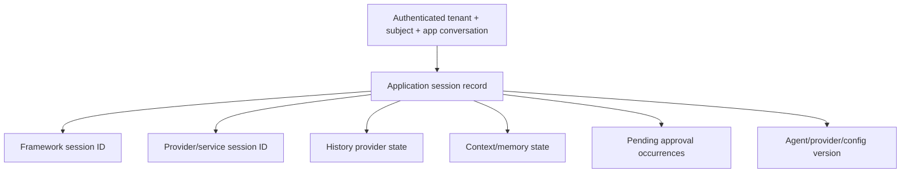

# Middleware, Context, Sessions, and Memory

## Put behavior at the seam it must control

MAF exposes adjacent but different extension points. Choosing the wrong one produces policy gaps or duplicate work.

| Need | Best-fit seam | Important limitation |
|---|---|---|
| Wrap the whole agent run | Agent middleware | May not see internal remote-service actions |
| Inspect local tool invocation | Function middleware | Hosted tools do not pass through it |
| Modify each model call | Chat middleware | Runs more than once in a tool loop |
| Load/store history or add context | Context/history provider | Order and persistence semantics matter |
| Coordinated fail-closed Python policy | Agent Hooks | Experimental, Python-only, buffered streaming |
| Information-flow enforcement | FIDES | Experimental, Python-only, opt-in labels/coverage |

The [agent pipeline](https://learn.microsoft.com/en-us/agent-framework/agents/agent-pipeline) is the source of truth for placement. Specialized agents can differ.

## Middleware order

Middleware is nested, not a flat list. A typical call enters registrations in order and exits in reverse order:

```text
A1 before -> A2 before -> runtime -> A2 after -> A1 after
```

If agent, chat, and function middleware are combined, the chat layer can run once per model turn and the function layer once per local tool invocation. Consequences:

- do not count an agent run by counting model spans;
- do not retry the complete agent inside per-model middleware;
- make logging safe when an “after” path never runs due to cancellation;
- propagate context through typed metadata rather than process globals;
- document short-circuit behavior and terminal response shape.

Order security controls before transformations that could invalidate their decision, and place metrics outside the component whose failures they must measure.

## Context providers versus tools

Microsoft’s context-provider journey offers a useful rule:

- context provider: information the agent should receive proactively on every applicable run;
- tool: information/actions the model should request reactively.

Use context providers for bounded profile data, policy, current workspace, retrieved evidence that is always relevant, history, or compaction. Use tools for expensive, optional, high-cardinality, privileged, or freshness-sensitive operations.

For each provider define:

- authenticated namespace and lookup key;
- before/after lifecycle and ordering;
- maximum messages/bytes/tokens;
- provenance and trust label;
- caching/freshness behavior;
- failure policy: fail closed, omit with signal, or abort;
- whether generated context is persisted to primary history or only an audit/eval stream.

Do not convert retrieved untrusted text into system instructions.

## Session anatomy

An `AgentSession` can contain a local ID, a provider/service session ID, history-provider state, memory/context state, queued approvals, and provider-specific data. It is an opaque continuation object, not a universal conversation schema.



Service IDs are often scoped to an API key, project, endpoint, or provider. Never accept a raw service session ID as proof that the caller owns it. Bind it in application storage to an authenticated tenant/subject.

## History storage modes

MAF distinguishes local history and service-managed history. The application can also attach custom providers. Do not confuse a reusable `SessionStore`/`AgentSessionStore` with a chat-history provider: one persists the opaque session envelope; the other selects and stores messages.

Production persistence flow:

1. authenticate and authorize the logical conversation;
2. load the session using an application-owned composite key;
3. validate schema/config version and provider binding;
4. acquire a per-conversation lease or optimistic version;
5. run and fully consume the response stream;
6. persist the updated session and terminal outcome atomically where possible;
7. release the lease and publish completion.

Saving mid-stream can make a later request observe incomplete function-call/result pairs. The self-hosting guidance recommends persisting after the run or stream completes.

## Memory and compaction

Memory is an application feature with several layers:

| Layer | Purpose | Failure if confused |
|---|---|---|
| Raw transcript | Audit/replay evidence | Cost and privacy growth |
| Active context | Bounded messages sent to the model | Context overflow |
| Semantic/profile memory | Cross-turn facts and preferences | Stale or cross-tenant retrieval |
| Workflow state | Routing and executor progress | Domain truth duplicated |
| Domain database | Authoritative records | Model/session becomes source of truth |

Compaction is lossy. Preserve tool call/result pairs atomically, bound summarization input, retain provenance, and keep the authoritative transcript or domain record separately when required. The Python changelog contains recent fixes for duplicate streaming transcripts, bounded compaction, and atomic tool pairs; turn those into regression tests before upgrading.

Treat learned memory as untrusted, mutable data. Attach subject, tenant, source, timestamp, confidence, schema version, and deletion policy. Never store a permission decision or credential as model-recalled memory.

## Agent Hooks and ordinary middleware

Python Agent Hooks installs a coordinated policy bundle across input, model, tool, and output seams. It can gate persistence and buffer streaming until a verdict. That makes it stronger than independent middleware for some fail-closed policies, but it has boundaries:

- experimental and Python-only;
- hosted tool execution cannot be intercepted at local pre/post-tool seams;
- buffered output changes latency and token-stream UX;
- cooperative in the same process, not a hardened sandbox;
- normal approval and hooks remain separate controls.

If the product depends on these guarantees, pin the feature stage and test every provider/tool path, including cancellation and policy-service failure.

## Context and session failure matrix

| Failure | Cause | Control |
|---|---|---|
| Cross-tenant memory | Namespace omits tenant/subject | Composite keys plus authorization filter |
| Repeated context | Provider appends enriched messages to primary history | Separate load/store flags and audit provider |
| Lost approvals after restart | Pending state only in memory | Durable session/approval store and occurrence test |
| Concurrent turn corruption | Same session used in parallel | Lease or optimistic concurrency |
| Stale provider session | Agent/client config changed | Config version gate; migrate or start new |
| Policy bypass | Hosted tool assumed to use local middleware | Provider-native control or local tool boundary |
| Trace leak | Sensitive telemetry enabled | Explicit production-off policy and redaction |

## Production checklist

- [ ] Middleware type, layer, order, short-circuit, and retry behavior are documented.
- [ ] Context providers have bounds, provenance, namespace, and failure policy.
- [ ] Session store and history provider are modeled separately.
- [ ] Sessions are bound to authenticated application identity and a config version.
- [ ] Concurrent turns to one session are serialized or versioned.
- [ ] Compaction preserves tool-pair integrity and does not erase authoritative records.
- [ ] Experimental hooks/security features have explicit provider-path tests.

## Sources

- [Agent pipeline architecture](https://learn.microsoft.com/en-us/agent-framework/agents/agent-pipeline)
- [Middleware](https://learn.microsoft.com/en-us/agent-framework/agents/middleware/)
- [Adding context providers](https://learn.microsoft.com/en-us/agent-framework/journey/adding-context-providers)
- [Conversation storage](https://learn.microsoft.com/en-us/agent-framework/agents/conversations/storage)
- [Self-hosting and session persistence](https://learn.microsoft.com/en-us/agent-framework/hosting/self-hosting/)
- [Agent Hooks](https://learn.microsoft.com/en-us/agent-framework/agents/agent-hooks)
- [Python changelog](https://github.com/microsoft/agent-framework/blob/main/python/CHANGELOG.md)
