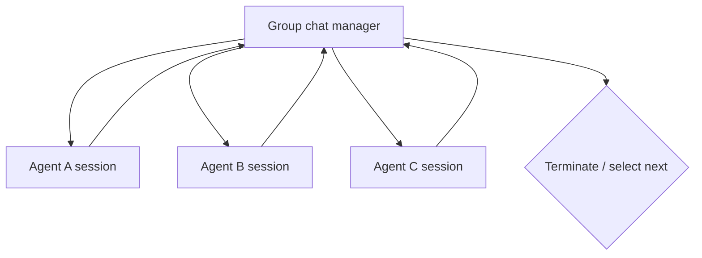

# Multi-Agent Orchestration Patterns

## Start from the simplest topology

More agents add model calls, state machines, context propagation, tool boundaries, latency, cost, and failure modes. Use multiple agents only when role separation or independent context/tool policy materially improves the system.

Selection order:

1. one agent with deterministic tools;
2. one agent in an explicit workflow with deterministic executors;
3. fixed sequential or concurrent agent steps;
4. handoff or managed group chat;
5. dynamic manager/Magentic behavior only when the task justifies it.

The official journey guidance favors a hybrid production design: deterministic workflow control with agent steps where judgment is useful.

## Built-in patterns

| Pattern | Control owner | Best fit | Main production risk |
|---|---|---|---|
| Sequential | Fixed order | Transform/review pipelines | Cascading context and cost |
| Concurrent | Runtime fan-out + aggregator | Independent perspectives | Cost spikes, nondeterministic ordering |
| Handoff | Current agent chooses allowed target | Interactive specialist routing | Loops, hidden nested tools, context spread |
| Group chat | Central manager selects speaker | Iterative collaboration | Long shared history and manager drift |
| Magentic | Manager/planner dynamically coordinates | Open-ended complex tasks | Highest autonomy, latency, and unpredictability |

Go’s checked public-preview repository implements sequential, concurrent, and group-chat builders but states that handoff is not implemented. Do not infer the complete table applies to Go.

## Sequential

Sequential orchestration passes each participant’s output to the next. Use it when the stages and order are stable.

Production controls:

- typed artifact between stages instead of prose-only handoff;
- domain validation after each stage;
- stage-specific prompt/model/tool policy;
- per-stage and total budgets;
- stop early on deterministic invalid input;
- checkpoint before/after high-cost or human-reviewed stages;
- avoid including the entire transcript when a bounded artifact is sufficient.

Prefer a deterministic executor for parsing, validation, calculations, and effects. An “agent for every stage” is not a quality guarantee.

## Concurrent

Concurrent orchestration gives one task to independent participants and aggregates results.

Decide whether the product needs:

- all results, a quorum, first valid, or ranked best;
- stable output order independent of completion order;
- cancellation of slow branches;
- diversity through different evidence/models/prompts rather than cosmetic roles;
- a deterministic aggregator or another model call;
- partial-output UX and failure attribution.

Cap participant count and total tool/model calls. Running the same model with slightly different role prompts often adds correlated cost rather than independent evidence.

## Handoff

Handoff injects special tools that transfer control. The runtime uses a specialized executor to detect handoff calls and filters handoff mechanics from the conversation passed onward. Custom route rules limit who may take over, but the implementation can still synchronize context broadly; route topology is not necessarily data-isolation topology.

By default handoff is interactive: when the current agent answers without handing off, control returns for user input. Autonomous mode introduces continuation turns and must have a strict per-agent and total limit.

Controls:

- allow-list transitions and terminal conditions;
- maximum handoffs, per-agent turns, and revisits;
- cycle detection and diagnostic event;
- least-privilege tools per participant;
- explicit context projection rather than blanket sensitive history;
- nested tool/approval conformance test;
- deterministic fallback when the chosen target is unavailable.

An open .NET feature request from a February 2026 preview build reports difficulty intercepting nested MCP tool calls inside a handoff. It is not evidence about every current path, but it is a strong reason to test the exact nested provider/tool/middleware combination before production.

## Group chat

Group chat uses a star topology with a central manager. Participants have separate sessions; the orchestrator synchronizes or broadcasts conversation context so the selected participant can respond.

The separate-session design supports heterogeneous agents, but broadcast context increases exposure, token use, and compaction complexity. Project only the information each role needs where the builder allows customization.

Manager requirements:

- deterministic maximum iteration count;
- no-repeat/cycle policy if required;
- explicit termination predicate independent of model optimism;
- speaker-selection trace with reason and candidate set;
- bounded/sanitized broadcast history;
- checkpointed manager state where resume is required;
- stable participant names across checkpoint restoration.

## Magentic

Magentic-style orchestration delegates planning and participant selection to a manager. Treat it as a high-autonomy workflow:

- define a narrow task envelope and allowed tools;
- cap replans, turns, model calls, tokens, wall time, and artifacts;
- require deterministic validation before effects;
- checkpoint and trace manager decisions;
- provide operator cancellation and bounded partial-result behavior;
- evaluate adversarial loops, irrelevant delegation, and tool escalation.

Use a fixed graph when the business process is already known.

## Context and identity propagation

Every participant invocation should receive trusted runtime context outside the prompt:

- tenant, subject, roles, and correlation IDs;
- remaining budget/deadline;
- allowed tool set and resource scope;
- workflow/run/checkpoint identity;
- evidence provenance and sensitivity labels.

Do not let one agent grant another permissions through a natural-language handoff. The destination tool re-authorizes the current caller and requested resource.

## Orchestration and HITL

Tool approval can surface through built-in orchestrations. Arbitrary human questions require the workflow request/response mechanism. Sequential, concurrent, and group chat do not inherently pause for free-form user input; wrap them in a custom graph with a request port. Handoff is interactive by default but still requires checkpoint/session persistence for process-safe waits.

## Failure matrix

| Failure | Control |
|---|---|
| Agents converse indefinitely | Deterministic iteration, handoff, revisit, and wall-time limits |
| Secret spreads to every participant | Context projection and per-agent data policy |
| Same stateful agent called concurrently | Fresh sessions/instances or serialized calls |
| Manager selects unavailable/forbidden agent | Allow-list validation and deterministic fallback |
| Checkpoint fails after participant rename | Stable participant IDs and migration test |
| Nested privileged tool bypasses approval | End-to-end nested invocation test; local authorized boundary |
| Parallel branches multiply cost | Global budget and concurrency admission control |

## Production checklist

- [ ] A multi-agent topology has a measurable advantage over one agent/workflow.
- [ ] Each role has a distinct responsibility, context, and tool policy.
- [ ] Turn, loop, handoff, concurrency, time, token, and cost limits are deterministic.
- [ ] Context sharing is explicit and sensitivity-aware.
- [ ] Participants and manager state have stable checkpoint identifiers.
- [ ] Nested tools, approvals, cancellation, and partial failures are tested end to end.
- [ ] Effects remain behind authorized idempotent domain tools.

## Sources

- [Workflow orchestrations](https://learn.microsoft.com/en-us/agent-framework/workflows/orchestrations/)
- [Sequential orchestration](https://learn.microsoft.com/en-us/agent-framework/workflows/orchestrations/sequential)
- [Concurrent orchestration](https://learn.microsoft.com/en-us/agent-framework/workflows/orchestrations/concurrent)
- [Handoff orchestration](https://learn.microsoft.com/en-us/agent-framework/workflows/orchestrations/handoff)
- [Group chat orchestration](https://learn.microsoft.com/en-us/agent-framework/workflows/orchestrations/group-chat)
- [Workflow human-in-the-loop](https://learn.microsoft.com/en-us/agent-framework/workflows/human-in-the-loop)
- [Go repository README](https://github.com/microsoft/agent-framework-go)
