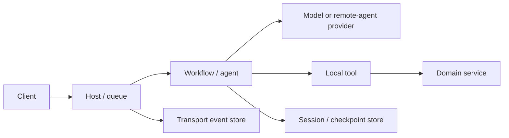
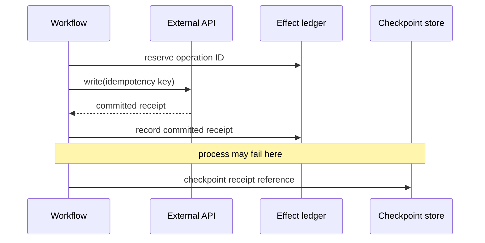

# Reliability, Cancellation, Retries, and Effects

## Reliability is a cross-layer contract

MAF supplies cancellation parameters, workflow checkpoints, provider continuations, hosting integrations, and durable extensions. It does not provide one universal retry or exactly-once policy across them.

Model the run as a set of failure domains:



Each arrow needs its own timeout, retry classification, idempotency rule, and observable outcome.

## Failure taxonomy

| Failure class | Examples | Default response |
|---|---|---|
| Invalid/permanent | bad schema, forbidden resource, unsupported capability | fail without retry |
| Authentication/authorization | expired token, missing role, wrong tenant | refresh once where valid; otherwise fail closed |
| Rate limit/transient service | 429, selected 5xx, connection reset | bounded backoff within deadline |
| Ambiguous effect outcome | timeout after sending write | query by operation ID; never blind retry |
| Process loss | crash/OOM/redeploy | selected host recovery + persisted progress |
| Caller cancellation | disconnect/user stop | propagate; reconcile committed effects |
| State incompatibility/corruption | checkpoint schema/type/topology mismatch | quarantine; operator/migration path |
| Budget exhaustion | max turns/tokens/time/cost | terminal bounded partial/failure result |

Do not retry “all exceptions” in agent middleware. It can replay a complete model/tool loop and duplicate effects.

## Time budgets

Use one end-to-end deadline and derive smaller child budgets:

- admission/queue wait;
- history/context load;
- each model call and complete tool loop;
- each local/MCP/domain tool;
- workflow executor and total supersteps;
- human wait expiry (usually separate from compute deadline);
- checkpoint/session/event persistence;
- client streaming idle and total duration;
- graceful shutdown window.

A timeout must classify the state: definitely not started, definitely completed, or ambiguous. Only the first class is automatically safe to retry.

## Retry design

For a safe retry policy define:

- operation boundary being retried;
- transient error allow-list;
- maximum attempts and total elapsed time;
- exponential backoff with jitter and provider `Retry-After` handling;
- per-tenant retry budget/circuit breaker;
- cancellation propagation while sleeping/calling;
- idempotency/deduplication behavior;
- telemetry that links attempts to one logical operation.

Retry the narrowest safe call. A model read may be repeatable but nondeterministic; record that a second answer is a new attempt. Provider SDKs may already retry—avoid multiplying attempts in nested policies.

## External effect protocol

Every nontrivial write should use a domain-owned operation record:

```text
operation_id
tenant_id
actor_id
action
normalized_input_hash
target_resource + expected_version
status: proposed | executing | committed | rejected | unknown
external_receipt
result_hash / safe result
created_at / completed_at
```

Execution flow:

1. generate or retrieve a stable operation ID before the tool call;
2. validate and authorize the exact action;
3. create/probe the operation record atomically;
4. call the downstream system with the same idempotency key if supported;
5. store its receipt/result;
6. return the durable result on duplicate attempts;
7. reconcile `unknown` outcomes instead of repeating blindly.

The model must never choose the tenant or actor portion of the idempotency namespace.

## Checkpoint gaps

The critical gap is effect commit versus checkpoint commit:



If failure occurs before the checkpoint, recovery asks the effect ledger first. Framework checkpoint storage cannot close this cross-system gap by itself.

## Cancellation

Cancellation is cooperative and may arrive at any time. Implement it in:

- host request and queue/work item;
- agent/model stream;
- workflow run and every executor;
- middleware `next` chain;
- MCP/client HTTP requests and subprocesses;
- domain tool and storage calls;
- polling/backoff waits;
- Foundry resilient handler or Durable Task activity where supported.

Represent outcomes separately:

- `cancellation_requested` — signal sent;
- `execution_stopped` — local work ceased;
- `provider_cancelled` — remote operation confirms cancellation;
- `effect_committed` — downstream write completed despite cancellation;
- `terminal_response_delivered` — client received the final state.

Do not mark a workflow “cancelled with no changes” until effect reconciliation proves it.

## Process loss and recovery choices

| Runtime | Recovery behavior | Application requirement |
|---|---|---|
| Plain in-process agent/workflow | caller/host must restart or resume | durable sessions/checkpoints and work queue if needed |
| Provider background response | provider operation can be polled/resumed | persist token/session; provider feature only |
| Foundry resilient task | lease recovery re-enters handler from beginning | durable phase/checkpoint/watermark and safe rerun |
| Durable Extension | Durable Task orchestration/activity recovery | deterministic orchestration and idempotent activities |

Foundry recovery is not retry: recovery continues a durable work attempt after process loss. It still re-enters application code. Durable Task replay is a different execution model. Test both with forced termination.

## Overload and admission

Bound reliability before work starts:

- per-tenant and global concurrent runs/sessions;
- queue length and maximum wait;
- provider and tool concurrency pools;
- fan-out width and agent participants;
- request/input/artifact/history/checkpoint bytes;
- tool/model iterations, tokens, and spend;
- polling frequency and retained stream backlog.

Reject with a clear retryable/nonretryable status rather than accepting unbounded work. Shed low-priority traffic before high-value state persistence and cancellation paths fail.

## Graceful shutdown

On shutdown:

1. stop admitting new work;
2. signal cooperative cancellation or steering according to the runtime;
3. allow a bounded drain window;
4. persist settled sessions/checkpoints/effect receipts;
5. do not write a false terminal state for work intended for lease recovery;
6. close streams with an explicit retry/reconnect signal where possible;
7. flush telemetry within a short bound.

For Foundry resilient tasks, defer unfinished work so another process can reclaim it. For ordinary self-hosted work, a separate durable queue is required if the product promises continuation.

## Upgrade regression cases

The framework changelog and closed issue history suggest these high-value tests:

- checkpoint JSON round-trip preserves concrete approval content types;
- parallel calls with mixed approvals preserve every occurrence;
- process dies after approval consumption and tool commit but before model completion;
- stale approval interrupt is retired after a terminal resume error;
- checkpoint object returned from storage cannot be mutated accidentally;
- subworkflow state restores across process restart;
- streamed tool calls are not duplicated after reconnection;
- compaction preserves call/result pairs and bounds provider input.

Treat issue reports as test leads tied to versions, not estimates of current defect prevalence.

## Production checklist

- [ ] Every network/storage/effect boundary has timeout and error classification.
- [ ] Retries are narrow, bounded, cancellation-aware, and nonmultiplicative.
- [ ] Effects have stable IDs, durable receipts, and ambiguity reconciliation.
- [ ] Cancellation request, local stop, remote cancellation, and effect outcome are separate.
- [ ] The chosen process-loss recovery model is named and chaos-tested.
- [ ] Admission limits protect providers, storage, streams, and spend.
- [ ] Shutdown preserves recoverable work without false terminal states.
- [ ] Approval/checkpoint/stream regressions run against the exact upgrade pins.

## Sources

- [Workflow checkpoints](https://learn.microsoft.com/en-us/agent-framework/workflows/checkpoints)
- [Background responses](https://learn.microsoft.com/en-us/agent-framework/agents/background-responses)
- [Foundry long-running resilience](https://learn.microsoft.com/en-us/azure/foundry/agents/concepts/long-running-agent-resilience)
- [Durable Extension](https://learn.microsoft.com/en-us/agent-framework/hosting/azure-functions)
- [Self-hosting](https://learn.microsoft.com/en-us/agent-framework/hosting/self-hosting/)
- [Python changelog](https://github.com/microsoft/agent-framework/blob/main/python/CHANGELOG.md)
