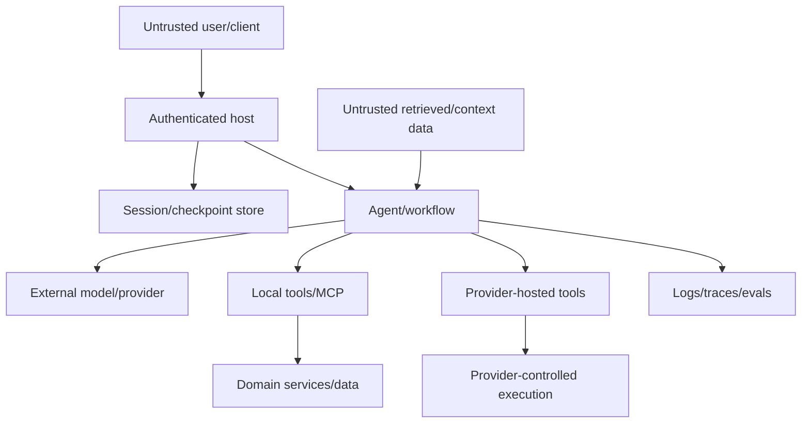

# Security, Identity, Tenancy, and Data

## Framework safety is shared responsibility

MAF provides abstractions and some controls; the application owns input validation, authentication, authorization, encryption, resource limits, safe storage, tool policy, and output handling. The official [Agent Safety](https://learn.microsoft.com/en-us/agent-framework/agents/safety) page explicitly says tools run without approval by default and external-service connection security comes from developer-chosen clients.

## Threat model

Trust boundaries include user input, history/context providers, model output, local and hosted tools, MCP servers, serialized state, protocol adapters, telemetry, and administrative APIs.

## Identity model

Keep four identities separate:

| Identity | Purpose |
|---|---|
| End user/caller | Who requested the action |
| Application/workload | Which service accepts and orchestrates work |
| Agent deployment identity | Credentials granted to the deployed agent/container |
| Downstream delegated identity | User-scoped token used only where on-behalf-of is intended |

Foundry gives each hosted agent a dedicated Entra identity. Grant it only the model, storage, toolbox, and downstream actions it needs. Do not silently substitute the agent’s broad identity for user authorization. If user delegation is required, use a documented delegated/OBO flow and check both caller entitlement and resource policy.

For production Azure authentication, prefer a specific managed identity credential. Broad credential chains can probe unintended sources and add latency/risk.

## Tenant and resource authorization

Every externally addressable ID is a lookup hint, not authorization:

- framework session or provider session;
- conversation/previous response ID;
- workflow run/checkpoint;
- approval/request occurrence;
- AG-UI thread, A2A task, resilient work/input identity;
- Foundry hosted session and file path;
- MCP resource/tool identifier.

Resolve them through a server-side composite key such as `tenant + subject/workspace + resource type + opaque ID`, then authorize the requested operation. Protect list, read, resume, cancel, delete, file, replay, and administrative operations—not just create/run.

Session isolation keys partition data but are not authorization. Current Foundry protocol guidance prefers identity-derived isolation; trusted header modes still require the application to supply the correct scope.

## Tool security

Treat model-selected arguments exactly like hostile API input:

- allow-list resources, hosts, commands, and file roots;
- resolve paths and verify the final absolute location;
- parameterize database/shell/query inputs;
- enforce type/range/length and output limits;
- re-fetch resource and check expected version;
- authorize action/resource inside the tool;
- use least-privilege downstream credentials;
- require human approval for high-risk, broad, irreversible, or sensitive operations;
- make effects idempotent and auditable.

Approval is not authorization and can become stale. Re-authorize after the wait. Display exact normalized arguments, scope, impact, and expiry; do not approve a vague natural-language summary.

Provider-hosted tools do not pass through local function middleware. If application authorization must mediate an action, use a local tool or provider-native policy with equivalent verified controls.

## Prompt injection and trust labels

Roles are not all trusted:

| Content | Default security posture |
|---|---|
| System/developer instruction | trusted only if exclusively developer-controlled |
| User message | untrusted |
| Assistant/model output | untrusted |
| Tool/retrieval result | untrusted unless a specific verified source justifies otherwise |
| Restored session/checkpoint | untrusted input after storage load |

Never splice untrusted data into system instructions. Keep provenance and sensitivity metadata. Minimize privileged tools available to contexts that process external content. Use a separate constrained reader/quarantine model where useful, but assume its output remains untrusted.

### FIDES

FIDES is a Python-only experimental information-flow-control feature in `agent-framework-core`. It propagates integrity/confidentiality labels and enforces policies before local sensitive tools. Its defaults are nuanced: unlabeled `Content` is treated as trusted/public, while unlabeled tool output can default fail-closed to untrusted/public through `SecureAgentConfig`. Label every external source explicitly rather than relying on defaults.

FIDES is useful for enforcing labeled source-to-sink rules, but it is not universal isolation:

- labels are opt-in and only protect covered flows;
- provider-hosted tool execution bypasses local function seams;
- local code can bypass middleware if wired incorrectly;
- it does not solve model poisoning, identity, host compromise, or all side channels;
- the repository ADR remained “proposed” while Learn/package status described an experimental implementation.

Pin and threat-model the exact feature version. Keep ordinary tool authz, output sanitization, and least privilege.

### Agent Hooks

Python Agent Hooks is also experimental. It coordinates fail-closed verdicts across input, model, local tool, output, streaming, and persistence gates. It can buffer streaming until policy approval. Hosted tool calls remain visible only after model content returns, not at the local tool seam. Treat the policy service and hook failure path as critical infrastructure and test fail-closed behavior.

## MCP security

For every MCP connection:

- review operator, package/image provenance, version, terms, data retention, and region;
- use TLS and authenticated transports;
- supply credentials per run from trusted runtime context, never the model;
- scope tokens to one server and minimal permissions;
- restrict egress destinations and redirects;
- cap advertised tools/schemas, request/result bytes, and duration;
- validate tool descriptions/arguments/results as untrusted;
- isolate local stdio servers and filesystem roots;
- audit calls without storing secrets;
- close clients/subprocesses and rotate credentials.

Prefer first-party server endpoints over unreviewed proxies. A remote MCP server can exfiltrate every prompt/header sent to it.

## Data lifecycle

Inventory data across:

- provider prompts/responses and service conversations;
- local history, semantic memory, and context caches;
- workflow checkpoints and pending approvals;
- Foundry `$HOME`, files, sessions, and conversations;
- transport snapshots/event replay;
- traces, logs, eval datasets, and captured failures;
- domain effect/audit ledgers.

For each, record controller/processor, region, retention, encryption, access roles, deletion API, backup, legal hold, and schema/version. `AgentSession` has no universal provider-history deletion method because providers differ; track provider resources and delete through the provider SDK when required.

Do not enable sensitive telemetry in production. Never place secrets or full unredacted session/checkpoint payloads in span attributes.

## Output safety

Model and tool output is untrusted. Before rendering or executing:

- escape/sanitize HTML/Markdown and URL schemes;
- never evaluate generated code/SQL/shell outside an isolated, policy-constrained tool;
- scan artifacts where appropriate;
- validate structured output and cited resources;
- apply content and data-loss controls;
- distinguish model text from authoritative application status.

## Abuse and cost controls

Authentication does not prevent cost abuse. Enforce per-tenant/user:

- input/output size;
- request rate and concurrent runs/sessions;
- model/tool/workflow iterations and fan-out;
- token and spend budgets;
- artifact/history/checkpoint storage;
- background work and polling;
- approval pending age;
- MCP connections and subprocesses.

Log limit decisions and expose safe retry information without revealing internal capacity.

## Security review checklist

- [ ] Caller, workload, agent, and delegated identities are distinct.
- [ ] Every state/task/session ID is authorized before load or mutation.
- [ ] Tools validate/authz at execution and use least privilege/idempotency.
- [ ] Hosted-tool paths have explicit equivalent policy or are disallowed.
- [ ] System instructions contain no untrusted interpolation.
- [ ] MCP servers, egress, credentials, schemas, and results are constrained.
- [ ] Experimental FIDES/Hooks coverage and bypasses are documented and tested.
- [ ] Data retention/deletion covers provider, host, state, file, event, and telemetry stores.
- [ ] Output rendering/execution and abuse/cost limits are enforced.

## Sources

- [Agent Safety](https://learn.microsoft.com/en-us/agent-framework/agents/safety)
- [Agent Security with FIDES](https://learn.microsoft.com/en-us/agent-framework/agents/security)
- [Agent Hooks](https://learn.microsoft.com/en-us/agent-framework/agents/agent-hooks)
- [Tool approval](https://learn.microsoft.com/en-us/agent-framework/agents/tools/tool-approval)
- [Local MCP tools](https://learn.microsoft.com/en-us/agent-framework/agents/tools/local-mcp-tools)
- [Conversation storage](https://learn.microsoft.com/en-us/agent-framework/agents/conversations/storage)
- [Manage Foundry hosted sessions](https://learn.microsoft.com/en-us/azure/foundry/agents/how-to/manage-hosted-sessions)
- [Least privilege for AI agents](https://learn.microsoft.com/en-us/security/zero-trust/sfi/least-privilege-for-ai-agents)
- [FIDES design ADR](https://github.com/microsoft/agent-framework/blob/main/docs/decisions/0024-prompt-injection-defense.md)
