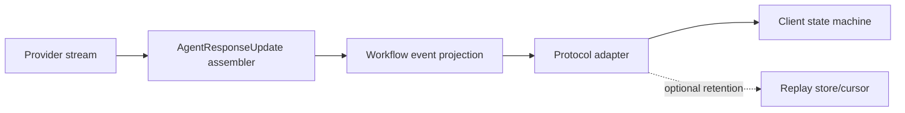

# Streaming, Events, and Protocols

## Four streams that must not be conflated

MAF applications can expose several independently meaningful streams:

1. **model/agent response updates** — text and typed content deltas from one agent run;
2. **workflow events** — executor lifecycle, intermediate output, requests, faults, and terminal outcome;
3. **transport events** — SSE/WebSocket/AG-UI/Responses/A2A frames delivered to a client;
4. **durable replay events** — retained events/cursors supplied by a host or durable runtime.

Receiving a token does not mean the agent run settled, history was persisted, a workflow checkpoint committed, or an external effect is safe to repeat.

## Agent response assembly

An agent stream can contain text, tool calls/results, usage, reasoning metadata, citations, errors, finish reasons, continuation tokens, and provider-native identifiers. Build one typed assembler that:

- preserves order and content occurrence IDs;
- coalesces only content types with documented delta semantics;
- retains raw/unknown content in a bounded envelope;
- distinguishes partial output from the final assembled response;
- records terminal success, failure, cancellation, or input-required;
- persists the updated session only after completion.

Do not render raw tool/model content as HTML or execute it. Sanitize for the destination.

## Workflow events

Workflow execution exposes more than final output. A consumer should recognize:

- run started/completed/failed/cancelled;
- executor started/completed/failed;
- intermediate and final output;
- agent response updates carried through workflow output events;
- request information for HITL;
- checkpoint/runtime events used by operators.

Treat event names and payloads as a versioned contract at the application boundary. Project framework-native events into a smaller application schema so SDK upgrades do not directly break clients.

### Terminal outcome beats iterator exhaustion

Define one explicit terminal event/outcome. Iterator closure alone is ambiguous: the producer may have failed, the client may have disconnected, or cancellation may have stopped enumeration. Persist/audit the terminal classification and last event sequence.

## Backpressure and disconnects

A fast provider and slow browser can exhaust memory if every token is queued. Use:

- bounded per-client buffers;
- coalescing for text deltas where semantics allow;
- dropping or sampling only nonessential telemetry, never control events;
- heartbeat and idle timeout;
- maximum stream duration and output bytes;
- cancellation when the product contract says work should stop on disconnect;
- detached/background execution only with durable work identity and client reconnection.

If the client disconnects after an effect but before the result frame, a retry may replay the request. The effect receipt, not the transport, prevents duplication.

## Protocol boundaries

| Protocol/integration | Primary purpose | Application still owns |
|---|---|---|
| Responses-compatible endpoint | OpenAI-style agent input/output and conversation continuation | Auth, route policy, store, semantic coverage |
| AG-UI | Frontend event/state protocol | Thread authorization, state persistence, approval correctness |
| A2A | Remote agent discovery/tasks/messages | Trust, auth, task ownership, capability policy |
| MCP hosting | Expose agent/workflow as a tool | Caller authorization, input/result limits, effect safety |
| Telegram | Bot channel integration | User mapping, abuse limits, storage |

Protocol conversion is often lossy. Create a conformance matrix for every content/event type used: text, images, files, function calls/results, approval, reasoning, citations, usage, errors, cancellation, and terminal states.

## AG-UI state and approvals

AG-UI combines event streaming with client thread/state projections. This creates a multi-layer consistency problem:

- framework session and pending approval registry;
- workflow checkpoint/request state;
- AG-UI thread snapshot;
- browser-side pending interrupt cards;
- transport retry/reconnect behavior.

The official repository has fixed 2026 defects involving parallel approval calls, consumed approvals followed by failure, and stale approval cards. They do not prove current versions are broken; they identify required regression cases:

1. several tool calls with mixed approval policies;
2. process restart while an approval is pending;
3. approval accepted, tool commits, provider call fails;
4. duplicate approval response;
5. reconnect after terminal `NOT_FOUND`/cancelled approval;
6. stream disconnect before and after session persistence.

## Responses background continuation

Provider background responses carry a continuation token for polling or stream resumption. Persist the latest confirmed token and session atomically enough for the application’s recovery model. Poll with bounded exponential backoff and jitter.

This continuation is provider-owned. It does not replace a workflow checkpoint or a host’s crash-recovery mechanism. Foundry resilient background work adds a separate work/input identity and retained stream cursor; foreground Responses are not automatically reinvoked after process loss.

## Durable stream semantics

If the product promises reconnectable delivery, define:

- stable work/run and stream IDs;
- monotonically ordered event sequence or opaque cursor;
- retention window and maximum replay bytes;
- whether replay is at-least-once and how clients deduplicate;
- terminal event retention;
- authorization on every reconnect;
- behavior when the cursor is expired or invalid;
- separation between replayed display events and re-executed work.

The MAF Durable Extension documents reliable streaming. Foundry resilient tasks document cursor-based replay. Plain in-process agent/workflow streaming makes neither promise by itself.

## Cancellation

Cancellation has at least four scopes:

- client transport cancelled;
- agent/workflow run cancelled;
- provider background operation cancelled;
- hosted/durable work cancelled or steered.

Propagate the signal through middleware, executors, provider SDK, MCP clients, and tools. Cancellation is cooperative: downstream systems may commit even after the caller stops waiting. Record “cancellation requested,” “execution stopped,” and “external effect outcome” separately.

## Failure matrix

| Failure | Control |
|---|---|
| UI shows completion before tool loop settles | Render terminal application event, not last text token |
| Duplicate text after injection/resume | Typed occurrence-aware assembler and regression fixture |
| Memory growth from slow clients | Bounded buffers, coalescing, backpressure policy |
| Reconnect repeats effect | Work/effect IDs and durable receipts |
| Approval card cannot be answered | Persist occurrence state; clear terminal stale interrupt |
| Protocol loses content type | Conversion conformance suite and explicit unsupported error |
| Session saved with half a tool pair | Persist after settled stream |

## Production checklist

- [ ] Agent, workflow, transport, and durable replay streams are named separately.
- [ ] A typed assembler preserves content and terminal outcome.
- [ ] Buffers, bytes, duration, heartbeat, and disconnect behavior are bounded.
- [ ] Every protocol conversion has a feature conformance suite.
- [ ] Reconnect and approval state machines survive process restart.
- [ ] Durable replay claims are made only for the selected host/runtime.
- [ ] Cancellation outcome is distinct from cancellation request.

## Sources

- [Running agents](https://learn.microsoft.com/en-us/agent-framework/agents/running-agents)
- [Workflow events](https://learn.microsoft.com/en-us/agent-framework/concepts/workflows/events)
- [Agents in workflows](https://learn.microsoft.com/en-us/agent-framework/workflows/agents-in-workflows)
- [Background responses](https://learn.microsoft.com/en-us/agent-framework/agents/background-responses)
- [Self-hosting](https://learn.microsoft.com/en-us/agent-framework/hosting/self-hosting/)
- [Foundry long-running resilience](https://learn.microsoft.com/en-us/azure/foundry/agents/concepts/long-running-agent-resilience)
- [Durable Extension](https://learn.microsoft.com/en-us/agent-framework/hosting/azure-functions)
