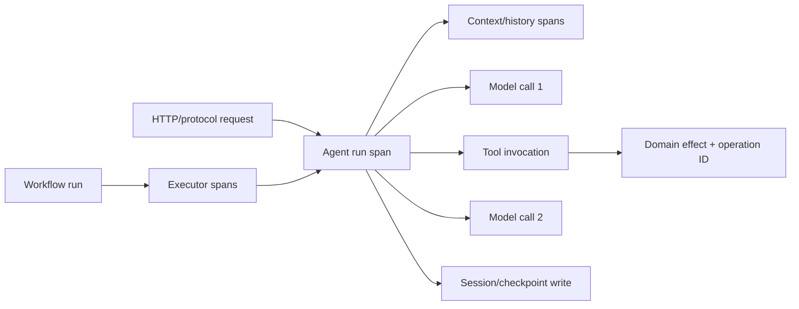

# Telemetry, Evaluation, Testing, and Debugging

## Observability is layered

MAF emits OpenTelemetry-oriented traces, metrics, and logs for agents, model calls, tools, and workflows. Add application spans for authorization, storage, queueing, checkpoints, approvals, and domain effects so one trace explains the complete request.

Keep stable correlation attributes:

- service/deployment/agent/workflow/executor version;
- run/work/session/conversation/checkpoint IDs as hashed or non-sensitive values;
- authenticated tenant/subject pseudonyms, not raw PII;
- provider, requested model, and actual served model where exposed;
- tool name, operation ID, approval decision class, and effect outcome;
- retry/cancellation/error classification;
- token/usage/cost counters and stream timing.

## Instrumentation behavior

Python instrumentation is enabled by default in the checked releases, but no telemetry leaves the process without configured providers/exporters. `ENABLE_INSTRUMENTATION` can disable it; sensitive prompt/response/tool data is off by default. The framework can also add package/version and feature-category tokens to supported User-Agent requests, with documented environment switches.

.NET may produce overlapping spans when both an agent and the underlying `IChatClient` are instrumented. Inspect a trace and choose the level that avoids misleading double counting.

Never enable production `Trace` message logging or `EnableSensitiveData` merely to debug an incident. Prompts, responses, tool arguments/results, retrieved content, and session IDs can contain credentials or regulated data. Prefer hashes, sizes, categorical decisions, and sampled redacted captures in an isolated environment.

## Workflow observability

Trace the workflow run, supersteps/executors, agent invocations, checkpoint writes, and request waits. Parallel fan-in may be represented with span links rather than a false parent/child chain.

Useful workflow measures:

- superstep count and active executor count;
- time in each executor and queue/wait state;
- fan-out width and aggregation result;
- checkpoint bytes/write latency/failure;
- pending request age and resume latency;
- loop/handoff/group-chat iteration count;
- state bytes and transcript/context bytes;
- replay/recovery source checkpoint and code version.

Do not put full checkpoint state in span attributes.

## Evaluation stack

Use several evaluator classes because no single score represents production quality:

| Layer | Examples | Determinism |
|---|---|---|
| Contract | schema, required citations, allowed tool, no forbidden action | high |
| Tool trajectory | selected tool, arguments, order, approval path | high/medium |
| Domain result | record version, calculation, policy outcome | high |
| Retrieval | relevance, provenance, freshness, tenant isolation | medium/high |
| Language quality | helpfulness, coherence, groundedness | often model-judged |
| Safety | injection resistance, data leakage, harmful action | mixed |
| Operations | latency, tokens, retries, cost, completion rate | high |

Python evaluation APIs and Foundry eval helpers are marked experimental in `PACKAGE_STATUS.md`, even though evaluation has prominent Learn documentation. .NET builds on Microsoft.Extensions.AI evaluation surfaces. Go lacks the packaged Foundry evaluation integration described for Python/.NET. Treat package/feature stage as authoritative for API stability.

For model judges, pin judge model/deployment, prompt, rubric, threshold, samples, and randomization parameters. Track uncertainty and periodically calibrate against human labels. Never let a model judge alone authorize a production effect.

## Test pyramid

### Unit tests

- tool schema and domain validation;
- authorization and tenant namespace;
- middleware order, short-circuit, and cancellation;
- context-provider bounds/provenance/failure;
- deterministic executor routing and state updates;
- response/event assembler;
- idempotency/effect receipt logic;
- checkpoint schema migration.

Use fake chat/provider clients that emit scripted text, tool calls, parallel calls, malformed content, usage, failures, and cancellation. Do not make every unit test depend on a live model.

### Runtime integration tests

- real checkpoint/session store round-trip;
- every content subtype used by the product;
- process restart with pending HITL request;
- duplicate and stale approval responses;
- workflow fan-out/fan-in and reset/isolation;
- stream disconnect/reconnect and partial writes;
- nested workflow and agent-as-tool behavior;
- actual protocol adapters and authenticated state loading.

### Provider conformance tests

Run a small suite against each exact provider/client/model/region/package pin:

- plain and streaming responses;
- function and parallel tools;
- structured output;
- hosted tools/MCP if used;
- finish reason, usage, errors, and actual served model;
- background continuation/cancel if used;
- session continuation after restart.

### End-to-end and chaos tests

- replica/process loss before/after checkpoint and effect;
- provider 429/5xx/timeout after an approved tool commits;
- storage outage during session/checkpoint persistence;
- slow client and buffer pressure;
- expired identity/credential during long work;
- rollout/rollback with old retained checkpoints;
- cancellation during model, tool, wait, and durable recovery.

## Debugging workflow

1. capture package, provider, model, host, protocol, and deployment versions;
2. classify the failed layer: agent, workflow, provider, tool, state store, host, protocol, or client;
3. locate the last settled event/checkpoint/effect receipt;
4. reproduce with a scripted provider and the same stored state shape;
5. minimize to one agent/executor/tool while preserving the failing boundary;
6. compare typed events, not just rendered text;
7. add the reproduction to the upgrade conformance suite.

DevUI is useful for local inspection, not production hosting. At the checked date Python DevUI is beta, .NET DevUI is preview, and Go has no DevUI package. Bind locally, use non-production credentials/data, and do not treat its optional auth as a production gateway.

## Golden-data discipline

Store eval/test cases with:

- stable case ID and requirement;
- input plus authorized context fixture;
- expected tool/routing invariants;
- acceptable semantic output range, not brittle prose;
- provider/model/prompt/tool/workflow versions;
- seed/settings where supported;
- expected latency/token/cost envelope;
- provenance and privacy classification.

Separate regression gates from exploratory evaluations. A flaky model-judge threshold should not hide a deterministic authorization failure.

## Production checklist

- [ ] Traces connect protocol, agent, workflow, storage, tool, and effect boundaries.
- [ ] Sensitive telemetry is off and a safe incident-debug path exists.
- [ ] Duplicate instrumentation and token accounting are checked.
- [ ] Evals combine deterministic contracts, domain results, quality, safety, and operations.
- [ ] Experimental eval APIs are isolated behind a small adapter.
- [ ] Real-store restart/approval/serialization tests run before upgrades.
- [ ] Every chosen provider/model has a conformance suite.
- [ ] DevUI is restricted to development.

## Sources

- [Agent observability](https://learn.microsoft.com/en-us/agent-framework/agents/observability)
- [Workflow observability](https://learn.microsoft.com/en-us/agent-framework/workflows/observability)
- [Agent evaluation](https://learn.microsoft.com/en-us/agent-framework/agents/evaluation)
- [Microsoft Foundry evaluation integration](https://learn.microsoft.com/en-us/agent-framework/integrations/by-component/evaluation/microsoft-foundry)
- [DevUI](https://learn.microsoft.com/en-us/agent-framework/integrations/by-component/ui/devui/)
- [Python observability sample](https://github.com/microsoft/agent-framework/blob/main/python/samples/02-agents/observability/README.md)
- [Python package status](https://github.com/microsoft/agent-framework/blob/main/python/PACKAGE_STATUS.md)
