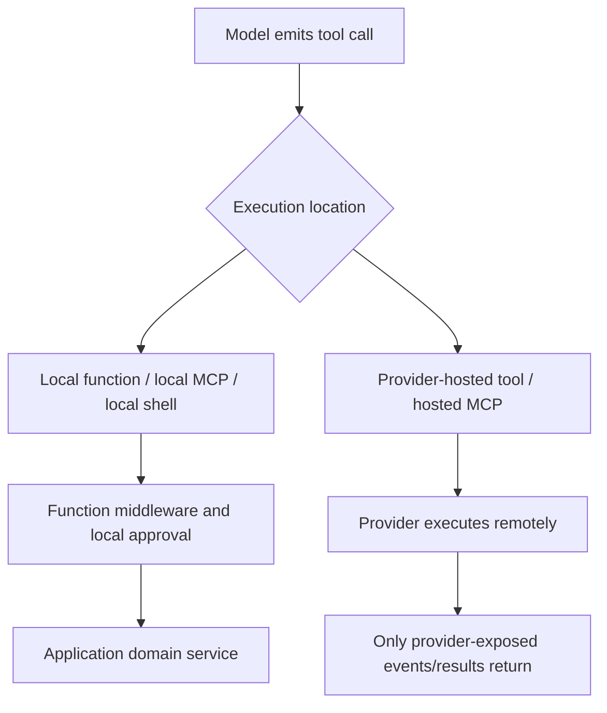
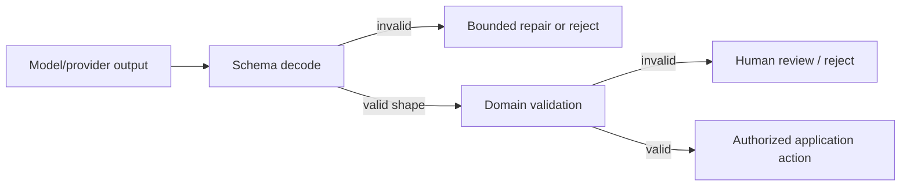

# Tools, Functions, MCP, and Structured Output

## The execution boundary matters more than the schema

MAF exposes both locally invoked function tools and provider-hosted tools. They can share a declaration shape while having different security, approval, observability, retry, and data-residency properties.

The [tools matrix](https://learn.microsoft.com/en-us/agent-framework/agents/tools/) is provider-specific. Local MCP and local shell appear as function tools to a provider. Hosted tools are declarations executed by the AI service.

## Tool contract

Every effectful tool needs a contract stronger than its model-facing JSON Schema:

| Concern | Required control |
|---|---|
| Identity | Derive caller/tenant from trusted runtime context, never model arguments |
| Authorization | Check the requested resource and action inside the tool |
| Validation | Allow-listed targets, types, ranges, sizes, paths, query parameters |
| Idempotency | Stable operation key and durable effect receipt |
| Concurrency | Expected version/ETag or domain lock where needed |
| Timeout | Deadline propagated to downstream client |
| Retry | Only for classified transient failures and safe operations |
| Result | Bounded, typed, redacted, provenance-aware output |
| Audit | Actor, action, resource, decision, operation ID, outcome—not secrets |

Keep credentials and service clients out of model-visible arguments. Inject them from the host or run context.

## Function schemas

Schema generation from type hints or reflection reduces boilerplate but does not enforce domain correctness. Review the emitted schema:

- names and descriptions are stable and unambiguous;
- enums and required fields match the implementation;
- optional versus nullable semantics are intentional;
- arbitrary dictionaries and free-form strings are avoided for privileged actions;
- recursive or huge schemas are bounded;
- tool results do not expose credentials, internal stack traces, or unrestricted binary data.

Changing a function name, parameter, enum, approval requirement, or result shape is a versioned protocol change for prompts, checkpoints, approval cards, eval fixtures, and remote clients.

## Approval semantics

By default, MAF tools run without user approval. Approval is an explicit framework feature for locally invoked tools. The normal flow is:

1. model proposes a tool call;
2. framework emits an approval request instead of executing;
3. caller displays exact action and arguments;
4. caller returns an approval response using the same authorized session;
5. framework binds response to the pending occurrence and executes or rejects;
6. model receives the tool result.

Approval does not replace authorization. Re-authorize immediately before the effect because permissions and resources may have changed while the request waited. Bind the approval to a hash of tool name, normalized arguments, tenant, subject, resource version, expiry, and occurrence ID. If arguments change after approval, require a new decision.

Ordinary function middleware can transform arguments. In Python, the current Agent Hooks guidance warns that a post-approval transform can otherwise change what was approved. Put such transformations before the proposal or use a coordinated hook/policy boundary.

## Parallel calls and approval

When a model emits several calls in one turn, decide whether to:

- reject parallel calls for effectful tools;
- present a batch with one decision per call;
- approve an atomic group only if the domain supports a transaction;
- execute safe reads concurrently and serialize writes.

Preserve call IDs and occurrence identity. Do not synthesize “skipped” results for lost calls. Regression tests should cover parallel calls where only some require approval; the official repository has fixed failures in this area, making it a valuable upgrade test.

## Local MCP

Local MCP tools run through an MCP client owned by the application process and normally participate in local function-tool controls.

Production controls:

- trust only reviewed servers and transports;
- pin server package/image versions and verify provenance;
- prefer provider-operated endpoints over unreviewed proxies;
- scope filesystem roots and commands;
- use per-run credentials from a trusted header provider;
- reject arbitrary model-supplied URLs and headers;
- set connect, request, and idle timeouts;
- cap tool count, schema bytes, result bytes, and reconnects;
- dispose clients and subprocesses reliably;
- log server identity and tool version without secrets.

Treat MCP tool descriptions and results as untrusted. A malicious server can advertise deceptive schemas, prompt-inject through output, request broad credentials, or return oversized content.

## Hosted MCP and hosted tools

Hosted MCP, web search, file search, and code interpreter execute service-side. Consequences:

- local function middleware cannot intercept the actual invocation;
- local approval applies only if the provider exposes an equivalent gate;
- credentials, retention, network egress, residency, and logs follow provider semantics;
- the provider may emit content/events that differ across SDKs;
- a local idempotency wrapper cannot control the remote side effect.

Use hosted tools only after validating the selected provider/account/model and its policy surface. If a privileged operation must pass through application authorization, expose a narrow local tool instead of a service-hosted path the application cannot intercept.

## Agent as tool

Wrapping an agent as a tool is a composition mechanism, not isolation. It adds another model loop, tool registry, session policy, failure surface, and cost center.

Define:

- whether each invocation gets a fresh session;
- which identity and budget flow into the child;
- whether parallel invocations may touch one child instance;
- how nested tool events and approvals surface;
- a recursion/depth limit;
- a concise, typed result contract.

Prefer a deterministic function when the delegated work does not need an agent loop.

## Structured output and tool output

Structured output is best used at a boundary with explicit failure handling:

Never pass deserialized model output directly into a privileged tool. Re-resolve resource identifiers server-side and enforce invariants after parsing.

## Failure matrix

| Failure | Detection | Response |
|---|---|---|
| Tool hallucination/unknown name | Registry lookup | Return bounded error; do not fuzzy-match privileged tools |
| Invalid arguments | Schema + domain validation | No execution; provide safe validation feedback |
| Approval/session mismatch | Occurrence lookup under authorized key | Reject and retire stale UI state safely |
| Tool succeeded, stream failed | Durable effect receipt exists | Resume/return recorded result; do not repeat |
| MCP server changes schema | Startup/runtime fingerprint mismatch | Quarantine and require review |
| Hosted tool bypasses policy | Architecture/conformance review | Replace with local authorized tool or provider-native policy |
| Oversized result | Byte/token limit | Store artifact externally; return pointer/summary |

## Production checklist

- [ ] Local and hosted tools are shown separately in the architecture.
- [ ] Every effectful tool validates, authorizes, and deduplicates independently.
- [ ] Approval binds the exact proposed occurrence and expires.
- [ ] Parallel approval behavior is covered by an integration test.
- [ ] MCP servers, credentials, egress, schemas, and outputs are constrained.
- [ ] Structured data receives domain validation after decoding.
- [ ] Nested agents have fresh-state, budget, depth, and event rules.

## Sources

- [Tools overview and provider matrix](https://learn.microsoft.com/en-us/agent-framework/agents/tools/)
- [Function tools](https://learn.microsoft.com/en-us/agent-framework/agents/tools/function-tools)
- [Tool approval](https://learn.microsoft.com/en-us/agent-framework/agents/tools/tool-approval)
- [Local MCP tools](https://learn.microsoft.com/en-us/agent-framework/agents/tools/local-mcp-tools)
- [Hosted MCP tools](https://learn.microsoft.com/en-us/agent-framework/agents/tools/hosted-mcp-tools)
- [Agent safety](https://learn.microsoft.com/en-us/agent-framework/agents/safety)
- [Agent Hooks](https://learn.microsoft.com/en-us/agent-framework/agents/agent-hooks)
