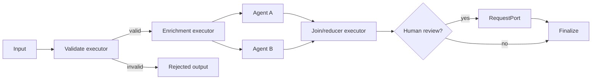

# Workflows, Executors, Edges, and State

## What the workflow runtime provides

MAF workflows are explicit graphs for coordinating code, agents, state, events, and human input. All three SDKs expose graph workflows. Python additionally exposes an experimental functional workflow API.

A graph workflow has four core parts:

- **executors** perform typed work and emit values;
- **edges** route values and express conditions, fan-out, fan-in, and loops;
- **state** holds run-scoped or executor-scoped data that direct messages should not carry;
- **events** expose lifecycle, outputs, requests, and faults to the caller.



Use a workflow when the execution path, intermediate state, checkpoints, events, or human waits are part of the product contract. Use ordinary application code for a short deterministic sequence with no graph/runtime need.

## Superstep execution

MAF describes checkpoint and state visibility in supersteps. The practical model is:

1. the runtime identifies executors ready at the start of a step;
2. ready executors may run concurrently;
3. each emits outputs and queues state updates;
4. routing produces messages for the next step;
5. other executors observe queued shared-state updates starting in the next step;
6. the runtime can checkpoint the completed boundary.

Do not use shared state as same-step synchronization. Use a fan-in/join edge, a message, or an external transactional store.

## Executors

An executor should have one clear input/output responsibility. Its implementation can call deterministic code, an agent, a service, or a child workflow.

Production executor design:

- stable logical name and type version;
- typed and bounded input/output;
- no hidden mutable state unless the reset/checkpoint contract is implemented;
- cancellation/deadline propagation;
- external calls isolated behind retry/idempotency policy;
- structured events and telemetry;
- explicit checkpoint contribution for internal state;
- deterministic reconstruction after deployment.

Do not capture request-specific mutable data in a singleton executor closure. Do not store live clients, file handles, locks, or credentials in checkpoint state.

### Agents inside workflows

Agent adapters translate workflow messages/events to an agent run. They also maintain agent session/thread state. .NET and Go adapters can buffer agent updates until a turn token; Python surfaces `AgentResponseUpdate` events. Verify the exact streaming behavior instead of assuming an agent token becomes a workflow output immediately.

An agent executor inherits two state machines: the workflow and the agent/tool loop. Bound both.

## Edges and routing

| Edge shape | Use | Risk |
|---|---|---|
| Direct | Fixed pipeline | Accidental giant linear workflow |
| Conditional | Deterministic branch | Unhandled value or ambiguous predicate |
| Fan-out | Independent parallel work | Cost explosion and duplicate effects |
| Fan-in | Aggregate known branches | Early/late completion and partial failures |
| Loop | Bounded refinement | Infinite/costly execution |
| Subworkflow | Encapsulated reusable graph | Hidden state/version boundary |
| Request port | External input/HITL | Indefinite wait and stale authorization |

Make routing decisions deterministic whenever possible. If a model chooses a route, validate it against an allow-list and record the selected rule/model/prompt version. A conditional edge should have an explicit default/error path.

For parallel branches, decide before implementation:

- all-or-nothing, best-effort, quorum, or first-success semantics;
- deterministic output ordering;
- per-branch and total deadlines;
- cancellation of losing branches;
- how errors appear in state and events;
- whether effects can run concurrently.

## Workflow state

.NET distinguishes executor-private default scopes from named shared scopes. Python and Go expose their language-specific state contexts. Shared state is not a database; it is workflow orchestration state.

Good workflow state contains:

- validated inputs and stable domain record IDs;
- routing decisions and completed phase markers;
- bounded intermediate evidence;
- proposal/approval occurrence IDs;
- effect operation IDs and durable receipt references;
- error classifications and retry counters;
- schema, workflow, prompt, and policy versions.

Poor workflow state contains:

- authoritative balances, inventory, permissions, or order state;
- live service clients, tasks, streams, or locks;
- unbounded transcripts or binary artifacts;
- plaintext secrets;
- mutable objects shared across requests;
- data whose serializer and migration behavior is unknown.

## State isolation and reuse

The official [state guidance](https://learn.microsoft.com/en-us/agent-framework/workflows/state) warns against reusing one workflow instance for multiple tasks because executor and agent state can leak across runs. The safest factory is:

```text
request -> create fresh agents/executors -> build workflow -> run -> dispose
```

If construction must be reused:

- .NET stateful executors implement `IResettableExecutor`;
- Go can provide `ResetFunc` or bind fresh executor instances;
- Python has no equivalent general reset interface in the checked documentation, so construct fresh stateful executors/workflows.

Reset is not a tenant-isolation substitute. Shared external caches and clients still need correct namespacing and thread safety.

## Graph API versus Python functional API

| Dimension | Graph workflow | Python functional workflow |
|---|---|---|
| Maturity | Stable core surface | Experimental feature |
| Control flow | Executors and edges | Native Python `if`, loops, `asyncio.gather` |
| Observability | Executor/superstep topology | Function/step oriented |
| Parallelism | Fan-out/fan-in graph | Native async composition |
| HITL | Request ports/request executors | Run context requests |
| Resume caching | Superstep/checkpoint state | `@step` result caching |
| Portability | Python/.NET/Go concepts | Python only |

Use functional workflows for concise Python-local control flow only if experimental API churn is acceptable. Use the graph API for explicit topology, cross-language architectural alignment, and mature checkpoint/HITL patterns. Building a functional workflow instance and exposing it as an agent does not change its maturity or add distributed durability.

## Subworkflows

Treat a subworkflow as a versioned state boundary:

- unique stable executor and state names;
- defined input/output contract;
- explicit checkpoint and event propagation;
- no accidental reuse of stateful child instances;
- migration strategy when topology changes;
- bounded nesting and cancellation propagation.

Test restore with the exact parent/child version combination. Recent Python changelog entries include subworkflow restore fixes; checkpoint conformance should cover nested graphs.

## Failure matrix

| Failure | Likely cause | Control |
|---|---|---|
| Cross-request state leak | Reused workflow/executor/agent instance | Fresh factory or documented reset contract |
| Reader sees stale value | Same-superstep shared-state assumption | Message/join or wait for next superstep |
| Fan-out cost spike | Model-driven or unbounded branch count | Hard branch and budget limits |
| Loop never completes | Model termination only | Deterministic iteration/deadline limits |
| Resume cannot map node | Renamed executor/topology | Stable IDs and checkpoint migration gate |
| Child state disappears | Subworkflow checkpoint mismatch | Nested restore integration test |
| Cancellation ignored | Executor/downstream call drops token/context | Propagation test and timeout at each boundary |

## Production checklist

- [ ] A workflow is justified by explicit runtime needs.
- [ ] Executors are small, typed, reconstructible, and cancellation-aware.
- [ ] Every conditional, loop, fan-out, and fan-in has deterministic limits/failure behavior.
- [ ] Workflow state excludes domain truth, secrets, and live objects.
- [ ] A fresh workflow graph is created per request unless reset semantics are implemented and tested.
- [ ] Topology and executor IDs are versioned for checkpoint compatibility.
- [ ] Agent-in-workflow streaming and session behavior are conformance-tested.

## Sources

- [Workflow concepts](https://learn.microsoft.com/en-us/agent-framework/concepts/workflows/)
- [Workflow capabilities](https://learn.microsoft.com/en-us/agent-framework/workflows/)
- [Workflow state](https://learn.microsoft.com/en-us/agent-framework/workflows/state)
- [Resettable executors](https://learn.microsoft.com/en-us/agent-framework/workflows/advanced/resettable-executors)
- [Agents in workflows](https://learn.microsoft.com/en-us/agent-framework/workflows/agents-in-workflows)
- [Functional workflow API](https://learn.microsoft.com/en-us/agent-framework/workflows/functional)
