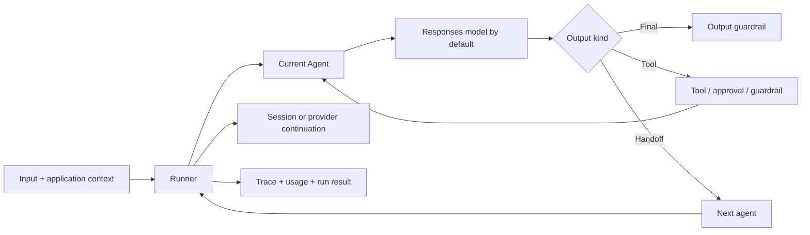
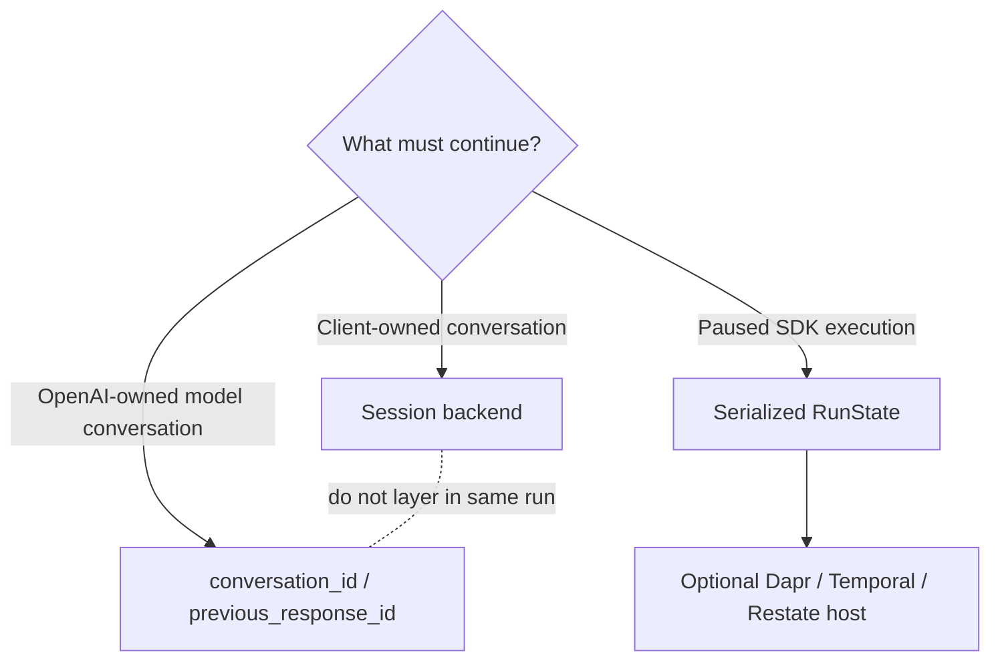
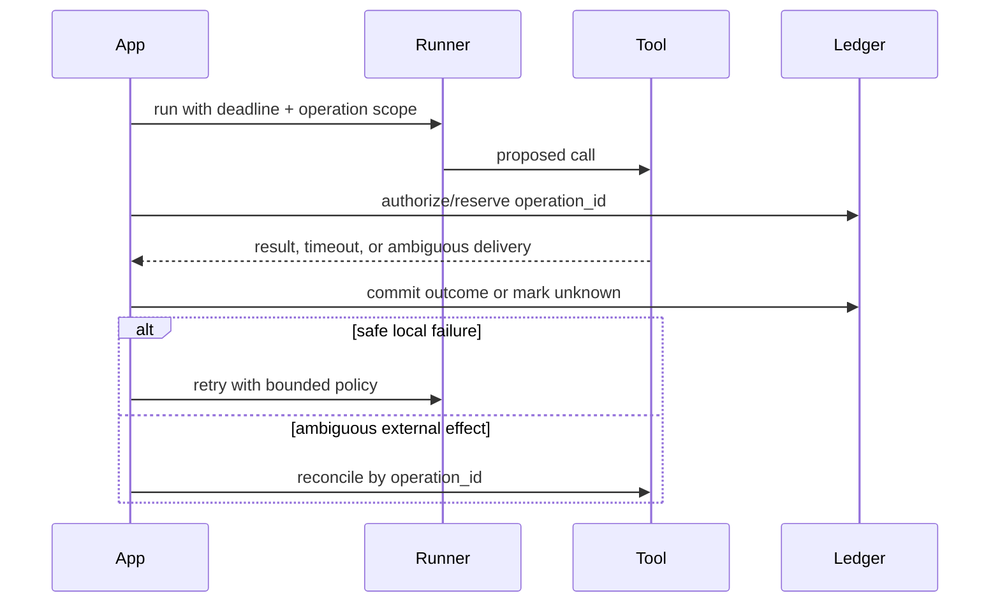

# OpenAI Agents SDK in Production

**Research date:** 2026-08-30  
**Status:** Research-backed technology guide  
**Scope:** Current Python and TypeScript SDKs; verify exact release before adoption

## Bottom line

Choose OpenAI Agents SDK when you want a relatively thin, code-first loop with first-class OpenAI Responses features, tools, handoffs, approval interruptions, sessions, and tracing. Keep business state, authorization, effect identity, and durable job ownership outside the SDK.

Do not choose it merely because the model provider is OpenAI. A direct Responses call is smaller for one-step work; a durable workflow engine is stronger when a run must survive crashes, waits, and non-idempotent effects.

## Mental model

The runner owns turns. Your application still owns admission, identity, authorization, deadlines, idempotency, artifact storage, and repair.

## What the SDK packages

| Concern | Native surface | Production interpretation |
|---|---|---|
| Loop | `Runner.run`, sync and streamed variants, maximum turns, error handlers | Bound total time and model/tool work outside the turn counter too |
| Delegation | Handoffs and agents-as-tools | Handoffs change the active specialist; agents-as-tools keep a manager in control |
| Tools | Function, hosted, local execution, MCP, tool search, programmatic calls | Guardrail and execution semantics differ by tool category |
| State | Client sessions, OpenAI Conversations/response chaining, serializable `RunState` | Pick one conversation authority; none is automatically business workflow state |
| Approval | Run-wide interruptions that resume from `RunState` | Persist exact request, policy/version, expiry, and approver separately |
| Safety checks | Input, output, and function-tool guardrails | Coverage is not uniform across hosted tools, handoffs, and built-in execution tools |
| Telemetry | Default tracing for model, agent, tool, handoff, and guardrail spans | Redact beyond SDK span payloads; ZDR accounts cannot use OpenAI tracing |
| Sandboxed work | Python-first sandbox agent/harness capabilities and provider integrations | Newer and language-asymmetric; treat the manifest and workspace as versioned runtime config |

## State is three different choices

- A **session** prepends stored history and appends new run items. The Python SDK offers several backends, but their concurrency, consistency, encryption, and lifecycle characteristics differ.
- **Provider continuation** reduces client transcript handling and couples state to OpenAI Responses/Conversations semantics.
- **`RunState`** captures interrupted execution. It may include application context, approvals, tool input, trace metadata, and credentials if configured carelessly; encrypt and version it.

Automatic response compaction is useful but not free. It may keep a stream open after the last token, rewrites stored history, and can race concurrent mutations. Schedule compaction between turns when latency and consistency matter.

## Guardrails: know the boundary

| Desired policy | Correct mechanism | Common error |
|---|---|---|
| Reject initial input before any expensive or effectful work | Blocking input guardrail | Default parallel guardrail may finish after work starts |
| Validate final answer | Output guardrail | Assuming it validates intermediate handoff output |
| Check every custom function call | Function-tool input/output guardrails | Assuming hosted tools or handoffs use the same pipeline |
| Authorize an external write | Application policy at proposal and commit | Treating a model guardrail as deterministic authorization |
| Contain shell/filesystem work | Sandbox capability and egress boundary | Treating approval as containment |

The strongest rule is simple: apply deterministic policy immediately before the external effect, even if an SDK guardrail or human approval ran earlier.

## Failure and recovery contract

SDK retries and occurrence tracking can prevent some accidental duplicate input handling. They cannot prove whether an external API performed a write. A resumed run must consume an effect receipt or reconcile; it must not infer “tool result missing” means “tool did not run.”

## Provider portability

The model interface supports custom providers and best-effort Any-LLM/LiteLLM adapters. This is useful for controlled experiments, not evidence of semantic portability. Validate, per provider:

- structured-output strictness and repair behavior;
- parallel tool-call ordering and identifiers;
- hosted-tool availability;
- usage completeness and price attribution;
- streaming termination, cancellation, and retry classification;
- preservation of request IDs and raw provider diagnostics.

Keep a provider-neutral domain transcript and effect ledger even when the SDK transcript is OpenAI-specific.

## Operational acceptance tests

- [ ] Pin Python or TypeScript SDK and model versions; record language-specific capability gaps.
- [ ] Test maximum turns, wall-clock deadline, cancellation during model stream, and cancellation during every tool class.
- [ ] Run approval → serialize → restart → approve/reject → resume through the production store.
- [ ] Attempt concurrent writes to one session and concurrent compaction.
- [ ] Crash before tool send, after send, after remote commit, and before result persistence.
- [ ] Verify tracing flush on success, exception, cancellation, and unconsumed streams.
- [ ] Confirm sensitive data is absent from spans, exception chains, logs, and serialized state.
- [ ] Test handoff history and agent-as-tool context against real token budgets.
- [ ] Replay evaluation fixtures after every SDK, model, prompt, tool-schema, or session migration.

## Choose it when

- OpenAI Responses and hosted tools are core requirements.
- The application benefits from explicit handoffs, tool loops, and resumable approvals without adopting a large graph abstraction.
- You can operate state, policy, effects, and durability as independent services.
- Python or TypeScript fits the execution boundary and current feature parity is acceptable.

## Prefer another shape when

- A single model/tool round trip is enough: call the API directly.
- The workload is fundamentally a deterministic business process: use ordinary workflow code.
- Crash-safe waits and effect replay dominate: put the SDK inside a durable workflow activity boundary.
- Autonomous workspace work is the primary abstraction: compare a harness such as Claude Agent SDK or a sandbox-agent surface directly.
- Uniform cross-provider behavior is a hard requirement: prove a thin custom adapter against multiple providers first.

## Version and freshness notes

At this research snapshot, both language lines are changing rapidly and remain pre-1.0. Python has received newer sandbox/harness capabilities first, while TypeScript has its own Realtime and validation ecosystem. Never infer parity from the shared product name. Recheck the [Python release notes](https://openai.github.io/openai-agents-python/release/) and [TypeScript changelog](https://github.com/openai/openai-agents-js/blob/main/packages/agents/CHANGELOG.md) together.

## Sources and related guides

Primary sources: [Agents SDK Python](https://openai.github.io/openai-agents-python/), [running agents](https://openai.github.io/openai-agents-python/running_agents/), [sessions](https://openai.github.io/openai-agents-python/sessions/), [human in the loop](https://openai.github.io/openai-agents-python/human_in_the_loop/), [guardrails](https://openai.github.io/openai-agents-python/guardrails/), [tracing](https://openai.github.io/openai-agents-python/tracing/), [models](https://openai.github.io/openai-agents-python/models/), and [April 2026 SDK evolution](https://openai.com/index/the-next-evolution-of-the-agents-sdk/).

- [Provider-native framework selection](../comparisons/provider-native-agent-frameworks.md)
- [Production agent loop](../foundations/agent-loop.md)
- [Execution boundaries](../runtime/execution-boundaries.md)
- [Durable execution](../runtime/durable-execution.md)
- [Tool contracts](../tools/tool-contracts.md)
- [Research packet](../research/packets/provider-native-agent-frameworks.md)
