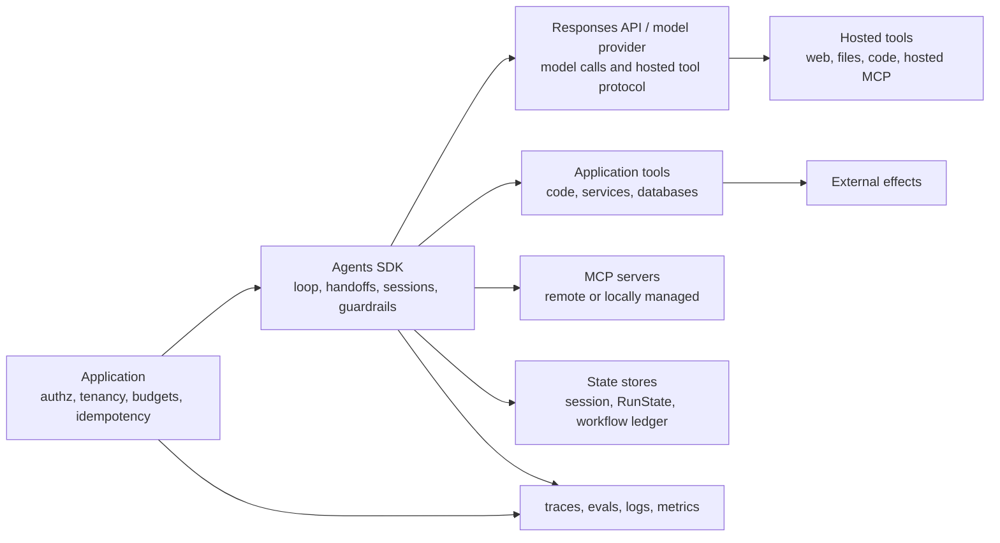
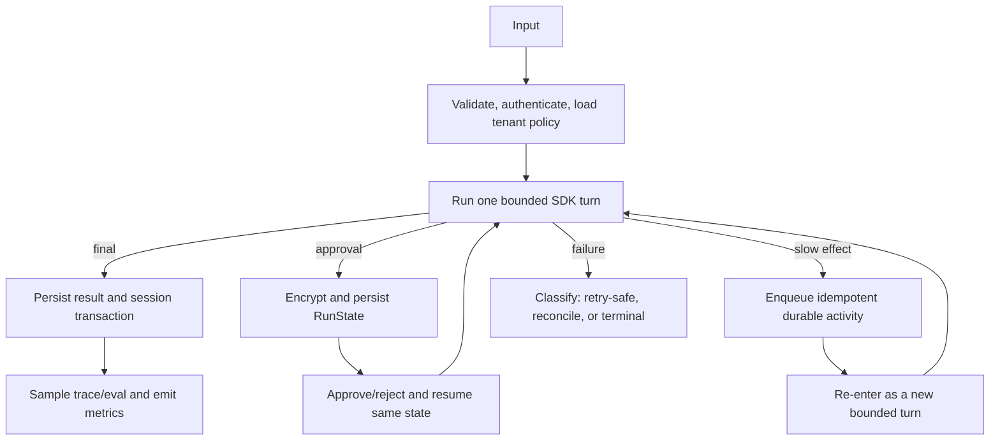

# OpenAI Agents SDK: production deep dive

**Research date:** 2026-08-31  
**Status:** Research-backed, version-sensitive guide  
**Scope:** OpenAI Agents SDK for Python and TypeScript, with explicit boundaries around the Responses API, hosted tools, Realtime, sandbox agents, and application infrastructure

The Agents SDK is a deliberately small orchestration layer around a consequential control loop: call a model, inspect its response, execute tools or transfer control, and repeat until a final output or interruption exists. Production quality comes less from adding agents and more from making every boundary—model, tool, state, approval, retry, and trace—explicit.

This area expands the repository's [concise framework overview](../openai-agents-sdk.md). It is written for engineers selecting, implementing, and operating the SDK rather than for first-run tutorials.

## Use this map

| If you need to decide or build… | Start here |
|---|---|
| Run-loop shape, turn budgets, stop conditions | [Architecture and run lifecycle](architecture-and-run-lifecycle.md) |
| Agent configuration, dynamic instructions, models, provider portability | [Agents, models, and provider boundaries](agents-models-and-provider-boundaries.md) |
| Function tools, hosted tools, MCP, schemas, structured output | [Tools and structured outputs](tools-and-structured-outputs.md) |
| History, local context, sessions, RunState, server conversations | [Sessions, context, and state](sessions-context-and-state.md) |
| Handoffs versus manager agents and nested execution | [Handoffs and multi-agent design](handoffs-and-multi-agent.md) |
| Stream event handling, settlement, cancellation, Realtime distinction | [Streaming, events, and Realtime](streaming-events-and-realtime.md) |
| Traces, deterministic tests, eval datasets, regression gates | [Tracing, evaluation, and testing](tracing-evaluation-and-testing.md) |
| Guardrails, approvals, authorization, MCP and data risks | [Security, guardrails, and approvals](security-guardrails-and-approvals.md) |
| Timeouts, retries, replay safety, recovery, durability | [Reliability, cancellation, and recovery](reliability-cancellation-and-recovery.md) |
| Deployment topology, lifecycle, capacity, cost, observability | [Deployment, operations, and cost](deployment-operations-and-cost.md) |
| Isolated workspaces, snapshots, mounts, memory, long-running work | [Sandbox agents and long-running work](sandbox-agents-and-long-running-work.md) |
| Python/TypeScript differences, upgrade policy, limitations | [Version, parity, migrations, and limitations](version-parity-migrations-and-limitations.md) |
| Evidence, scope, claim ledger, and unresolved questions | [Research packet](../../research/packets/openai-agents-sdk-deep-dive.md) |

## The boundary map

The diagram is an ownership model, not merely a request path:

- The **Responses API or another model provider** owns model inference, its wire protocol, and provider-hosted tools.
- The **Agents SDK** owns the in-process loop, normalized items, handoffs, local tool dispatch, SDK sessions, guardrails, approvals, and trace integration.
- The **application** still owns authentication, tenant isolation, authorization, effect idempotency, persistence selection, deployment, reconciliation, and operational policy.
- A **sandbox** is an isolated workspace runtime. It does not make business effects durable or trustworthy by itself.
- The **Realtime API** is a distinct low-latency product surface. The SDK's Responses WebSocket transport is not Realtime.

This distinction prevents a common category error: an SDK feature may expose a base API capability without implementing it locally. A hosted web-search tool, for example, runs on OpenAI infrastructure; a function tool runs in your process unless you deliberately move it elsewhere.

## Minimum production contract

Before a workload leaves a development environment, define all of the following:

- [ ] Explicit SDK versions and explicit model identifiers or snapshots.
- [ ] A bounded run budget: turns, wall-clock deadline, token/cost budget, and tool-specific limits.
- [ ] A single conversation-history strategy per run.
- [ ] An application-owned [state and event contract](../../runtime/agent-state-and-event-contracts.md) for stable identity, terminal outcomes, replay, and delivery projections.
- [ ] Strict input and output schemas at every model/tool boundary.
- [ ] Execution-time authorization independent of tool visibility.
- [ ] Approval policy for externally visible, destructive, privileged, or irreversible actions.
- [ ] Idempotency and reconciliation for side-effecting tools.
- [ ] A cancellation path that reaches provider calls and cooperative tools.
- [ ] State encryption, retention, versioning, and tenant scoping.
- [ ] Trace redaction or disabling where sensitive-data or Zero Data Retention constraints require it.
- [ ] Deterministic tests, provider integration tests, dataset evals, and adversarial cases.
- [ ] Drain/shutdown behavior for streams, traces, MCP connections, WebSockets, and sandboxes.
- [ ] Upgrade acceptance tests for both SDK and model changes.

## Recommended default architecture

Start with one agent and typed tools. Add a manager agent when the model must choose among bounded specialists while retaining user-facing ownership. Use a handoff only when the destination should own the rest of the conversation turn. Put slow or failure-prone effects behind a durable job/workflow boundary rather than stretching one in-memory run indefinitely.

## Version posture

At the research cutoff, the inspected official source snapshots were:

| Surface | Inspected version | Source snapshot |
|---|---:|---|
| Python `openai-agents` | 0.22.0 | official repository commit `89c02c8` (2026-08-28) |
| TypeScript `@openai/agents` | 0.17.0 | official repository commit `8e862b3` (2026-08-28) |

Both packages are pre-1.0 and document a modified semantic-versioning policy in which a minor release can break public non-beta APIs. Examples in this area emphasize semantic contracts over copy-paste snippets. Pin exact versions for risk-sensitive systems, test upgrades, and do not infer parity from similarly named APIs.

## Refresh triggers

Recheck this area when any of these change:

- either SDK's minor version, default model, session contract, retry policy, or testing utilities;
- Responses API tool, conversation, background-mode, or streaming semantics;
- sandbox-agent beta status or provider support;
- MCP authorization/approval guidance;
- tracing behavior, data controls, or eval APIs;
- a provider adapter's structured-output, tool-call, usage, or streaming behavior.

## Primary sources

- [OpenAI developer guide: Agents](https://developers.openai.com/api/docs/guides/agents)
- [OpenAI developer guide: Run agents](https://developers.openai.com/api/docs/guides/agents/running-agents)
- [OpenAI developer guide: Orchestration](https://developers.openai.com/api/docs/guides/agents/orchestration)
- [OpenAI developer guide: Guardrails and approvals](https://developers.openai.com/api/docs/guides/agents/guardrails-approvals)
- [OpenAI Agents SDK for Python documentation](https://openai.github.io/openai-agents-python/)
- [OpenAI Agents SDK for TypeScript documentation](https://openai.github.io/openai-agents-js/)
