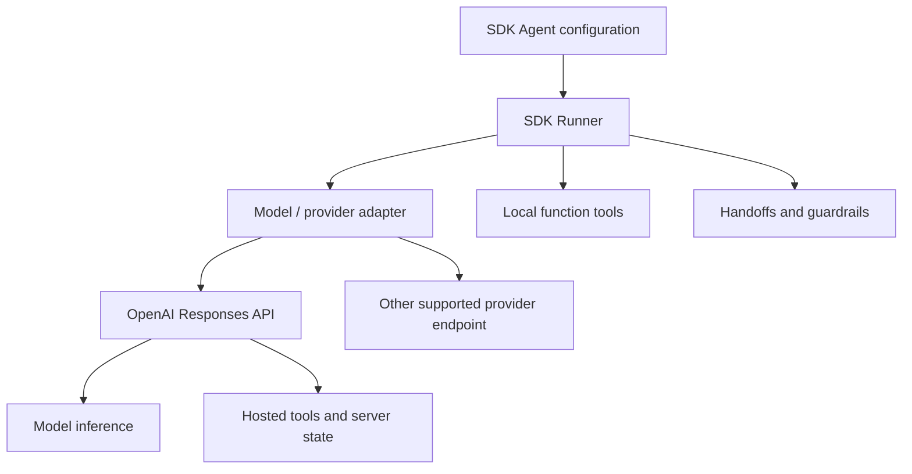
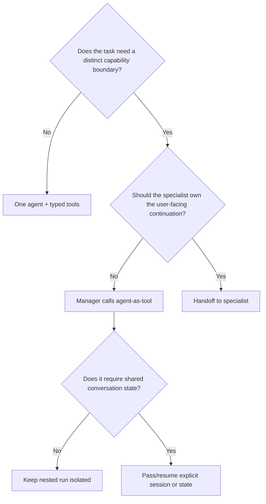

# Agents, models, and provider boundaries

**Research date:** 2026-08-31  
**Status:** Research-backed, version-sensitive guide  
**Scope:** Agent configuration, instructions, models and settings, clones, provider adapters, and portability limits in Python and TypeScript

An SDK agent is configuration plus policy, not an autonomous process. It packages instructions, a model choice, tools, guardrails, handoffs, and an optional structured output contract. The runner supplies the process.

## Agent configuration model

| Field | Purpose | Production question |
|---|---|---|
| Name and description | Identification and routing context | Is it stable and useful in traces and handoff selection? |
| Instructions | Policy and task context | Which portions are immutable, dynamic, or user-controlled? |
| Model and settings | Inference behavior | Is the exact model explicit, supported, and acceptance-tested? |
| Tools | Capabilities | Where are schemas, authorization, timeouts, and effects enforced? |
| Handoffs | Transfer targets | Should ownership transfer, or should a manager call a specialist? |
| Guardrails | Input/output/tool checks | At which exact lifecycle boundary does each guardrail execute? |
| Output type | Terminal schema | How are validation failures surfaced and recovered? |

Keep agents declarative. Database clients, authenticated identities, caches, and transaction handles belong in application context, not global agent definitions or instructions.

## Instructions are a security boundary

Both SDKs support static instructions and dynamic instructions computed from the current run context. A useful layering is:

1. immutable platform policy;
2. tenant or product policy loaded from trusted storage;
3. task-specific instructions;
4. user content clearly delimited as data;
5. retrieved or tool-produced content explicitly labeled untrusted.

Dynamic instructions are appropriate for locale, entitlements, workflow phase, or safe tenant configuration. They are not proof of authorization. A model can misunderstand an instruction; the tool implementation must enforce the real decision.

Avoid placing secrets in instructions. Instructions are provider input, can appear in traces, and can be retained or exposed by later prompt/tool behavior.

## Model selection

The SDKs provide a default model, but the default has changed in minor releases. Production systems should select an explicit model and maintain a small acceptance matrix:

| Test dimension | Why |
|---|---|
| Tool schema acceptance and call ordering | Providers and models differ in strictness and item protocol |
| Structured final output | JSON/schema conformance can change |
| Handoff selection and refusal behavior | Behavioral capability, not only syntax |
| Streaming event sequence | Adapters may normalize incompletely |
| Usage accounting | Required for budgets and cost controls |
| Hosted-tool availability | Responses-only and model-specific capabilities |
| Retry and stateful continuation | Replay safety and response-ID semantics |

Model settings can tune tool choice, temperature-like behavior where supported, parallel tool calls, timeouts, reasoning, truncation, and provider-specific extras. Unsupported settings may be rejected, ignored, or mapped differently by an adapter. Make this observable: log the normalized configuration and validate the provider response rather than assuming the setting took effect.

## Base API versus SDK

| Capability | Primary owner |
|---|---|
| Provider request/response format, model inference | Base API/provider |
| Hosted web/file/code/MCP tools | Responses API/platform |
| In-process agent loop and normalized run items | Agents SDK |
| Function-tool process and application credentials | Your runtime/application |
| Handoffs, SDK guardrails, approvals, sessions | Agents SDK plus application policy |
| Authentication, tenant authorization, effect ledger | Application |

The SDK does not turn a non-Responses provider into full Responses semantic parity. An adapter can translate a call while still lacking hosted tools, stateful continuation, usage details, output items, or exact stream events.

## Provider portability is an acceptance claim

Treat portability as proven only after tests. The highest-risk mismatches are:

- strict tool and output schemas;
- tool-call identifiers and call/result ordering;
- multiple tool calls in one response;
- refusals and incomplete terminal responses;
- streaming deltas and final settlement;
- usage and reasoning-token accounting;
- stateful response continuation;
- model retry classification; and
- provider-hosted tools.

Use the smallest common feature set if portability is a product requirement. If a workflow depends on hosted MCP, web search, or provider conversations, document the OpenAI-specific dependency rather than hiding it behind an interface.

## Cloning and composition

Both SDKs provide mechanisms to derive or clone agent configurations. Cloning is helpful for narrow variants such as locale, model tier, or tool subset, but creates policy drift if used as inheritance.

Good practice:

- define a small trusted base;
- override only named fields;
- snapshot-test the effective configuration;
- avoid mutating shared tool arrays or context objects;
- give variants distinct trace-visible names; and
- re-run the same behavioral evals for every model or policy variant.

For materially different tasks, prefer separate explicit agents over a large conditional instruction function.

## Local application context

The run context is dependency injection for code: authenticated principal, tenant ID, service clients, policy objects, feature flags, and request-scoped caches. It is not automatically sent to the model. However, tools or dynamic instructions can expose it, and resumable RunState may serialize parts of application state.

Therefore:

- pass references or stable IDs instead of large mutable objects;
- never assume “local context” means safe to serialize;
- make context serialization explicit and versioned;
- scope credentials to the run and tool;
- avoid cross-tenant caches in shared objects; and
- do not allow a specialist agent to silently broaden the principal's permissions.

## Choosing agent granularity

Do not create an agent for every tool or topic. Extra agents increase model calls, routing ambiguity, prompt surface, eval combinations, and state complexity.

## Model change runbook

- [ ] Pin the candidate SDK and explicit candidate model.
- [ ] Run deterministic SDK contract tests unchanged.
- [ ] Run provider integration tests for tools, schemas, streams, and usage.
- [ ] Compare dataset eval quality, latency, and cost.
- [ ] Re-run injection, refusal, excessive-agency, and approval tests.
- [ ] Inspect traces for new item types or sequencing.
- [ ] Verify fallbacks do not replay external effects.
- [ ] Canary by tenant/workflow, with rollback to the prior explicit model.

## Limits and refresh triggers

At the cutoff, official package defaults had recently moved to `gpt-5.6-luna`; that detail is intentionally not treated as a recommendation. Refresh on model deprecations, a default-model change, new provider adapters, structured-output changes, or any SDK minor release that alters model settings.

## Primary sources

- [Define agents](https://developers.openai.com/api/docs/guides/agents/define-agents)
- [Models in the Agents SDK](https://developers.openai.com/api/docs/guides/agents/models)
- [OpenAI Agents SDK Python: agents](https://openai.github.io/openai-agents-python/agents/)
- [OpenAI Agents SDK TypeScript: agents](https://openai.github.io/openai-agents-js/guides/agents/)

## Continue reading

[Knowledge-area map](README.md) · [Tools and structured outputs](tools-and-structured-outputs.md) · [Handoffs and multi-agent design](handoffs-and-multi-agent.md) · [Version and parity](version-parity-migrations-and-limitations.md)

