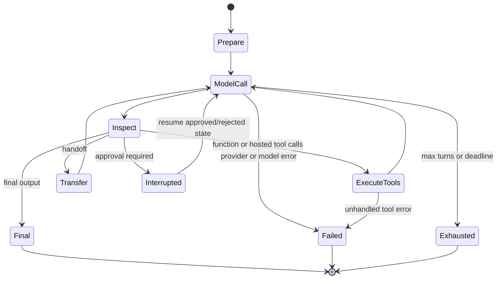
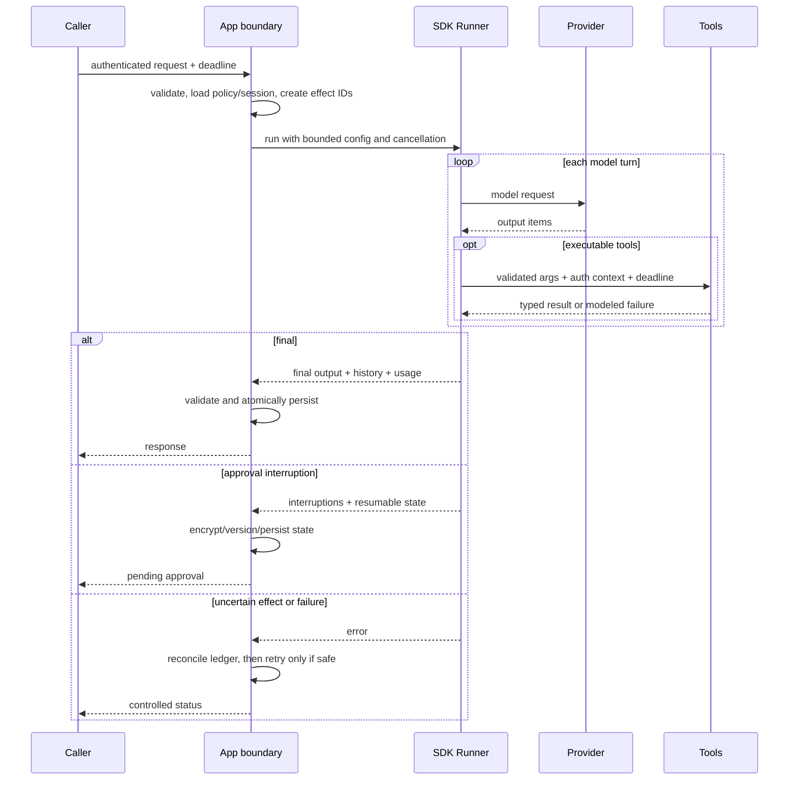

# Architecture and run lifecycle

**Research date:** 2026-08-31  
**Status:** Research-backed, version-sensitive guide  
**Scope:** The SDK runner loop, turns, run configuration, stop paths, lifecycle ownership, and design implications in Python and TypeScript

An Agents SDK run is best treated as **one bounded application-level turn**. It can contain several model calls, many tool calls, a handoff, and an approval interruption. It is not a durable workflow, a background job queue, or a guarantee that effects happened exactly once.

## The canonical loop



The runner calls the active agent's model, converts the response into SDK items, executes any applicable tools or handoff, and repeats. A **turn** in the SDK limit is a model invocation, not each tool call. The inspected Python and TypeScript versions default to ten turns; disabling the limit is possible but usually inappropriate in an online request path.

### Terminal paths

| Path | Meaning | Application response |
|---|---|---|
| Final output | The active agent produced its configured terminal output | Validate, persist, return |
| Interruption | One or more tool approvals are pending | Persist the exact run state; collect decisions; resume |
| Max turns | The loop used its configured model-call budget | Return a controlled failure or use a supported run error handler |
| Provider/model failure | Timeout, transport, refusal, invalid terminal response, or other model error | Classify retry safety; avoid blind replay |
| Tool failure | Tool returned a modeled error or raised | Let the model repair only when safe; otherwise stop/reconcile |
| Cancellation | Caller deadline, user action, or shutdown | Propagate cancellation and persist only coherent state |

## Runner surfaces

| Concern | Python | TypeScript |
|---|---|---|
| Normal asynchronous run | `Runner.run(...)` | `runner.run(...)` or convenience `run(...)` |
| Synchronous wrapper | `Runner.run_sync(...)` | No equivalent general synchronous Node execution |
| Streamed run | `Runner.run_streamed(...)` | `run(..., { stream: true })` |
| Completion wait | result returned / exhaust stream | result returned / `await stream.completed` |
| Cancellation | task cancellation and streamed-result cancellation modes | `AbortSignal`, iterator/reader cancellation |
| Resumable interruption | serialized `RunState` / result state | serialized `RunState` / result state |

Names and serialization details are language-specific. Build an application adapter around the lifecycle you use; do not attempt to make Python and TypeScript objects wire-compatible without an explicit, versioned interchange schema.

## Configuration layers

There are three useful scopes:

1. **Agent configuration**: instructions, model, tools, handoffs, guardrails, output type, model settings.
2. **Run configuration**: cross-agent overrides and controls such as model/provider selection, tracing, input filters, tool-execution concurrency, retry policies, and error handlers.
3. **Application policy**: authentication, authorization, deadlines, token/cost budgets, idempotency, storage, and operational limits.

The last layer is not optional just because the SDK has a turn limit. A ten-turn run can still issue expensive hosted tools, start many local tool calls, or block in one tool.

### Budget independently

```text
run budget =
  model-call turns
  + provider request timeout per attempt
  + retry/backoff allowance
  + local/remote tool deadlines
  + token and monetary ceilings
  + total wall-clock deadline
```

The model timeout is normally per provider attempt; it is not a total run deadline and does not bound tool execution. A production wrapper should enforce a wall-clock deadline and pass its remaining time or cancellation signal into cooperative tools.

## Tool concurrency has two controls

Do not conflate:

- **provider parallel tool calls**, a model setting that influences whether a response can emit more than one tool call; and
- **local function-tool concurrency**, a run setting that caps how many emitted function tools execute simultaneously.

With no local cap, the runner can start all function calls that the model emitted. Apply a conservative cap when tools contend for a database, browser, GPU, rate-limited service, or tenant quota. Tools that mutate shared state usually need serialization or explicit optimistic concurrency.

## Model-input interception

The run-level model-input filter runs immediately before each model call. It is a useful last boundary for:

- pruning or redacting history;
- enforcing a system-message invariant;
- recording a stable request fingerprint;
- rejecting over-budget calls; or
- adapting provider-specific input.

It is not a replacement for session transaction logic. Session history is merged earlier, and any filter must preserve tool-call/result relationships that the target provider requires. Treat filter changes as protocol changes and regression-test multi-tool and handoff histories.

## Lifecycle ownership

The runner owns only objects it creates under its documented lifecycle. Your application may additionally own:

- a session store or database transaction;
- an MCP client connection;
- a cached Responses WebSocket provider;
- a sandbox session supplied by the caller;
- a tracing exporter or processor;
- open streams and background tasks.

Create these at an appropriate request, worker, or process scope and close them deterministically. In serverless or edge environments, explicitly flush traces where the runtime may freeze immediately after returning.

## A robust run wrapper



## Design rules

- Keep the online run small. Convert long waits and unreliable effects into durable activities that report back in a later turn.
- Treat every tool call as untrusted input even when the model generated it.
- Make final-output validation independent of “the model probably followed the schema.”
- Persist interruption state before displaying an approval request.
- Record stable effect identifiers before a tool starts, not after it returns.
- Drain streamed runs after the last user-visible token so session updates and bookkeeping settle.
- Use the result's actual last agent and history; a handoff can change which agent finished.
- Measure model calls, tool calls, wall time, usage, retries, interruptions, and cancellations separately.

## Failure review checklist

- [ ] Did the failure happen before any tool, during a read, or after a possible effect?
- [ ] Was a provider response already streaming?
- [ ] Is the failed request safe to replay according to its stateful/replay classification?
- [ ] Did the session transaction commit, partially commit, or remain unchanged?
- [ ] Is RunState available and version-compatible?
- [ ] Are background tool tasks still running?
- [ ] Does the external system show the effect despite a timeout?
- [ ] Were traces flushed without exposing restricted data?

## Limits and refresh triggers

This lifecycle is accurate for the inspected Python 0.22.0 and TypeScript 0.17.0 source snapshots. Recheck on any minor upgrade, especially default turn limits, tool-concurrency settings, retry hooks, session merging, interruption serialization, and streamed completion semantics.

## Primary sources

- [Run agents](https://developers.openai.com/api/docs/guides/agents/running-agents)
- [Results](https://developers.openai.com/api/docs/guides/agents/results)
- [OpenAI Agents SDK Python: running agents](https://openai.github.io/openai-agents-python/running_agents/)
- [OpenAI Agents SDK TypeScript: running agents](https://openai.github.io/openai-agents-js/guides/running-agents/)

## Continue reading

[Knowledge-area map](README.md) · [Sessions, context, and state](sessions-context-and-state.md) · [Reliability and recovery](reliability-cancellation-and-recovery.md) · [Streaming and events](streaming-events-and-realtime.md)
