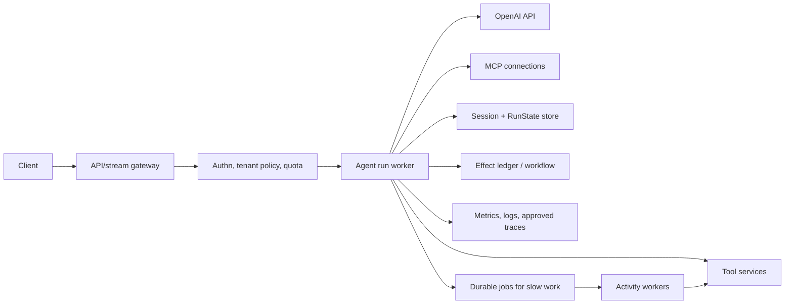
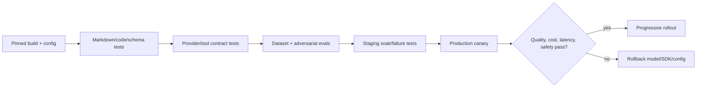

# Deployment, operations, and cost

**Research date:** 2026-08-31  
**Status:** Research-backed, version-sensitive guide  
**Scope:** Service topology, environment isolation, process lifecycle, capacity, latency, cost, rate limits, observability, rollout, and incident operations

Deploy the SDK as an application runtime, not as a self-contained control plane. The SDK runner is usually stateless between bounded turns if sessions, resumable state, effect ledgers, and artifacts live in appropriate external systems.

## Reference topology



Horizontal scaling is straightforward only when conversation concurrency and state mutations are coordinated. Sticky sessions do not replace a transaction/version check.

## Environment and access isolation

OpenAI production guidance recommends separate projects for staging and production. Also separate:

- API keys and service identities;
- rate/spend limits;
- trace/eval projects and retention;
- MCP credentials;
- sandbox providers/workspaces;
- external tool test tenants.

Store secrets in a secret manager or platform runtime configuration. Rotate them without editing prompts or agent manifests. Use organization/project RBAC with least privilege and keep administrative keys away from agent workers.

## Process lifecycle

On startup:

- validate pinned SDK/model configuration;
- initialize HTTP/provider clients and bounded connection pools;
- establish only required MCP connections;
- verify session/effect stores;
- register readiness only after critical dependencies are usable.

On shutdown:

1. stop accepting new runs;
2. signal cancellation or allow bounded drain;
3. settle or safely persist active streams;
4. close MCP and cached WebSocket providers;
5. flush traces/metrics with a deadline;
6. close caller-owned sandboxes and store clients.

Do not let termination wait indefinitely on a model or tool.

## Capacity model

Track separate bottlenecks:

| Resource | Control |
|---|---|
| Provider requests/tokens | rate-limit budget, concurrency, backoff, model choice |
| Local function tools | per-run and global concurrency pools |
| MCP connections | connection/session caps and health |
| Database/session store | transaction latency and hot-conversation conflicts |
| Streams | connection count, buffer limits, proxy timeouts |
| Sandboxes | provider quota, startup time, CPU/memory/storage |
| Durable activities | queue depth, leases, retries, dead-letter/reconcile |

A per-run tool concurrency cap does not protect the whole service. Add tenant and global bulkheads.

## Latency

Official optimization principles are broadly:

- make fewer model requests;
- send fewer tokens;
- parallelize independent work;
- stream to reduce perceived latency;
- do not use a model where deterministic code suffices.

Apply them carefully:

- One manager plus many specialists may increase both calls and tail latency.
- Tool search can reduce schema tokens for large catalogs.
- Programmatic tool calling can reduce model round trips for bounded orchestration.
- Compaction controls long-context cost but may add settlement latency.
- WebSocket transport can reduce connection setup but adds lifecycle/recovery complexity.
- Speculative guardrails reduce latency only when the risk of work before rejection is acceptable.

Measure time to first visible token, time to last visible item, and time to settled completion separately.

## Cost

```text
cost per successful outcome =
  model input + cached input + output + reasoning
  + nested agent calls
  + hosted tools
  + sandbox/runtime compute
  + external services
  + retry and failed-run waste
```

Cost controls:

- select the smallest model that meets an evaluated quality target;
- use explicit models instead of a shifting default;
- trim instructions/history and defer large tool catalogs;
- cap turns, nested depth, tool calls, and wall time;
- cache deterministic application results where safe;
- use Batch/Flex processing for eligible asynchronous lower-priority work;
- alert on cost per successful outcome and runaway loops.

Do not optimize token price while ignoring human review, failed tasks, or duplicate external effects.

## Observability and SLOs

Minimum operational signals:

- request/run rate and concurrent active runs;
- final, interrupted, max-turn, refusal, failure, and cancellation rates;
- model latency/usage/retry/rate-limit metrics;
- tool latency/error/timeout/reconcile metrics by safe bounded name;
- session conflicts and resume failures;
- active streams and settlement lag;
- trace export/flush failures;
- sandbox startup/cleanup and leaked resource counts;
- cost per tenant/workflow/success;
- eval/canary quality drift.

Candidate SLOs should describe user outcomes, such as “eligible support turns reach a validated final or approval state within X seconds,” rather than only API uptime.

## Deployment sequence



Roll SDK and model changes independently where possible. That makes regressions attributable and rollback safer.

## Operations runbooks

Prepare procedures for:

- provider rate limiting or regional outage;
- a tool/MCP server returning malicious or malformed content;
- stuck or leaking streams/sandboxes;
- session-store degradation;
- duplicate/uncertain effects;
- tracing exporter failure or restricted-data exposure;
- model quality or routing regression;
- emergency disable by tool, workflow, tenant, or model;
- migration/expiry of pending RunState.

## Production checklist

- [ ] Staging and production projects/keys/stores are separated.
- [ ] Explicit SDK and model versions are recorded in every run.
- [ ] Readiness and graceful drain cover all owned resources.
- [ ] Tenant/global concurrency and spend limits exist.
- [ ] Slow effects use a durable queue/workflow boundary.
- [ ] Logs/traces obey data policy and ZDR constraints.
- [ ] SLOs cover settled outcomes and approval latency.
- [ ] Canary thresholds and rollback are automated or rehearsed.
- [ ] Kill switches and reconciliation runbooks are tested.

## Limits and refresh triggers

Refresh on platform rate-limit, Batch/Flex, pricing, model, tracing, WebSocket, sandbox quota, or deployment-guidance changes. Cost numbers are intentionally omitted because they change; calculate them from current official pricing and measured traffic.

## Primary sources

- [Production best practices](https://developers.openai.com/api/docs/guides/production-best-practices)
- [Production deployment checklist](https://developers.openai.com/api/docs/guides/deployment-checklist)
- [Latency optimization](https://developers.openai.com/api/docs/guides/latency-optimization)
- [Cost optimization](https://developers.openai.com/api/docs/guides/cost-optimization)

## Continue reading

[Knowledge-area map](README.md) · [Reliability and recovery](reliability-cancellation-and-recovery.md) · [Tracing and evaluation](tracing-evaluation-and-testing.md) · [Sandbox agents](sandbox-agents-and-long-running-work.md)

