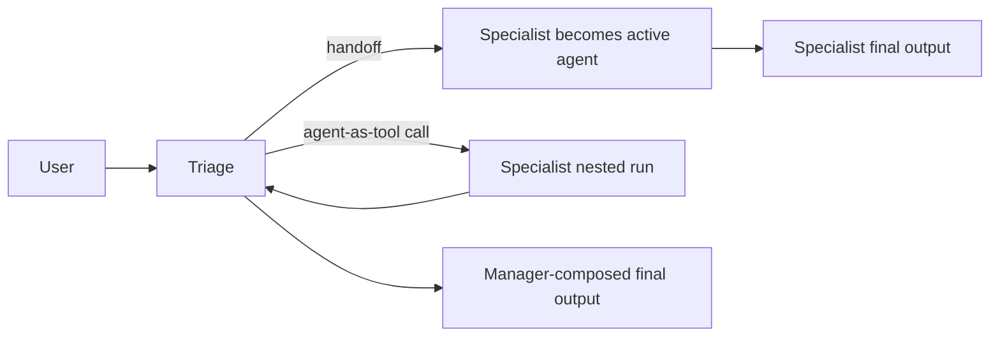
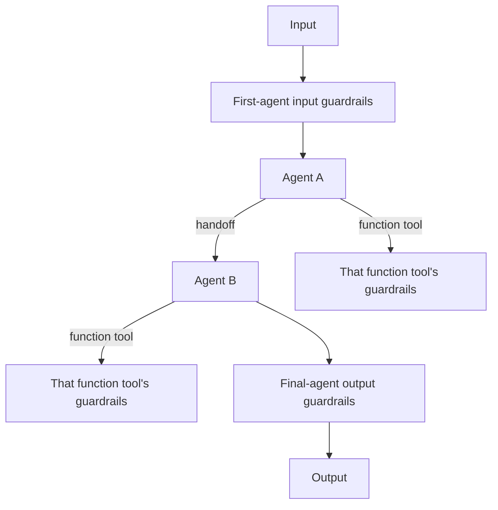
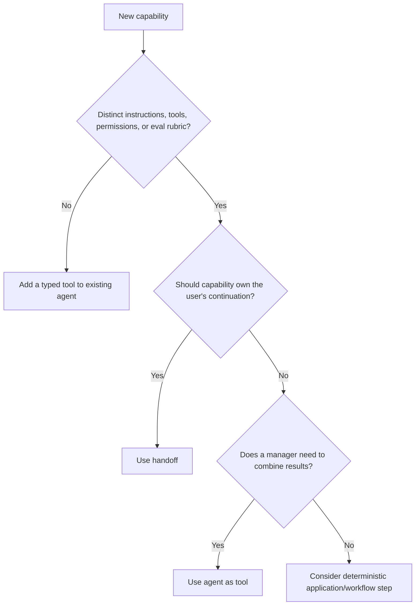

# Handoffs and multi-agent design

**Research date:** 2026-08-31  
**Status:** Research-backed, version-sensitive guide  
**Scope:** Handoffs, agents as tools, manager patterns, context transfer, recursion controls, and practical multi-agent selection

Multi-agent design should follow ownership boundaries, not an organizational chart. Most systems need one agent with well-designed tools. Add another agent only when a distinct instruction/tool/eval boundary reduces risk or improves quality enough to justify more routing and state complexity.

## Two orchestration primitives

| Primitive | User-facing owner after invocation | Best for |
|---|---|---|
| Handoff | Destination agent | Triage to a specialist that should continue the turn |
| Agent as tool | Calling manager agent | Bounded specialist output composed by a manager |

A handoff changes active-agent ownership. An agent-as-tool is ordinary tool orchestration around a nested run. This affects instructions, output guardrails, final output type, history, trace interpretation, and who answers the user.

## Handoff contract

Treat each handoff as a typed route:

- clear destination description used for selection;
- structured handoff input containing only needed routing/context fields;
- an input filter that removes irrelevant or sensitive history where necessary;
- destination tools and permissions no broader than the principal;
- trace metadata recording source, destination, reason, and policy version;
- explicit limits on cycles and total model turns.

Do not ask a model to transfer an access token, hidden system policy, or full internal context through handoff arguments. Use trusted application context for those.

### Guardrail boundary

Input guardrails apply to the first agent's initial input. Output guardrails apply to the agent that produces the final output. A handoff can therefore change which output guardrails execute. Tool guardrails attach to individual function tools and do not automatically govern hosted tools, handoffs, or arbitrary nested calls.

Map every control to its actual execution point:

Authorization remains inside each tool and downstream service.

## Manager pattern

Choose an agent-as-tool when the manager should:

- call multiple specialists and compare outputs;
- preserve one final-output schema;
- hide specialist transcripts from the end user;
- enforce a common final policy;
- combine domain work into one answer.

Make specialist inputs narrower than the full conversation and outputs smaller than complete transcripts. A specialist that returns free-form reasoning increases tokens and prompt-injection propagation; prefer a typed finding/evidence/uncertainty object.

Nested agent state is not automatically shared in all modes. Pass an explicit session or supported resume state if continuity is required. Otherwise, treat the nested run as isolated and supply its complete task input.

## Routing quality

Routing is a classification problem and needs its own eval set. Include:

- obvious positive cases for every destination;
- near-boundary and ambiguous cases;
- requests spanning several domains;
- adversarial text that names a specialist to manipulate routing;
- unsupported or high-risk requests;
- “stay with current agent” cases;
- cyclic routing pressure.

Measure destination accuracy, unnecessary handoffs, loops, cost, latency, and final resolution—not only whether a route was technically valid.

## Context transfer

Transfer the minimum state necessary:

| State | Preferred channel |
|---|---|
| User-visible task facts | filtered conversation or structured handoff input |
| Principal, tenant, entitlements | trusted local context |
| Long-lived domain state | authoritative database/service |
| Approval status | resumable run state and audit store |
| Specialist result | typed tool result |
| Large artifact | authorized object/file reference, not pasted transcript |

History nesting/filter behavior is version-sensitive. Python has an opt-in beta nested handoff-history surface in the inspected version; the TypeScript docs did not establish equivalent parity. Do not make cross-language architecture depend on it.

## Preventing loops and fan-out

- Retain a global max-turn budget across handoffs.
- Add application limits for nested-run depth and total specialist calls.
- Deny or downgrade repeated source/destination cycles.
- Cap local tool concurrency independently.
- Track total usage across every nested run.
- Avoid symmetric “handoff to anyone” graphs.
- Let one router own ambiguous selection.
- Escalate unsupported cases to a deterministic fallback, not another unconstrained agent.

## Failure semantics

If a nested agent fails, decide whether the manager receives a typed partial failure, retries a read-only operation, or stops. Do not convert every infrastructure error into model-visible prose; a model may fabricate around an outage.

If a handoff destination cannot operate, the original agent is no longer automatically a safe rollback point. Persist enough state to return a controlled failure or deliberately route through an application recovery policy.

## Selection decision

The deterministic workflow option is often best when routing is known from business state rather than natural-language intent.

## Production checklist

- [ ] Each agent has a distinct capability and eval rubric.
- [ ] Route descriptions and inputs are typed and minimal.
- [ ] Principal and tenant propagate through trusted context.
- [ ] Tool authorization is enforced after every route.
- [ ] Input/output/tool guardrail boundaries are documented.
- [ ] Cycles, nested depth, turns, calls, tokens, and wall time are bounded.
- [ ] Specialist results are typed and injection-resistant.
- [ ] Routing has a dedicated adversarial eval set.
- [ ] Trace views expose active agent and nested usage.
- [ ] Failure and fallback do not replay external effects.

## Limits and refresh triggers

Refresh when handoff history filters, nested-session/resume behavior, agent-as-tool APIs, or guardrail execution order changes. Verify Python and TypeScript separately; similar conceptual primitives do not guarantee identical state behavior.

## Primary sources

- [Orchestration](https://developers.openai.com/api/docs/guides/agents/orchestration)
- [Define agents](https://developers.openai.com/api/docs/guides/agents/define-agents)
- [OpenAI Agents SDK Python: handoffs](https://openai.github.io/openai-agents-python/handoffs/)
- [OpenAI Agents SDK TypeScript: handoffs](https://openai.github.io/openai-agents-js/guides/handoffs/)

## Continue reading

[Knowledge-area map](README.md) · [Agents and models](agents-models-and-provider-boundaries.md) · [Tools and outputs](tools-and-structured-outputs.md) · [Security and approvals](security-guardrails-and-approvals.md)

