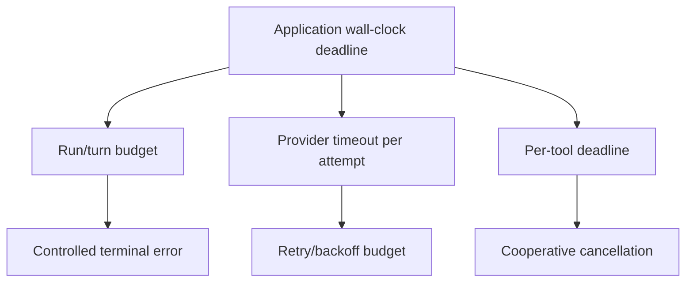
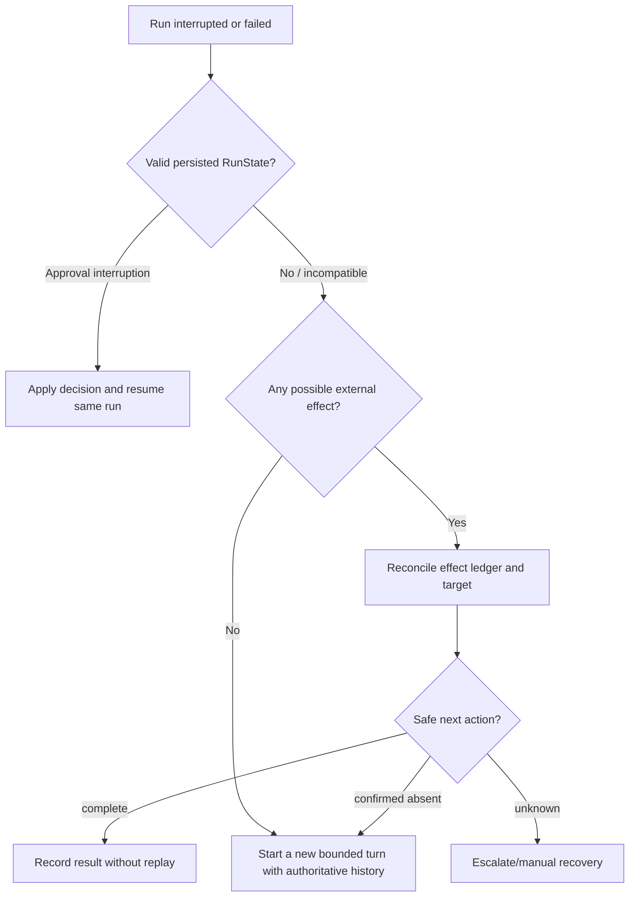

# Reliability, cancellation, and recovery

**Research date:** 2026-08-31  
**Status:** Research-backed, version-sensitive guide  
**Scope:** Deadlines, model retries, tool failures, replay safety, cancellation, state recovery, idempotency, reconciliation, error handlers, and durable workflow boundaries

The key reliability question is not “can it retry?” It is “what definitely happened before the failure, and what is safe to repeat?” Model calls, streamed responses, local tools, and external effects have different answers.

## Failure classification

| Failure point | Likely replay posture |
|---|---|
| Provider connection failed before a request was accepted | Often retryable with bounded backoff |
| Rate limit/temporary server error before response output | Retryable if policy and deadline allow |
| Stream began, then connection failed | Replay is state- and effect-sensitive |
| Read-only tool timed out | Retryable only if truly read-only and resource-safe |
| Mutating tool timed out | Unknown outcome; reconcile before replay |
| Approval state failed to persist | Do not present approval; stop and recover |
| Session commit conflict | Do not blindly append; resolve concurrency |
| Process died during nested run | Recover from durable state/effect ledger, not memory |

## Deadline stack

A model timeout applies to an individual attempt. Retries and backoff can extend elapsed time, and tools have their own duration. Compute remaining time from the application deadline and refuse to start work that cannot safely finish.

## Model retries

Model retries are opt-in in the inspected SDKs. Retry policy can classify normalized HTTP, rate-limit, timeout, network, abort, response-started, replay-safety, and stateful-request information.

Conservative policy:

- retry transient failures only;
- honor bounded Retry-After;
- cap attempts and total backoff;
- add jitter;
- veto replay after streamed output or unsafe local effects;
- fail closed when replay safety is unknown;
- record attempt count and classification.

Callbacks/policy objects are runtime configuration and may not be serialized with RunState. Restore the intended policy when resuming.

## Tool retries

The SDK cannot make an external mutation exactly once. Build an effect protocol:

1. derive a stable effect ID from run/tool/business intent;
2. persist “planned/started” before the operation;
3. pass an idempotency key if the target supports it;
4. store the authoritative response;
5. on timeout, query the target system;
6. replay only when confirmed absent and policy allows;
7. expose pending/reconcile status rather than inventing success.

Do not let the model choose the idempotency key.

## Cancellation

Cancellation is a request, not proof that work stopped.

- Propagate task cancellation or AbortSignal into provider and tool calls.
- Ensure long loops periodically observe it.
- Bound thread/subprocess work and terminate isolated processes where safe.
- Track orphanable external jobs by effect ID.
- Decide whether session history records cancellation.
- Drain or close streams deliberately.
- Test shutdown while tools and traces are active.

Python synchronous functions can block the event loop or continue in a worker after cancellation. TypeScript libraries may ignore AbortSignal. Wrap such operations at a process/job boundary for hard isolation.

## Supported run error handlers

At the cutoff, documented run error handlers cover limited terminal cases such as max turns, model refusal, and invalid final output. A fallback handler creates a controlled result; it does not rerun the model or undo/replay tools.

Use these handlers for safe user-facing degradation. Keep infrastructure errors and uncertain effects in application recovery logic.

## Resume versus restart

RunState is a continuation mechanism, not a workflow engine. It may represent an approval pause or unfinished turn, but it does not schedule retries, lease work, guarantee durable timers, or make external activities transactional.

## Durable workflows

Use a durable workflow/job system when work:

- waits minutes or days;
- requires timers or callbacks;
- spans deployments;
- has several mutating activities;
- needs operator retries/compensation;
- must survive process or provider failure.

The Python ecosystem documentation includes integrations/examples for Dapr Workflow, Temporal, Restate, and DBOS. TypeScript core documentation does not establish the same built-in integration parity. In either language, model turns and tools should be bounded workflow activities, with idempotency and small persisted inputs/results.

Do not hold database transactions or SDK sessions open across long waits.

## Operational recovery table

| Symptom | First evidence | Safe response |
|---|---|---|
| Repeated max-turn failures | trace route/tool loop | reduce ambiguity, add stop rule, improve tool result |
| Tool p95 spike | tool span/target metrics | shed load, cap concurrency, extend only tool-specific deadline if justified |
| Duplicate effect | effect ledger/idempotency logs | stop replay, reconcile, fix stable effect identity |
| Stream ends without final | settlement error/session state | do not show success; recover/rebuild based on effects |
| Paused states fail after deploy | SDK/app schema version | support migration or controlled expiry/restart |
| WebSocket provider leaks | connection count/shutdown logs | close/rotate cached provider |
| Missing traces in edge | exporter/flush metrics | explicit bounded flush or alternate telemetry |

## Reliability test matrix

- [ ] Transient provider failure before output.
- [ ] Failure after first streamed item.
- [ ] Rate-limit Retry-After beyond caller deadline.
- [ ] Read-only and mutating tool timeouts.
- [ ] Cancellation during model, tool, approval, compaction, and shutdown.
- [ ] Process crash after external effect but before session commit.
- [ ] Concurrent turns/session conflict.
- [ ] Resume after SDK/app upgrade.
- [ ] Nested agent exhausts budget.
- [ ] Trace exporter and MCP shutdown failure.

## Limits and refresh triggers

Retry APIs are evolving and version-specific. Refresh on retry-policy changes, new resumable state fields, session transaction behavior, error-handler coverage, model incomplete-response handling, or documented durable-runtime integrations.

## Primary sources

- [Run agents](https://developers.openai.com/api/docs/guides/agents/running-agents)
- [Production best practices](https://developers.openai.com/api/docs/guides/production-best-practices)
- [OpenAI Agents SDK Python: models and retry policy](https://openai.github.io/openai-agents-python/models/#model-request-retries)
- [OpenAI Agents SDK TypeScript documentation](https://openai.github.io/openai-agents-js/)

## Continue reading

[Knowledge-area map](README.md) · [Architecture and lifecycle](architecture-and-run-lifecycle.md) · [Sessions and state](sessions-context-and-state.md) · [Deployment and operations](deployment-operations-and-cost.md)
