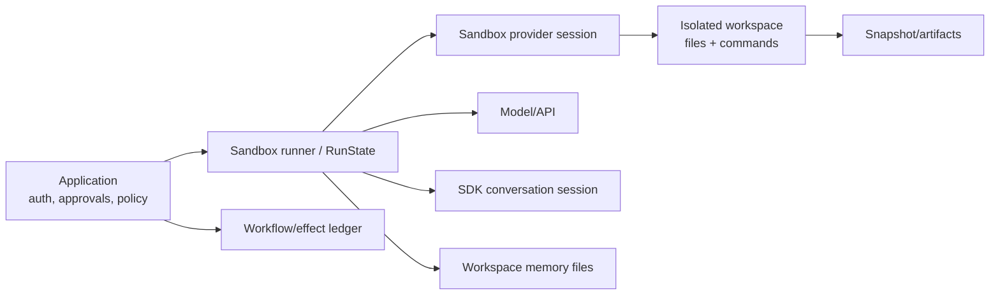
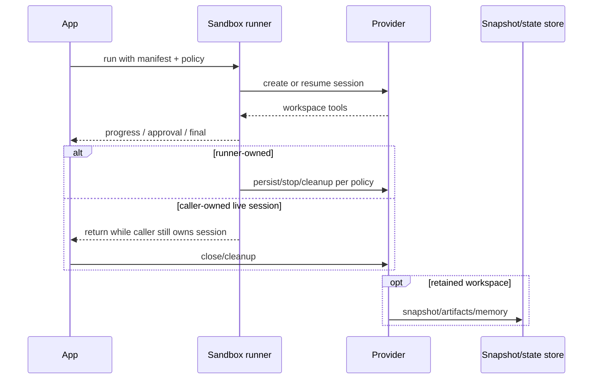
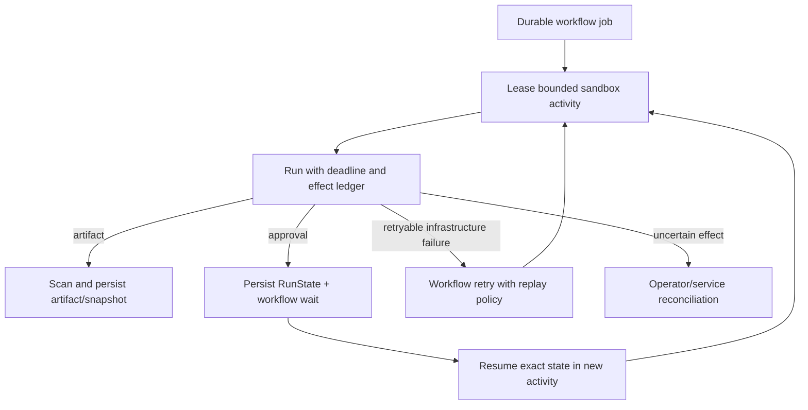

# Sandbox agents and long-running work

**Research date:** 2026-08-31  
**Status:** Research-backed, beta and version-sensitive guide  
**Scope:** Sandbox-agent architecture, manifests, providers, sessions, snapshots, workspace memory, credentials, mounts, lifecycle, isolation, and durable-work boundaries

Sandbox agents run model-driven work against an isolated filesystem/command environment. At the cutoff, the feature is beta in both Python and TypeScript. A sandbox reduces host exposure; it does not make generated commands correct, external effects idempotent, or workflows durable.

## Boundary model

Keep these concepts separate:

- **SDK conversation session**: model-visible conversational history.
- **RunState**: resumable execution and approvals.
- **sandbox provider session**: live backend connection/resume handle.
- **snapshot**: persisted workspace contents.
- **workspace memory**: files distilled from prior sandbox work.
- **durable workflow**: scheduling, retries, timers, and external-effect recovery owned outside the sandbox.

## Manifest contract

The agent manifest is the fresh-workspace contract: tools, instructions, workspace behavior, approvals, setup, and related sandbox configuration. A live session, explicit RunState, SDK session history, or snapshot can change what a particular run actually sees.

Manifest rules:

- keep relative workspace paths bounded and reject traversal;
- never derive extra host-path grants from model text;
- treat mounts and credentials as privileged deployment configuration;
- use read-only access by default;
- pin and review manifest changes;
- verify behavior in a fresh empty workspace, not only a developer machine.

## Provider selection and Windows

The official local Unix sandbox client targets macOS/Linux. On Windows, use a Docker-backed or hosted provider rather than assuming native local parity. Provider capabilities vary in snapshots, session resume, mounts, networking, compute, and cleanup; acceptance-test the chosen provider.

## Lifecycle ownership

Runner-created sessions can be created, stopped, persisted, and cleaned through the runner's documented lifecycle. If the caller supplies a live sandbox session, the caller owns cleanup.

Add leak detection and a sweeper based on provider inventory. Process termination can bypass ordinary cleanup.

## Snapshots and resume

A snapshot captures workspace contents; it is not necessarily a running process or provider session. A provider session may resume a live backend; RunState may resume an interrupted agent turn. Document which one your product promises.

Snapshot policy:

- classify files before persistence;
- exclude secrets and temporary credentials;
- size and file-count limit;
- malware/content scan before export;
- tenant-scope identifiers and storage;
- expiry and deletion;
- compatibility check with manifest/tool versions.

## Workspace memory

Sandbox memory is file-based and distinct from conversation-session history. The documented flow can extract and consolidate useful information when a sandbox closes, based on conversation, tool activity, interruptions, and final content.

Treat memory as retained derived data:

- label provenance and confidence;
- exclude secrets and transient tokens;
- make it tenant/user scoped;
- review before it becomes instruction-like context;
- support deletion and expiry;
- prevent poisoned memory from silently overriding trusted policy.

Stable identity dimensions such as conversation, session, or group identifiers influence continuity; an agent name alone is not a safe isolation key.

## Credentials, mounts, and network

Credentials available inside a workspace can be read by model-generated code. Prefer:

- short-lived, least-privilege credentials;
- provider-native or external credential brokerage;
- explicit domain/network egress rules;
- read-only mounts;
- empty workspace by default;
- separate write targets for generated artifacts;
- audited, trusted manifest configuration.

In-container helpers that materialize credentials or broad host mounts can increase exposure. Never place credentials in prompts, memory files, snapshots, or generated artifacts.

## Approvals

The outer application/runtime owns approvals and trace policy even when commands execute inside the sandbox. Require approval for:

- host or external writable mounts;
- credential use;
- network actions with material effects;
- destructive commands;
- publishing, merging, deploying, or messaging;
- large compute/spend requests.

Build the approval summary from validated command/tool metadata. A shell command can conceal several effects; high-risk commands may require structural parsing or a narrower purpose-built tool.

## Long-running work

Use the sandbox as a bounded activity inside a durable workflow when work must survive process restarts, wait for humans, or coordinate external effects.

The workflow should own leases, retries, timers, compensation, and business state. Keep any one model/sandbox activity bounded.

## Validation checklist

- [ ] Beta status and provider-specific capabilities are accepted.
- [ ] Fresh-workspace manifest test passes.
- [ ] Paths reject traversal and host grants are trusted config only.
- [ ] Network, mounts, credentials, CPU, memory, time, and storage are bounded.
- [ ] Caller-versus-runner session ownership is explicit.
- [ ] Crash cleanup and leaked-session sweeping are tested.
- [ ] Snapshots/artifacts are scanned, scoped, encrypted, and expiring.
- [ ] Memory has provenance, poisoning controls, and deletion.
- [ ] Approvals cover high-impact commands and credential use.
- [ ] Durable workflow/effect recovery is outside the sandbox.

## Limits and refresh triggers

This entire surface is beta. Refresh on SDK minor releases, provider additions, local-platform support changes, manifest schema changes, lifecycle/snapshot/memory semantics, mount/credential guidance, or beta graduation.

## Primary sources

- [Sandbox agents](https://developers.openai.com/api/docs/guides/agents/sandboxes)
- [OpenAI Agents SDK Python: sandbox agents](https://openai.github.io/openai-agents-python/sandbox_agents/)
- [OpenAI Agents SDK TypeScript documentation](https://openai.github.io/openai-agents-js/)
- [Guardrails and approvals](https://developers.openai.com/api/docs/guides/agents/guardrails-approvals)

## Continue reading

[Knowledge-area map](README.md) · [Security and approvals](security-guardrails-and-approvals.md) · [Sessions and state](sessions-context-and-state.md) · [Reliability and recovery](reliability-cancellation-and-recovery.md)
