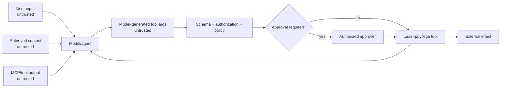
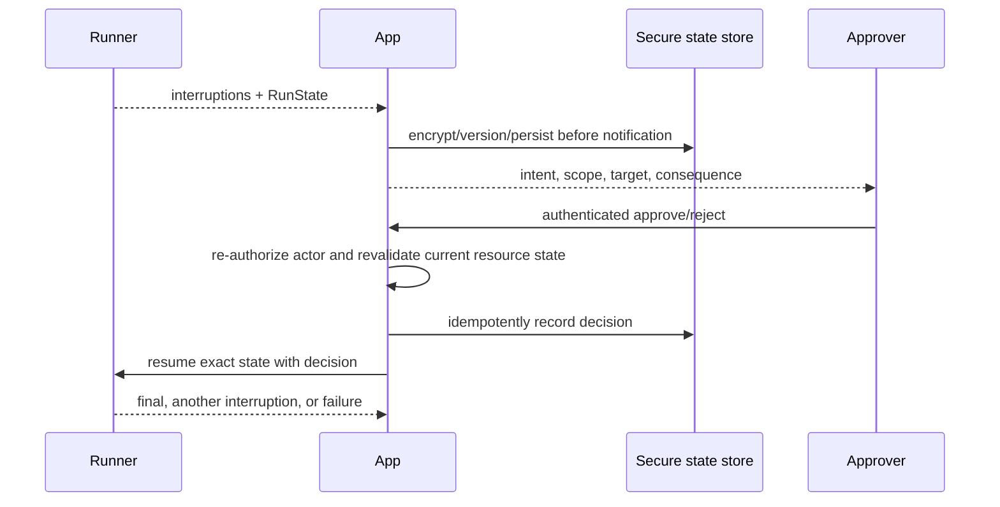

# Security, guardrails, and approvals

**Research date:** 2026-08-31  
**Status:** Research-backed, version-sensitive guide  
**Scope:** Trust boundaries, guardrail execution points, approvals, authorization, prompt injection, MCP, secrets, sandbox risk, data controls, and incident readiness

Guardrails influence or stop SDK execution at specific points. They are not a substitute for authentication, authorization, least privilege, isolation, output validation, or effect controls.

## Threat model

The model and everything it reads can be manipulated. A valid model-generated argument is still untrusted.

## Guardrail execution boundaries

| Guardrail | Runs where | Important limitation |
|---|---|---|
| Input guardrail | Initial input to the first agent | Does not automatically re-run for every handoff agent |
| Output guardrail | Output from the agent that produces the final result | A handoff changes which agent is final |
| Function-tool guardrail | Around the attached function tool | Does not automatically cover hosted tools, MCP, handoffs, or other function tools |

Some input guardrails can execute in parallel with speculative agent work. If a rejected input must cause **no downstream work**, use the documented blocking mode and test it. Parallel mode can reduce latency but may allow model/tool work to complete before the tripwire is known.

Guardrail tripwires should produce a controlled application response. Do not leak internal policy text or classifier details that make evasion easier.

## Authorization belongs at execution

Every tool implementation should:

1. derive principal and tenant from trusted application context;
2. validate schema and semantic bounds;
3. resolve the requested resource inside that tenant;
4. evaluate current permission and policy;
5. require approval if policy says so;
6. reserve an effect ID;
7. perform the least-privilege action;
8. audit the outcome.

Conditional tool visibility reduces confusion and prompt size. It is not access control. Handoffs and nested agents must not broaden the principal's permissions.

## Approval lifecycle

When a tool needs approval, the run returns interruptions plus resumable state. The application displays a safe, human-readable summary; an authenticated actor approves or rejects; then the same stored state resumes with those decisions.

Approval is not permission forever. Revalidate authorization and important resource state at resume; approvals can expire or be revoked.

An approval UI should show:

- exact action type and target;
- actor/tenant;
- externally visible or destructive consequence;
- bounded arguments with secrets redacted;
- why the action is requested;
- expiry and whether it can be undone;
- whether several actions are grouped.

Do not let model prose be the only description of the effect. Build the card from validated tool arguments and trusted metadata.

## Prompt injection and MCP

Retrieved pages, files, MCP descriptions, MCP outputs, and tool-output URLs are untrusted. Reduce blast radius:

- allowlist servers and tools;
- prefer official servers and verify ownership;
- expose the minimum schema/catalog;
- send only required data;
- separate read and write tools;
- require approval for sensitive actions;
- render external content as quoted data, not instructions;
- constrain output and tool choices;
- monitor unexpected cross-domain instructions.

Hosted MCP moves the connection to the platform; runtime-managed MCP keeps it in your network. Neither model establishes trust automatically.

## Secrets and data

- Keep secrets in runtime secret/config systems, never prompts, manifests, sandbox snapshots, memory files, or approval state summaries.
- Use short-lived, scoped credentials for tools and sandboxes.
- Redact trace payloads and logs.
- Apply stable safety identifiers where supported without placing direct personal data in the identifier.
- Enforce retention and deletion across conversation stores, RunState, traces, eval datasets, and sandbox workspaces.
- Separate staging and production projects/keys.

Tracing can capture inputs/outputs and is unavailable under Zero Data Retention. Design a local, compliant audit path where needed.

## Sandboxes

Isolation reduces host risk but does not make model-generated code safe. Treat:

- additional host paths as privileged grants;
- credential mounts as high-risk;
- writable mounts as possible exfiltration/destruction channels;
- snapshots and memory as retained data;
- network egress as a policy decision.

Use read-only mounts and empty workspaces by default. Never construct trusted path grants from model-generated text.

## High-stakes and code actions

OpenAI's safety guidance recommends human review for high-stakes domains and code generation/deployment. Add deterministic checks around generated code:

- repository/path allowlist;
- diff size and forbidden-file policy;
- dependency and secret scanning;
- tests in isolation;
- human review before merge/deploy;
- restricted CI identity.

The same principle applies to payments, messages, access changes, deletion, or public publication.

## Red-team suite

- [ ] Direct and indirect prompt injection.
- [ ] Tool-description poisoning and malicious MCP output.
- [ ] Cross-tenant resource references.
- [ ] Encoded/obfuscated destructive arguments.
- [ ] Handoff to a more privileged agent.
- [ ] Approval-summary deception and stale approval replay.
- [ ] Tool timeout after a completed external effect.
- [ ] Secret extraction from traces, state, workspace, or memory.
- [ ] Excessive fan-out/cost denial.
- [ ] Malicious URL/file returned by a tool.
- [ ] Concurrent approval and cancellation.
- [ ] Model/provider fallback with weaker schema behavior.

## Incident controls

Maintain kill switches at several scopes: tool, MCP server, agent/workflow, tenant, model/provider, and environment. Preserve an effect ledger and audit trail sufficient to identify actions without retaining unrestricted prompt content. Rotate credentials and revoke pending approvals after a relevant incident.

## Limits and refresh triggers

Guardrail and approval behavior is SDK-version-specific. Refresh on changes to blocking semantics, interruption serialization, hosted-tool approvals, MCP guidance, tracing data controls, sandbox beta status, or organization/project RBAC.

## Primary sources

- [Guardrails and approvals](https://developers.openai.com/api/docs/guides/agents/guardrails-approvals)
- [Safety best practices](https://developers.openai.com/api/docs/guides/safety-best-practices)
- [Connectors and remote MCP](https://developers.openai.com/api/docs/guides/tools-connectors-mcp)
- [Role-based access control](https://developers.openai.com/api/docs/guides/rbac)

## Continue reading

[Knowledge-area map](README.md) · [Tools and outputs](tools-and-structured-outputs.md) · [Sessions and state](sessions-context-and-state.md) · [Sandbox agents](sandbox-agents-and-long-running-work.md)

