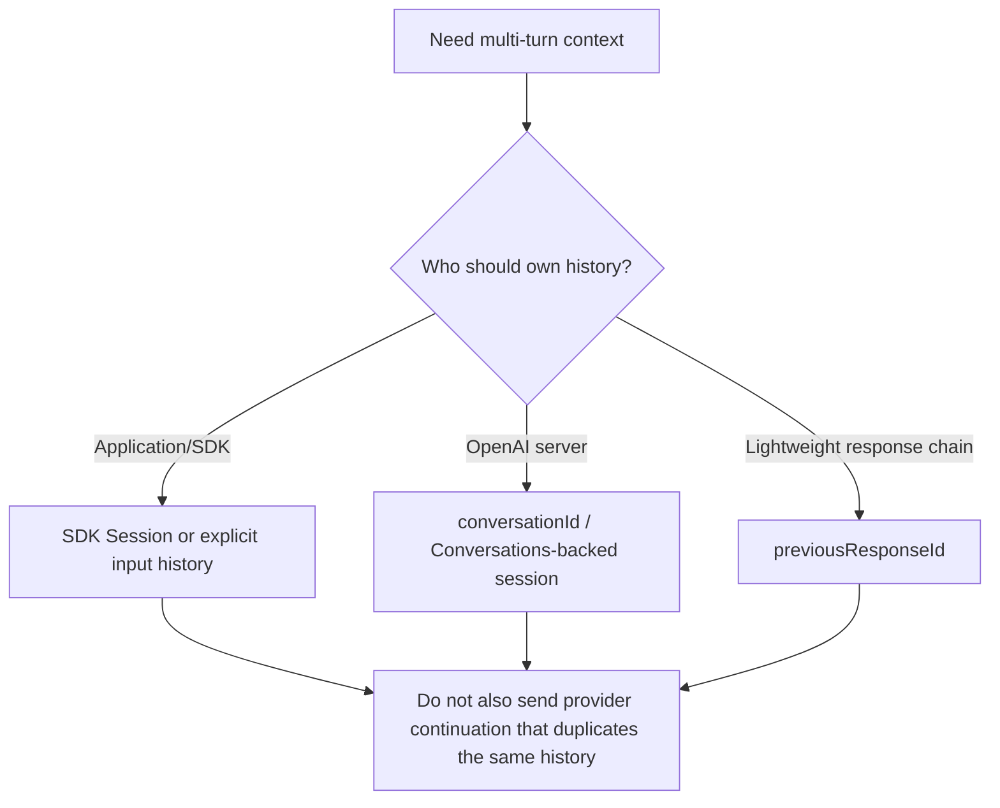
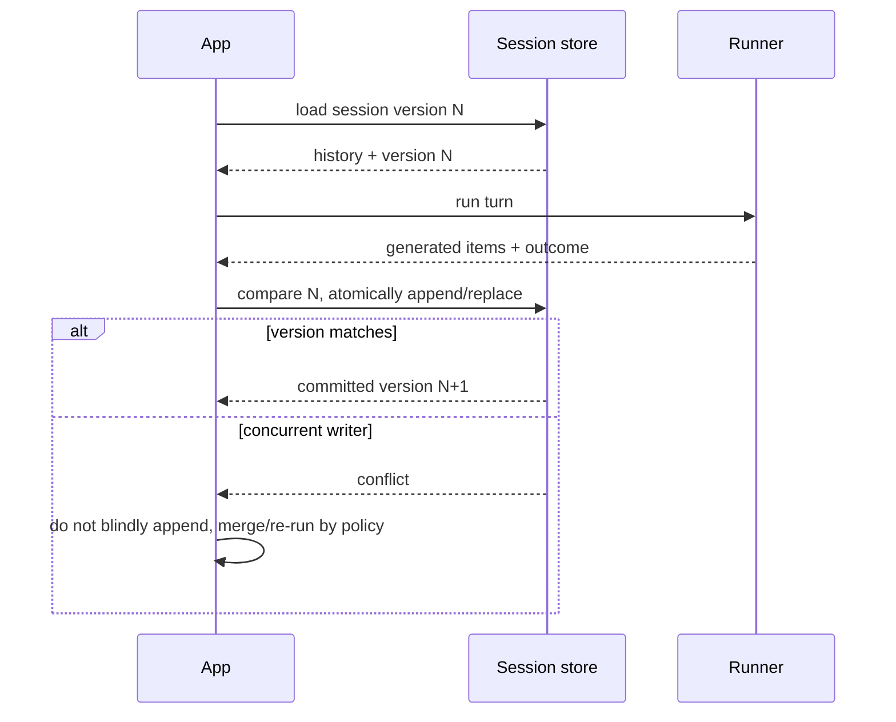

# Sessions, context, and state

**Research date:** 2026-08-31  
**Status:** Research-backed, version-sensitive guide  
**Scope:** Model-visible history, local application context, SDK sessions, OpenAI server conversations, previous-response chaining, resumable RunState, and sandbox workspace state

“Memory” is too vague for production design. The SDK exposes several state layers with different trust, persistence, and serialization semantics. Choose each deliberately and avoid combining mechanisms that duplicate history.

## Four state layers

| Layer | Seen by model? | Typical contents | Owner |
|---|---|---|---|
| Conversation history | Yes | messages, tool calls/results, handoff items | SDK session, application, or provider |
| Local application context | No, unless instructions/tools expose it | principal, tenant, clients, policies, caches | Application |
| Resumable run state | Potentially, when resumed | history plus interruption, usage, active agent, tool/run metadata | SDK + application persistence |
| Sandbox workspace | Only through sandbox tools | files, snapshot, workspace memory | Sandbox runtime/provider |

These layers should have separate retention and authorization policies. A file remaining in a sandbox workspace is not the same as a message stored in an SDK session.

## Pick one history strategy per run

Common strategies:

- **Explicit local history**: the application sends the complete relevant history each turn.
- **SDK session**: the runner loads stored items, merges new input, and persists generated items.
- **OpenAI Conversations**: server-managed conversation state, directly or through a Conversations-backed session.
- **Previous response ID**: chain a new response to a prior response.

Python explicitly rejects combinations between an SDK session and run-level conversation/previous-response controls in relevant paths. TypeScript guidance also discourages combining them. The safe rule is simple: one authoritative history mechanism per run.

## SDK session contract

A session generally needs to:

- retrieve history with an optional limit;
- append items;
- pop or clear items; and
- provide a stable session identifier.

The Python SDK documents a comparatively broad set of built-in/community-backed implementations, including SQLite variants, Redis, SQLAlchemy, MongoDB, Dapr, OpenAI Conversations, a Responses-compaction wrapper, advanced SQLite, and encrypted wrappers. TypeScript ships a memory session and an OpenAI Conversations session, with a custom session interface and storage examples. Do not assume storage parity.

### Transaction and concurrency

TypeScript exposes an optional transaction-aware session contract for atomic/idempotent history mutation using stable operation identifiers and suffix replacement. Python's public session guidance at the cutoff does not expose the same named contract.

Regardless of language:

- serialize concurrent turns for one conversation unless the store implements conflict detection;
- use a session version/ETag or transaction;
- make append/replace idempotent;
- never mix tenants in a session key;
- persist model items and application outcome coherently; and
- define recovery for a tool effect that commits before history persistence.

## Compaction

Compaction summarizes or replaces older Responses items to reduce context size. It is lossy state transformation, so test whether it preserves:

- unresolved promises and user constraints;
- tool-call/result relationships;
- current entity identifiers and permissions;
- handoff context;
- safety-relevant facts; and
- reproducibility of eval failures.

Automatic Responses compaction can complete after the last visible stream token, increasing tail settlement time. For low-latency UX, consider a controlled between-turn compaction job.

The Python compaction wrapper serializes compaction with mutations made through the same wrapper instance. Multiple wrapper instances or direct writes to the underlying session still need application coordination.

## Local application context

Local context is shared with agents and tools in the run but is not automatically model input. Recommended contents:

- stable principal and tenant identifiers;
- already-authorized service facades;
- policy evaluators;
- request deadline/cancellation;
- trace correlation and effect ledger;
- feature/config snapshots.

Avoid raw secrets, large mutable ORM sessions, and objects that cannot be safely serialized if a run may pause. A nested agent must not acquire broader privileges merely because it shares the context object.

## RunState and approvals

Approval interruption produces pending interruptions plus a resumable state. Resume means continuing the same logical run, not starting a fresh turn. Persist the exact state before asking a human to decide.

State storage requirements:

- authenticated encryption at rest;
- tenant- and principal-scoped lookup;
- SDK version and application schema version;
- expiration and revocation;
- tamper detection;
- one-time or idempotent decision processing;
- audit record for approve/reject and actor;
- migration or controlled rejection after incompatible upgrades.

Do not rebuild approval state from a user-facing summary. Resume the stored state, apply explicit decisions, and continue through the runner.

## Input added during a pause

If new user input arrives while approval is pending, decide whether it:

- is an approval decision;
- safely augments the same paused run; or
- should become a separate new turn.

Use the SDK's supported state-input staging surface where applicable, and test ordering. Never splice text directly into serialized internals.

## Data minimization

- Store model-visible history only as long as product and compliance requirements permit.
- Summarize or redact secrets before provider input, not only before logging.
- Separate operational logs from conversation storage.
- Encrypt serialized RunState; it may contain more than visible messages.
- Treat sandbox memory files and snapshots as retained user data.
- Make deletion cover every state layer and derived eval/trace artifacts.

## Decision checklist

- [ ] One authoritative history strategy is selected.
- [ ] Session keys include tenant scope and cannot be user-forged.
- [ ] Concurrent turns have a conflict policy.
- [ ] History mutations are atomic/idempotent or recoverable.
- [ ] Compaction quality has domain-specific tests.
- [ ] RunState is encrypted, versioned, expiring, and revocable.
- [ ] Application context is minimal and safe if serialized.
- [ ] Deletion and retention cover histories, state, traces, and workspaces.
- [ ] Upgrade policy handles old paused states.

## Limits and refresh triggers

Session backends and transaction semantics are a notable Python/TypeScript parity gap. Refresh when either SDK adds a store or transaction contract, Responses conversation/compaction behavior changes, or RunState schema/version compatibility changes.

## Primary sources

- [Run agents: conversation state](https://developers.openai.com/api/docs/guides/agents/running-agents)
- [OpenAI Agents SDK Python: sessions](https://openai.github.io/openai-agents-python/sessions/)
- [OpenAI Agents SDK TypeScript: sessions](https://openai.github.io/openai-agents-js/guides/sessions/)
- [Results and state](https://developers.openai.com/api/docs/guides/agents/results)

## Continue reading

[Knowledge-area map](README.md) · [Architecture and lifecycle](architecture-and-run-lifecycle.md) · [Security and approvals](security-guardrails-and-approvals.md) · [Sandbox agents](sandbox-agents-and-long-running-work.md)
