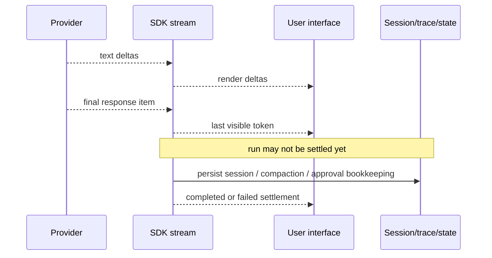
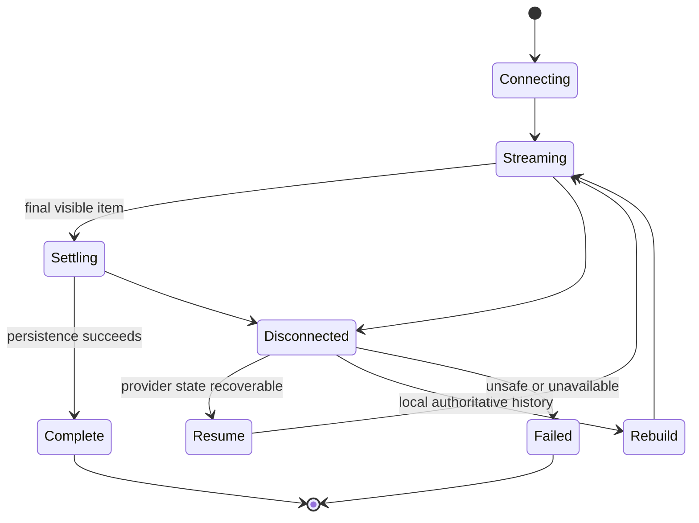

# Streaming, events, and Realtime

**Research date:** 2026-08-31  
**Status:** Research-backed, version-sensitive guide  
**Scope:** Streamed run events, completion settlement, UI projection, cancellation, Responses WebSocket transport, reconnect behavior, and the Realtime boundary

Streaming improves perceived latency but creates two completion times: the last visible token and the settled run. A production client must represent both.

## Event levels

The SDK stream exposes three useful event classes:

| Event level | Use |
|---|---|
| Raw model/response events | token deltas, provider-specific details, low-level diagnostics |
| Run-item events | completed message, tool call/result, handoff, approval item |
| Agent-updated events | active-agent change after orchestration |

Prefer run-item events for business UI and raw deltas only for incremental text. Raw sequences can change with model/provider behavior.

One small parity trap: the Python event name preserves the historical misspelling `handoff_occured`, while TypeScript uses `handoff_occurred`. Normalize it in your application telemetry.

## Visible versus settled

In Python, exhaust the async event iterator and check completion state. In TypeScript, await `stream.completed` even after consuming text or events. If the client disconnects, a server-side worker should still settle or deliberately cancel according to product policy.

Never mark a transaction complete merely because text stopped arriving.

## A UI projection model

Keep an append-only internal event log and derive a smaller UI state:

- active agent;
- visible assistant text;
- tool status with safe labels;
- approval cards;
- final/failed/cancelled settlement;
- retry/reconnect status.

Do not stream raw tool arguments or results to users by default. They may contain secrets, internal identifiers, untrusted URLs, or prompt-injection content.

## Cancellation

Python streamed runs expose cancellation, including an after-turn mode in the inspected SDK. TypeScript uses AbortSignal and stream/reader cancellation. In either language cancellation is cooperative:

- provider requests must receive it;
- async tools should observe it;
- blocking or third-party operations may continue;
- external effects require reconciliation;
- the session should only persist a coherent suffix.

“Cancel after turn” can produce cleaner state than immediate cancellation when the current model/tool boundary is safe to finish. Immediate cancellation is appropriate for hard deadlines or user safety, but plan for orphaned work.

## Backpressure and disconnects

- Bound any event queue between runner and client.
- Coalesce high-frequency text deltas.
- Give business events (approval, tool completion, final error) priority.
- Stop rendering after client disconnect, but do not abandon persistence accidentally.
- Separate the HTTP connection lifetime from the run worker if turns can outlive proxies.
- Emit monotonic sequence numbers for reconnectable client projections.

## Responses HTTP/SSE versus WebSocket transport

The SDK can use a Responses WebSocket transport to reduce repeated connection setup. It remains a Responses transport, not the Realtime API.

At the cutoff, documented WebSocket constraints included one active response per connection and a maximum connection lifetime. Prefer HTTP/SSE when simpler isolation and recovery matter more than connection reuse.

With response storage disabled or Zero Data Retention constraints, reconnecting from a previous response identifier may not be possible. Keep authoritative local/session history sufficient to rebuild a request.

Cached provider/WebSocket objects need explicit close on shutdown. Test rotation before the maximum connection age and failure during a streamed response.

## Realtime is a separate design

Realtime agents address low-latency interactive audio/event sessions with a different session, transport, interruption, and media model. Do not infer that:

- an Agents SDK text stream is a full-duplex Realtime session;
- a Responses WebSocket supports Realtime audio behavior;
- text-run session persistence maps directly to a Realtime session;
- the same cancellation/interruption UI is sufficient.

The TypeScript package exports Realtime surfaces, but their presence in one package does not collapse the architecture boundary.

## Reconnect state machine

Do not automatically rebuild a run that may have executed a mutating tool. Consult the effect ledger first.

## Test matrix

- [ ] Text-only final output.
- [ ] Multiple interleaved tool calls.
- [ ] Handoff updates active-agent UI.
- [ ] Approval interruption and later resume.
- [ ] Client disconnect before and after a tool effect.
- [ ] Cancellation during model, tool, and settlement.
- [ ] Slow consumer/backpressure.
- [ ] Provider retry before any output and failure after output started.
- [ ] Session compaction after final visible token.
- [ ] WebSocket rotation/reconnect and process shutdown.
- [ ] Storage-disabled/ZDR recovery path.

## Limits and refresh triggers

Stream event types and WebSocket transport remain version-sensitive. Refresh on a new normalized event type, connection-lifetime or concurrency change, session-settlement change, or Realtime export/API change.

## Primary sources

- [Run agents](https://developers.openai.com/api/docs/guides/agents/running-agents)
- [OpenAI Agents SDK Python: streaming](https://openai.github.io/openai-agents-python/streaming/)
- [OpenAI Agents SDK TypeScript: streaming](https://openai.github.io/openai-agents-js/guides/streaming/)
- [Realtime API guide](https://developers.openai.com/api/docs/guides/realtime)

## Continue reading

[Knowledge-area map](README.md) · [Architecture and lifecycle](architecture-and-run-lifecycle.md) · [Reliability and recovery](reliability-cancellation-and-recovery.md) · [Sessions and state](sessions-context-and-state.md)

