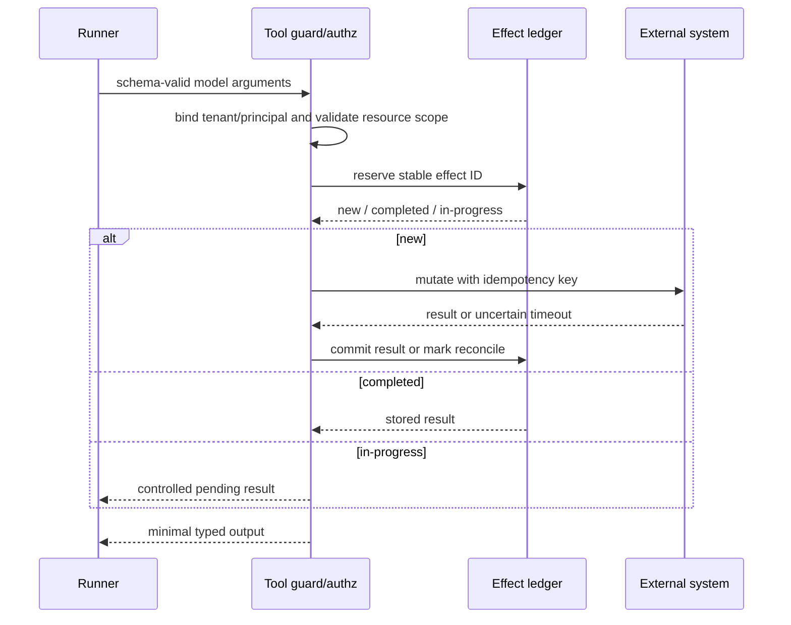
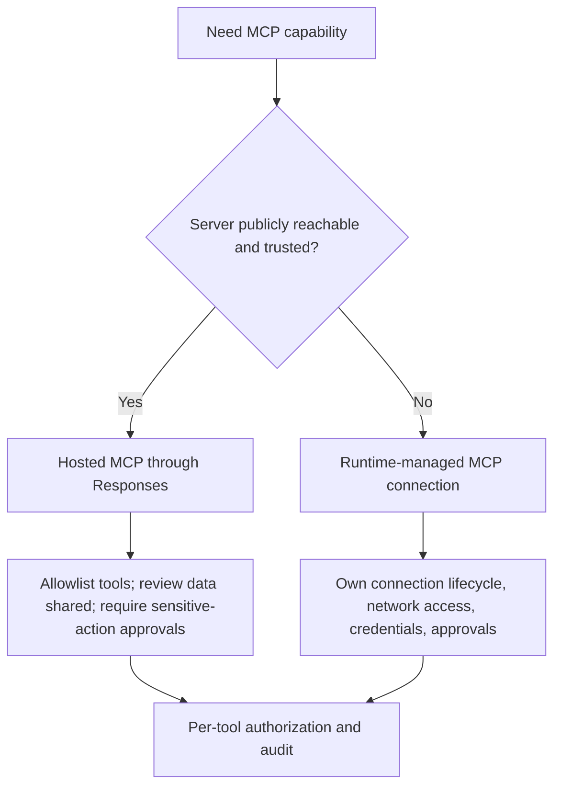

# Tools and structured outputs

**Research date:** 2026-08-31  
**Status:** Research-backed, version-sensitive guide  
**Scope:** Function tools, hosted Responses tools, MCP, agents as tools, tool search, programmatic tool calling, validation, failure semantics, and terminal schemas

Tools cross the trust boundary between probabilistic decisions and real systems. Treat a tool definition as a public protocol: its schema, authorization, deadline, idempotency, error model, and telemetry matter more than its decorator.

## Tool taxonomy and execution owner

| Category | Executes where | Main operational owner |
|---|---|---|
| Function tool | Your Python/TypeScript runtime | Application |
| Agent as a tool | Nested SDK run in your runtime | Application + SDK |
| Hosted web/file/code/image/MCP tool | OpenAI platform through Responses | Platform, with application policy |
| Runtime shell/computer/apply-patch | Local runtime or configured hosted/sandbox runtime | Application/runtime provider |
| Locally managed MCP | Your process connects over stdio or streamable HTTP | Application |
| Hosted remote MCP | OpenAI connects to a public remote server | Platform connection + third-party server |
| Tool search | Schemas loaded when relevant; execution depends on selected tool | Mixed |
| Programmatic tool calling | Model-authored JavaScript in hosted restricted V8 invokes allowed tools | Platform plus each invoked tool owner |

Hosted tool availability is a base Responses API and model property. A Chat Completions path or another provider adapter may reject or ignore it. Fail during configuration or acceptance tests rather than discovering this after a model chooses the tool.

## Function tools

Python derives a schema from the function signature and Pydantic-compatible types. TypeScript commonly uses Zod/Standard Schema or a raw JSON schema. In both:

- use strict schemas by default;
- keep names and descriptions concise and discriminative;
- model semantic errors as typed results when the agent can safely repair them;
- raise or stop for infrastructure and policy failures;
- set a tool-specific deadline;
- attach authorization context outside model-controlled arguments; and
- emit an effect ID before any mutation.

A raw JSON schema is a wire contract, not necessarily runtime validation in every TypeScript path. Validate again at execution before touching resources.

### Safe effect pattern

A timeout is not evidence that an external effect did not happen. Reconcile the target system before replay.

## Tool-output schemas and failures

Schema-backed tool outputs reduce ambiguity and make downstream validation possible. They also tighten failure semantics: timeouts, thrown errors, and arbitrary fallback strings may no longer fit the declared schema. Define an explicit error union only for errors the model should see and act on.

Do not expose stack traces, credentials, internal URLs, or raw database errors in tool results. Map them to a safe error code, retryability signal, and user-appropriate detail; keep sensitive diagnostics in restricted logs.

Python's documented asynchronous function-tool timeout support and TypeScript's timeout/signal surfaces are not identical. Verify actual cancellation with your tool implementation—blocking Python code and libraries that ignore an AbortSignal can continue after the runner gives up.

## Structured terminal outputs

An agent output type asks the model/provider to produce a terminal object conforming to a schema. It does not replace domain validation.

Use two validation layers:

1. **structural validation**: required fields, types, enumerations, bounds;
2. **domain validation**: resource ownership, cross-field consistency, current state, business invariants.

Never make an irreversible effect solely because a field parsed. For plans, commands, or payments, convert the output into a reviewed/authorized application command first.

## Tool search

Tool search defers large tool definitions and exposes selected schemas when relevant, reducing prompt size for large catalogs. It is an optimization, not authorization: a tool that becomes visible still needs execution-time checks.

Parity is not exact at the cutoff:

- the Python guide documents a manual loop for client-executed tool search rather than automatic execution by the standard runner;
- the TypeScript SDK exposes client execution through its tool-search helper.

Acceptance-test catalog selection, schema loading, and failure behavior before depending on tool search for core routing.

## Programmatic tool calling

Programmatic tool calling lets generated JavaScript invoke explicitly allowed tools inside a fresh hosted V8 isolate. The isolate has no Node.js, filesystem, or network access except through those tools. This can compress bounded loops, branching, and parallel calls without a model round trip for each step.

It changes the replay and review surface:

- one model response can cause several tool calls;
- intermediate decisions may be less visible to a human approver;
- a partially completed program can leave mixed external state;
- each invoked tool still needs its own guardrails and approvals.

Use it for read-heavy aggregation and tightly bounded computation. Avoid grouping high-impact mutations unless the plan and every effect remain individually authorized, idempotent, and observable.

## MCP choices

Remote MCP servers are third parties unless you operate them. Their tool descriptions and outputs are untrusted content and can carry prompt injection. Prefer official servers, pin/allowlist tools, minimize data shared, require approval for sensitive actions, and treat tool-output URLs as untrusted.

For runtime-managed MCP, own startup, health, reconnect, and shutdown. Keep credentials out of model-visible configuration. A successful MCP connection does not establish permission to use every discovered tool.

## Agents as tools

An agent-as-tool preserves a manager agent as the user-facing owner while running a specialist as a nested tool. This is useful for bounded research, classification, or transformation. It is not automatic shared memory: nested state and conversation context must be passed or resumed deliberately.

Control:

- input extraction—send only what the specialist needs;
- output schema—return a bounded artifact, not an unbounded transcript;
- recursion and turn limits;
- total usage across nested runs;
- tool subset and principal propagation; and
- trace correlation.

Use a handoff instead when the specialist should own the remaining conversation.

## Dangerous shortcuts

- Calling a Python decorated tool's `__wrapped__` function bypasses the SDK's normal argument validation, guardrails, timeout, and tracing path.
- Hiding a tool conditionally does not authorize it.
- A tool description is not an access-control policy.
- A successful schema parse is not domain authorization.
- Retrying a timed-out mutating tool is not safe without idempotency/reconciliation.
- Returning “error” as free text makes repair, alerting, and evals brittle.

## Review checklist

- [ ] Execution location and credential owner are documented.
- [ ] Inputs and outputs are strict, bounded, and runtime-validated.
- [ ] Tenant and principal come from trusted context.
- [ ] Resource authorization happens at execution.
- [ ] Deadline and cancellation reach the underlying operation.
- [ ] Mutations have effect IDs, idempotency, and reconciliation.
- [ ] Expected repairable errors are typed; internal failures are redacted.
- [ ] Tool output cannot silently become instructions.
- [ ] Approval is required for sensitive or irreversible effects.
- [ ] Provider and model support are acceptance-tested.

## Limits and refresh triggers

Refresh when Responses adds or changes hosted tools, either SDK changes tool-search or programmatic-tool behavior, MCP security guidance changes, or tool-output schema/timeout semantics change. Beta and experimental tools require explicit feature flags and fallback plans.

## Primary sources

- [OpenAI developer guide: Tools](https://developers.openai.com/api/docs/guides/tools)
- [Connectors and remote MCP](https://developers.openai.com/api/docs/guides/tools-connectors-mcp)
- [OpenAI Agents SDK Python: tools](https://openai.github.io/openai-agents-python/tools/)
- [OpenAI Agents SDK TypeScript: tools](https://openai.github.io/openai-agents-js/guides/tools/)

## Continue reading

[Knowledge-area map](README.md) · [Security and approvals](security-guardrails-and-approvals.md) · [Reliability and recovery](reliability-cancellation-and-recovery.md) · [Handoffs and multi-agent design](handoffs-and-multi-agent.md)
