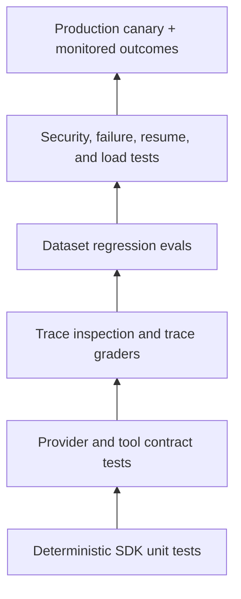

# Tracing, evaluation, and testing

**Research date:** 2026-08-31  
**Status:** Research-backed, version-sensitive guide  
**Scope:** Built-in tracing, sensitive-data controls, deterministic SDK tests, provider integration tests, trace graders, datasets, eval runs, and release gates

Tracing explains what a run did; evaluation measures whether it was good enough. Unit tests establish deterministic SDK behavior. Production confidence requires all three.

## Evidence ladder

Each layer answers a different question:

| Layer | Proves | Does not prove |
|---|---|---|
| Scripted model unit test | runner control flow, tools, handoffs, guardrails, serialization | real model quality or provider protocol |
| Provider contract test | selected model/API accepts schemas and emits expected items | broad behavioral quality |
| Trace inspection | actual sequence and latency for sampled runs | population-level regression |
| Dataset eval | repeatable quality metric over cases | real traffic distribution or system reliability |
| Adversarial/failure test | bounded resilience and safety properties | all novel attacks/failures |
| Canary | behavior under real deployment | safe full rollout without thresholds/rollback |

## Built-in tracing

The SDK tracing integration can record:

- agent/model spans;
- generation details;
- function-tool and hosted-tool activity;
- handoffs;
- guardrails and approvals;
- custom spans and grouping metadata.

Tracing is enabled by default in normal server-side paths, subject to configuration. The TypeScript SDK disables it in browser-like and test environments by default. Do not assume a test generated no remote trace unless you configure this explicitly.

### Data handling

Traces may contain model inputs/outputs and function-tool inputs/outputs. That can include personal data, secrets, retrieved documents, tool errors, or adversarial content.

Choose one of:

- disable sensitive payload capture while retaining structural spans;
- redact before the trace processor/exporter;
- disable tracing for restricted workflows;
- use a separately approved observability provider/integration.

OpenAI's documentation states that SDK tracing is unavailable under Zero Data Retention. Treat this as an architectural constraint, not a logging toggle. Build compliant local metrics and audit trails instead.

In edge/serverless runtimes, flush explicitly before the runtime freezes. In long-lived services, flush during graceful shutdown with a bounded timeout.

## Trace schema

Add application metadata that lets operators answer:

- Which tenant/workflow/policy version ran?
- Which SDK and explicit model version?
- Which active agent and route?
- Which tool/effect ID and approval actor?
- What were model/tool/settlement latency and usage?
- Was the result final, interrupted, retried, cancelled, or recovered?

Never use raw user content as a metric label. Use opaque correlation IDs and bounded enumerations.

## Deterministic SDK tests

Current Python and TypeScript SDKs include provider-neutral scripted-model testing utilities. Script normalized outputs to test:

- tool call → tool result → final output;
- multiple emitted tool calls and concurrency limits;
- handoff route and active-agent change;
- guardrail tripwire;
- approval interruption, state serialization, decision, and resume;
- max turns and supported error-handler fallback;
- timeout/retry classification;
- streamed event projection and settlement;
- malformed final output.

These utilities exercise SDK-normalized boundaries. They do not validate the actual provider wire format, model decision quality, real sandbox isolation, MCP server behavior, or external side effects.

## Contract and integration tests

Run a small controlled suite against each model/provider combination:

- strict function schema and structured final output;
- parallel tool-call ordering and identifiers;
- hosted tools used by the workload;
- streaming deltas and final result;
- stateful conversation/previous-response flow;
- incomplete/failed response handling;
- usage accounting and rate-limit headers;
- cancellation and timeout;
- trace export or intentionally disabled behavior.

Mock external effects or use isolated test tenants. A provider test must never create an uncontrolled production mutation.

## From trace to eval

Use failed or surprising traces to create a durable case:

1. redact and minimize the input;
2. identify the desired output/route/tool policy;
3. add deterministic assertions where possible;
4. define a human rubric or grader for semantic quality;
5. add variations and adversarial neighbors;
6. establish a baseline and release threshold.

Trace graders help score observed execution traces; datasets and eval runs support repeatable regression testing. Inspect traces first so a grader does not reward a final answer while missing an unsafe tool path.

## Metrics by layer

| Layer | Useful metrics |
|---|---|
| Model | calls, tokens, cached tokens, latency, refusal/incomplete rate |
| Agent loop | turns, final/interrupted/max-turn/cancel rate |
| Routing | destination accuracy, loops, unnecessary handoffs |
| Tools | call count, validation errors, timeouts, p95 latency, effect uncertainty |
| Safety | guardrail trips, approvals, rejection rate, policy escapes |
| State | conflicts, compactions, resume success, incompatible state |
| Outcome | task success, human correction, groundedness, escalation |
| Economics | cost per successful outcome, not only per model call |

Include nested agent and hosted-tool usage in budgets. A low-cost top-level model call can trigger expensive nested work.

## Release gate

- [ ] Deterministic suite passes for control flow and resume paths.
- [ ] Provider contract suite passes for every supported model/provider.
- [ ] Dataset scores meet quality and safety thresholds with confidence bounds.
- [ ] No critical regression in cost, p95 latency, or tool error rate.
- [ ] Injection and excessive-agency cases pass.
- [ ] Trace payload policy and ZDR behavior are verified.
- [ ] Canary alerts and automatic/manual rollback are ready.
- [ ] New failures can be converted into versioned cases.

## Common evaluation mistakes

- Evaluating only final prose while ignoring tool sequence and approvals.
- Using an LLM grader without calibration against human labels.
- Tuning prompts on the test set.
- Comparing model quality without cost/latency/error rate.
- Ignoring nondeterministic variance and reporting one run.
- Uploading sensitive production traces to an unapproved eval project.
- Treating a scripted model test as evidence of real model behavior.

## Limits and refresh triggers

Testing utilities, trace schemas, data controls, and eval APIs can change independently. Refresh on either SDK minor release, a tracing-default change, a ZDR/data-policy change, or a new eval/trace-grader surface.

## Primary sources

- [Integrations and observability](https://developers.openai.com/api/docs/guides/agents/integrations-observability)
- [Agent evals](https://developers.openai.com/api/docs/guides/agent-evals)
- [OpenAI Agents SDK Python: tracing](https://openai.github.io/openai-agents-python/tracing/)
- [OpenAI Agents SDK TypeScript: tracing](https://openai.github.io/openai-agents-js/guides/tracing/)

## Continue reading

[Knowledge-area map](README.md) · [Security and approvals](security-guardrails-and-approvals.md) · [Deployment and operations](deployment-operations-and-cost.md) · [Version and parity](version-parity-migrations-and-limitations.md)

