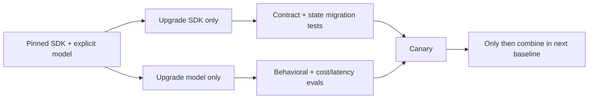

# Version, parity, migrations, and limitations

**Research date:** 2026-08-31  
**Status:** Research-backed snapshot; verify before every upgrade  
**Scope:** Python 0.22.0 and TypeScript 0.17.0 parity, base API versus SDK ownership, release policy, migration controls, and known architectural limitations

Python and TypeScript implement the same conceptual SDK, not identical products. At the cutoff, both were pre-1.0 and documented a modified semantic-version policy: minor versions can include breaking changes to public non-beta APIs, while beta/experimental/private behavior can change even more freely.

## Inspected snapshot

| Language | Package | Version | Official source commit/date |
|---|---|---:|---|
| Python | `openai-agents` | 0.22.0 | `89c02c828ee8510fe9a84ee6675608193aa13b02`, 2026-08-28 |
| TypeScript | `@openai/agents` | 0.17.0 | `8e862b3380a577df1315bef17f351c1b58c2938b`, 2026-08-28 |

Python 0.22.0 requires Python 3.10+ and OpenAI Python 3.x. The inspected TypeScript package uses OpenAI JavaScript 7.x and Zod 4 as a peer-family dependency. Confirm exact constraints from the release you install.

## Capability parity

| Capability | Python | TypeScript | Portability note |
|---|---|---|---|
| Core runner, agents, handoffs, function tools | Strong | Strong | Concept parity; names and serialization differ |
| Default max turns | 10 | 10 | Turn is a model call; still set explicitly |
| Static/dynamic instructions, structured output | Yes | Yes | Schema ecosystems differ |
| Streaming events | Yes | Yes | One handoff event spelling differs |
| Approvals + resumable RunState | Yes | Yes | Persist language-native state; do not assume wire compatibility |
| SDK sessions | Broad documented backend set | Memory + Conversations built-ins, custom interface | Python richer in documented storage implementations |
| Transaction-aware session extension | No equivalent documented contract at cutoff | Optional atomic/idempotent contract | Do not infer Python parity |
| Tool search client execution | Manual-loop limitation documented | Helper supports client execution | Acceptance-test |
| Function-tool timeout/cancellation | Async timeout surface; cooperative limits | Timeout/AbortSignal surface; cooperative limits | Underlying code may continue |
| Model retries | Opt-in policy/helpers | Opt-in policy/helpers | Exact callback/types differ |
| Deterministic scripted-model tests | Yes | Yes | Tests SDK-normalized behavior only |
| Sandbox agents | Beta | Beta | Provider/platform support differs |
| Local Unix sandbox client | macOS/Linux | macOS/Linux-oriented | Use Docker/hosted on Windows |
| Nested handoff history | Opt-in beta surface | No equivalent established in inspected docs | Avoid cross-language dependency |
| Durable-runtime integrations | Several Python docs/examples | Not equivalent in core docs | Keep durability external |
| Realtime package surface | Available | Available/exported | Separate from Responses text run semantics |

“No equivalent established” means the inspected official docs/source did not support a parity claim; it is not proof that no lower-level workaround exists.

## Base API, SDK, and adjacent products

| Surface | Owns | Does not automatically provide |
|---|---|---|
| Responses API | model response protocol, hosted tools, server conversation/response state, HTTP/SSE/WebSocket transport | application agent policy, local effect safety |
| Agents SDK | in-process loop, normalized items, handoffs, function dispatch, SDK sessions, guardrails/approvals, tracing integration | durable workflows, exactly-once effects, tenant authorization |
| Realtime API/SDK surface | low-latency interactive event/audio sessions | ordinary Responses stream equivalence |
| Sandbox agents | isolated workspace/command runtime | correctness, trustworthy code, workflow durability |
| Agent Builder/ChatKit | visual/workflow or product UI surfaces | drop-in equivalence to code-first Agents SDK |
| Evals/trace graders | quality measurement | runtime enforcement or authorization |

## Recent migration signals

The official histories around the cutoff show why exact pinning matters:

- Python 0.21 moved to OpenAI Python 3.x/HTTPX 2; custom transports need migration testing.
- Python 0.20 and TypeScript 0.15 changed the default model to `gpt-5.6-luna`.
- Python 0.22 hardened rejected-tool-output persistence and terminal failed/incomplete Responses handling.
- TypeScript 0.16 added deterministic testing utilities.
- TypeScript 0.15 added durable pending-input handling; 0.14.3 improved session-history transaction idempotency.
- TypeScript 0.14 disabled sensitive logging by default.

These are examples, not a substitute for reading every intervening release note.

## Upgrade matrix

For each upgrade:

- read all release notes between versions;
- record package, transitive OpenAI client, schema library, and model;
- test existing serialized RunState/session data;
- test custom model providers/transports;
- run tool, stream, retry, approval, and trace contracts;
- run quality/safety datasets;
- canary with rollback;
- expire or migrate incompatible paused states deliberately.

Avoid changing SDK, model, prompt, and tools in one rollout. It destroys attribution.

## Architectural limitations

The SDK does not by itself guarantee:

- exactly-once external effects;
- durable scheduling, timers, or crash recovery;
- cross-language serialized-state compatibility;
- equivalent semantics across model providers;
- automatic authorization of tool calls;
- prompt-injection immunity;
- safe generated code;
- complete cancellation of blocking work;
- zero sensitive data in traces;
- correct cost budgets across nested/external systems;
- safe concurrent turns in every session backend.

These are application/system responsibilities.

## Pinning policy

For risk-sensitive production:

- pin exact SDK patch and dependency lockfile;
- select an explicit model or snapshot;
- record versions in trace/log metadata;
- isolate beta/experimental features behind flags;
- keep a rollback artifact;
- retain fixture states from the previous version;
- schedule recurring release-note review.

For prototypes, a minor range may be acceptable if CI runs contract/eval suites on every resolved-version change. Never allow an unattended dependency update to alter a high-impact agent path.

## Parity decision checklist

- [ ] A single-language source of truth is selected, or parity tests exist.
- [ ] State is not serialized across languages without an application schema.
- [ ] Storage/session capabilities are designed to the weaker common contract.
- [ ] Hosted/base-API features are labeled provider-specific.
- [ ] Beta/experimental surfaces have fallbacks.
- [ ] Event-name and result-shape normalization lives in an adapter.
- [ ] Both languages run equivalent behavioral eval cases.
- [ ] Upgrade and rollback cover paused approval states.

## Refresh triggers

Refresh this file for every SDK minor release, OpenAI client major change, default-model change, sandbox beta change, session/retry/testing contract change, or newly claimed Python/TypeScript parity.

## Primary sources

- [Agents overview](https://developers.openai.com/api/docs/guides/agents)
- [OpenAI Agents SDK Python release notes](https://openai.github.io/openai-agents-python/release/)
- [OpenAI Agents SDK TypeScript changelog](https://github.com/openai/openai-agents-js/blob/main/packages/agents/CHANGELOG.md)
- [OpenAI Agents SDK Python repository snapshot](https://github.com/openai/openai-agents-python/tree/89c02c828ee8510fe9a84ee6675608193aa13b02)
- [OpenAI Agents SDK TypeScript repository snapshot](https://github.com/openai/openai-agents-js/tree/8e862b3380a577df1315bef17f351c1b58c2938b)

## Continue reading

[Knowledge-area map](README.md) · [Agents and provider boundaries](agents-models-and-provider-boundaries.md) · [Sessions and state](sessions-context-and-state.md) · [Research packet](../../research/packets/openai-agents-sdk-deep-dive.md)

