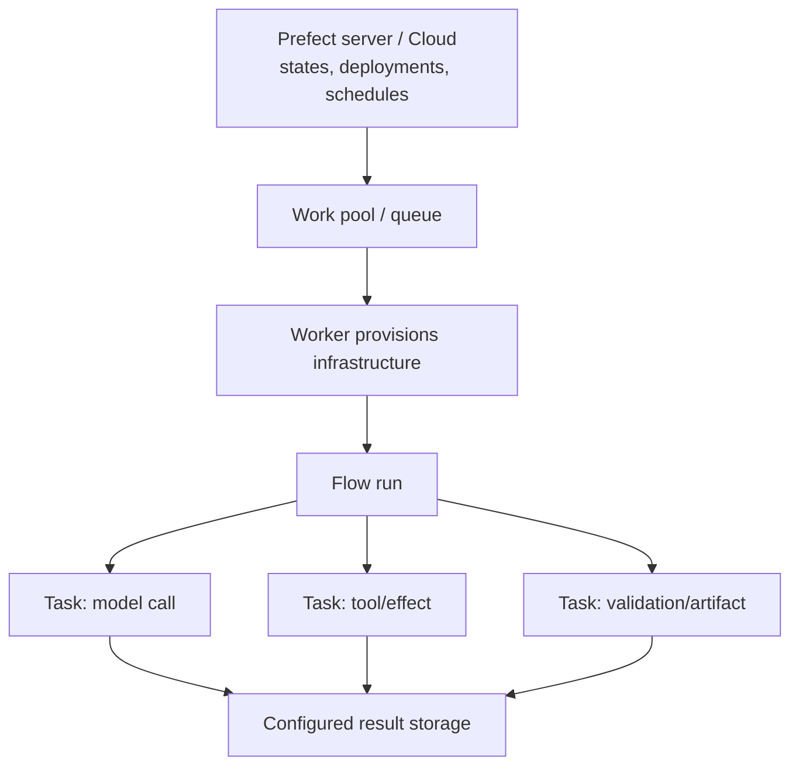
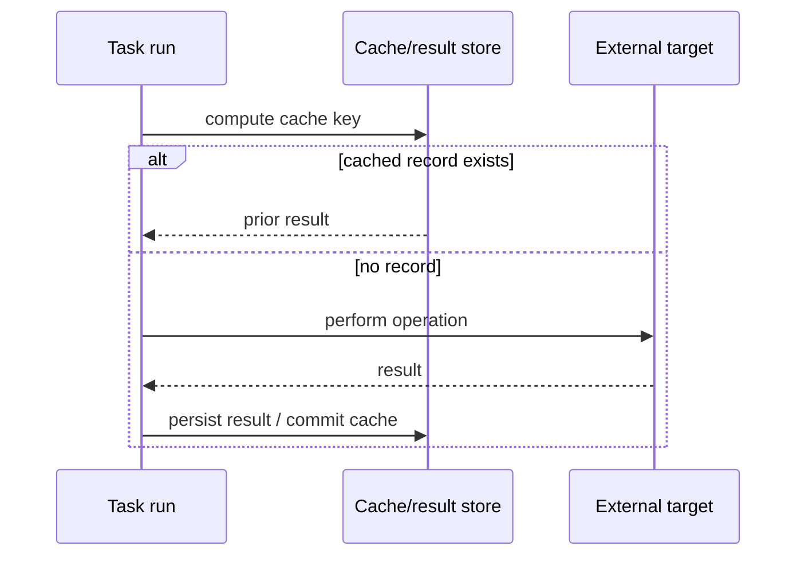
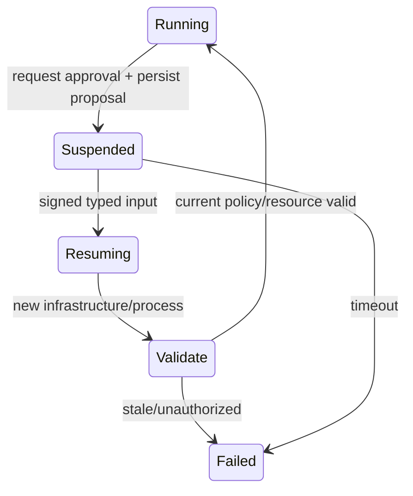

# Prefect for Agent Workflows

**Research date:** 2026-08-31  
**Status:** Research-backed technology guide  
**Scope:** Prefect 3 flows/tasks, states, results, caching/transactions, interaction, deployments/workers, cancellation, and agent workload fit

## Bottom line

Choose Prefect when an agent is part of a Python data, ML, infrastructure, research, or batch workflow that benefits from dynamic tasks, mapping, retries, schedules, event automations, work pools, and operator-visible run states.

Do not assume Prefect transparently resumes arbitrary Python at the last instruction. Recovery quality comes from task boundaries, retries, persisted results, cache/lock configuration, and idempotent external effects. A whole agent loop hidden inside one flow is still one coarse failure unit.

## Execution model

Flows compose work and own a run state. Tasks add their own state, retries, timeouts, caching, and concurrency. Deployments describe when, where, and how a flow starts; work pools and workers provision/monitor infrastructure.

## Design agent granularity

| Shape | Recovery behavior | Use |
|---|---|---|
| Entire agent in flow body | Flow retry can rerun the body from the beginning | Short read-only or internally idempotent loop |
| Model/tool calls as tasks | Failed task can retry; persisted/cacheable results can be reused | Most production agent pipelines |
| Agent as one task in larger flow | Outer data/process workflow remains explicit | Bounded pocket of autonomy |
| One deployment per long-running subprocess | Independently cancellable infrastructure/run | Work needing separate lifecycle/SLO |

Keep model reasoning nondeterministic but make effectful boundaries explicit. A task’s `Completed` state means Prefect observed the task completion, not that a remote effect cannot repeat after an ambiguous network failure.

## Results and caching

Result persistence is foundational to Prefect caching and later retrieval, but is not universally enabled by default. Local result storage does not survive replacement of an ephemeral pod/container. Configure shared S3/GCS/Azure/object storage or a persistent volume for distributed recovery.

Default `READ_COMMITTED` cache isolation can allow concurrent executions with the same key. `SERIALIZABLE` needs a lock manager appropriate to threads, processes, or multiple machines. A cache key must include every input that changes correctness: tenant, resource version, prompt/tool/policy version, model settings, and artifact digest. Never use a shared cache across tenants by accident.

## Transactions are compensating workflow tools

Prefect transactions group result commits and run `on_commit`/`on_rollback` hooks. They can enforce at-most-once execution relative to a transaction/cache key and coordinate cache writes. They do not create an ACID transaction with arbitrary external APIs.

Rollback hooks are compensating effects. Make each hook idempotent, pass the original operation receipt, record its outcome, and escalate failure. Do not label a flow “rolled back” unless operators can inspect what was actually compensated.

## Retries, timeouts, and provider failures

Put model/tool retries on the smallest safe task and ensure only one layer owns them. If an SDK already retries, multiply its worst-case attempts by Prefect attempts. Use retry conditions to separate transient rate limits/5xx/network failures from invalid credentials, policy denial, invalid tool arguments, and budget exhaustion.

Set task and flow deadlines. A timeout interrupts local execution according to the runtime, but an external request or subprocess may continue. Use operation IDs and reconciliation before another task attempt.

## Human interaction: pause versus suspend

Prefect supports typed input on resume.

- `pause_flow_run` blocks the flow process and polls until resumed; already-started tasks continue.
- `suspend_flow_run` stops the process and schedules a new execution on resume, releasing infrastructure.

Use suspension for hours/days. Ensure all state needed after reschedule is in persisted results, parameters, artifacts, or domain records—not process memory. Bind the input to exact run/proposal identity and reauthorize on resume.

## Cancellation is infrastructure-mediated

Cancellation of a deployed flow moves it to `Cancelling`; a worker monitors the request and asks the recorded infrastructure to terminate, then kills it after a grace period if supported. The official guide documents important limits:

- the flow must be associated with a deployment and a monitor must run;
- inline nested flows cannot be independently cancelled;
- unsupported infrastructure cannot be force-cancelled;
- a missing/mismatched infrastructure identifier can produce a cancelled state without terminating the actual process.

Design cleanup/effect reconciliation outside process-finally blocks because SIGKILL, node loss, and missing identifiers can skip them. Deploy independently cancellable units rather than nesting them inline.

## Deployments, work pools, and scaling

Deployments store schedules, parameters, infrastructure configuration, and code-location metadata. Work pools abstract Docker, Kubernetes, cloud-run jobs, and other environments. Workers poll and provision/monitor jobs; some Prefect Cloud pool types do not require user-operated workers.

Use unique immutable image tags; pull-latest behavior can run unexpected code. Version deployment config, flow/task code, prompts, tools, and schemas. Deployment configuration versioning in Cloud does not automatically guarantee that an old run can load old code or results.

Monitor scheduled/Late/Pending age, healthy worker polls, infrastructure creation time, task retry/timeout rate, mapped-task fan-out, concurrency-slot wait, cache hit/collision, result-store errors, stuck Running states, suspended-run age, cancellation enforcement, and per-tenant cost.

Automations can detect absence of expected transitions and cancel/restart or alert on stuck runs. Keep automated restarts bounded and effect-aware.

## Security and data

Flow/task parameters, logs, states, artifacts, results, and serialized context may expose prompt/tool data. Secret blocks are encrypted at rest in the backend, but loading a secret into a task does not prevent logs, model prompts, traces, or result serialization from leaking it.

Prefect’s default result serializer includes pickle. Treat persisted results as trusted-code data, restrict writers/readers, prefer safer structured formats when possible, and isolate result storage by environment/tenant. Ensure workers receive least-privilege cloud credentials through their infrastructure, not serialized flow parameters.

## Failure and adoption tests

- [ ] Crash flow and task processes before/after model and tool results.
- [ ] Use remote result storage and recover after pod/node replacement.
- [ ] Race identical cache keys at `READ_COMMITTED` and selected distributed lock isolation.
- [ ] Prove remote effects deduplicate independently of task cache.
- [ ] Suspend for a deploy, then resume on fresh infrastructure with typed input.
- [ ] Cancel Docker/Kubernetes/process runs and verify the process and target effect both stop/reconcile.
- [ ] Lose a worker and detect Late/Pending/stuck Running runs through automations.
- [ ] Load-test mapped fan-out, API calls, result storage, and concurrency limits.
- [ ] Change code/image/result schema and load oldest retained runs/results.
- [ ] Inspect logs, parameters, result files, and UI for sensitive data.

## Choose something else when

- transparent deterministic event-history replay is a hard requirement;
- durable keyed services/objects are the domain model;
- Postgres-embedded workflow checkpoints are the desired minimal stack;
- Dapr is already the runtime platform;
- the workload is primarily an interactive low-latency agent service rather than Python data/operations orchestration.

## Primary sources and failure-test leads

- [Flows](https://docs.prefect.io/v3/concepts/flows), [tasks](https://docs.prefect.io/v3/concepts/tasks), and [states](https://docs.prefect.io/v3/concepts/states)
- [Result persistence](https://docs.prefect.io/v3/advanced/results), [caching](https://docs.prefect.io/v3/concepts/caching), and [transactions](https://docs.prefect.io/v3/advanced/transactions)
- [Interactive workflows](https://docs.prefect.io/v3/advanced/interactive), [cancellation](https://docs.prefect.io/v3/advanced/cancel-workflows), and [deployments](https://docs.prefect.io/v3/concepts/deployments)
- [Automations](https://docs.prefect.io/v3/concepts/automations), [task runners](https://docs.prefect.io/v3/concepts/task-runners), and [secret storage](https://docs.prefect.io/v3/how-to-guides/configuration/store-secrets)

See [durable-runtime selection](../comparisons/durable-agent-workflow-runtimes.md) and the [research packet](../research/packets/durable-agent-workflow-runtimes.md).
