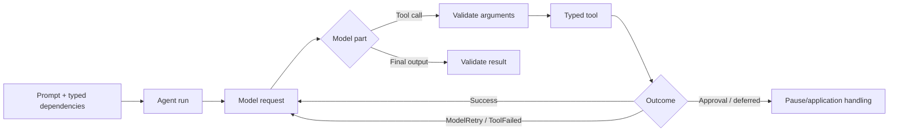
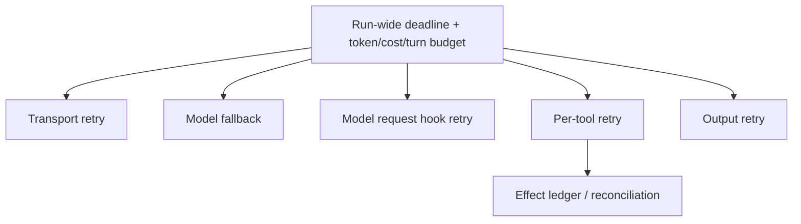
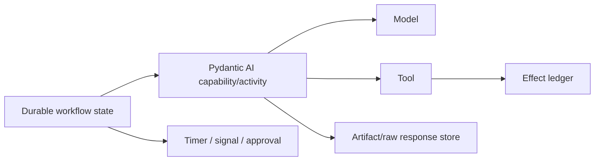

# Pydantic AI in Production

**Research date:** 2026-08-31  
**Status:** Research-backed technology guide  
**Scope:** Pydantic AI V2 line, with explicit durable integrations; pin fixed versions and recheck security advisories

> Continue from this concise overview into the [14-guide Pydantic AI production playbook](pydantic-ai/README.md) for lifecycle, providers, tools, validation, streaming, limits, history, durable adapters, delegation, evals, telemetry, security, deployment, and migration.

## Bottom line

Choose Pydantic AI for a Python-native agent with typed dependencies, validated tools and outputs, explicit model/tool control flow, and maintained integration paths to durable engines. It is strongest when schema correctness and predictable application integration matter more than a visual graph abstraction.

Types do not provide effect safety, authorization, total retry bounds, or provider parity. Add those as application contracts.

## Runtime model

Pydantic validation is valuable at untrusted model boundaries: malformed arguments and results become explicit correction paths. Semantic validity still requires resource lookup, authorization, invariants, and conflict checks immediately before an effect.

## Failure taxonomy is a feature

| Outcome | Meaning | Production handling |
|---|---|---|
| Validation error | Model supplied malformed data | Return bounded, model-visible correction details |
| `ModelRetry` | Tool asks model to revise its call | Count against tool and total run budgets |
| `ToolFailed` | Expected tool failure is model-visible | Use a stable, non-sensitive error taxonomy |
| Approval required / deferred call | Application must decide or perform later | Persist exact call, policy version, expiry, and state |
| Cancellation | Cooperative run/tool stop | Suppress late commits; reconcile side effects |
| Ordinary exception | Application/programming/infrastructure failure | Classify outside model-visible correction unless intentionally mapped |

Do not turn arbitrary stack traces into model context. Map expected failures narrowly and keep diagnostics in protected telemetry.

## Compose retries explicitly

The framework documents distinct transport, model-fallback, tool, output, and model-request-hook retry layers. Tool counters are per tool name, reset after success, and `N` retries permits `N+1` attempts. A model can call multiple tools or invent another name, so local counters do not bound the run.

Create one attempt tree per run. Permit transport retries only for known-safe request states; require an idempotency key or reconciliation for writes; and stop all layers when the total deadline or budget expires. Whole runs are not automatically retried, and blindly adding a job retry outside the agent can duplicate every inner attempt.

## Cancellation boundary

Async tool tasks can be cancelled and drained. Synchronous functions running in worker threads cannot be forcibly stopped; their eventual return may be ignored while their side effects still happen. An in-process cancellation token also does not automatically cross a serialized durable activity boundary.

Every effectful tool should accept a deadline/cancellation context where the downstream client supports it, use short network timeouts, record an operation ID, and check commit authority just before writing. After cancellation, late results must be discarded or marked for reconciliation—never appended as if the run were still authoritative.

## Durable execution integrations

Pydantic AI documents integrations for Temporal, DBOS, Prefect, and Restate. These can move model requests, tools, and other capabilities into engine-managed units.

The integration is not invisible. It introduces serialization, engine retry, heartbeat/cancellation, activity size, and version-compatibility rules. A current dynamic-tool issue shows that model-correctable validation may be surfaced as an engine task failure in some combinations. Build a conformance suite for malformed calls, retryable provider errors, timeouts, cancellation, approval, crash-after-effect, large results, and version upgrades.

Store large provider responses and artifacts outside workflow history, referenced by immutable digest. Keep deterministic workflow decisions separate from stochastic model calls.

## Security and versioning

Pydantic AI V2 became the stable line in June 2026; V1 has a time-limited security-support window. The project published several 2026 advisories involving developer web UI exposure, UI adapter confused-deputy behavior, unbounded remote-content download, and telemetry redaction. The lesson is broader than the individual patches:

- developer UIs are privileged execution surfaces; bind locally and authenticate;
- validate UI message/tool provenance server-side;
- cap and stream remote content before parsing;
- redact prompts, tool arguments/results, dependencies, and exceptions at source;
- pin versions containing fixes across core, UI, adapters, and durable integration packages.

Review the current [security advisories](https://github.com/pydantic/pydantic-ai/security) before every release.

## Operational acceptance tests

- [ ] Generate malformed, semantically invalid, unauthorized, and oversized tool calls.
- [ ] Enumerate the maximum combined attempts across every retry layer.
- [ ] Cancel async, sync-thread, streaming, deferred, and durable-engine work.
- [ ] Crash before tool send, after send, after remote commit, and before result persistence.
- [ ] Resume approval/deferred calls after deployment and policy changes.
- [ ] Replay persisted engine state across every supported package upgrade.
- [ ] Compare provider structured-output, tool parallelism, usage, and stream semantics.
- [ ] Verify sensitive values never enter logs, spans, model-visible errors, or serialized state.
- [ ] Bound result sizes and external downloads before memory allocation.
- [ ] Evaluate with outcome and invariant checks, not only type-validation success.

## Choose it when

- the application is Python-first and gains real value from Pydantic models and dependency injection;
- tool/result validation and explicit failure paths are central;
- the team wants to compose an agent with one of the maintained durable engines;
- it can own authorization, effects, budgets, and telemetry outside the type layer.

## Prefer another shape when

- workflow topology and operator-visible checkpoints dominate: compare LangGraph;
- TypeScript streaming UI is the primary product surface: compare AI SDK;
- filesystem/shell/subagent harness behavior is central: compare Deep Agents or a dedicated harness;
- a single structured model call is sufficient: use the provider client plus Pydantic validation.

## Primary sources and failure-test leads

- [Agents](https://ai.pydantic.dev/agents/), [advanced tools](https://ai.pydantic.dev/tools-advanced/), [retries](https://ai.pydantic.dev/retries/), and [timeouts](https://ai.pydantic.dev/timeouts/)
- [Durable execution overview](https://ai.pydantic.dev/durable_execution/overview/) and [version policy](https://ai.pydantic.dev/version-policy/)
- [Security advisories](https://github.com/pydantic/pydantic-ai/security)
- Adoption tests from [cancellation semantics issue #6460](https://github.com/pydantic/pydantic-ai/issues/6460) and [durable dynamic-tool validation issue #6979](https://github.com/pydantic/pydantic-ai/issues/6979)

See [independent framework selection](../comparisons/independent-agent-frameworks.md), [Python agent runtimes](../languages/python-agent-runtimes.md), and the [research packet](../research/packets/independent-agent-frameworks.md).
