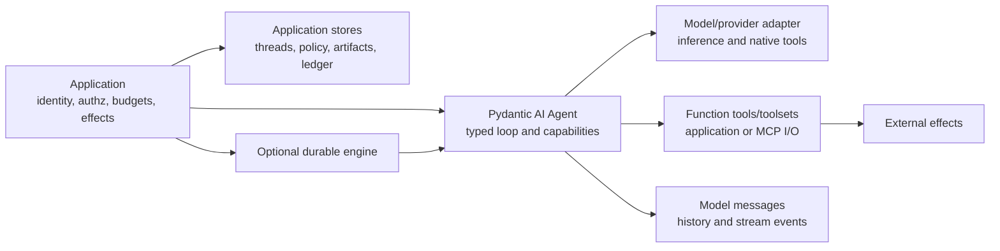
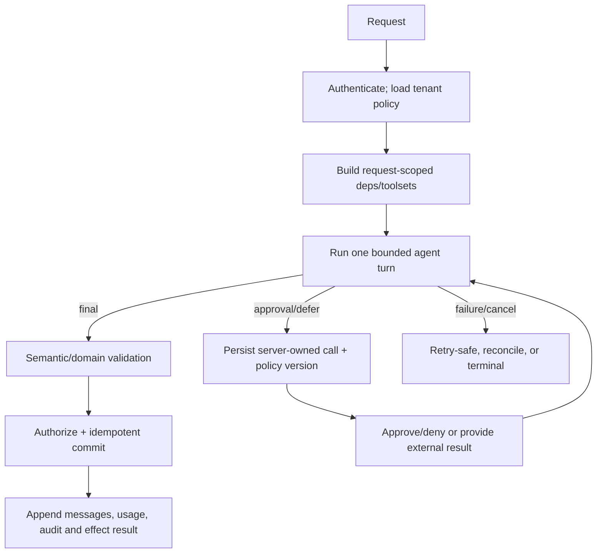

# Pydantic AI Production Playbook

**Research date:** 2026-08-31  
**Status:** Deep, research-backed guide cluster  
**Primary scope:** Pydantic AI V2, verified against stable `v2.36.0` and official repository `main` at `22b3d6a`  
**Related scope:** first-party Pydantic AI Harness capabilities and maintained durable-engine integrations where they change the runtime contract

Pydantic AI is a typed Python agent runtime, not a security boundary or a workflow engine. Its strongest contract is at model-facing data boundaries: it derives schemas from Python types, validates tool arguments and output, exposes model-correction paths, and carries typed dependencies through the run. Production correctness still depends on application policy around identity, authorization, side effects, budgets, storage, and recovery.

This area expands the repository's [concise Pydantic AI overview](../pydantic-ai.md). It focuses on how the V2 runtime behaves under malformed model output, retries, cancellation, streaming, client-supplied history, durable replay, provider differences, and upgrades.

## Use this map

| If you need to understand or build… | Start here |
|---|---|
| Agent graph, run entry points, dependencies, capabilities, hooks | [Architecture, run lifecycle, and dependencies](architecture-run-lifecycle-and-dependencies.md) |
| Instructions, messages, model settings, providers, native tools | [Messages, instructions, models, and providers](messages-instructions-models-and-providers.md) |
| Function tools, toolsets, MCP, dynamic exposure, approval, deferral | [Tools, toolsets, MCP, and approvals](tools-toolsets-mcp-and-approvals.md) |
| Output modes, Pydantic validation, correction, retry and error taxonomy | [Outputs, validation, retries, and errors](outputs-validation-retries-and-errors.md) |
| Stream APIs, events, partial validation, AG-UI and Vercel adapters | [Streaming, events, and UI protocols](streaming-events-and-ui.md) |
| Request/token/cost/tool limits, deadlines, concurrency, cancellation | [Usage, limits, context, and cancellation](usage-limits-context-and-cancellation.md) |
| Message history, trust, serialization, compaction, state, memory | [History, state, memory, and persistence](history-state-memory-and-persistence.md) |
| Temporal, DBOS, Prefect, Restate, replay and effect boundaries | [Durable execution and replay boundaries](durable-execution-and-replay-boundaries.md) |
| Delegation, hand-off, shared usage, dependencies, cancellation trees | [Multi-agent systems and delegation](multi-agent-and-delegation.md) |
| `TestModel`, `FunctionModel`, deterministic tests and Pydantic Evals | [Testing, evals, and model fakes](testing-evals-and-model-fakes.md) |
| Logfire, OpenTelemetry formats, metrics, redaction and correlation | [Tracing, Logfire, and OpenTelemetry](tracing-logfire-and-opentelemetry.md) |
| Current advisories, UI/history trust, SSRF, permissions and secrets | [Security advisories and permission boundaries](security-advisories-and-permissions.md) |
| Deployment shape, connection reuse, backpressure, retries, shutdown | [Deployment, performance, and reliability](deployment-performance-and-reliability.md) |
| V1-to-V2 migration, version guarantees, limitations and alternatives | [Versions, migrations, limitations, and alternatives](versions-migrations-limitations-and-alternatives.md) |
| Evidence ledger, issue leads, exclusions and refresh criteria | [Research packet](../../research/packets/pydantic-ai-deep-dive.md) |

## The ownership boundary

The critical separations are:

- **Pydantic validation** proves that data matches a declared structure after parsing. It does not prove that a claim is true, that an object exists, that a transition is legal, or that the caller may perform it.
- **Tool visibility** influences what the model can request. It is not authorization. Re-check tenant, subject, object, action, policy version, and current resource state inside the effect boundary.
- **Approval** is a model-control mechanism unless the paused run and approval decision are server-owned. Client-submitted histories and approvals are forgeable by design.
- **Message history** provides conversational continuity. It is not a durable effect log, long-term memory policy, or trustworthy event source.
- **A durable adapter** makes the model/tool units it wraps replayable according to one engine. It does not make an external write exactly once, make schemas upgrade-safe, or automatically propagate in-process state mutations across the durable boundary.

## Recommended production shape

Start with one reusable `Agent`, typed per-request dependencies, a small allowlisted toolset, `instructions` rather than persistent system prompts, and one explicit output mode. Apply run-wide request, token, cost, tool-call, wall-clock, and concurrency limits. Keep effectful tools idempotent and authorize immediately before commit.

Use a durable engine only when crash recovery, long waits, scheduling, or operator control justify its deployment and migration cost. Model calls remain stochastic activities; workflow replay must reuse recorded results rather than invoke the model again. Every external write still needs an operation ID and reconciliation path.

## Minimum production contract

- [ ] Pin the core package, extras, provider SDKs, UI adapters, MCP runtime, and durable-engine adapter as one tested set.
- [ ] Translate run/message/UI events into an application-owned [state and event contract](../../runtime/agent-state-and-event-contracts.md) with stable identity, terminal outcomes, ordering, and replay.
- [ ] Give each run a wall-clock deadline plus request, token, cost, and successful-tool-call limits.
- [ ] Bound transport, provider, model-correction, output, job, and engine retries separately.
- [ ] Build dependencies and authenticated toolsets per request; never share user credentials through one long-lived MCP session.
- [ ] Authorize at execution time even when a tool was filtered, approved, or schema-valid.
- [ ] Use idempotency keys and an effect ledger for external writes; reconcile indeterminate outcomes.
- [ ] Treat client-supplied message history, tool calls, results, file references, and approvals as untrusted.
- [ ] Persist exact message types with `ModelMessagesTypeAdapter`; version application-owned records.
- [ ] Redact prompts, retries, tool data, dependencies, exceptions, binary content, and metadata before export.
- [ ] Test cancellation during model streaming, parallel async tools, synchronous tools, approval, durable activities, and shutdown.
- [ ] Evaluate semantic outcomes, authorization, side effects, latency, cost, and trajectories—not only schema validity.
- [ ] Check the official security advisories before each release.

## Version posture and refresh triggers

V2 became stable on 2026-06-23. The official policy avoids intentional breaking changes in minor releases, but permits new message parts and stream events, optional fields, undocumented-bug fixes, OpenTelemetry attribute changes, and beta incompatibility. Consumers must use tolerant event handling and test minor upgrades.

Refresh this area when any of these change:

- the Pydantic AI major or minor line, provider SDK, default model mapping, output mode, message/event schema, or retry semantics;
- capability or Pydantic AI Harness packaging, Step Persistence, Memory, Guardrails, or spend controls;
- Temporal, DBOS, Prefect, Restate, Kitaru, or Airflow adapter protocols and replay rules;
- AG-UI, Vercel AI, MCP, remote-file, web-fetch, cancellation, or telemetry behavior;
- a new [Pydantic AI security advisory](https://github.com/pydantic/pydantic-ai/security/advisories).

## Primary official sources

- [Pydantic AI documentation](https://ai.pydantic.dev/)
- [Official repository](https://github.com/pydantic/pydantic-ai), [releases](https://github.com/pydantic/pydantic-ai/releases), and [V2 upgrade guide](https://ai.pydantic.dev/changelog/)
- [Agents](https://ai.pydantic.dev/agent/), [capabilities](https://ai.pydantic.dev/capabilities/overview/), [tools](https://ai.pydantic.dev/tools/), and [messages](https://ai.pydantic.dev/message-history/)
- [Durable execution](https://ai.pydantic.dev/durable_execution/overview/) and [security advisories](https://github.com/pydantic/pydantic-ai/security/advisories)
