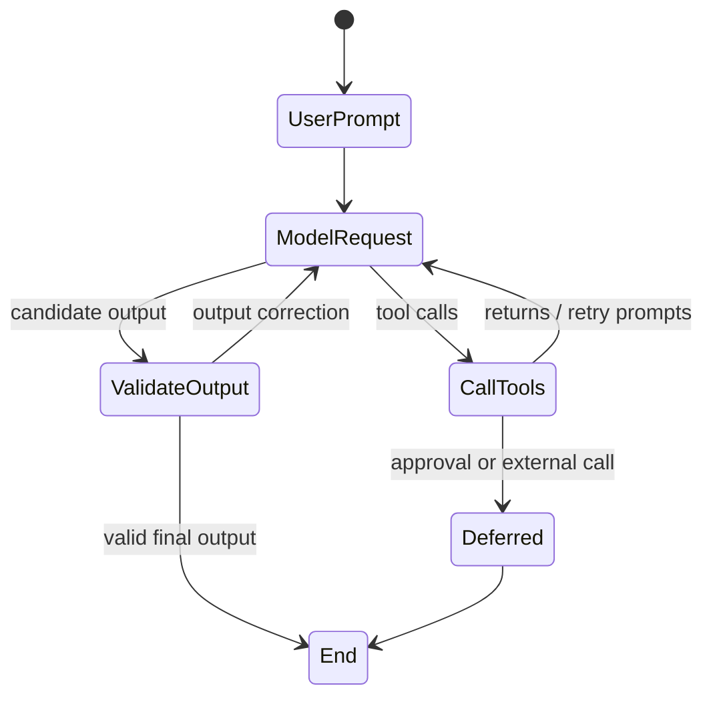

# Architecture, Run Lifecycle, and Dependencies

**Research date:** 2026-08-31  
**Version scope:** Pydantic AI `v2.36.0`

Pydantic AI's `Agent` packages configuration around a pydantic-graph execution loop. The useful abstraction is small: assemble the current instructions, model settings, tools, and history; request a model response; validate and execute calls; repeat until a valid output, deferral, cancellation, limit, or failure ends the run.

## Runtime units

An agent can contain instructions, system prompts, function tools and toolsets, output types, a dependency type, a default model, model settings, and capabilities. Agents are generic over dependency and output types and are intended to be reusable global objects; request-scoped values belong in `deps`, not on mutable agent fields.

Under the hood, the ordinary path traverses graph nodes equivalent to:



`agent.run()` hides this graph. `agent.iter()` exposes nodes and `AgentRun.next()` for custom driving. Node control is powerful but makes the application responsible for consuming streams, continuing the correct node, and preserving cancellation and history behavior. Prefer the high-level run APIs until node-level interception is a real requirement.

## Five execution surfaces

| Surface | Result | Best use | Important semantic |
|---|---|---|---|
| `run()` | completed `AgentRunResult` | normal async services | traverses the graph to completion |
| `run_sync()` | completed result | sync edge only | drives an event loop; do not call inside an active agent callback |
| `run_stream()` / sync variant | `StreamedRunResult` | convenient final-output streaming | first matching output can finalize before later tool calls |
| `run_stream_events()` | raw events ending in result event | protocol adapters and event consumers | async context manager; consumer reconstructs content |
| `iter()` | graph nodes and streams | custom runtime control | lowest-level public execution surface |

`run_stream()` is not just `run()` with chunks. It treats the first response matching the output type as final. With default V2 `end_strategy='graceful'`, additional function calls can still run in some mixed output responses, but their results are not another model round after the run is already final. Use `run_stream_events()` or `iter()` when every tool and event must be represented in the run protocol.

## Dependencies are typed runtime context

The dependency object is application-supplied and available through `RunContext[DepsT]` in dynamic instructions, tools, validators, output functions, and hooks. It is a good home for request-scoped database sessions, authenticated principals, API clients, tenant policy, clocks, and repositories.

```python
from dataclasses import dataclass
from pydantic_ai import Agent, RunContext

@dataclass
class Deps:
    subject_id: str
    tenant_id: str
    orders: "OrderRepository"

agent = Agent("openai:gpt-5.2", deps_type=Deps)

@agent.tool
async def cancel_order(ctx: RunContext[Deps], order_id: str) -> str:
    order = await ctx.deps.orders.get(ctx.deps.tenant_id, order_id)
    await ctx.deps.orders.authorized_cancel(ctx.deps.subject_id, order)
    return "cancelled"
```

The annotation improves static checking and Pydantic-aware plumbing. It does not constrain what the dependency instance can do. Keep credentials out of model-visible errors and telemetry; close request-scoped resources outside the agent; do not mutate a global dependency object between concurrent runs.

`Agent.override()` is valuable in tests for replacing models, dependencies, and toolsets. Avoid using global overrides as request routing: overlapping tasks can make implicit mutable configuration hard to reason about. Pass values on the run where possible.

## Capabilities and hooks in V2

V2 makes a capability the primary extension unit. A capability may contribute tools or native tools, instructions, hooks, model settings, or model selection. Core includes model/framework-integrated capabilities; the first-party Pydantic AI Harness contains higher-level memory, persistence, guardrail, spend, filesystem, shell, planning, and subagent components.

Capabilities compose behavior; they do not compose guarantees. Ordering matters when several hooks modify the same request or tool result. Record a capability inventory and test the final assembled tool list, instructions, settings, and hook outcomes—not each component in isolation.

Hook timing matters:

- early run/node hooks may execute before the current model request and tool manager are assembled;
- `before_model_request` sees the request about to be sent;
- tool validate hooks run around argument validation, then execution hooks around the tool body;
- model-request `ModelRetry` consumes the output-side correction budget;
- tool-hook `ModelRetry` consumes that tool's budget;
- error hooks recover by returning a replacement and propagate by raising.

Do not use a capability hook to conceal broad programming failures from the model. Map only expected, safe failures to `ModelRetry` or `ToolFailed`; leave the protected trace with the real exception.

## Instructions and run construction

Prefer `instructions` for current-agent behavior. Dynamic instructions are reevaluated on each run and can read dependencies. When message history is supplied, old instructions are not resent; the current agent's instructions are. `system_prompt` parts persist in history and should be reserved for deliberate cross-run prompt continuity.

At run creation, explicitly supply:

- authenticated dependencies and any per-user toolsets;
- a model or pinned routing policy;
- `UsageLimits`, a deadline, and request metadata;
- prior message history only from a trusted store or after sanitization;
- the same total-usage object when nested runs are intended to share a budget.

## Concurrency and lifecycle

An `Agent` is reusable, but not every object reachable through it is safe to share. Provider HTTP clients should be reused over the process lifetime; per-user MCP toolsets should not. `max_concurrency` and `ConcurrencyLimit` bound concurrent runs, while model wrappers can share a request limiter across agents. These limits protect capacity; they do not create queue durability or fairness across replicas.

Synchronous tools run in threads unless configured otherwise. Python cannot forcibly terminate such a thread. A timeout or run cancellation can discard its result while the function continues and commits an effect. Use async clients with cooperative timeouts for I/O, process isolation for untrusted or non-cooperative work, and commit fences for writes.

## Production invariants

- A run has one authoritative `run_id`, `conversation_id`, principal, tenant, policy version, and total budget.
- Tool availability and model settings are deterministic functions of authenticated run state.
- Schema validation happens before tool execution; domain validation and authorization happen again at commit.
- Every model request and effect is attributable to the run and tool-call ID.
- Cancellation stops future authority even when underlying work cannot be killed.
- Agent objects are reusable; per-run secrets, connections, sessions, and mutable state have bounded lifetimes.

## Failure tests

- [ ] Reuse one agent across concurrent tenants and prove no dependencies, tools, prompts, or MCP credentials bleed.
- [ ] Exercise all five run surfaces with mixed text, output tools, and function-tool calls.
- [ ] Raise from every hook category; verify retry budget and protected error handling.
- [ ] Cancel async and synchronous tools and attempt a late write.
- [ ] Change capability order and detect request/tool-set drift.
- [ ] Drive `iter()` manually through tool, output-retry, deferred, cancelled, and terminal-error paths.

## Primary sources

- [Agents and run methods](https://ai.pydantic.dev/agent/)
- [Dependencies](https://ai.pydantic.dev/dependencies/)
- [Capabilities](https://ai.pydantic.dev/capabilities/overview/) and [hooks](https://ai.pydantic.dev/hooks/)
- [Pydantic Graph](https://ai.pydantic.dev/graph/)
- [Advanced tools and concurrency](https://ai.pydantic.dev/tools-advanced/)

